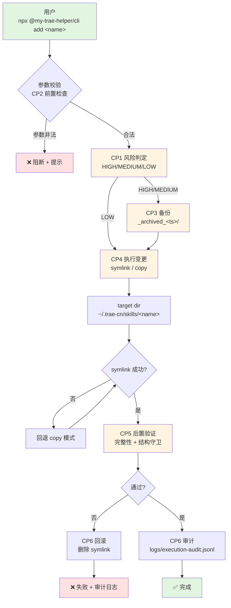
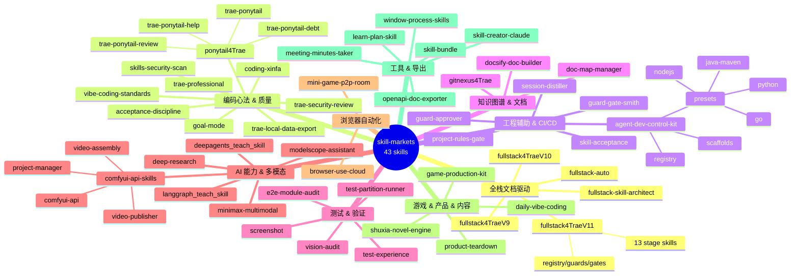
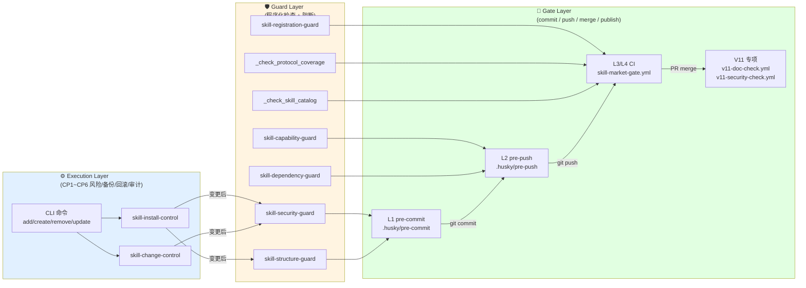
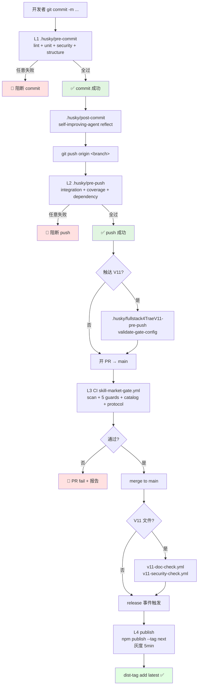

# my-trae-helper

Trae IDE 技能包开发工程 + 跨 Agent 技能市场 CLI。

> 这个仓库既是「技能包开发工程」也是「技能市场 CLI 源码」：
> - `skill-markets/` —— 43 个技能包
> - `bin/` + `src/` —— `@my-trae-helper/cli`(已发布到 npm)
>
> **2026-08-16 新增 skill**：`github-kownledge-helper`（本地 GitHub 仓库管家）— 第 48 个技能包（V1.0），纯文档 + 9 references + TS CLI（`pnpm ghh add/update/sync-to/sync-docs/verify-docs`，CLI 落本项目根）；详见 [skill-markets/github-kownledge-helper/SKILL.md](skill-markets/github-kownledge-helper/SKILL.md) 与 [CHANGELOG.md Unreleased §github-kownledge-helper 接入](CHANGELOG.md)
>
> **2026-08-16 references 全量沉淀**：按 skill-evolution 协议，把 `AGENT.md`(341 行 10 节)+ `project-rules.md`(94 行 10 节)全量沉淀为 22 个 references(13 新增 + 9 原有增量)，按"通用 vs 具体项目配置"二分判定 — 通用约定沉淀，具体 env/路径作为示例段。详见 [CHANGELOG.md §github-kownledge-helper 全量沉淀](CHANGELOG.md)

> **2026-08-16 fullstack4TraeV11 升级**：V11.8.5 协议层承诺 → 脚本落地（13/14）— 新增 3 脚本 + 6 references + 79 单测。详见 [skill-markets/fullstack4TraeV11/CHANGELOG.md](skill-markets/fullstack4TraeV11/CHANGELOG.md)。
>
> **2026-08-16 fullstack4TraeV11 升级**：V11.8.5.P1 — §3.7 #10 commit 准入最小集程序化：`scripts/commit-minimum-check.py` 4 项校验（typecheck / spot-check / admin 探针 / lint 预存），前 3 任一 FAIL 阻断 commit、第 4 仅 WARN 入日志。详见 [skill-markets/fullstack4TraeV11/CHANGELOG.md](skill-markets/fullstack4TraeV11/CHANGELOG.md)。
>
> **2026-08-16 fullstack4TraeV11 升级**：V11.8.6 — V12 物理隔离思想在 V11 主版本内的渐进落地（6 步，不升主版本）：`init-from-zero.py --layout v12-preview` 创建 fact/ + stage/ 骨架，多角色按模板落位产物，`process-layer-guard.sh` 强制路径边界，`stage-gate.py --reset-to` 保留事实源可重置流程。详见 [skill-markets/fullstack4TraeV11/CHANGELOG.md](skill-markets/fullstack4TraeV11/CHANGELOG.md)。
>
> **2026-08-16 audit-fix**：guard-smith audit B 方案 3 件系统化缺口修补落地 — `AGENTS.md §1.11 增补条款`（主代理直接 Edit）+ `guard-gate-smith SKILL §1.1.1` + `skill-registration-guard.mjs` 顶部 docstring（guard-smith sub-agent 委派）。协议语义真空闭合：豁免范围明文化 + 硬约束明文化 + 治理边界算法程序化。详见 [skill-markets/fullstack4TraeV11/references/todos/audit-fix-2026-08-16.md](skill-markets/fullstack4TraeV11/references/todos/audit-fix-2026-08-16.md)。
>
> **2026-08-16 mentioned-but-not-parsed closure**：top 5 全量验证 — 5/5 已落地（批修 + V11.8.5.P1 + V11.8.6 三批 commit 累积）。V11 协议层闭环度 **18/18 = 100%**。剩余仅 V12-ROOT（等用户授权 V12 ADR，主版本升级独立轨道）。详见 [skill-markets/fullstack4TraeV11/references/todos/mentioned-but-not-parsed-closure.md](skill-markets/fullstack4TraeV11/references/todos/mentioned-but-not-parsed-closure.md)。
>
> **2026-08-15 fullstack4TraeV11 升级**：V11.8.4 提交准入最小集与全量验收分层（Stage 3.5/4.5 异步化）+ V11.8.3 Stage 6 重构为 4 层分层决策框架。详见 [skill-markets/fullstack4TraeV11/CHANGELOG.md](skill-markets/fullstack4TraeV11/CHANGELOG.md)。

## 📑 目录

- 🗺️ [仓库全景(Mindmap)](#-仓库全景mindmap)
- 📚 [工作流指南](#-工作流指南)
- 🔁 [安装流(Flowchart)](#-安装流flowchart)
- ⚡ [快速开始](#-快速开始推荐用-npx)
- 🎯 [支持的 Agent(24 种)](#-支持的-agent24-种)
- 📦 [技能市场(43 个,分类 Mindmap)](#-技能市场43-个分类-mindmap)
- 🛠️ [CLI 命令](#-cli-命令)
- 🔧 [安装机制](#-安装机制)
- 🛠️ [本地开发](#-本地开发这个仓库)
- 📦 [发布到 npm](#-发布到-npm)
- 🔗 [与 npx skills 的关系](#-与-npx-skills-vercel-labsskills-的关系)
- 📚 [技能格式](#-技能格式skillmd)
- ⚙️ [项目自维护机制](#-项目自维护机制防止遗忘清单)
  - 🪝 A. [TRAE 用户级钩子](#-a-trae-用户级钩子ide-会话侧)
  - 🪝 B. [Git 钩子](#-b-git-钩子--门禁执行器husky)
  - 🪝 C. [GitHub Actions](#-c-github-actions--远程门禁githubworkflows)
  - 🛡️ D. [守卫脚本](#-d-守卫脚本scriptspy--srguardsmjs)
  - 📊 E. [仓库内日志](#-e-仓库内日志--临时产物)
  - 🤖 F. [self-improving-agent 自动化路径](#-f-self-improving-agent-自动化路径-treruleslearningmd)
  - 🚫 G. [不自动触发的清单](#-g-不自动触发的清单手动)

## 🛡️ 协议先行 + 多维度一致(2026-08-15 NEW)

- **`.agents/skills/project-rule-skill/references/skill-creation-workflow.md`** (V11.8.0.1 路径迁移)— skill 创建/更新工作流(协议先行 + 多维度一致)
- **`.agents/skills/project-rule-skill/references/protocol-coverage-protocol.md`** (V11.8.0.1 路径迁移)— 协议覆盖度协议(程序化配套)
- **`tests/catalogs/catalog-protocol.md`** — Skill Catalog 校验协议(V1 report-only)
- **`scripts/_check_protocol_coverage.py`** — 多维度同步检测(std lib,200+ 行)
- **`tests/catalogs/_check_skill_catalog.py`** — Catalog 元数据校验(200+ 行)
- **CI gate**:`.github/workflows/skill-market-gate.yml` §5.7 protocol coverage + §5.8 skill catalognpm）

## 📚 工作流指南

不同身份读者走读指南：

- [docs/GUIDE.md](file:///d:/workspace/my-trae-helper/docs/GUIDE.md) — 四类受众全景工作流（仓库开发者 / 安装使用者 / 调研者 / vibecoding 配置者）

## 🔁 安装流（Flowchart）



> 详见 [`src/execution/skill-install-control.mjs`](src/execution/skill-install-control.mjs) CP1~CP6 控制点。

## ⚡ 快速开始（推荐：用 npx）

```bash
# 装到 Trae CN（默认）
npx @my-trae-helper/cli add fullstack4TraeV11

# 一次装到多个 agent
npx @my-trae-helper/cli add fullstack4TraeV11 -a trae-cn -a claude-code -a codex

# 全局装（所有项目可用）
npx @my-trae-helper/cli add fullstack4TraeV11 -g -a trae-cn

# 看已装了哪些
npx @my-trae-helper/cli list

# 卸
npx @my-trae-helper/cli remove fullstack4TraeV11
```

## 🎯 支持的 Agent（24 种）

> 完整定义见 [`src/agents.mjs`](src/agents.mjs) 第 22~193 行,精确 24 个。

| Agent | 项目级 skills 路径 | 说明 |
|---|---|---|
| **trae-cn** | `.trae-cn/skills/` | Trae CN（项目核心） |
| **trae** | `.trae/skills/` | Trae 国际版 |
| **claude-code** | `.claude/skills/` | Claude Code |
| **codex** | `.agents/skills/` | OpenAI Codex |
| **cursor** | `.agents/skills/` | Cursor |
| **gemini-cli** | `.agents/skills/` | Gemini CLI |
| **github-copilot** | `.github/skills/` | GitHub Copilot |
| **opencode** | `.opencode/skills/` | OpenCode |
| **kimi-code-cli** | `.agents/skills/` | Kimi Code |
| **amp** | `.agents/skills/` | Amp |
| **openhands** | `.openhands/skills/` | OpenHands |
| **cline** | `.agents/skills/` | Cline |
| **windsurf** | `.windsurf/skills/` | Windsurf |
| **continue** | `.continue/skills/` | Continue |
| **roo** | `.roo/skills/` | Roo Code |
| **aider-desk** | `.aider-desk/skills/` | Aider Desk |
| **zed** | `.zed/skills/` | Zed |
| **warp** | `.warp/skills/` | Warp |
| **devin** | `.devin/skills/` | Devin |
| **qwen-code** | `.qwen/skills/` | Qwen Code |
| **kiro-cli** | `.kiro/skills/` | Kiro CLI |
| **augment** | `.augment/skills/` | Augment |
| **hermes-agent** | `.hermes/skills/` | Hermes Agent |
| **antigravity** | `.agents/skills/` | Antigravity |

## 📦 技能市场(43 个,分类 Mindmap)



## 🛠️ CLI 命令

```bash
trae-skills add <name>           # 装一个 skill
trae-skills list                 # 列已装
trae-skills remove <name>        # 卸
trae-skills update [name]        # 更新（重做 symlink）
trae-skills init <name>          # 创建新 skill 模板
trae-skills --help               # 帮助
trae-skills --version            # 版本
```

### 全局选项

| 选项 | 说明 |
|---|---|
| `-g, --global` | 装到用户目录（`~/...`）而不是项目目录（`./...`） |
| `-a, --agent <name>` | 指定 agent，可多次（`-a trae-cn -a claude-code`） |
| `-y, --yes` | 跳过确认 |
| `--copy` | 复制文件而非软链（牺牲可更新性换兼容） |

## 🔧 安装机制

**默认用 symlink**（单一数据源，`git pull` 后自动生效）：

| 平台 | 方式 |
|---|---|
| Windows | `symlink(..., 'junction')`（无需管理员/开发者模式） |
| macOS / Linux | `symlink(..., 'dir')` |

要复制而不是软链：`trae-skills add xxx --copy`

## 🛠️ 本地开发（这个仓库）

```bash
# 1. 装依赖
pnpm install

# 2. 本地跑
node bin/cli.mjs --help
node bin/cli.mjs list
node bin/cli.mjs add fullstack4TraeV11 -a trae-cn -y

# 3. 测发布
npm pack --dry-run
```

## 📦 发布到 npm

```bash
# 1. 创建 npm org: my-trae-helper（首次）
#    https://www.npmjs.com/settings/yourname/organizations/

# 2. 登录
npm login

# 3. 发布
npm publish --access public
```

发布后用户可以：
- `npx @my-trae-helper/cli add xxx` —— 临时用
- `npm install -g @my-trae-helper/cli` —— 全局装

## 🔗 与 `npx skills` (vercel-labs/skills) 的关系

本 CLI 是 `npx skills` 的 Trae 优化版：

| 维度 | `npx skills` (vercel) | `npx @my-trae-helper/cli` (本仓库) |
|---|---|---|
| 来源 | 从任何 GitHub 仓库 clone | 本仓库 `skill-markets/` 内置 |
| 技能数 | 178+ (搜索) | 43 (本仓库精选) |
| Agent | 70+ | 24（专注 Trae 系 + 主流） |
| 特色 | 跨平台开源标准 | Trae CN 原生 + 中文化 |
| YAML 解析 | `yaml` | `yaml`（同款） |
| 交互 | `@clack/prompts` | `@inquirer/prompts` |

## 📚 技能格式（SKILL.md）

```markdown
---
name: my-skill              # 必需，kebab-case
version: "1.0.0"            # 必需
description: "做什么 + 何时用 + 触发词"  # 必需
requires:
  skills: [dep1, dep2]      # 强依赖
  optional: [opt1]          # 软引用
---

# My Skill

详细指令...
```

完整规范见 [AgentSkills.io 开放标准](https://agentskills.io/)。

## ⚙️ 项目自维护机制（防止遗忘清单）

> 仓库本身跑着一组自动化机制，多数用户不可见。下面是**所有自动触发的钩子、守卫、CI 门禁和后台记录器**的索引，方便日后回查"为什么这次 commit 被拦了""日志落到哪了"。

---

### 🪝 A. TRAE 用户级钩子（IDE 会话侧）

#### A1. `trae-prompt-logger` — 用户发言落盘器

| 项 | 值 |
|---|---|
| 入口脚本 | [`scripts/trae-prompt-logger.mjs`](scripts/trae-prompt-logger.mjs) |
| 安装器 | [`scripts/trae-prompt-logger.install.mjs`](scripts/trae-prompt-logger.install.mjs)（由 PowerShell 调用） |
| 触发事件 | TRAE IDE `UserPromptSubmit` Hook |
| 输入 | TRAE 通过 stdin 推送的 JSON `{session_id, cwd, prompt, workspace_roots, hook_event_name}` |
| 落盘路径 | `<cwd>/.trae/prompt-logs/sessions/<session_id>/prompts.ndjson` + `<cwd>/.trae/prompt-logs/index.ndjson` |
| 安装位置 | `~/.trae-cn/hooks.json` 的 `UserPromptSubmit` 数组 |
| 标记字符串 | `node "<脚本绝对路径>"`（用 marker 匹配去重/卸载） |
| 设计原则 | 零依赖 / 写入失败不抛错（exit 0）/ NDJSON 流式追加 / 隐私脱敏（sk- / Bearer / ghp_ / AKID）/ 跨 session 并行无冲突 |
| 卸载 | `node scripts/trae-prompt-logger.install.mjs --op uninstall --file <hooks.json> --script <logger.mjs> --marker <mark>` |

**查找历史 prompt**（默认折叠,日志在 `.gitignore` 中）:

<details>
<summary>查询示例 — 展开查看</summary>

```bash
# 单项目
cat .trae/prompt-logs/index.ndjson | jq -r '. | "\(.ts)  \(.session_id[0:8])  \(.prompt[0:80])"'

# 跨 session 检索关键词
grep -r "TODO" .trae/prompt-logs/sessions/
```

</details>

---

### 🪝 B. Git 钩子 — 门禁执行器（`.husky/`）

启用：`git config core.hooksPath .husky`

#### B1. `pre-commit` — L1 提交门禁

| 顺序 | 检查 | 失败行为 |
|---|---|---|
| 1 | `npm run lint`（`scripts/lint.mjs` 对所有 `.mjs` 跑 `node --check`） | 阻断 |
| 2 | `npm run test:unit`（5 个 control 测试 + pytest） | 阻断 |
| 3 | `python scripts/skill-security-guard.py`（仅本次变更的技能目录） | 阻断 |
| 4 | `python scripts/skill-structure-guard.py`（仅新建的 `SKILL.md`） | 阻断 |
| 5 | `python scripts/run-agent-dev-control-kit-tests.py`（仅 `agent-dev-control-kit` 变更时） | 阻断 |
| 6 | `npm run test:manifest`（`scripts/test-manifest.mjs` → `intent-classifier.mjs` → `manifest-assert.py`） | 阻断 |

**Windows 兼容细节**：探测 Python 路径用 `miniconda3 → Python3xx → PATH` 三段 fallback，必须能 `import pytest, yaml`；找不到则阻断（hook 头部有完整探测逻辑）。

#### B2. `pre-push` — L2 推送门禁

| 顺序 | 检查 | 失败行为 |
|---|---|---|
| 1 | `npm run test:integration` | 阻断 |
| 2 | `npm run test:coverage` | 阻断 |
| 3 | `node src/guards/skill-dependency-guard.mjs`（全量技能） | 阻断 |
| 4 | `npm run build`（`scripts/validate-config.mjs`） | 阻断 |
| 5 | `agent-dev-control-kit` catalog-guard（仅变更时） | 阻断 |

#### B3. `post-commit` — 跨会话经验沉淀（C 路径兜底）

| 项 | 值 |
|---|---|
| 入口 | `.husky/post-commit` |
| 触发 | commit 成功后（**不阻断 commit**，失败仅 warn） |
| 职责 | 把上一 commit 期间的 commit log + agent-hints + log warn 自动落到 `~/.self-improving-agent/.learnings/` |
| 探测顺序 | `self-improving-agent`（PATH）→ 仓库内 `scripts/self-improving-agent.mjs`（shim）→ 跳过 |
| WSL 兼容 | 自动把 `/root/...` 重定向到 `/mnt/c/Users/septe/...`，`/mnt/c/...` → `C:\...` |
| 日志 | `logs/post-commit-self-improve.log`（**所有 stdout/stderr 丢这里**，不污染 commit 输出） |

#### B4. `fullstack4TraeV11-pre-push` — V11 pre-push 专项（2026-08-15 NEW）

- 触发：`git push` 时，仅当本次变更触达 `skill-markets/fullstack4TraeV11/**`
- 步骤：`skill-markets/fullstack4TraeV11/scripts/validate-gate-config.py` 校验 gate-config 与 registry/gates.yaml 一致 + `_check_protocol_coverage.py` 跑 V11 维度
- 失败：阻断 push + 报告 gate drift

#### B5. `fullstack4TraeV11-l4` — V11 L4 发布前 hook（2026-08-15 NEW）

- 触发：手动（发布前 dry-run）/ `release: published` GitHub event 同步本地时
- 步骤：`ac-gate.py`（验收清单核销）→ `gate-integrity-guard.py`（gate 完整性）→ `run-all-guards.py`（全量守卫）→ `repair-flow-gate.py`（修复流门禁）
- 失败：阻断 + 报告未核销 AC 编号

---

### 🪝 C. GitHub Actions — 远程门禁（`.github/workflows/`）

#### C1. `skill-market-gate.yml` — L3 合并 + L4 发布

- **L3 merge gate**（PR → `main` / `release/*`）：
  全量 `scan_skills_dir.py` → 变更技能 `skill-structure-guard` → 变更技能 `skill-dependency-guard` → 变更技能 `skill-capability-guard` → `CAPABILITY-MAP.md` 与 `SECURITY-MAP.md` diff 检查 → `_check_protocol_coverage.py` §5.7 → `_check_skill_catalog.py` §5.8 → 构建 CLI
- **L4 publish gate**（`release: published`）：
  L3 + 全量结构守卫 + 全量能力守卫 + `npm publish --tag next` + 灰度 5 分钟 → `dist-tag add latest`

#### C2. `agent-dev-control-kit-ci.yml` — 子套件专项

- 触发：PR 改 `skill-markets/agent-dev-control-kit/**` / push main / manual
- 步骤：`catalog-guard.py` → trap 反例集（pytest `-m trap`） → 全量 pytest → hint 聚合
- 自验收：trap 反例必须 PASS/FAIL 双态都跑过（对应 `AGENTS.md §2.4`）

#### C3. `v11-doc-check.yml` — V11 文档同步门禁（2026-08-15 NEW）

- 触发：PR 改 `skill-markets/fullstack4TraeV11/**` / push main / manual
- 步骤：调用 `skill-markets/fullstack4TraeV11/scripts/v11-doc-sync.py` 校验各 stage skill 文档 ↔ registry/state-machine/repair-flow 一致
- 失败：阻断 PR + 报告不一致位置（文件名 + 行号）

#### C4. `v11-security-check.yml` — V11 安全门禁（2026-08-15 NEW）

- 触发：PR 改 `skill-markets/fullstack4TraeV11/**` / push main / manual
- 步骤：调用 `skill-markets/fullstack4TraeV11/scripts/gate-integrity-guard.py` 校验 scaffold / hook 模板无硬编码密钥 + ac-gate.py 验收清单完整
- 失败：阻断 PR + 报告可疑路径

#### C5. 三层控制体系总览（Flowchart）



#### C6. Commit → Push → CI 验证流（Flowchart）



---

### 🛡️ D. 守卫脚本（`scripts/*.py` / `src/guards/*.mjs`）

| 守卫 | 类型 | 触发场景 |
|---|---|---|
| `scripts/skill-security-guard.py` | 安全 | pre-commit / pre-push |
| `scripts/skill-structure-guard.py` | 结构 | pre-commit |
| `scripts/skill-capability-guard.py` | 能力去重 | pre-push / L3 / L4 |
| `scripts/manifest-assert.py` | Manifest 对账 | pre-commit（`test:manifest`） |
| `scripts/_check_protocol_coverage.py` | 协议覆盖度 | L3 CI §5.7 |
| `tests/catalogs/_check_skill_catalog.py` | Catalog 元数据 | L3 CI §5.8 |
| `src/guards/skill-dependency-guard.mjs` | 依赖 | pre-push / L3 / L4 |
| `src/guards/skill-registration-guard.mjs` | 注册表 | verify / L3 |
| `src/execution/skill-change-control.mjs` | 变更控制（CP1~CP6） | `create` / `update` 子命令 |
| `src/execution/skill-install-control.mjs` | 安装控制（CP1~CP6） | `add` / `remove` 子命令 |
| `skill-markets/fullstack4TraeV11/scripts/ac-gate.py` | V11 AC 核销 | V11 专项 CI |
| `skill-markets/fullstack4TraeV11/scripts/gate-integrity-guard.py` | V11 gate 完整性 | V11 专项 CI |
| `skill-markets/fullstack4TraeV11/scripts/v11-doc-sync.py` | V11 文档同步 | V11 专项 CI |
| `skill-markets/fullstack4TraeV11/scripts/validate-gate-config.py` | V11 gate 配置 | V11 专项 CI |

---

### 📊 E. 仓库内日志 / 临时产物

<details>
<summary>运行时落盘（`.gitignore` 已屏蔽，不进 git）— 展开查看</summary>

> 这些是 **运行时落盘**，不进 git（按需清理）。

| 路径 | 产生者 | 用途 |
|---|---|---|
| `logs/post-commit-self-improve.log` | `.husky/post-commit` | post-commit 经验沉淀日志 |
| `logs/pre-commit.log` / `logs/pre-push.log` | gate hooks | 门禁执行明细 |
| `logs/agent-hints.jsonl` | `agent-signal-detect.mjs` | 会话级 hint（C 路径数据源） |
| `.trae/prompt-logs/**/*.ndjson` | `trae-prompt-logger.mjs` | 用户发言存档（每个 IDE 项目） |
| `auto_reports/` | `scan_skills_dir.py` | 安全扫描报告（CI artifact） |
| `.publish/` | `scripts/prepare-publish.mjs` | 发布预处理（npm pack 前） |

</details>

---

### 🤖 F. self-improving-agent 自动化路径（`.trae/rules/learning.md`）

| 路径 | 方式 | 触发点 | 工具 |
|---|---|---|---|
| A 启动注入 | 会话开始强制 `Skill(self-improving-agent)` | 每个会话第一步 | `project-rule-skill` 网关 |
| B 显式 log | 主 agent 调用 | 关键决策后 | `scripts/self-improving-agent.mjs log --type ... --summary ...` |
| C commit 兜底 | `.husky/post-commit` 触发 `reflect` | 每次 commit | `.husky/post-commit` |
| 三方组合 | A + C 永远在跑，B 关键时用 | — | — |

---

### 🚫 G. **不**自动触发的清单（手动）

| 操作 | 何时手动 |
|---|---|
| `npm publish` | 仅 L4 CI 触发；本地勿跑 |
| `git push --force` | 必须显式申请（默认拒绝） |
| 直接改 `~/.trae-cn/hooks.json` | 用 `trae-prompt-logger.install.mjs` 维护 |
| 在仓库外写脚本 | AGENTS.md §1.6 禁止；正确路径 `scripts/` |

---

## 📜 许可

MIT
