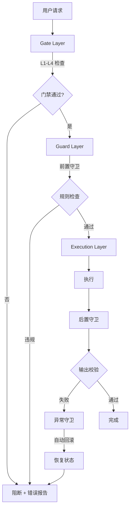
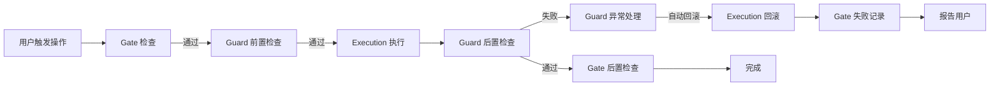

# Agent Development Control Kit

> **核心理念**：通过**制度 + 工具**强制执行质量标准,不依赖人的自觉性。

本技能包提供一套完整的三层控制体系（Execution + Guard + Gate），帮助 Agent 在数据变更、文档同步、配置管理、资产处理、发布流程等高风险操作中保持标准化、可审计、可回滚。

---

## §0 定位

### 0.1 体系核心理念

```
┌──────────────────────────────────────────────────────────┐
│  Gate Layer（门禁层）— 检查点控制                          │
│    L1 提交前 → L2 推送前 → L3 合并前 → L4 发布前           │
│         ↓                                                 │
│  Guard Layer（守卫层）— 运行时防护                         │
│    前置守卫 → 执行守卫 → 后置守卫 → 异常守卫                │
│         ↓                                                 │
│  Execution Layer（执行层）— 标准化执行                     │
│    输入验证 → 流程执行 → 输出校验 → 错误处理               │
└──────────────────────────────────────────────────────────┘
```

**三层分工**：
- **Execution Layer（执行层）**：原子化执行单元,把高风险操作封装为标准流程
- **Guard Layer（守卫层）**：在执行前后插入禁止性规则 + 白名单豁免机制
- **Gate Layer（门禁层）**：在代码生命周期的关键节点设置质量门禁,失败即阻断

### 0.2 适用场景

- **高风险操作规范化**：数据库变更、配置同步、发布上线等需要备份和回滚的操作
- **多 Agent 协作一致性**：跨会话、跨 Agent 保持执行标准的统一
- **团队质量门禁缺失**：需要自动化检查替代人工 review
- **可审计性要求高**：金融、医疗、合规等需要完整操作轨迹的场景
- **新项目快速建立规范**：通过脚手架一键生成完整控制体系

### 0.3 不适用场景

- **纯查询类操作**：不涉及状态变更的读操作
- **临时性原型开发**：快速验证概念,不需要长期维护
- **单文件纯新增**：风险等级 LOW 的简单操作
- **用户明确要求"快速执行"**：避免过度流程化

> **反例参考**：[references/execution-skills-guide.md §8 AP-1 过度流程化](references/execution-skills-guide.md)

---

## §1 三层控制体系

### 1.1 整体架构



### 1.2 Execution Layer（执行层）

**职责**：封装高风险操作为标准流程,提供可审计、可回滚的原子化执行单元。

**核心能力**：
- 5 个 Execution Skills 覆盖常见高风险场景
- 每个 Skill 包含 4-5 个关键控制点（CP）
- 统一的风险分级（HIGH / MEDIUM / LOW）

**典型 Skills**：
- 数据变更控制
- 文档同步控制
- 配置同步控制
- 资产管理控制
- 发布流程控制

**详细规范**：[references/execution-skills-guide.md](references/execution-skills-guide.md)

### 1.3 Guard Layer（守卫层）

**职责**：在关键节点执行强制性检查,阻止不符合规范的代码/设计进入下一阶段。

**核心能力**：
- 5 个 Guard Skills 覆盖质量、安全、性能等维度
- **禁止性规则优先**：明确列出不允许的行为
- **白名单机制兜底**：为合理例外提供逃生通道
- **失败必须阻断**：检查失败必须停止流程

**典型 Skills**：
- API 契约 Guard
- 架构约束 Guard
- 测试覆盖 Guard
- 安全约束 Guard
- 性能约束 Guard

**详细规范**：[references/guard-skills-guide.md](references/guard-skills-guide.md)

### 1.4 Gate Layer（门禁层）

**职责**：在代码生命周期的关键节点（提交、推送、合并、发布）设置质量门禁。

**核心能力**：
- 4 层门禁覆盖完整 DevOps 流程
- 通过 husky + CI workflow 自动触发
- 失败即阻断,不允许绕过

**典型层级**：
- L1 提交门禁（本地 Lint + TypeCheck + 单元测试）
- L2 推送门禁（集成测试 + 覆盖率 + 构建）
- L3 合并门禁（Code Review + E2E + 契约测试）
- L4 发布门禁（全量测试 + 性能基准 + 安全扫描）

**详细规范**：[references/gate-skills-guide.md](references/gate-skills-guide.md)

---

## §2 5 个 Execution Skills

| Skill | 控制对象 | 典型风险 | 关键控制点 |
|-------|---------|---------|-----------|
| **数据变更控制** | 数据库 / 文件数据 | 数据丢失、不一致 | 影响评估、备份、验证、回滚 |
| **文档同步控制** | 文档内容 | 版本漂移、陈旧度 | 类型判定、新鲜度评分、版本标记、关联方通知 |
| **配置同步控制** | 配置文件 | 配置冲突、环境不一致 | 基准提取、差异分析、冲突解决、验证、审计 |
| **资产管理控制** | 二进制 / 大文件 | 磁盘爆炸、重复资产 | 去重检查、引用追踪、陈旧度评估、空间预警 |
| **发布流程控制** | 部署 / 发布 | 线上故障、回滚失败 | 预发布检查、灰度策略、自动回滚、签名、监控 |

### 2.1 适用原则

```yaml
触发条件:
  - 操作涉及 ≥ 2 个系统组件
  - 操作具有不可逆性
  - 操作失败需要回滚机制

不触发条件:
  - 单一文件纯新增
  - 纯查询类操作
  - 用户明确要求"快速执行"
```

### 2.2 风险等级与流程

| 风险等级 | 触发条件 | 强制措施 |
|:-------:|---------|---------|
| **HIGH** | 影响生产数据 / 跨表关联 / 无 WHERE 条件 | 必须备份 + dry-run + 审批 + 回滚脚本 |
| **MEDIUM** | 单表变更 / 有明确范围 | 必须备份 + dry-run |
| **LOW** | 新增测试数据 / 临时表 | 可选备份 |

> **完整流程图与实施示例**：[references/execution-skills-guide.md §1-5](references/execution-skills-guide.md)

---

## §3 5 个 Guard Skills

| Guard | 检查维度 | 阻断条件 | 白名单机制 |
|-------|---------|---------|-----------|
| **API 契约 Guard** | 接口规范、Schema 完整性 | 端点无 Schema、破坏性变更未升版本 | 内部端点、健康检查 |
| **架构约束 Guard** | 模块边界、依赖方向 | 循环依赖、跨层引用 | 紧急修复、白名单模块 |
| **测试覆盖 Guard** | 单元 / 集成 / E2E 覆盖率 | 覆盖率 < 阈值 | 临时跳过（带 reason） |
| **安全约束 Guard** | 漏洞扫描、密钥泄露、依赖安全 | HIGH 风险漏洞、硬编码密钥 | 临时白名单（24h 过期） |
| **性能约束 Guard** | 响应时间、吞吐量、资源占用 | 性能回归 > 10% | 性能优化专项期 |

### 3.1 Guard 通用结构

```yaml
# 典型 Guard 配置
guard:
  name: api-contract-guard
  triggers:
    - pre-commit
    - pre-merge
  forbidden:
    - 添加无 Schema 的 API 端点
    - 修改已发布 API 的响应结构（破坏性变更）
  whitelist:
    - path: "/health"
      reason: "健康检查端点,无需认证"
      expires: "永久"
  on_failure: BLOCK
  on_warning: WARN
```

### 3.2 失败处理

| 结果 | 处理 | 输出 |
|------|------|------|
| **PASS** | 继续流程 | 无输出 |
| **WARN** | 输出警告,允许继续 | 黄色提示（需人工确认） |
| **BLOCK** | 终止流程,输出错误 | 红色阻断 + 修复建议 + 白名单申请方式 |

> **详细配置与白名单模板**：[references/guard-skills-guide.md](references/guard-skills-guide.md)

---

## §4 4 层 Gate Skills

### 4.1 门禁层级总览

```
┌─────────────────────────────────────────────────────────────┐
│ L4 发布前门禁 (Release Gate)                                │
│ ├─ 全量测试 + 性能基准 + 安全扫描 + 验收测试                  │
│ └─ 通过标准：全部通过 + 性能达标 + 无安全漏洞                 │
├─────────────────────────────────────────────────────────────┤
│ L3 合并前门禁 (Merge Gate)                                  │
│ ├─ L2 检查 + 代码审查 + E2E 测试                             │
│ └─ 通过标准：审批通过 + E2E 全绿                             │
├─────────────────────────────────────────────────────────────┤
│ L2 推送前门禁 (Push Gate)                                   │
│ ├─ L1 检查 + 集成测试 + 覆盖率检查                           │
│ └─ 通过标准：零失败 + 覆盖率 ≥ 阈值                          │
├─────────────────────────────────────────────────────────────┤
│ L1 提交前门禁 (Commit Gate)                                 │
│ ├─ Lint + TypeCheck + 单元测试                               │
│ └─ 通过标准：零错误 + 零失败                                 │
└─────────────────────────────────────────────────────────────┘
```

### 4.2 各级门禁详解

| 层级 | 触发时机 | 检查项 | 通过标准 | 失败处理 |
|------|---------|--------|---------|---------|
| **L1 提交门禁** | `git commit` | Lint / TypeCheck / 单元测试 | 零错误 + 零失败 | 阻断提交 |
| **L2 推送门禁** | `git push` | L1 全部 + 集成测试 + 覆盖率 + 构建 | 零失败 + 覆盖率 ≥ 80% | 阻断推送 |
| **L3 合并门禁** | PR merge | L2 全部 + Code Review + E2E + 契约测试 | 审批通过 + E2E 全绿 | 拒绝合并 |
| **L4 发布门禁** | Release | L3 全部 + 性能基准 + 安全扫描 + 验收 | 全部通过 + 性能达标 + 无漏洞 | 阻断发布 |

### 4.3 实现机制

- **L1 + L2**：通过 husky pre-commit / pre-push hook 本地触发
- **L3 + L4**：通过 GitHub Actions / GitLab CI 在 PR / Release 阶段触发
- **门禁配置**：`gates/gate-config.json` 集中管理

```json
{
  "L1": {
    "trigger": "pre-commit",
    "checks": ["lint", "typecheck", "test:unit"]
  },
  "L2": {
    "trigger": "pre-push",
    "checks": ["test:integration", "test:coverage", "build"]
  },
  "L3": {
    "trigger": "pr-merge",
    "checks": ["code-review", "test:e2e", "api-contract"]
  },
  "L4": {
    "trigger": "release",
    "checks": ["perf-benchmark", "security-scan", "acceptance"]
  }
}
```

> **完整门禁配置与模板**：[references/gate-skills-guide.md](references/gate-skills-guide.md) + [templates/gate-skill-template.md](templates/gate-skill-template.md)

---

## §5 使用方式

### 5.1 方式一：脚手架初始化（推荐）

**适用场景**：新建项目,需要完整的控制体系。

```bash
# 1. 复制脚手架到目标项目
cp -r skill-markets/agent-dev-control-kit/template-project /path/to/your-project

# 2. 进入项目目录
cd /path/to/your-project

# 3. 执行初始化脚本
./scripts/init-project.sh

# 4. 安装 Git Hooks
./hooks/install-hooks.sh
```

**脚手架包含**：
- `.agents/skills/` — Execution Skill 模板
- `gates/` — 4 层门禁配置
- `guards/` — Guard 脚本与配置
- `hooks/` — Git Hooks 安装脚本
- `tests/` — 测试目录结构（unit / integration / e2e）
- `package.json` — 预配置的 npm scripts

### 5.2 方式二：工具脚本自动化

**适用场景**：在已有项目上增量添加控制能力。

```bash
# 1. 列出可用技术栈选型
python scripts/init-control-kit.py --list-stacks

# 2. 显式指定技术栈初始化
python scripts/init-control-kit.py \
  --target /path/to/your-project \
  --stack python

# 3. 交互式选择技术栈
python scripts/init-control-kit.py --interactive

# 4. 自动检测已有项目技术栈
python scripts/init-control-kit.py --auto-detect

# 5. 添加自定义选型(动态扩展)
python scripts/init-control-kit.py --add-stack /path/to/your-custom-preset

# 6. 运行所有 Guard 检查
python scripts/run-all-guards.py --project /path/to/your-project

# 7. 执行门禁检查
python scripts/gate-check.py --level L2

# 8. 从模板生成 Skill
python scripts/generate-skill-from-template.py \
  --template execution-skill-template.md \
  --output skills/my-execution-skill/SKILL.md

# 验证 Execution Skill 合规性
python scripts/validate-execution-skill.py \
  --skill skills/data-change-control
```

**核心脚本**：
- `scripts/init-control-kit.py` — 项目初始化
- `scripts/run-all-guards.py` — 批量执行 Guard
- `scripts/gate-check.py` — 门禁检查
- `scripts/generate-skill-from-template.py` — 模板生成
- `scripts/validate-execution-skill.py` — 合规性校验

### 5.3 方式三：场景化应用

**适用场景**：针对特定问题查阅解决方案。

| 场景 | 参考文档 |
|------|---------|
| 新项目搭建控制体系 | [scenarios/01-new-project-setup.md](scenarios/01-new-project-setup.md) |
| 新增 Execution Skill | [scenarios/02-add-new-execution-skill.md](scenarios/02-add-new-execution-skill.md) |
| 自定义 Guard 规则 | [scenarios/03-customize-guards.md](scenarios/03-customize-guards.md) |
| 门禁失败排查 | [scenarios/04-troubleshooting-gate-failure.md](scenarios/04-troubleshooting-gate-failure.md) |
| 遗留项目改造 | [scenarios/05-migrate-legacy-project.md](scenarios/05-migrate-legacy-project.md) |

---

## §6 目录结构 — 三层架构

### 管理层 (Management Layer)
- `SKILL.md` — 技能入口 + YAML frontmatter
- `registry/` — 统一注册表
  - `stacks.yaml` — 技术栈路由注册
  - `guards.yaml` — 守卫配置注册
  - `gates.yaml` — 门禁配置注册
- `presets/_index.yaml` — 预设元数据索引

### 描述层 (Description Layer)
- `references/` — 方法论文档（不变）
- `scenarios/` — 场景指南（不变）
- `templates/` — 模板描述文件
  - `guard-template.yaml`
  - `gate-template.yaml`

### 执行层 (Execution Layer)
- `scripts/` — Python 脚本（读取 registry/）
- `scaffolds/` — 脚手架物理分离（按技术栈）
  - `nodejs/`, `python/`, `go/`, `java-maven/`
  - `rust-react/`, `nextjs-fullstack/`, `cli-only/`
  - 每个 scaffold 包含 `scaffold.yaml` + `files/`

### 子技能（跨层引用）
- `skills/` — 5 个 Execution Skills

---

## §7 联动机制

### 7.1 Execution → Guard → Gate 联动



**联动规则**：
1. **Gate 优先**：先过门禁,再进入 Guard + Execution
2. **Guard 包裹**：Execution 前后必须由 Guard 包裹
3. **失败联动**：任何一层失败,逐级向上报告
4. **回滚链路**：Execution 失败触发 Guard 异常处理 → 自动回滚 → Gate 记录

### 7.2 失败处理矩阵

| 失败层 | Execution 状态 | Guard 状态 | Gate 状态 | 处理动作 |
|--------|---------------|-----------|-----------|---------|
| **L1 失败** | 未执行 | 未触发 | BLOCK | 阻断提交,提示修复 |
| **Guard 前置失败** | 未执行 | BLOCK | 已通过 | 阻断执行,提示规则 |
| **Execution 失败** | FAIL | 异常守卫触发 | 已通过 | 自动回滚 + 报告 |
| **Guard 后置失败** | 已执行 | BLOCK | 已通过 | 回滚 + 报告 |
| **L4 失败** | 已完成 | 已通过 | BLOCK | 阻止发布,生成报告 |

### 7.3 状态流转协议

```
INIT → GATE_CHECKING → GUARD_PRE → EXECUTING → GUARD_POST → GATE_FINAL → DONE
                              ↓           ↓            ↓            ↓
                            BLOCK      FAIL→ROLLBACK  BLOCK       BLOCK
                              ↓           ↓            ↓            ↓
                            FAILED    ROLLED_BACK    FAILED     RELEASED_BLOCKED
```

**状态机说明**：
- 每个状态都有明确的进入和退出条件
- 任何状态失败都会产生状态报告
- 状态报告可追溯、可审计

---

## §8 与其他技能的联动

| 联动技能 | 联动方式 | 场景 |
|---------|---------|------|
| **project-rule-skill** | 加载协议 | 任何控制操作前先加载项目规则 |
| **acceptance-discipline** | 验收门禁 | Execution 执行后走验收门禁 |
| **goal-mode** | 目标追踪 | 复杂控制流程配合目标追逐模式 |
| **fullstack4TraeV11** | 全栈流程 | 嵌入 13 stage 流水线作为质量层 |
| **trae-security-review** | 安全审查 | Guard 安全约束调用其扫描能力 |

**联动协议**：
```yaml
联动优先级:
  - 加载 project-rule-skill（强制前置）
  - 调用 control-kit 的三层检查
  - 触发 acceptance-discipline 验收
  - 进入 goal-mode 目标追踪（如适用）
```

---

## §9 设计原则

### 9.1 SOP 化

将所有高风险操作封装为**标准操作程序**（SOP），每个 SOP 包含：
- 适用场景
- 核心流程图
- 关键控制点
- 验收标准
- 实施示例

**目的**：降低人为判断成本,确保跨 Agent 行为一致。

### 9.2 契约驱动

所有接口、配置、产物都以**契约**形式定义：
- API 契约（OpenAPI / GraphQL Schema）
- 配置契约（JSON Schema）
- 产物契约（输出格式标准）

**目的**：通过契约校验实现自动化检查,减少人工 review。

### 9.3 多级门禁

不依赖单一检查点,而是设置**多层级门禁**：
- L1 提交门禁（本地快速检查）
- L2 推送门禁（集成验证）
- L3 合并门禁（团队 review）
- L4 发布门禁（生产就绪）

**目的**：尽早发现问题,降低修复成本。

### 9.4 白名单豁免

禁止性规则可能误伤合理场景,通过**白名单机制**兜底：
- 永久白名单（如健康检查端点）
- 临时白名单（24h 过期,需带 reason）
- 条件白名单（限定环境 / 时间）

**目的**：保持规则严格性,同时不阻碍合理业务。

### 9.5 需求追踪

每个 Execution / Guard / Gate 都关联到**具体需求**：
- 需求 ID（来自 PRD / Issue）
- 验收标准（可量化的判定条件）
- 追溯链路（从需求到实现到验收）

**目的**：实现需求-实现-验收的全链路可追溯。

---

## §10 关键指标

### 10.1 质量指标

| 指标 | 目标值 | 测量方式 |
|------|-------:|---------|
| **门禁通过率** | ≥ 90% | 通过次数 / 总次数 |
| **门禁误报率** | < 5% | 误报次数 / 失败次数 |
| **Guard 覆盖率** | 100% | 已配置 Guard 数 / 必需 Guard 数 |
| **回滚成功率** | ≥ 99% | 成功回滚数 / 回滚总数 |
| **执行审计完整率** | 100% | 有审计记录的执行 / 总执行 |

### 10.2 效率指标

| 指标 | 目标值 | 测量方式 |
|------|-------:|---------|
| **L1 检查耗时** | < 30s | pre-commit hook 耗时 |
| **L2 检查耗时** | < 5min | pre-push hook 耗时 |
| **L3 检查耗时** | < 30min | CI workflow 耗时 |
| **L4 检查耗时** | < 2h | Release pipeline 耗时 |
| **脚手架初始化耗时** | < 5min | init-project.sh 耗时 |

### 10.3 风险指标

| 指标 | 目标值 | 测量方式 |
|------|-------:|---------|
| **线上故障率** | < 0.1% | 故障次数 / 发布次数 |
| **数据丢失事件** | 0 | 不可逆数据丢失次数 |
| **回滚失败事件** | < 1% | 回滚失败数 / 回滚总数 |
| **安全漏洞逃逸率** | 0 | L4 后仍存在的高危漏洞 |

---

## 附录

### A. 快速参考

- **Execution Skills 决策树**：[references/execution-skills-guide.md §9.1](references/execution-skills-guide.md)
- **Guard 失败处理模板**：[references/guard-skills-guide.md §1.1](references/guard-skills-guide.md)
- **Gate 层级详解**：[references/gate-skills-guide.md §1.1](references/gate-skills-guide.md)
- **相关技能**：`project-rule-skill`(强制前置) / `acceptance-discipline` / `goal-mode` / `fullstack4TraeV11` / `trae-security-review`
- **工具脚本**：`mysqldump` / `config-validate` / `asset-check-duplicate` / `deploy --strategy=canary`
- **当前版本**：1.1.0 | 详细变更：[CHANGELOG.md](CHANGELOG.md) | 升级指南：[CHANGELOG.md §Migration Guide](CHANGELOG.md)

---

**许可证**：MIT | **维护者**：my-trae-helper team | **最后更新**：2026-08-13
