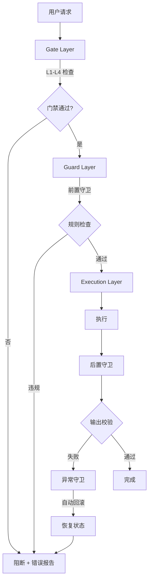
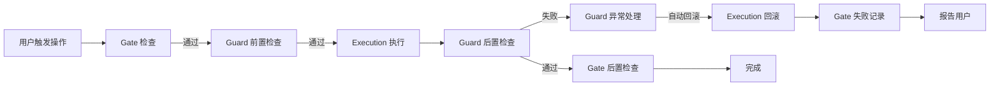

# Agent Development Control Kit

> **V11.8.0 NEW 与 fullstack4TraeV11 互斥说明**:
> - **本 kit 的 Gate 层**:安装 `.husky/pre-commit` / `.husky/pre-push` 命令级钩子(L1-L4)
> - **fullstack4TraeV11 贾维斯**:使用 hash 锁(文件级),不在 git hooks 层操作
> - **互斥机制**:同时装两个 → 命令级钩子冲突,需手动取舍
>   - 选项 A:用本 kit(传统命令级 lint/test/coverage 钩子)
>   - 选项 B:用 V11 贾维斯(hash 锁防 agent 改标准,本仓库已装)
>   - **本仓库默认选项 B**(已装 fullstack4TraeV11 + 贾维斯);装本 kit 时建议 `--check-only` 模式
> - 详见 [references/traps.md](references/traps.md)

> **核心理念**:通过**制度 + 工具**强制执行质量标准,不依赖人的自觉性。

---

## §0 定位

```
┌──────────────────────────────────────────────────────────┐
│  Gate Layer(门禁层)— 检查点控制                            │
│    L1 提交前 → L2 推送前 → L3 合并前 → L4 发布前          │
│         ↓                                                 │
│  Guard Layer(守卫层)— 运行时防护                          │
│    前置守卫 → 执行守卫 → 后置守卫 → 异常守卫              │
│         ↓                                                 │
│  Execution Layer(执行层)— 标准化执行                      │
│    输入验证 → 流程执行 → 输出校验 → 错误处理               │
└──────────────────────────────────────────────────────────┘
```

**三层分工**:
- **Execution Layer** — 原子化执行单元,把高风险操作封装为标准流程
- **Guard Layer** — 在执行前后插入禁止性规则 + 白名单豁免机制
- **Gate Layer** — 在代码生命周期的关键节点设置质量门禁,失败即阻断

### 0.1 适用 / 不适用场景

| ✅ 适用 | ❌ 不适用 |
|---------|----------|
| 高风险操作规范化(数据库/配置/发布) | 纯查询类操作 |
| 多 Agent 协作一致性 | 临时性原型开发 |
| 团队质量门禁缺失 | 单文件纯新增 |
| 可审计性要求高(金融/医疗/合规) | 用户明确要求"快速执行" |

> 反例参考:[references/traps.md §AP-1 过度流程化](references/traps.md)

### 0.2 目录结构(一级索引)

```
agent-dev-control-kit/
├── SKILL.md                  # 本文件(地图 + 核心铁律 + 骨架)
├── README.md / INDEX.md / CHANGELOG.md
├── references/               # 方法论(指针目标)
│   ├── execution-skills-guide.md    # 5 Execution Skills 详细
│   ├── guard-skills-guide.md        # 5 Guard Skills 详细
│   ├── gate-skills-guide.md         # 4 Gate 层级详细
│   ├── traps.md                     # 反例库(AP-1~AP-12)
│   ├── implementation-roadmap.md    # 实施路线图
│   └── trap-instructions.yaml       # 程序可断言反例
├── registry/                 # stacks.yaml / guards.yaml / gates.yaml
├── presets/                  # python / nodejs / go / java-maven
├── scaffolds/                # 同上 4 栈脚手架(files/ 物理分离)
├── skills/                   # 5 Execution + 3 控制核心 Skill
├── scripts/                  # 10 业务脚本(init-control-kit / run-all-guards / gate-check 等)
├── templates/                # guard / gate / execution / changed-file-impact 模板
├── scenarios/                # 01-新项目搭建 ~ 05-遗留项目改造
└── tests/                    # unit / integration / catalogs + conftest.py
```

---

## §1 三层控制体系

### 1.1 整体流程



### 1.2 三层职责摘要

| 层 | 职责 | 详细规范 |
|----|------|----------|
| **Execution** | 封装高风险操作为标准流程,提供可审计、可回滚的原子化执行单元 | [references/execution-skills-guide.md](references/execution-skills-guide.md) |
| **Guard** | 在关键节点执行强制性检查,阻止不符合规范的代码/设计进入下一阶段 | [references/guard-skills-guide.md](references/guard-skills-guide.md) |
| **Gate** | 在代码生命周期关键节点(提交、推送、合并、发布)设置质量门禁 | [references/gate-skills-guide.md](references/gate-skills-guide.md) |

---

## §2 5 个 Execution Skills(摘要)

| Skill | 控制对象 | 典型风险 | 关键控制点 |
|-------|---------|---------|-----------|
| **数据变更控制** | 数据库 / 文件数据 | 数据丢失、不一致 | 影响评估、备份、验证、回滚 |
| **文档同步控制** | 文档内容 | 版本漂移、陈旧度 | 类型判定、新鲜度评分、版本标记、关联方通知 |
| **配置同步控制** | 配置文件 | 配置冲突、环境不一致 | 基准提取、差异分析、冲突解决、验证、审计 |
| **资产管理控制** | 二进制 / 大文件 | 磁盘爆炸、重复资产 | 去重检查、引用追踪、陈旧度评估、空间预警 |
| **发布流程控制** | 部署 / 发布 | 线上故障、回滚失败 | 预发布检查、灰度策略、自动回滚、签名、监控 |

**适用原则**:操作涉及 ≥ 2 个系统组件 / 不可逆 / 需回滚 → 触发;反之不触发。

**风险分级**:HIGH(影响生产/跨表/无 WHERE) → MEDIUM(单表/有范围) → LOW(测试数据/临时表)。

> 完整流程图 + CP1~CP6 控制点 + 实施示例 → [references/execution-skills-guide.md §1-5](references/execution-skills-guide.md)

---

## §3 5 个 Guard Skills(摘要)

| Guard | 检查维度 | 阻断条件 | 白名单机制 |
|-------|---------|---------|-----------|
| **API 契约 Guard** | 接口规范、Schema 完整性 | 端点无 Schema、破坏性变更未升版本 | 内部端点、健康检查 |
| **架构约束 Guard** | 模块边界、依赖方向 | 循环依赖、跨层引用 | 紧急修复、白名单模块 |
| **测试覆盖 Guard** | 单元 / 集成 / E2E 覆盖率 | 覆盖率 < 阈值 | 临时跳过(带 reason) |
| **安全约束 Guard** | 漏洞扫描、密钥泄露、依赖安全 | HIGH 风险漏洞、硬编码密钥 | 临时白名单(24h 过期) |
| **性能约束 Guard** | 响应时间、吞吐量、资源占用 | 性能回归 > 10% | 性能优化专项期 |

**失败处理三态**:

| 结果 | 处理 |
|------|------|
| **PASS** | 继续流程 |
| **WARN** | 黄色提示,允许继续(需人工确认) |
| **BLOCK** | 红色阻断 + 修复建议 + 白名单申请方式 |

> 完整 Guard 配置 + 白名单模板 → [references/guard-skills-guide.md](references/guard-skills-guide.md)

---

## §4 4 层 Gate Skills(摘要)

```
L4 发布门禁 — 全量测试 + 性能基准 + 安全扫描 + 验收
L3 合并门禁 — L2 + Code Review + E2E + 契约测试
L2 推送门禁 — L1 + 集成测试 + 覆盖率 + 构建
L1 提交门禁 — Lint + TypeCheck + 单元测试
```

| 层级 | 触发 | 通过标准 | 失败处理 |
|------|------|---------|---------|
| **L1** | `git commit` | 零错误 + 零失败 | 阻断提交 |
| **L2** | `git push` | 零失败 + 覆盖率 ≥ 80% | 阻断推送 |
| **L3** | PR merge | 审批通过 + E2E 全绿 | 拒绝合并 |
| **L4** | Release | 全部通过 + 性能达标 + 无漏洞 | 阻断发布 |

**实现机制**:L1/L2 通过 husky hook 本地触发;L3/L4 通过 GitHub Actions / GitLab CI。

> 完整门禁配置 + JSON 样板 + 模板 → [references/gate-skills-guide.md](references/gate-skills-guide.md) + [templates/gate-skill-template.md](templates/gate-skill-template.md)

---

## §5 使用方式(指针)

| 场景 | 推荐方式 | 文档 |
|------|---------|------|
| 新项目搭建完整控制体系 | 脚手架初始化(`scripts/init-control-kit.py`) | [scenarios/01-new-project-setup.md](scenarios/01-new-project-setup.md) |
| 已有项目增量添加控制 | 工具脚本自动化 | [scenarios/05-migrate-legacy-project.md](scenarios/05-migrate-legacy-project.md) |
| 新增 Execution Skill | 模板生成 + 合规校验 | [scenarios/02-add-new-execution-skill.md](scenarios/02-add-new-execution-skill.md) |
| 自定义 Guard 规则 | Guard 模板 + registry 注册 | [scenarios/03-customize-guards.md](scenarios/03-customize-guards.md) |
| 门禁失败排查 | 失败处理矩阵 + 反例库 | [scenarios/04-troubleshooting-gate-failure.md](scenarios/04-troubleshooting-gate-failure.md) |

**核心脚本**: `init-control-kit.py` / `run-all-guards.py` / `gate-check.py` / `generate-skill-from-template.py` / `validate-execution-skill.py` / `validate-gate-integrity.py` / `install-husky.py` 详见 [scripts/README.md](scripts/README.md)。

---

## §6 联动机制

### 6.1 三层联动流程



**联动规则**:
1. **Gate 优先** — 先过门禁,再进入 Guard + Execution
2. **Guard 包裹** — Execution 前后必须由 Guard 包裹
3. **失败联动** — 任何一层失败,逐级向上报告
4. **回滚链路** — Execution 失败 → Guard 异常 → 自动回滚 → Gate 记录

### 6.2 失败处理矩阵

| 失败层 | Execution | Guard | Gate | 处理动作 |
|--------|-----------|-------|------|---------|
| **L1 失败** | 未执行 | 未触发 | BLOCK | 阻断提交 |
| **Guard 前置失败** | 未执行 | BLOCK | 已通过 | 阻断执行 |
| **Execution 失败** | FAIL | 异常触发 | 已通过 | 自动回滚 + 报告 |
| **Guard 后置失败** | 已执行 | BLOCK | 已通过 | 回滚 + 报告 |
| **L4 失败** | 已完成 | 已通过 | BLOCK | 阻止发布 + 报告 |

> 状态流转协议 → [references/implementation-roadmap.md](references/implementation-roadmap.md)

---

## §7 与其他技能的联动

| 联动技能 | 联动方式 | 场景 |
|---------|---------|------|
| **project-rule-skill** | 加载协议 | 任何控制操作前先加载项目规则 |
| **acceptance-discipline** | 验收门禁 | Execution 执行后走验收门禁 |
| **goal-mode** | 目标追踪 | 复杂控制流程配合目标追逐模式 |
| **trae-security-review** | 安全审查 | Guard 安全约束调用其扫描能力 |

**联动优先级**:加载 project-rule-skill(强制前置) → control-kit 三层检查 → acceptance-discipline 验收 → goal-mode 目标追踪(如适用)。

---

## §8 设计原则(5 条)

| # | 原则 | 核心做法 |
|---|------|----------|
| 1 | **SOP 化** | 高风险操作封装为标准操作程序:场景/流程/控制点/验收/示例 |
| 2 | **契约驱动** | API / 配置 / 产物皆以契约定义,通过校验自动化检查 |
| 3 | **多级门禁** | L1-L4 分层控制,尽早发现问题,降低修复成本 |
| 4 | **白名单豁免** | 永久 / 临时(24h 过期) / 条件白名单,保持规则严格性同时不阻碍合理业务 |
| 5 | **需求追踪** | 每个 Execution / Guard / Gate 关联需求 ID + 验收标准 + 追溯链路 |

---

## §9 关键指标(摘要)

| 维度 | 核心指标 | 目标 |
|------|---------|------|
| **质量** | 门禁通过率 / Guard 覆盖率 / 回滚成功率 | ≥ 90% / 100% / ≥ 99% |
| **效率** | L1 耗时 / L4 耗时 / 脚手架初始化 | < 30s / < 2h / < 5min |
| **风险** | 线上故障率 / 数据丢失 / 安全漏洞逃逸 | < 0.1% / 0 / 0 |

> 完整指标表 → [references/implementation-roadmap.md §3 关键指标](references/implementation-roadmap.md)

---

## §11 Gate 自验收强制(V1.2.1 — 会话蒸馏硬约束)

> **本节必读**。原始三层控制 SKILL.md 缺"Gate 自验收"约束,导致集成时 4 次"假通过"被反复纠正。

### 11.1 强制铁律

```
MUST 10.1.1: Gate / Guard 脚本写完后,必须用真反例跑自验收
  触发: 任何 pre-commit / pre-push / *.guard.{py,mjs} / workflow yml 写完后
  验证: tmp 目录造违规样本 → 跑 Gate → 期望 exit ≠ 0 + 错误信息
  反例: 见 references/traps.md §AP-2 Gate 静默跳过

MUST 10.1.2: Gate 配置三件套必须同步维护
  ├─ package.json scripts.{lint,test:unit,test:integration,test:coverage,build} 必须存在
  ├─ .husky/{pre-commit,pre-push} 必须 grep -q 校验 scripts 存在
  └─ GitHub Actions workflow 必须独立跑一遍
  缺失任意一项 → Gate 在该层静默跳过

MUST 10.1.3: 反例样本必须固化进 tests/unit/test_*.py
  反例跑一次就丢 → 下次再写 Gate 重复犯错
  固化模板: 见 skill-acceptance §7.3

MUST 11.1.4: Gate 失败必须报告,不能"自动回滚"却无日志
  失败时 exit ≠ 0 + stderr 打印失败项 + 必要时 commit --amend
```

### 11.2 触发场景

| Gate 类型 | 验证责任 |
|----------|---------|
| `.husky/pre-commit` | 故意加违规 commit,验证 exit ≠ 0 |
| `.husky/pre-push` | 故意加违规 push,验证 exit ≠ 0 |
| `*.guard.py` / `*.guard.mjs` | tmp 目录造反例,验证 BLOCK |
| `package.json scripts.*` | 删除脚本名,验证 Gate 报错 |
| GitHub Actions workflow | 故意 push 失败,验证 CI 阻断 |

### 11.3 与上游 skill 的关系

```
依赖: skill-acceptance(§7 协议 + 反例模板) / trae-security-review(scan_skills_dir.py 子调用)
不重复: acceptance-discipline(通用交付) / test-experience(测试反模式)
```

---

## 附录 — 快速参考

- **Execution Skills 决策树**:[references/execution-skills-guide.md §9.1](references/execution-skills-guide.md)
- **Guard 失败处理模板**:[references/guard-skills-guide.md §1.1](references/guard-skills-guide.md)
- **Gate 层级详解**:[references/gate-skills-guide.md §1.1](references/gate-skills-guide.md)
- **反例库**:[references/traps.md](references/traps.md) | **程序化反例**:[references/trap-instructions.yaml](references/trap-instructions.yaml)
- **变更日志**:[CHANGELOG.md](CHANGELOG.md) | **升级指南**:[CHANGELOG.md §Migration Guide](CHANGELOG.md)

---

**许可证**:MIT | **维护者**:my-trae-helper team | **最后更新**:2026-08-19