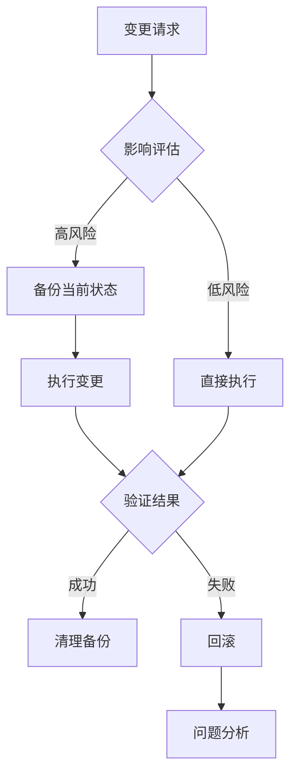
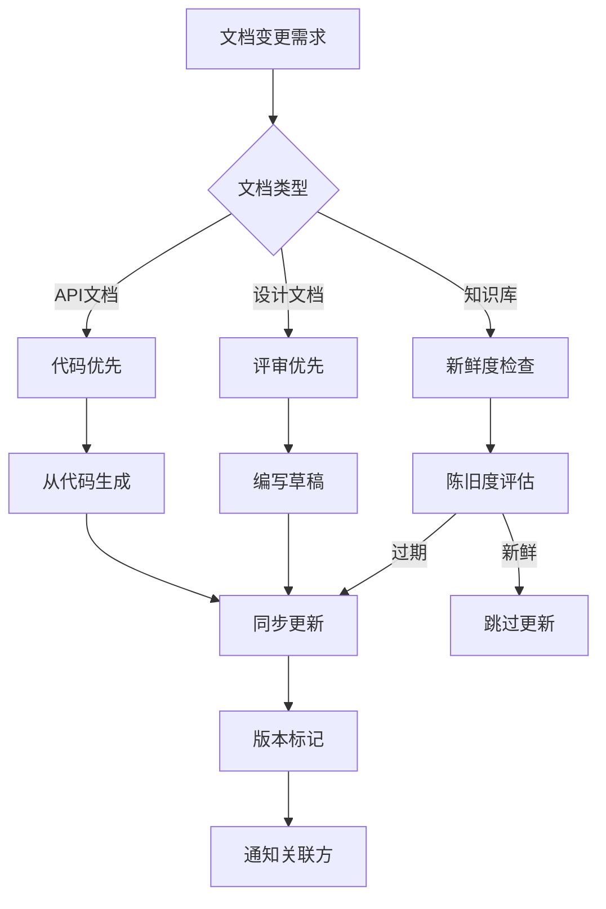
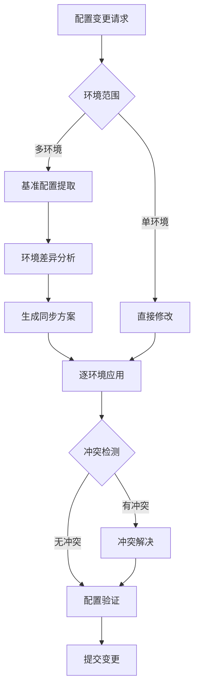
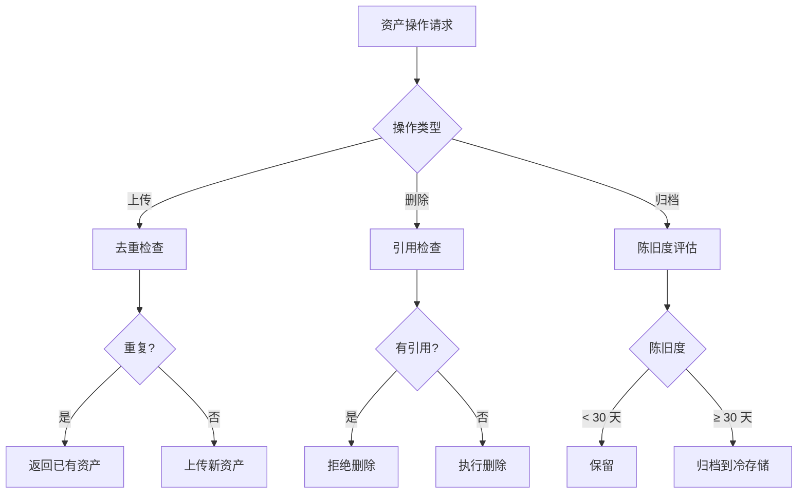
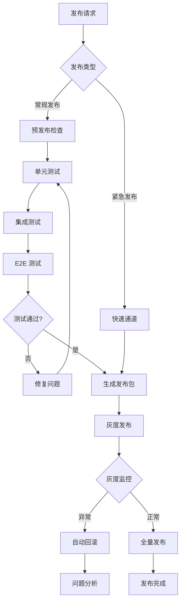

# Execution Skills 执行控制技能指南

> 本文档提供 5 个核心 Execution Skills 的完整实施规范，包含适用场景、流程图、控制点、验收标准、示例。

---

## §0 概述

### 什么是 Execution Skill

Execution Skill（执行技能）是 Agent 执行过程中的**控制层方法论**，用于：

- 规范化高风险操作
- 提供可审计的执行轨迹
- 确保跨会话的一致性

### 5 个核心 Execution Skills

| Skill | 控制对象 | 典型风险 |
|-------|---------|---------|
| 数据变更控制 | 数据库 / 文件数据 | 数据丢失、不一致 |
| 文档同步控制 | 文档内容 | 版本漂移、陈旧度 |
| 配置同步控制 | 配置文件 | 配置冲突、环境不一致 |
| 资产管理控制 | 二进制 / 大文件 | 磁盘爆炸、重复资产 |
| 发布流程控制 | 部署 / 发布 | 线上故障、回滚失败 |

### 适用原则

```
触发条件：
  - 操作涉及 ≥ 2 个系统组件
  - 操作具有不可逆性
  - 操作失败需要回滚机制
  
不触发条件：
  - 单一文件纯新增
  - 纯查询类操作
  - 用户明确要求"快速执行"
```

---

## §1 数据变更控制 Skill

### 1.1 适用场景

- 数据库 schema 变更（DDL）
- 数据迁移（DML 批量修改）
- 文件系统数据重组
- API 响应格式变更

### 1.2 核心流程图



### 1.3 关键控制点

#### CP-1：影响评估（必须）

```python
def assess_impact(change_type, target):
    """
    评估变更影响范围
    
    Returns:
        {
            "risk_level": "HIGH|MEDIUM|LOW",
            "affected_components": [...],
            "rollback_complexity": "TRIVIAL|MODERATE|HARD",
            "backup_required": bool
        }
    """
```

**判定标准**：

| 风险等级 | 触发条件 | 强制措施 |
|:-------:|---------|---------|
| HIGH | 影响生产数据 / 跨表关联 / 无 WHERE 条件 | 必须备份 + dry-run + 审批 |
| MEDIUM | 单表变更 / 有明确范围 | 必须备份 + dry-run |
| LOW | 新增测试数据 / 临时表 | 可选备份 |

#### CP-2：备份当前状态（HIGH/MEDIUM 必须）

```bash
# 数据库备份
mysqldump --single-transaction --routines db_name > backup_$(date +%Y%m%d_%H%M%S).sql

# 文件系统备份
tar -czf backup_$(date +%Y%m%d_%H%M%S).tar.gz /path/to/data
```

#### CP-3：变更执行（必须记录）

```markdown
## 变更记录

- 时间：2026-08-13 14:30:00
- 操作人：Agent-XXX
- 变更内容：添加 user_settings 表
- 执行命令：`ALTER TABLE users ADD COLUMN settings JSON`
- 影响行数：0（结构变更）
- 执行耗时：0.23s
```

#### CP-4：验证结果（必须）

```python
def verify_change(change_id):
    """
    验证变更是否达到预期
    
    Checklist:
      - 结构是否符合预期
      - 数据是否完整
      - 关联查询是否正常
      - 应用层是否正常工作
    """
```

#### CP-5：回滚机制（HIGH 必须预备）

```sql
-- 回滚脚本示例
-- rollback_20260813_add_settings.sql
ALTER TABLE users DROP COLUMN settings;
```

### 1.4 验收标准

```yaml
数据变更验收:
  - 影响评估报告已生成
  - 备份文件已创建（HIGH/MEDIUM）
  - 变更日志已记录
  - 验证脚本已执行并通过
  - 回滚脚本已准备（HIGH）
  - 用户已确认结果
```

### 1.5 实施示例

#### 示例：添加用户配置表

```markdown
### 变更请求

添加 user_settings 表，存储用户个性化配置。

### 执行过程

1. **影响评估**
   - 风险等级：MEDIUM
   - 影响范围：新表，不影响现有表
   - 回滚复杂度：TRIVIAL（删表即可）

2. **备份**
   ```bash
   mysqldump myapp users > backup_users_20260813.sql
   ```

3. **执行**
   ```sql
   CREATE TABLE user_settings (
     id BIGINT PRIMARY KEY AUTO_INCREMENT,
     user_id BIGINT NOT NULL,
     settings JSON,
     created_at TIMESTAMP DEFAULT CURRENT_TIMESTAMP,
     FOREIGN KEY (user_id) REFERENCES users(id)
   );
   ```

4. **验证**
   ```bash
   mysql -e "SHOW CREATE TABLE user_settings\G"
   mysql -e "INSERT INTO user_settings (user_id, settings) VALUES (1, '{}'); SELECT * FROM user_settings WHERE user_id=1;"
   ```

5. **回滚脚本**
   ```sql
   DROP TABLE IF EXISTS user_settings;
   ```
```

---

## §2 文档同步控制 Skill

### 2.1 适用场景

- API 文档更新
- 架构设计文档修订
- 用户手册同步
- 知识库内容迁移

### 2.2 核心流程图



### 2.3 关键控制点

#### CP-1：文档类型判定

| 类型 | 同步策略 | 优先级 |
|------|---------|:-----:|
| API 文档 | 从代码生成（OpenAPI） | P0 |
| 架构文档 | 评审后同步 | P1 |
| 用户手册 | 发布前同步 | P2 |
| 知识库 | 按新鲜度评分决定 | P3 |

#### CP-2：新鲜度评分（知识库）

```python
def calculate_freshness(doc_path):
    """
    计算文档新鲜度评分
    
    Returns:
        {
            "score": 0-100,
            "last_modified": "2026-08-13",
            "linked_code_changed": bool,
            "recommendation": "UPDATE|KEEP|ARCHIVE"
        }
    """
```

**评分规则**：

```
基础分 = 100
- 每超过 30 天未更新：-10 分
- 关联代码已变更但文档未更新：-30 分
- 文档内有 TODO/FIXME：-5 分
- 有用户反馈"文档过时"：-20 分

判定：
  ≥ 70 分：KEEP（保持）
  30-69 分：UPDATE（需更新）
  < 30 分：ARCHIVE（归档）
```

#### CP-3：版本标记（必须）

```markdown
---
title: 用户认证 API
version: 2.1.0
last_updated: 2026-08-13
code_ref: src/auth/login.ts
freshness_score: 85
---
```

#### CP-4：关联方通知

```markdown
## 文档变更通知

- 文档：用户认证 API v2.1
- 变更内容：新增 OAuth2 支持
- 影响范围：
  - 前端团队：需适配登录组件
  - 移动端团队：需更新 SDK
- 同步截止：2026-08-20
```

### 2.4 验收标准

```yaml
文档同步验收:
  - 文档版本已更新
  - 新鲜度评分已记录
  - 关联代码引用已标注
  - 变更通知已发送
  - 陈旧文档已归档（score < 30）
```

### 2.5 实施示例

#### 示例：API 文档同步

```markdown
### 变更背景

后端新增 OAuth2 登录接口，需同步更新 API 文档。

### 执行过程

1. **文档类型判定**
   - 类型：API 文档
   - 策略：代码优先（从 OpenAPI 生成）

2. **代码更新**
   ```typescript
   // src/auth/oauth2.ts
   /**
    * @openapi
    * /auth/oauth2:
    *   post:
    *     summary: OAuth2 登录
    *     tags: [Auth]
    *     requestBody:
    *       content:
    *         application/json:
    *           schema:
    *             type: object
    *             properties:
    *               provider:
    *                 type: string
    *                 enum: [google, github, wechat]
    *               code:
    *                 type: string
    *     responses:
    *       200:
    *         description: 登录成功
    */
   ```

3. **生成文档**
   ```bash
   npm run docs:generate
   ```

4. **版本标记**
   ```markdown
   ---
   version: 2.1.0
   last_updated: 2026-08-13
   code_ref: src/auth/oauth2.ts
   ---
   ```

5. **通知关联方**
   ```markdown
   @frontend-team @mobile-team 
   用户认证 API 已升级至 v2.1，新增 OAuth2 支持。
   请在 2026-08-20 前完成适配。
   ```
```

---

## §3 配置同步控制 Skill

### 3.1 适用场景

- 多环境配置同步
- 配置项新增 / 修改
- 配置版本升级
- 配置冲突解决

### 3.2 核心流程图



### 3.3 关键控制点

#### CP-1：基准配置提取

```yaml
# config/base.yaml（基准配置）
database:
  host: ${DB_HOST}
  port: 5432
  name: myapp
  
cache:
  type: redis
  host: ${REDIS_HOST}
  port: 6379

logging:
  level: INFO
```

#### CP-2：环境差异分析

```python
def analyze_config_diff(base_config, env_configs):
    """
    分析各环境配置差异
    
    Returns:
        {
            "env_name": {
                "additions": [...],
                "modifications": [...],
                "deletions": [...],
                "conflicts": [...]
            }
        }
    """
```

**差异类型**：

| 类型 | 说明 | 处理策略 |
|------|------|---------|
| addition | 环境新增配置项 | 评估是否需要同步到基准 |
| modification | 环境修改基准配置 | 检查是否为环境特定值 |
| deletion | 环境删除基准配置 | 确认是否为废弃项 |
| conflict | 多环境配置冲突 | 需人工决策 |

#### CP-3：冲突解决策略

```yaml
冲突解决矩阵:
  - 策略：BASE_WINS（基准优先）
    适用：配置项应为标准值
  
  - 策略：ENV_WINS（环境优先）
    适用：环境特定配置（如 DB_HOST）
  
  - 策略：MANUAL（人工决策）
    适用：安全相关配置、无法自动判定
```

#### CP-4：配置验证（必须）

```python
def validate_config(config_path):
    """
    验证配置有效性
    
    Checklist:
      - YAML/JSON 语法正确
      - 必需项未缺失
      - 类型符合预期
      - 环境变量引用正确
      - 敏感信息已脱敏
    """
```

#### CP-5：配置变更审计

```markdown
## 配置变更记录

- 时间：2026-08-13 14:30
- 环境：production
- 变更项：
  - logging.level: INFO → WARN
  - cache.ttl: 300 → 600
- 原因：生产环境日志量过大，缓存命中率低
- 操作人：Agent-XXX
- 回滚方案：恢复上一版本 config/production.yaml
```

### 3.4 验收标准

```yaml
配置同步验收:
  - 基准配置已更新
  - 环境差异已分析
  - 冲突已解决
  - 配置验证已通过
  - 变更记录已生成
  - 敏感信息已脱敏
```

### 3.5 实施示例

#### 示例：多环境日志级别调整

```markdown
### 变更需求

生产环境日志量过大，需将日志级别从 INFO 调整为 WARN。

### 执行过程

1. **环境范围**
   - 影响环境：production
   - 不影响：development, staging（保持 DEBUG）

2. **环境差异分析**
   ```bash
   config-diff base.yaml production.yaml
   # Output:
   # [MODIFICATION] logging.level: INFO → WARN
   ```

3. **生成同步方案**
   ```yaml
   方案:
     production:
       - logging.level: INFO → WARN
       - cache.ttl: 300 → 600（关联优化）
   ```

4. **配置验证**
   ```bash
   config-validate production.yaml
   # ✓ YAML 语法正确
   # ✓ 必需项完整
   # ✓ 类型正确
   ```

5. **变更记录**
   ```markdown
   | 时间 | 环境 | 变更项 | 原因 |
   |------|------|--------|------|
   | 2026-08-13 14:30 | production | logging.level | 降低日志量 |
   | 2026-08-13 14:30 | production | cache.ttl | 提升命中率 |
   ```
```

---

## §4 资产管理控制 Skill

### 4.1 适用场景

- 大文件资产上传 / 替换
- 资产去重
- 资产归档
- 磁盘空间管理

### 4.2 核心流程图



### 4.3 关键控制点

#### CP-1：去重检查（上传必须）

```python
def check_duplicate(file_path, asset_store):
    """
    检查资产是否已存在
    
    Returns:
        {
            "is_duplicate": bool,
            "existing_asset_id": str or None,
            "similarity_score": 0.0-1.0,
            "action": "USE_EXISTING|UPLOAD_NEW"
        }
    """
```

**去重策略**：

| 文件类型 | 去重方式 | 容差 |
|---------|---------|------|
| 图片 | perceptual hash | 视觉相似度 ≥ 95% |
| 视频 | frame hash + duration | 前帧相似 + 时长一致 |
| 文档 | SHA-256 | 完全一致 |
| 模型 | SHA-256 | 完全一致 |

#### CP-2：引用追踪（删除必须）

```python
def trace_asset_references(asset_id):
    """
    追踪资产引用
    
    Returns:
        {
            "referenced_by": [
                {"type": "page", "id": "home", "location": "hero-image"},
                {"type": "component", "id": "avatar", "location": "default"}
            ],
            "safe_to_delete": bool
        }
    """
```

**删除判定**：

```
safe_to_delete = (
    referenced_by is empty OR
    user_confirmed_force_delete
)
```

#### CP-3：陈旧度评估（归档必须）

```python
def evaluate_asset_staleness(asset_id):
    """
    评估资产陈旧度
    
    Returns:
        {
            "last_accessed": "2026-08-13",
            "days_unused": 45,
            "size_mb": 12.5,
            "action": "KEEP|ARCHIVE|DELETE"
        }
    """
```

**判定规则**：

| 未使用天数 | 大小 | 建议操作 |
|:---------:|:---:|---------|
| < 30 天 | 任意 | KEEP |
| 30-90 天 | < 10MB | KEEP（等待观察） |
| 30-90 天 | ≥ 10MB | ARCHIVE（冷存储） |
| > 90 天 | 任意 | ARCHIVE + 提示删除 |

#### CP-4：磁盘空间预警

```yaml
磁盘空间监控:
  - 阈值警告：使用率 ≥ 70%
  - 阈值严重：使用率 ≥ 85%
  - 阈值紧急：使用率 ≥ 95%

应对措施:
  - 警告：列出前 10 大资产，建议归档
  - 严重：自动归档 > 90 天未访问资产
  - 紧急：阻止新资产上传，强制清理
```

#### CP-5：快照导出 / 回灌(对应 ai-short-studio-monster `npm run project:init:export` + `:init`)

```bash
# 导出当前资产 + 配置快照到 prisma/init-data.json
asset-snapshot export --output prisma/init-data.json

# 快照只包含全局初始化数据(资产/字典/默认配置)
# 不得加入:用户、项目、任务、密钥、媒体二进制、通知
asset-snapshot validate --input prisma/init-data.json --exclude user,project,task,key,media,notification

# 期望变更前 / 期望变更后 各导一次,比对 diff
asset-snapshot diff before.json after.json --strict
# exit 0 = 一致; exit 1 = 出现计划外字段

# 回灌:清库后恢复初始化数据
asset-snapshot apply --input prisma/init-data.json --target prisma
```

**判定规则**:

| 场景 | 必跑命令 |
|------|---------|
| 修改资产 schema / seed / 默认配置 | `snapshot export` → `snapshot apply` → `snapshot diff` 必须 exit 0 |
| 仅修文档/翻译 | 仅 `snapshot diff`,确认无意外变更 |
| 跨环境迁移 | `snapshot export --env production` → 在目标环境 `snapshot apply` |

> 参考:`ai-short-studio-monster` AGENTS.md §3 + §4,`prisma/init-data.json` 是事实来源,改完初始化链路必须 `project:init:export` + `project:init` 双跑验证。

### 4.4 验收标准

```yaml
资产管理验收:
  - 上传资产已去重
  - 删除资产已检查引用
  - 归档资产已生成清单
  - 磁盘空间已监控
  - 操作日志已记录
```

### 4.5 实施示例

#### 示例：用户头像上传

```markdown
### 场景

用户上传头像图片，需检查是否重复。

### 执行过程

1. **去重检查**
   ```python
   result = check_duplicate("uploads/avatar_123.jpg", asset_store)
   # Output:
   # is_duplicate: False
   # similarity_score: 0.45（与已有头像不相似）
   # action: UPLOAD_NEW
   ```

2. **上传新资产**
   ```bash
   asset-upload uploads/avatar_123.jpg --type avatar --user 123
   # Asset ID: asset_abc789
   # Size: 245KB
   ```

3. **记录引用**
   ```yaml
   # assets/registry.yaml
   asset_abc789:
     type: avatar
     user: 123
     uploaded_at: 2026-08-13
     size_kb: 245
   ```

4. **磁盘空间检查**
   ```bash
   disk-usage
   # Used: 68% (4.2GB / 6.2GB)
   # Status: OK（< 70%）
   ```
```

---

## §5 发布流程控制 Skill

### 5.1 适用场景

- 应用版本发布
- 配置热更新
- 数据库迁移发布
- 多服务协同发布

### 5.2 核心流程图



### 5.3 关键控制点

#### CP-1：预发布检查清单（常规发布必须）

```yaml
预发布检查:
  代码质量:
    - 单元测试覆盖率 ≥ 80%
    - 无严重 lint 错误
    - 无安全漏洞扫描告警
  
  集成验证:
    - API 契约测试通过
    - 数据库迁移脚本已验证
    - 配置文件已同步
  
  文档同步:
    - CHANGELOG 已更新
    - API 文档已同步
    - 用户公告已准备
  
  回滚准备:
    - 回滚脚本已准备
    - 数据库回滚脚本已验证
    - 回滚演练已通过
```

#### CP-2：灰度发布策略

```yaml
灰度发布:
  阶段1:
    流量比例: 5%
    持续时间: 30min
    监控指标:
      - 错误率 < 0.1%
      - 响应时间 P99 < 500ms
  
  阶段2:
    流量比例: 20%
    持续时间: 1h
    监控指标:
      - 错误率 < 0.1%
      - 响应时间 P99 < 500ms
  
  阶段3:
    流量比例: 100%
    持续时间: 持续监控
    监控指标:
      - 错误率 < 0.05%
      - 响应时间 P99 < 300ms
```

#### CP-3：自动回滚触发条件

```yaml
自动回滚触发:
  - 错误率 ≥ 1%（立即回滚）
  - 响应时间 P99 ≥ 2000ms（立即回滚）
  - 内存使用率 ≥ 90%（立即回滚）
  - 用户投诉 ≥ 5 条/分钟（人工决策）
  
回滚流程:
  1. 停止灰度流量
  2. 切回旧版本
  3. 执行数据库回滚（如有）
  4. 通知相关人员
  5. 生成回滚报告
```

#### CP-4：发布签名（必须）

```markdown
## 发布记录

- 版本：v2.3.1
- 发布时间：2026-08-13 16:00:00
- 发布人：Agent-XXX
- 发布类型：常规发布
- 变更内容：
  - 新增 OAuth2 登录支持
  - 优化缓存策略
  - 修复登录超时问题
- 灰度过程：5% → 20% → 100%（总耗时 1.5h）
- 监控结果：错误率 0.02%，P99 287ms
- 回滚脚本：rollback_v2.3.1.sh
```

#### CP-5：发布后监控（发布后 24h）

```yaml
发布后监控:
  时间窗口:
    - 发布后 0-1h：每 5min 检查一次
    - 发布后 1-6h：每 15min 检查一次
    - 发布后 6-24h：每 30min 检查一次
  
  监控项:
    - 错误率趋势
    - 响应时间分布
    - 资源使用率
    - 用户反馈
  
  异常处理:
    - 发现异常 → 立即通知
    - 严重异常 → 紧急回滚
```

### 5.4 验收标准

```yaml
发布流程验收:
  - 预发布检查全部通过
  - 灰度发布已完成
  - 监控指标正常
  - 发布签名已记录
  - 回滚脚本已验证
  - 发布后监控已启动
```

### 5.5 实施示例

#### 示例：v2.3.1 常规发布

```markdown
### 发布需求

发布 v2.3.1，包含 OAuth2 登录功能和性能优化。

### 执行过程

1. **预发布检查**
   ```bash
   npm test
   # Coverage: 85%
   
   npm run lint
   # No errors
   
   security-scan
   # No vulnerabilities
   ```

2. **生成发布包**
   ```bash
   npm run build
   npm version patch  # 2.3.0 → 2.3.1
   git tag v2.3.1
   ```

3. **灰度发布**
   ```bash
   deploy --strategy=canary --ratio=5
   # 等待 30min，监控正常
   
   deploy --strategy=canary --ratio=20
   # 等待 1h，监控正常
   
   deploy --strategy=canary --ratio=100
   # 全量发布
   ```

4. **发布签名**
   ```markdown
   | 字段 | 值 |
   |------|-----|
   | 版本 | v2.3.1 |
   | 时间 | 2026-08-13 16:00 |
   | 错误率 | 0.02% |
   | P99 | 287ms |
   ```

5. **发布后监控**
   ```bash
   monitor --version=v2.3.1 --duration=24h
   # 自动生成监控报告
   ```
```

---

## §6 Execution Skill 通用模板

### 6.1 模板结构

```markdown
# {Skill 名称} 控制 Skill

## 适用场景

{列举 3-5 个典型场景}

## 核心流程图

```mermaid
{Mermaid 流程图}
```

## 关键控制点

### CP-1：{控制点名称}

{控制点描述}

{判定标准表格}

### CP-2：{控制点名称}

...

## 验收标准

```yaml
{YAML 格式验收清单}
```

## 实施示例

{完整示例，包含场景、执行过程、结果}
```

### 6.2 控制点编写规范

```markdown
控制点必须包含：

1. **触发条件**：何时执行此控制点
2. **执行步骤**：具体操作流程
3. **判定标准**：成功 / 失败的判定规则
4. **输出产物**：控制点产生的文档 / 数据
5. **失败处理**：控制点失败时的应对措施
```

### 6.3 流程图绘制规范

```markdown
流程图规范：

1. 使用 Mermaid graph TD（自上而下）
2. 节点命名：
   - 方框：[操作步骤]
   - 菱形：{判定条件}
   - 圆角：((开始/结束))
3. 分支标注：
   - 成功分支：绿色标签
   - 失败分支：红色标签
   - 特殊分支：黄色标签
4. 流程必须包含：
   - 开始节点
   - 至少一个判定节点
   - 异常处理分支
   - 结束节点
```

---

## §7 最佳实践

### 7.1 Execution Skill 设计原则

```yaml
设计原则:
  1. 控制点最小化:
     - 只在关键风险点设置控制点
     - 避免过度流程化
  
  2. 风险分级:
     - HIGH：必须完整流程
     - MEDIUM：可简化部分控制点
     - LOW：可跳过非必要控制点
  
  3. 可审计性:
     - 每个控制点必须产生记录
     - 记录可追溯、可查询
  
  4. 可回滚性:
     - HIGH 风险操作必须预备回滚方案
     - 回滚方案必须经过验证
```

### 7.2 Execution Skill 实施要点

```yaml
实施要点:
  1. 前置条件验证:
     - 检查执行环境是否满足要求
     - 检查依赖资源是否可用
  
  2. 执行过程监控:
     - 实时记录执行状态
     - 异常立即告警
  
  3. 后置验证:
     - 验证操作结果符合预期
     - 检查副作用是否可控
  
  4. 清理工作:
     - 清理临时产物
     - 归档中间文件
```

### 7.3 Execution Skill 协作规范

```yaml
协作规范:
  1. 跨团队协作:
     - 明确责任边界
     - 使用标准化输出格式
  
  2. 人机协作:
     - Agent 负责执行控制点
     - 人类负责判定和决策
  
  3. 异常处理:
     - Agent 遇到无法自动处理的异常 → 阻塞并通知
     - 不猜测、不跳过、不隐藏异常
```

---

## §8 反模式（Anti-Patterns）

### AP-1：过度流程化

**错误操作**：对所有操作都应用完整 Execution Skill 流程。

**正确做法**：
- 仅对高风险操作应用完整流程
- 低风险操作可简化或跳过

**示例**：
```markdown
❌ 错误：
  - 新增测试文件 → 完整数据变更控制流程
  
✅ 正确：
  - 新增测试文件 → 直接执行（LOW 风险）
  - 修改生产数据库 → 完整流程（HIGH 风险）
```

### AP-2：控制点缺失

**错误操作**：Execution Skill 流程中缺少关键控制点。

**常见缺失**：
- 缺少回滚准备
- 缺少验收标准
- 缺少异常处理分支

**正确做法**：
- 参考通用模板补全控制点
- 至少包含：影响评估、执行记录、结果验证、回滚方案（HIGH）

### AP-3：记录不完整

**错误操作**：控制点执行后未生成完整记录。

**常见缺失**：
- 未记录执行时间
- 未记录操作人
- 未记录判定依据

**正确做法**：
```markdown
## 变更记录（完整示例）

- 时间：2026-08-13 14:30:00
- 操作人：Agent-XXX
- 变更内容：添加 user_settings 表
- 影响评估：MEDIUM 风险，新表不影响现有结构
- 执行结果：成功
- 验证结果：结构符合预期，测试数据插入正常
- 回滚脚本：rollback_20260813_add_settings.sql
```

### AP-4：回滚方案未验证

**错误操作**：准备了回滚方案但未验证可行性。

**风险**：
- 真正需要回滚时发现脚本不可用
- 回滚脚本本身有语法错误
- 回滚脚本导致新问题

**正确做法**：
```bash
# 在测试环境验证回滚脚本
bash rollback_20260813_add_settings.sql

# 验证回滚后状态
mysql -e "SHOW TABLES LIKE 'user_settings';"
# 应返回空（表已删除）
```

---

## §9 快速参考

### 9.1 Execution Skill 决策树

```
操作是否涉及数据变更？
  ├─ 是 → 数据变更控制 Skill
  └─ 否 → 操作是否涉及文档？
           ├─ 是 → 文档同步控制 Skill
           └─ 否 → 操作是否涉及配置？
                    ├─ 是 → 配置同步控制 Skill
                    └─ 否 → 操作是否涉及大文件？
                             ├─ 是 → 资产管理控制 Skill
                             └─ 否 → 操作是否为发布？
                                      ├─ 是 → 发布流程控制 Skill
                                      └─ 否 → 无需 Execution Skill
```

### 9.2 风险等级速查表

| 操作类型 | 典型风险等级 | 建议流程 |
|---------|:-----------:|---------|
| 新增测试数据 | LOW | 可选备份 |
| 新增生产表 | MEDIUM | 备份 + dry-run |
| 修改生产表结构 | HIGH | 完整流程 + 审批 |
| 删除生产数据 | HIGH | 完整流程 + 审批 |
| 更新 API 文档 | LOW | 从代码生成 |
| 修改架构文档 | MEDIUM | 评审后同步 |
| 单环境配置修改 | LOW | 直接修改 |
| 多环境配置同步 | MEDIUM | 差异分析 + 冲突解决 |
| 常规版本发布 | HIGH | 完整流程 + 灰度 |
| 紧急热修复 | MEDIUM | 快速通道 + 加强监控 |

---

## 附录

### A. 相关技能

- `fullstack4TraeV11` — 全栈开发流程控制
- `acceptance-discipline` — 验收门禁
- `trae-security-review` — 安全审查

### B. 工具参考

- 数据库备份：`mysqldump`, `pg_dump`
- 配置验证：`config-validate`
- 资产去重：`asset-check-duplicate`
- 灰度发布：`deploy --strategy=canary`

### C. 模板文件

- [Execution Skill 通用模板](../templates/execution-skill-template.md)