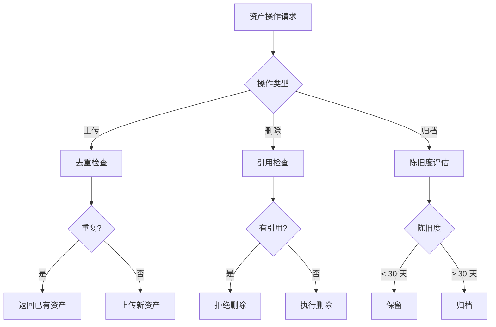

# 场景 02：添加新 Execution Skill

> 本场景展示如何在现有控制体系中添加新的 Execution Skill，以支持新的业务场景。

---

## 场景描述

**背景**：项目需要添加新的业务流程控制，现有的 Execution Skills 无法完全覆盖。

**目标**：
- 创建符合规范的 Execution Skill
- 集成到现有控制体系
- 提供可复用的执行流程

**预计时间**：1-2 小时

---

## 前置条件

### 环境要求

- 已完成场景 01（项目控制体系已建立）
- 熟悉 Execution Skill 规范（已阅读 `references/execution-skills-guide.md`）

### 判断是否需要新增

```
判断标准（满足任一即可新增）：
✓ 有独立的数据变更场景（非现有 Skill 覆盖）
✓ 有独立的文档同步场景（非现有 Skill 覆盖）
✓ 有独立的配置管理场景（非现有 Skill 覆盖）
✓ 有独立的资产管理场景（非现有 Skill 覆盖）
✓ 有独立的发布流程场景（非现有 Skill 覆盖）

禁止新增：
✗ 现有 Skill 已覆盖（改为扩展现有 Skill）
✗ 场景过于简单（直接内联，不建 Skill）
✗ 场景过于复杂（拆分为多个 Skill）
```

---

## 详细步骤

### Step 1：场景分析（15 分钟）

#### 1.1 识别场景类型

根据业务需求，判断属于哪类 Execution Skill：

| 场景类型 | 典型触发条件 | 参考 Skill |
|---------|-------------|------------|
| 数据变更 | 涉及数据库操作、文件系统数据变更 | data-change-control |
| 文档同步 | API 文档更新、架构文档修订 | doc-sync-control |
| 配置同步 | 环境变量更新、依赖版本升级 | config-sync-control |
| 资产管理 | 大文件上传、资产去重 | asset-mgmt-control（需新建） |
| 发布流程 | 版本发布、灰度部署 | release-flow-control（需新建） |

#### 1.2 确定控制点

列出关键控制点：

```yaml
控制点清单:
  前置检查:
    - [ ] 影响评估
    - [ ] 权限验证
    - [ ] 备份（如需要）
  
  执行过程:
    - [ ] 操作记录
    - [ ] 进度监控
    - [ ] 异常捕获
  
  后置校验:
    - [ ] 结果验证
    - [ ] 副作用检查
    - [ ] 通知相关方
```

---

### Step 2：使用模板创建 Skill（30 分钟）

#### 2.1 复制模板

```bash
cd your-project/.agents/skills/

# 使用模板创建新 Skill
mkdir {skill-name}
cp ../../../templates/execution-skill-template.md {skill-name}/SKILL.md
```

#### 2.2 编辑 Skill 文件

以"资产管理控制"为例，编辑 `asset-mgmt-control/SKILL.md`：

```yaml
---
name: asset-mgmt-control
description: 资产管理执行控制 — 控制大文件上传、资产去重、资产归档等场景。当用户需要上传大文件、管理资产库、执行资产清理时使用。
version: 1.0.0
triggers:
  - asset_upload
  - asset_dedup
  - asset_archive
---

# 资产管理控制 Skill

## 适用场景

- 大文件资产上传（> 10MB）
- 资产去重检查
- 资产归档和清理
- 磁盘空间管理

## 核心流程图



## 关键控制点

### CP-1：去重检查（上传必须）

**触发条件**：资产上传操作
**执行步骤**：
1. 计算文件哈希值
2. 检查资产库是否已存在相同哈希
3. 返回去重结果

**判定标准**：
| 文件类型 | 去重方式 | 容差 |
|---------|---------|------|
| 图片 | perceptual hash | 视觉相似度 ≥ 95% |
| 视频 | frame hash + duration | 前帧相似 + 时长一致 |
| 文档 | SHA-256 | 完全一致 |

**输出产物**：
```json
{
  "is_duplicate": false,
  "existing_asset_id": null,
  "similarity_score": 0.0,
  "action": "UPLOAD_NEW"
}
```

### CP-2：引用追踪（删除必须）

**触发条件**：资产删除操作
**执行步骤**：
1. 查询资产引用关系
2. 判断是否存在活跃引用
3. 返回删除可行性评估

**判定标准**：
```
safe_to_delete = (
  referenced_by is empty OR
  user_confirmed_force_delete
)
```

### CP-3：陈旧度评估（归档必须）

**触发条件**：资产归档操作
**执行步骤**：
1. 查询最后访问时间
2. 计算未使用天数
3. 返回归档建议

**判定标准**：
| 未使用天数 | 大小 | 建议操作 |
|:---------:|:---:|---------|
| < 30 天 | 任意 | KEEP |
| 30-90 天 | < 10MB | KEEP |
| 30-90 天 | ≥ 10MB | ARCHIVE |
| > 90 天 | 任意 | ARCHIVE + 提示删除 |

## 验收标准

```yaml
资产管理验收:
  - 去重检查已执行（上传）
  - 引用检查已执行（删除）
  - 陈旧度评估已生成（归档）
  - 操作日志已记录
  - 磁盘空间已监控
```

## 实施示例

### 示例：用户头像上传

```markdown
场景：用户上传头像图片，需检查是否重复。

执行过程：

1. **去重检查**
   ```bash
   asset-check-duplicate uploads/avatar_123.jpg
   # Output:
   # is_duplicate: False
   # similarity_score: 0.45
   # action: UPLOAD_NEW
   ```

2. **上传资产**
   ```bash
   asset-upload uploads/avatar_123.jpg --type avatar --user 123
   # Asset ID: asset_abc789
   # Size: 245KB
   ```

3. **记录引用**
   ```yaml
   # assets/registry.yaml
   asset_abc789:
     type: avatar
     user: 123
     uploaded_at: 2025-08-13
   ```
```
```

---

### Step 3：实现控制逻辑（30 分钟）

#### 3.1 创建执行脚本

创建 `scripts/asset-control.mjs`：

```javascript
#!/usr/bin/env node

import fs from 'fs';
import path from 'path';
import crypto from 'crypto';

/**
 * 资产管理控制脚本
 */

class AssetController {
  constructor(assetStorePath) {
    this.assetStorePath = assetStorePath;
    this.registryPath = path.join(assetStorePath, 'registry.json');
  }

  /**
   * CP-1：去重检查
   */
  async checkDuplicate(filePath) {
    const fileHash = await this.calculateHash(filePath);
    const registry = this.loadRegistry();
    
    for (const [assetId, asset] of Object.entries(registry)) {
      if (asset.hash === fileHash) {
        return {
          is_duplicate: true,
          existing_asset_id: assetId,
          similarity_score: 1.0,
          action: 'USE_EXISTING'
        };
      }
    }
    
    return {
      is_duplicate: false,
      existing_asset_id: null,
      similarity_score: 0.0,
      action: 'UPLOAD_NEW'
    };
  }

  /**
   * CP-2：引用追踪
   */
  async traceReferences(assetId) {
    const registry = this.loadRegistry();
    const references = [];
    
    for (const [id, asset] of Object.entries(registry)) {
      if (asset.references && asset.references.includes(assetId)) {
        references.push({ type: 'asset', id });
      }
    }
    
    return {
      referenced_by: references,
      safe_to_delete: references.length === 0
    };
  }

  /**
   * CP-3：陈旧度评估
   */
  async evaluateStaleness(assetId) {
    const registry = this.loadRegistry();
    const asset = registry[assetId];
    
    if (!asset) {
      throw new Error(`Asset not found: ${assetId}`);
    }
    
    const lastAccessed = new Date(asset.last_accessed || asset.uploaded_at);
    const daysUnused = Math.floor((Date.now() - lastAccessed) / (1000 * 60 * 60 * 24));
    
    let action = 'KEEP';
    if (daysUnused > 90) {
      action = 'ARCHIVE';
    } else if (daysUnused > 30 && asset.size_mb >= 10) {
      action = 'ARCHIVE';
    }
    
    return {
      asset_id: assetId,
      last_accessed: lastAccessed.toISOString(),
      days_unused: daysUnused,
      size_mb: asset.size_mb || 0,
      action
    };
  }

  /**
   * 计算文件哈希
   */
  async calculateHash(filePath) {
    const content = fs.readFileSync(filePath);
    return crypto.createHash('sha256').update(content).digest('hex');
  }

  /**
   * 加载资产注册表
   */
  loadRegistry() {
    if (!fs.existsSync(this.registryPath)) {
      return {};
    }
    return JSON.parse(fs.readFileSync(this.registryPath, 'utf-8'));
  }

  /**
   * 保存资产注册表
   */
  saveRegistry(registry) {
    fs.writeFileSync(this.registryPath, JSON.stringify(registry, null, 2));
  }
}

// CLI 入口
const args = process.argv.slice(2);
const command = args[0];

const controller = new AssetController('./assets');

switch (command) {
  case 'check-duplicate':
    controller.checkDuplicate(args[1]).then(console.log);
    break;
  case 'trace-references':
    controller.traceReferences(args[1]).then(console.log);
    break;
  case 'evaluate-staleness':
    controller.evaluateStaleness(args[1]).then(console.log);
    break;
  default:
    console.log('Usage: asset-control.mjs <command> [args]');
    console.log('Commands: check-duplicate, trace-references, evaluate-staleness');
}
```

#### 3.2 添加到 package.json

```json
{
  "scripts": {
    "asset:check": "node scripts/asset-control.mjs check-duplicate",
    "asset:trace": "node scripts/asset-control.mjs trace-references",
    "asset:eval": "node scripts/asset-control.mjs evaluate-staleness"
  }
}
```

---

### Step 4：集成到 Gate 流程（15 分钟）

#### 4.1 更新门禁配置

编辑 `gates/gate-config.json`：

```json
{
  "gates": {
    "pre-push": {
      "checks": [
        "test:integration",
        "test:coverage",
        "build",
        "asset:check"  // 新增资产检查
      ]
    }
  }
}
```

#### 4.2 更新 Git Hook

编辑 `.husky/pre-push`：

```bash
#!/usr/bin/env sh
. "$(dirname -- "$0")/_/husky.sh"

npm run test:integration && \
npm run test:coverage && \
npm run build && \
npm run asset:check  # 新增
```

---

### Step 5：编写测试用例（15 分钟）

#### 5.1 创建测试文件

创建 `tests/unit/asset-control.test.mjs`：

```javascript
import { describe, it, expect } from 'vitest';
import AssetController from '../../scripts/asset-control.mjs';

describe('AssetController', () => {
  const controller = new AssetController('./test-assets');

  it('should detect duplicate assets', async () => {
    const result = await controller.checkDuplicate('test-file.jpg');
    expect(result).toHaveProperty('is_duplicate');
    expect(result).toHaveProperty('action');
  });

  it('should trace asset references', async () => {
    const result = await controller.traceReferences('test-asset-id');
    expect(result).toHaveProperty('referenced_by');
    expect(result).toHaveProperty('safe_to_delete');
  });

  it('should evaluate asset staleness', async () => {
    const result = await controller.evaluateStaleness('test-asset-id');
    expect(result).toHaveProperty('days_unused');
    expect(result).toHaveProperty('action');
    expect(['KEEP', 'ARCHIVE']).toContain(result.action);
  });
});
```

#### 5.2 运行测试

```bash
npm run test:unit
```

---

### Step 6：文档和示例（15 分钟）

#### 6.1 创建使用示例

创建 `examples/asset-upload-example.md`：

```markdown
# 资产上传示例

## 场景

用户上传头像图片，系统自动检查重复。

## 步骤

1. 用户上传文件到 `uploads/avatar_123.jpg`
2. 系统执行去重检查
3. 如未重复，上传到资产库
4. 记录资产引用关系

## 命令

```bash
# 去重检查
npm run asset:check uploads/avatar_123.jpg

# 上传资产
npm run asset:upload uploads/avatar_123.jpg --type=avatar

# 验证结果
npm run asset:verify asset_abc789
```
```

#### 6.2 更新项目 README

在项目 README.md 中添加新 Skill 说明：

```markdown
## Execution Skills

- **数据变更控制**：数据库操作、文件系统变更
- **文档同步控制**：API 文档、架构文档同步
- **配置同步控制**：环境变量、依赖版本管理
- **资产管理控制**（NEW）：大文件上传、资产去重、归档管理
```

---

## 预期结果

### 成功标准

- [ ] Skill 文件格式正确（YAML frontmatter + Markdown）
- [ ] 控制点实现完整（至少 3 个）
- [ ] 执行脚本可运行（无语法错误）
- [ ] 测试用例通过（覆盖率 ≥ 80%）
- [ ] 文档示例可执行

### 产出物清单

```yaml
新 Execution Skill 产物:
  技能文件:
    - .agents/skills/asset-mgmt-control/SKILL.md
  
  执行脚本:
    - scripts/asset-control.mjs
  
  测试文件:
    - tests/unit/asset-control.test.mjs
  
  示例文档:
    - examples/asset-upload-example.md
```

---

## 常见问题

### Q1：控制点数量如何确定？

**原则**：控制点最小化，只在关键风险点设置。

```
最少控制点：
- 前置检查：至少 1 个（影响评估/权限验证）
- 执行过程：至少 1 个（操作记录）
- 后置校验：至少 1 个（结果验证）

推荐控制点：5-7 个
最多控制点：不超过 10 个（避免过度流程化）
```

### Q2：如何处理回滚逻辑？

**标准**：高风险操作（HIGH）必须预备回滚方案。

```yaml
回滚策略:
  HIGH 风险:
    - 必须编写回滚脚本
    - 回滚脚本必须经过验证
    - 执行前必须备份
  
  MEDIUM 风险:
    - 推荐编写回滚脚本
    - 至少提供回滚步骤说明
  
  LOW 风险:
    - 可选回滚方案
```

### Q3：如何与现有 Skill 协作？

**协作模式**：

```
Execution Skill 协作:
  串联模式: Skill A → Skill B → Skill C
    示例: 数据变更 → 文档同步 → 发布流程
  
  并联模式: Skill A、Skill B 同时执行
    示例: 配置同步 + 资产管理（发布前准备）
  
  条件模式: 根据条件选择执行哪个 Skill
    示例: if 需要数据变更 → data-change-control
          elif 需要配置同步 → config-sync-control
```

### Q4：如何判断 Skill 是否过于复杂？

**复杂度判定**：

| 指标 | 简单 | 适中 | 复杂 | 过于复杂 |
|------|------|------|------|---------|
| 控制点数 | 1-3 | 4-6 | 7-10 | > 10 |
| 流程步骤 | 1-5 | 6-10 | 11-15 | > 15 |
| 代码行数 | < 100 | 100-300 | 300-500 | > 500 |

**拆分建议**：超过"复杂"阈值，考虑拆分为多个 Skill。

### Q5：如何处理 Skill 版本升级？

**升级流程**：

```
1. 评估变更影响（L0-L9 决策层级）
2. 如涉及 L1+ 变更 → 走变更流程
3. 更新 version 字段（遵循语义化版本）
4. 更新 CHANGELOG
5. 运行完整测试套件
6. 通知依赖方（如有）
```

---

## 后续步骤

1. **团队评审**：组织团队评审新 Skill 设计
2. **试用验证**：在小范围项目中试用新 Skill
3. **反馈收集**：收集使用反馈，优化控制点
4. **正式发布**：验收通过后正式发布

---

## 相关资源

- [Execution Skills 指南](../references/execution-skills-guide.md)
- [Execution Skill 模板](../templates/execution-skill-template.md)
- [实施路线图](../references/implementation-roadmap.md)

---

> **维护者**：agent-dev-control-kit
> **最后更新**：2025-08-13
> **版本**：1.0.0