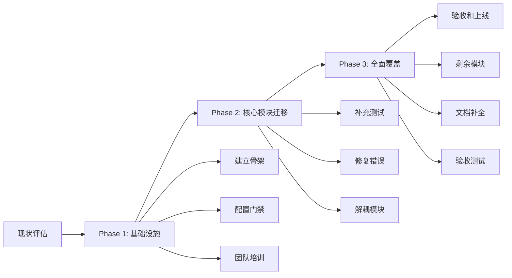

# 场景 05：遗留项目迁移到控制体系

> 本场景展示如何将遗留项目渐进式迁移到 Agent 开发控制体系，包括现状评估、迁移策略和兼容性处理。

---

## 场景描述

**背景**：存在一个开发多年的遗留项目，希望引入控制体系提升质量和可维护性。

**目标**：
- 评估遗留项目现状
- 制定渐进式迁移策略
- 处理兼容性问题

**预计时间**：评估 1-2 天，实施 1-2 周

---

## 前置条件

### 环境要求

- 遗留项目代码库可访问
- 具备项目修改权限

### 迁移决策

```
迁移前必须确认：
✓ 团队有明确的迁移意愿和资源投入
✓ 项目仍处于维护/开发状态（非归档项目）
✓ 迁移收益大于成本（质量提升 > 迁移投入）

不推荐迁移的情况：
✗ 项目即将下线
✗ 团队无维护资源
✗ 迁移成本过高（如完全重写）
```

---

## 详细步骤

### Step 1：现状评估（1-2 天）

#### 1.1 项目健康度评估

创建 `docs/legacy-assessment.md`：

```markdown
## 遗留项目评估报告

### 项目基本信息

- 项目名称：{project-name}
- 代码库规模：{lines-of-code} LOC
- 活跃开发者：{active-developers} 人
- 最近更新：{last-update}
- 主要技术栈：{tech-stack}

### 代码质量评估

#### 测试覆盖

| 指标 | 当前值 | 目标值 | 差距 |
|------|--------|--------|------|
| 单元测试覆盖率 | 25% | 80% | -55% |
| 集成测试数量 | 15 | 50 | -35 |
| E2E 测试数量 | 0 | 20 | -20 |

#### 代码规范

| 指标 | 当前值 | 目标值 | 状态 |
|------|--------|--------|------|
| Lint 错误数 | 350 | 0 | ❌ 需修复 |
| TypeCheck 错误数 | 120 | 0 | ❌ 需修复 |
| 循环依赖数 | 18 | 0 | ❌ 需解耦 |

#### 架构健康度

| 问题类型 | 数量 | 严重性 |
|---------|------|--------|
| 大文件（> 500 行） | 12 | MEDIUM |
| 大函数（> 50 行） | 45 | MEDIUM |
| 循环依赖 | 18 | HIGH |
| 硬编码配置 | 67 | HIGH |
| 缺失类型定义 | 120 | MEDIUM |

### 风险评估

| 风险项 | 影响范围 | 迁移难度 |
|--------|---------|---------|
| 缺乏测试覆盖 | 全局 | HIGH |
| 架构耦合严重 | 核心模块 | HIGH |
| 硬编码配置 | 配置管理 | MEDIUM |
| 缺失文档 | 维护成本 | LOW |
```

#### 1.2 迁移成本估算

```yaml
迁移成本估算:
  Phase 1（基础设施）:
    - 建立控制体系骨架：2 天
    - 配置基本门禁：1 天
    - 团队培训：1 天
    小计：4 天

  Phase 2（核心模块迁移）:
    - 补充测试：5 天
    - 修复 lint 错误：3 天
    - 解耦循环依赖：5 天
    小计：13 天

  Phase 3（全面覆盖）:
    - 剩余模块迁移：10 天
    - 文档补全：3 天
    - 验收测试：2 天
    小计：15 天

  总计：32 人天（约 6 周）
```

#### 1.3 收益评估

```yaml
迁移收益评估:
  质量提升:
    - 缺陷率下降：预计 50-70%
    - 代码审查效率：提升 30%
    - 维护成本：降低 40%
  
  团队效率:
    - 新成员上手时间：缩短 50%
    - 问题定位时间：缩短 60%
    - 发布频率：提升 2 倍
  
  长期价值:
    - 技术债务可控化
    - 知识沉淀规范化
    - 团队能力提升
```

---

### Step 2：制定迁移策略（半天）

#### 2.1 渐进式迁移策略

```yaml
迁移策略:
  原则:
    - 小步快跑：每次迁移一小部分
    - 持续验证：每步都要验证通过
    - 不中断业务：迁移期间保持项目可运行
  
  策略选择:
    策略 A：模块化迁移（推荐）
      - 按模块逐个迁移
      - 优先迁移高风险模块
      - 新老模块并行运行
  
    策略 B：分层迁移
      - 先迁移测试层
      - 再迁移 Guard 层
      - 最后迁移 Gate 层
  
    策略 C：全量迁移（不推荐）
      - 一次性迁移所有控制体系
      - 风险高，影响大
```

#### 2.2 迁移路线图



#### 2.3 制定迁移计划

创建 `docs/migration-plan.md`：

```markdown
## 迁移计划

### Phase 1：基础设施（第 1-2 周）

**目标**：建立控制体系骨架，不阻断现有开发

| 任务 | 时间 | 负责人 | 产物 |
|------|------|--------|------|
| 创建目录结构 | 0.5 天 | Tech Lead | .agents/, gates/, guards/ |
| 配置 Git Hooks | 0.5 天 | DevOps | husky 配置 |
| 建立基础门禁 | 1 天 | Tech Lead | gate-config.json |
| 团队培训 | 1 天 | Tech Lead | 培训材料 |

**验收标准**：
- [ ] 目录结构完整
- [ ] Git Hooks 可触发（可临时禁用）
- [ ] 团队理解控制体系

### Phase 2：核心模块迁移（第 3-6 周）

**目标**：迁移核心模块，建立控制规范

**优先级排序**：
1. 高风险模块（核心业务逻辑）
2. 高频修改模块（维护热点）
3. 新功能开发模块

| 模块 | 当前覆盖率 | 目标覆盖率 | 预计时间 |
|------|-----------|-----------|---------|
| auth（认证） | 30% | 90% | 3 天 |
| api（接口） | 20% | 80% | 4 天 |
| db（数据层） | 40% | 85% | 3 天 |

### Phase 3：全面覆盖（第 7-8 周）

**目标**：迁移剩余模块，全面启用控制体系

| 任务 | 时间 | 负责人 |
|------|------|--------|
| 剩余模块迁移 | 8 天 | 团队 |
| 文档补全 | 3 天 | Tech Lead |
| 验收测试 | 2 天 | QA |

**最终验收**：
- [ ] 全部模块通过门禁
- [ ] 覆盖率 ≥ 80%
- [ ] Lint/TypeCheck 零错误
- [ ] 无循环依赖
```

---

### Step 3：Phase 1 实施 — 建立基础设施（1-2 周）

#### 3.1 复制控制体系骨架

```bash
cd /path/to/legacy-project

# 创建目录结构
mkdir -p .agents/skills
mkdir -p gates guards hooks scripts tests

# 复制模板文件（从 agent-dev-control-kit）
cp -r skill-markets/agent-dev-control-kit/template-project/.agents/skills/* .agents/skills/
cp -r skill-markets/agent-dev-control-kit/template-project/gates/* gates/
cp -r skill-markets/agent-dev-control-kit/template-project/guards/* guards/
cp -r skill-markets/agent-dev-control-kit/template-project/hooks/* hooks/
cp -r skill-markets/agent-dev-control-kit/template-project/scripts/* scripts/
```

#### 3.2 配置宽松的门禁规则

编辑 `gates/gate-config.json`：

```json
{
  "gates": {
    "pre-commit": {
      "enabled": true,
      "checks": [],
      "blocking": false,
      "message": "门禁检查中，当前为非阻断模式"
    },
    "pre-push": {
      "enabled": false,
      "message": "门禁未启用，等待迁移完成"
    }
  },
  "migration_mode": true,
  "reason": "遗留项目迁移过渡期，门禁宽松配置"
}
```

#### 3.3 配置遗留代码白名单

编辑 `guards/guard-config.json`：

```json
{
  "guards": [
    {
      "name": "test-coverage-guard",
      "enabled": true,
      "severity": "LOW",
      "whitelist": [
        {
          "id": "WL-LEGACY-001",
          "target": { "type": "path", "pattern": "legacy/**" },
          "reason": "遗留代码，暂不纳入覆盖率统计",
          "coverage_exempt": true,
          "expires": "2025-12-31",
          "tech_debt": "TI-0001"
        }
      ]
    },
    {
      "name": "lint-guard",
      "enabled": true,
      "severity": "WARN",
      "whitelist": [
        {
          "id": "WL-LEGACY-002",
          "target": { "type": "path", "pattern": "**" },
          "reason": "遗留项目迁移期，lint 为警告模式",
          "expires": "2025-12-31"
        }
      ]
    }
  ]
}
```

#### 3.4 团队培训

创建 `docs/training-slides.md`：

```markdown
## Agent 开发控制体系培训

### 1. 为什么要迁移？

- 提升代码质量（减少缺陷）
- 降低维护成本（规范化流程）
- 加快新成员上手（知识沉淀）

### 2. 控制体系是什么？

三层控制：
- Execution Layer：执行流程标准化
- Guard Layer：质量规则守卫
- Gate Layer：门禁检查机制

### 3. 如何使用？

提交前：
- 本地运行门禁检查
- 查看守卫报告
- 修复问题或申请豁免

### 4. 迁移计划

- Phase 1：基础设施（2 周）
- Phase 2：核心模块（4 周）
- Phase 3：全面覆盖（2 周）

### 5. 问答环节
```

---

### Step 4：Phase 2 实施 — 核心模块迁移（4 周）

#### 4.1 选择优先迁移模块

```yaml
优先级评估矩阵:
  模块: auth（认证）
    风险等级: HIGH（核心安全模块）
    修改频率: HIGH（频繁更新）
    当前覆盖率: 30%（风险高）
    迁移优先级: P0
  
  模块: api（接口）
    风险等级: HIGH（对外接口）
    修改频率: MEDIUM（定期更新）
    当前覆盖率: 20%（风险高）
    迁移优先级: P0
  
  模块: utils（工具）
    风险等级: LOW（辅助功能）
    修改频率: LOW（稳定）
    当前覆盖率: 50%（中等）
    迁移优先级: P2
```

#### 4.2 补充测试用例

以 auth 模块为例：

```bash
# 创建测试目录
mkdir -p tests/unit/auth

# 编写测试用例
touch tests/unit/auth/login.test.js
touch tests/unit/auth/token.test.js
touch tests/unit/auth/permission.test.js

# 运行测试
npm run test:unit -- --coverage --testPathPattern=auth

# 查看覆盖率
open coverage/lcov-report/auth/index.html
```

#### 4.3 修复 Lint 错误

```bash
# 查看 lint 错误
npm run lint

# 自动修复
npm run lint -- --fix

# 手动修复无法自动修复的错误
# 逐个文件处理
```

#### 4.4 解耦循环依赖

```bash
# 检测循环依赖
npx madge --circular src/

# 输出示例
# Found 18 circular dependencies:
# 1) src/auth/index.js -> src/db/connection.js -> src/auth/index.js
# ...

# 解耦策略
# 1. 提取共享模块
# 2. 引入依赖注入
# 3. 使用中介者模式
```

#### 4.5 更新模块状态

```markdown
## 模块迁移状态

| 模块 | 测试覆盖率 | Lint 错误 | 循环依赖 | 状态 |
|------|-----------|----------|---------|------|
| auth | 90% ✓ | 0 ✓ | 0 ✓ | ✅ 完成 |
| api | 80% ✓ | 0 ✓ | 2 | 🔄 进行中 |
| db | 85% ✓ | 5 | 0 ✓ | 🔄 进行中 |
| utils | 50% | 12 | 3 | ⏳ 待迁移 |
```

---

### Step 5：Phase 3 实施 — 全面覆盖（2 周）

#### 5.1 迁移剩余模块

```yaml
剩余模块迁移策略:
  低风险模块:
    - utils（工具函数）
    - constants（常量定义）
    - config（配置文件）
  
  策略:
    - 批量处理（相同类型模块）
    - 自动化修复（使用脚本）
    - 抽样验证（确保质量）
```

#### 5.2 补全文档

```markdown
## 控制体系使用指南

### 1. 提交前检查

运行命令：
```bash
npm run gate:commit
```

预期结果：
- [ ] lint 通过
- [ ] typecheck 通过
- [ ] 单元测试通过

### 2. 推送前检查

运行命令：
```bash
npm run gate:push
```

预期结果：
- [ ] 集成测试通过
- [ ] 覆盖率 ≥ 80%
- [ ] 构建成功

### 3. 守卫规则

- API 契约 Guard：检查 API 规范
- 测试覆盖 Guard：检查覆盖率阈值
- 安全约束 Guard：检查安全漏洞

### 4. 白名单申请

如需申请豁免，编辑 `guard-config.json`：
```json
{
  "whitelist": [
    {
      "id": "WL-XXX",
      "target": { "pattern": "..." },
      "reason": "...",
      "expires": "YYYY-MM-DD"
    }
  ]
}
```
```

#### 5.3 验收测试

```yaml
验收清单:
  门禁检查:
    - [ ] L1 门禁启用且阻断
    - [ ] L2 门禁启用且阻断
    - [ ] L3 门禁在 CI 中启用
  
  测试覆盖:
    - [ ] 总体覆盖率 ≥ 80%
    - [ ] 核心模块覆盖率 ≥ 90%
    - [ ] 新增代码覆盖率 ≥ 90%
  
  代码规范:
    - [ ] Lint 错误 = 0
    - [ ] TypeCheck 错误 = 0
    - [ ] 循环依赖 = 0
  
  守卫规则:
    - [ ] 所有守卫启用
    - [ ] 白名单数量 ≤ 总规则的 10%
    - [ ] 无过期白名单
  
  文档完整:
    - [ ] 控制体系使用指南
    - [ ] 迁移记录
    - [ ] 团队培训记录
```

---

### Step 6：迁移后维护（持续）

#### 6.1 建立监控机制

```yaml
监控指标:
  门禁指标:
    - 门禁通过率：目标 ≥ 90%
    - 平均修复时间：目标 ≤ 30 分钟
    - 跳过次数：目标 ≤ 5 次/月
  
  质量指标:
    - 覆盖率趋势：目标持续上升
    - Lint 错误数：目标 = 0
    - 缺陷率：目标下降 50%
  
  效率指标:
    - 发布频率：目标提升 2 倍
    - 问题定位时间：目标缩短 60%
```

#### 6.2 定期审查白名单

```bash
# 每月执行
# 查看过期白名单
cat guards/guard-config.json | jq '.guards[].whitelist[] | select(.expires < "2025-08-13")'

# 清理或续期
# 根据实际情况决定是否续期或删除
```

---

## 预期结果

### 成功标准

- [ ] 控制体系全面启用
- [ ] 门禁通过率 ≥ 90%
- [ ] 测试覆盖率 ≥ 80%
- [ ] Lint/TypeCheck 零错误
- [ ] 无循环依赖
- [ ] 团队熟练使用

### 产出物清单

```yaml
迁移产出物:
  基础设施:
    - .agents/skills/（Execution Skills）
    - gates/（门禁配置）
    - guards/（守卫脚本）
    - hooks/（Git Hooks）
  
  文档:
    - docs/legacy-assessment.md（现状评估）
    - docs/migration-plan.md（迁移计划）
    - docs/training-slides.md（培训材料）
    - docs/control-system-guide.md（使用指南）
  
  状态记录:
    - docs/module-migration-status.md（模块状态）
    - docs/failure-log.md（失败记录）
```

---

## 常见问题

### Q1：迁移期间如何保证开发不中断？

**策略**：

```yaml
不中断开发策略:
  1. 渐进式迁移：
     - 门禁初始为非阻断模式
     - 逐步收紧规则
  
  2. 白名单过渡：
     - 为遗留代码设置白名单
     - 新代码必须符合规范
  
  3. 并行分支：
     - 创建迁移分支
     - 主分支保持稳定
     - 定期合并
```

### Q2：遗留代码覆盖率过低怎么办？

**策略**：

```yaml
覆盖率提升策略:
  优先级排序:
    1. 核心业务逻辑（必须覆盖）
    2. 高频修改模块（重点覆盖）
    3. 低风险模块（适度覆盖）
  
  渐进式提升:
    - 初始目标：60%（阶段性）
    - 中期目标：80%（迁移完成）
    - 长期目标：90%（持续优化）
  
  技术债务管理:
    - 记录未覆盖模块
    - 设置覆盖率提升计划
    - 定期回顾进度
```

### Q3：团队抵触新规则怎么办？

**解决策略**：

```yaml
团队抵触处理:
  1. 充分沟通：
     - 说明迁移收益
     - 分享成功案例
     - 倾听团队意见
  
  2. 逐步推进：
     - 先宽松，后严格
     - 先新代码，后旧代码
     - 给团队适应时间
  
  3. 提供支持：
     - 培训和指导
     - 工具和脚本
     - 问题及时响应
  
  4. 收集反馈：
     - 定期复盘
     - 优化规则
     - 持续改进
```

### Q4：迁移后发现规则不适用怎么办？

**调整策略**：

```yaml
规则调整流程:
  1. 收集反馈：
     - 团队使用反馈
     - 误报情况统计
     - 效率影响评估
  
  2. 分析原因：
     - 规则过于严格
     - 规则不适用
     - 规则配置错误
  
  3. 调整方案：
     - 降低严重性
     - 添加白名单
     - 修改规则配置
  
  4. 验证效果：
     - 团队评审
     - 试点运行
     - 正式发布
```

### Q5：如何处理遗留系统特有的复杂情况？

**处理策略**：

```yaml
遗留系统复杂情况:
  1. 架构耦合：
     - 引入依赖注入
     - 提取共享模块
     - 使用适配器模式
  
  2. 缺失测试：
     - 补充集成测试（优先）
     - 补充单元测试（逐步）
     - 使用快照测试（UI 组件）
  
  3. 硬编码配置：
     - 提取到配置文件
     - 使用环境变量
     - 建立配置管理流程
  
  4. 技术债务：
     - 记录到 TI（技术债务）
     - 设置清理计划
     - 定期回顾进度
```

---

## 相关资源

- [Execution Skills 指南](../references/execution-skills-guide.md)
- [Guard Skills 指南](../references/guard-skills-guide.md)
- [Gate Skills 指南](../references/gate-skills-guide.md)
- [实施路线图](../references/implementation-roadmap.md)

---

> **维护者**：agent-dev-control-kit
> **最后更新**：2025-08-13
> **版本**：1.0.0