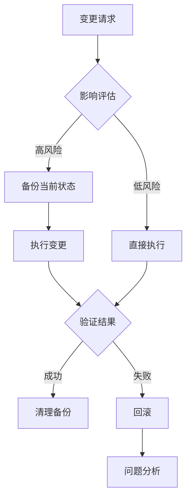

# Execution 控制实现规范

## §1 数据变更控制

### 1.1 流程图



### 1.2 实现示例

```python
def assess_impact(change_type, target):
    """
    评估变更影响范围
    
    Returns:
        {
            "risk_level": "HIGH|MEDIUM|LOW",
            "affected_components": [...],
            "rollback_complexity": "TRIVIAL|MODERATE|HARD",
            "backup_required": bool
        }
    """
    # 实现逻辑
```

### 1.3 备份脚本

```bash
# 数据库备份
mysqldump --single-transaction --routines db_name > backup_$(date +%Y%m%d_%H%M%S).sql

# 文件系统备份
cp -r data/ data.bak.$(date +%Y%m%d_%H%M%S)
```

## §2 文档同步控制

### 2.1 触发条件

- API 文档更新
- README 更新
- 架构文档更新

### 2.2 控制点

| 检查项 | 严重性 | 说明 |
|--------|--------|------|
| 版本号递增 | HIGH | 文档版本必须与代码版本同步 |
| 陈旧度检查 | MEDIUM | 标记超过 N 天未更新的文档 |
| 链接有效性 | LOW | 检查外部链接是否有效 |

## §3 配置同步控制

### 3.1 环境一致性检查

```yaml
environments:
  - name: development
    config: config/dev.yaml
  - name: staging
    config: config/staging.yaml
  - name: production
    config: config/prod.yaml

sync_rules:
  - key: DATABASE_URL
    required_in: [staging, production]
  - key: DEBUG_MODE
    forbidden_in: [production]
```

## §4 资产管理控制

### 4.1 资产生命周期

```
引入 → 使用 → 废弃 → 清理
```

### 4.2 检查项

| 检查项 | 严重性 | 说明 |
|--------|--------|------|
| 重复资产检测 | HIGH | 防止同一资产多份存储 |
| 磁盘空间监控 | MEDIUM | 超过阈值告警 |
| 废弃资产清理 | LOW | 定期清理 N 天未使用的资产 |

### 4.3 哈希计算

```python
import hashlib
from pathlib import Path

def calc_hash(path: Path, algo: str = "sha256", chunk: int = 8 * 1024 * 1024) -> str:
    h = hashlib.new(algo)
    with path.open("rb") as f:
        for blk in iter(lambda: f.read(chunk), b""):
            h.update(blk)
    return f"{algo}:{h.hexdigest()}"
```

### 4.4 去重索引结构

```json
{
  "asset_id": "ast_8f3a2b",
  "hash": "sha256:8f3a2b...",
  "size": 245132,
  "references": ["scenes/01/character.json#image"],
  "uploaded_at": "2026-08-13T10:30:00Z",
  "uploaded_by": "agent:asset-uploader"
}
```

### 4.5 清理流程

```
扫描 → 校验 reference_count == 0 → pending 7 天 → 冷归档 → hard delete
```

## §5 发布流程控制

### 5.1 发布前检查（CP-1）

1. 版本号校验（semver）
2. ChangeLog 完整性（Added/Changed/Fixed/Removed）
3. 依赖版本锁定（lockfile + SBOM）
4. 环境配置一致性（参考 §3）
5. 资产就绪（参考 §4）
6. 冒烟测试通过

### 5.2 灰度策略（CP-3）

| 策略 | 适用场景 | 切换方式 |
|------|---------|---------|
| canary（默认） | 通用业务 | 5% → 25% → 50% → 100% |
| blue-green | 关键/低流量 | 部署 green → 切负载均衡 → 1h 后清理 blue |
| rolling | 无状态服务 | 每批 25% 替换旧实例 |
| feature-flag | 客户端/前端 | 开关粒度控制 |

### 5.3 自动回滚阈值（CP-4）

| 指标 | 阈值 |
|------|------|
| error_rate | > 1% |
| latency_p99 | > baseline × 1.5 |
| success_rate | < 99% |
| qps_drop | > 30% |
| cpu/memory | > 85% |

任一超阈值 → 自动回滚到 `rollback_to` 版本，通知 oncall，写 post-mortem 草稿。

### 5.4 发布后验证

1. 冒烟测试
2. 监控指标正常
3. 回滚预案就绪
4. release 元数据归档 `release/<service>-<version>.json`
5. post-mortem 草稿（如有回滚）