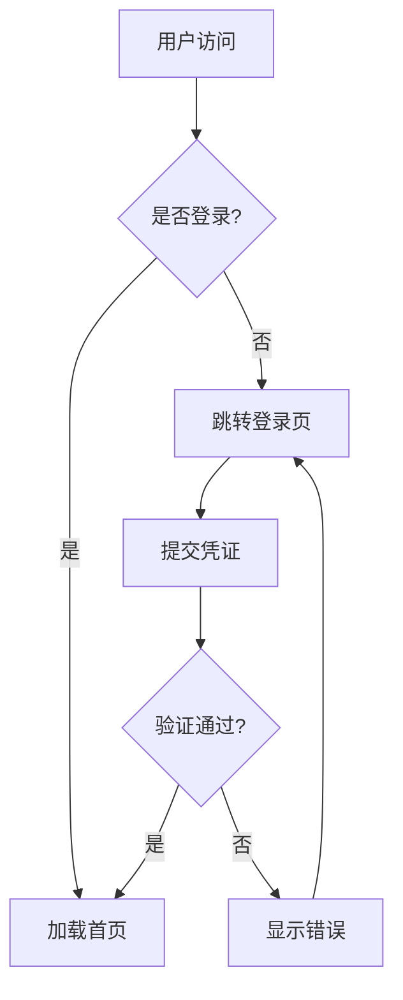

# {{PROJECT_NAME}}

> {{PROJECT_DESCRIPTION}}

---


## 快速导航

- [快速开始](基础篇/快速开始.md) — 5 分钟上手
- [核心概念](基础篇/核心概念.md) — 理解核心设计
- [API 参考](进阶篇/API参考.md) — 完整 API 文档
- [常见问题](附录/常见问题.md) — 遇到问题先查这里

---

## 项目概览

`{{PROJECT_NAME}}` 是一个**功能强大且易于使用**的现代项目，提供完整的文档系统与开箱即用的最佳实践。

<!-- 在这里描述你的项目定位、核心价值、适用场景 -->

### 核心特性

- **简单易用** — 一行命令启动，无需复杂配置
- **功能丰富** — 覆盖 90% 常见场景
- **高性能** — 基准测试领先同类产品
- **可扩展** — 插件机制灵活定制

---

## 系统要求

- Node.js 16+
- 现代浏览器（Chrome / Edge / Firefox / Safari）
- 推荐 4GB+ 内存

---

## 快速开始

```bash
# 安装
npm install {{PROJECT_NAME}}

# 初始化
{{PROJECT_NAME}} init

# 启动
{{PROJECT_NAME}} start
```

打开浏览器访问 `http://localhost:3000` 即可看到效果。

---

## 目录结构

```
├── src/          # 源代码
├── tests/        # 测试
├── docs/         # 文档（当前目录）
│   ├── index.html
│   ├── _sidebar.md
│   ├── custom.css
│   ├── 基础篇/
│   ├── 进阶篇/
│   └── 附录/
└── README.md     # 项目根 README
```

---

## 思维导图（Markmap）

> 💡 点击页面右上角 **导图** 按钮，可将任意页面切换为思维导图模式。
> 思维导图默认**全部展开**，可拖拽平移、滚轮缩放。

## 流程图（Mermaid）



> 💡 点击任意 Mermaid 图表可进入全屏查看 + 导出 SVG/PNG。

---

## 参与贡献

欢迎提交 Issue 和 Pull Request！

- [贡献指南](附录/贡献指南.md)
- [更新日志](附录/更新日志.md)

---

*文档由 [Docsify Doc Builder](https://github.com/) 自动生成*
