# Fullstack4TraeV10

> **全栈文档驱动开发技能包 v10** — 派生自 spec-kit 五阶段文档驱动 (spec/define/plan/contracts/tasks)，聚焦 Agent 行为质量，用 OS 级强制取代 LLM 自律。
>
> 面向人类阅读的展示文档。可视化优先，代码逻辑看 [`SKILL.md`](./SKILL.md)。

---

## 1. 一句话定位

> **把"AI 自律"换成"OS/Hook 级强制"** — 5 阶段流水线 + 4 层铁律 + 四维满分硬门禁 + 机械归档，每一刀砍在"AI 自评 100 分但实际为空"的痛点上。

---

## 2. 设计哲学（Mermaid mindmap）

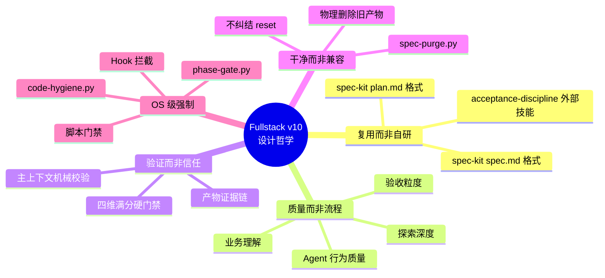

---

## 3. 五阶段流水线（Mermaid flowchart）

```mermaid
flowchart LR
    subgraph Plan[Phase 0: Plan · 用户确认: 必]
        P0[Planner 前置探索] --> P1[3 个子代理并行]
        P1 --> P2[文档探索<br/>代码探索<br/>依赖探索]
        P2 --> P3[产出 plan.md]
    end

    subgraph Spec[Phase 1: Spec · 用户确认: 必]
        S0[Spec-Enhancer<br/>代写 spec.md<br/>(spec-kit 格式)] --> S1[质量增强段<br/>E2E + Invariants + 原型触发]
        S1 --> S2[E2E + Invariants<br/>+ 原型触发]
    end

    subgraph Contract[Phase 2: Contract · 用户确认: 自动]
        C0[Contract-Writer] --> C1[契约四件套<br/>+ 测试骨架]
    end

    subgraph Implement[Phase 3: Implement · 用户确认: 必]
        I0[业务深度理解<br/>+ 模块接入文档] --> I1[TDD 红绿循环]
        I1 --> I2[code-hygiene.py<br/>实时拦截]
        I2 --> I3[tasks.md 驱动]
    end

    subgraph Review[Phase 4: Review · 用户确认: 自动]
        R0[四维满分验收] --> R1{全部满分?}
        R1 -->|是 ✅| R2[完成 + DOC SYNC]
        R1 -->|否 🛑| R3[REJECT 退回]
    end

    Plan --> Spec
    Spec --> Contract
    Contract --> Implement
    Implement --> Review

    style Plan fill:#e1f5ff
    style Spec fill:#fff4e1
    style Contract fill:#e8f5e9
    style Implement fill:#fce4ec
    style Review fill:#f3e5f5
```

**用户确认分级**（V10 新增）：3 次必确认（Plan/Spec/Implement）+ 2 次自动（Contract/Review）

---

## 4. 五个 Agent 角色全景（Mermaid graph）

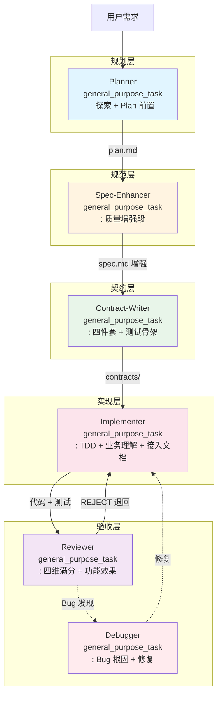

---

## 5. 四维满分硬门禁（Mermaid mindmap）

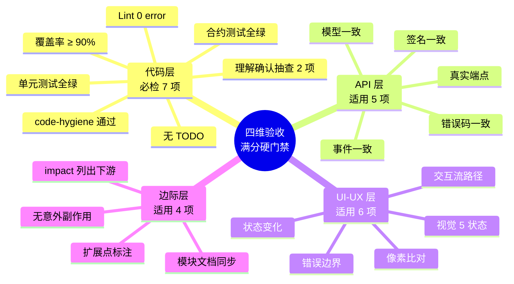

**核心规则**：

```text
✅ 4 维全部满分 = PASS
🛑 任一非满分 = REJECT 整个 change
🚫 禁 N/A 计入分母（须 Plan 阶段锁定）
🚫 禁"非阻塞 P1 / 降级验收 / 部分扣分"
```

---

## 6. 机械验证 6 步硬门禁（Mermaid sequence）

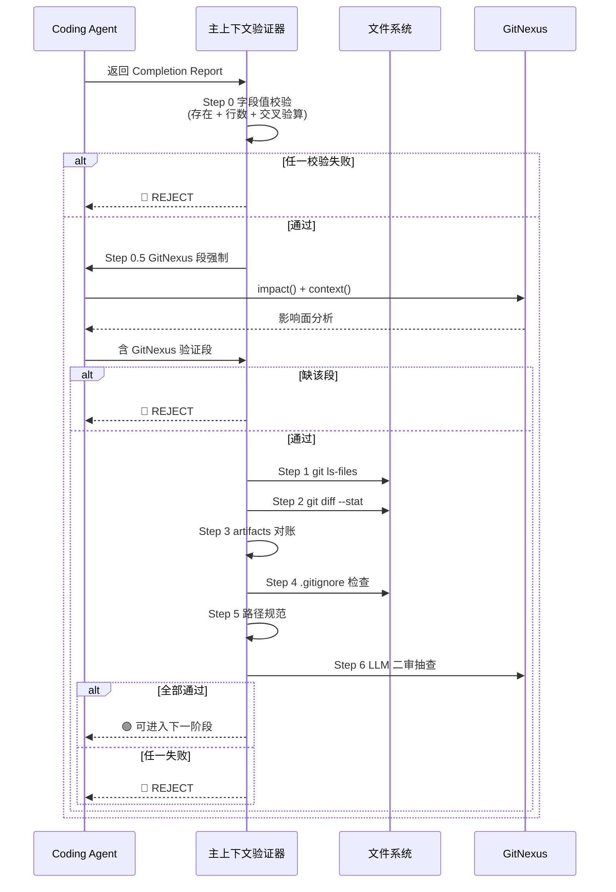

详见 [`/trae/rules/agent-机械验证.md`](../../trae/rules/agent-机械验证.md)。

---

## 7. 三个硬门禁脚本（Mermaid graph）

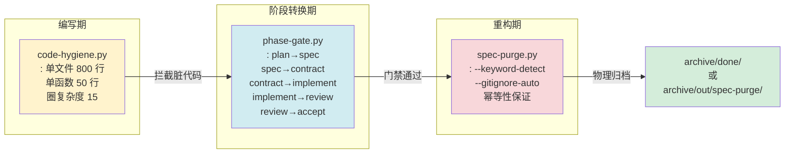

**使用示例**：

```powershell
# 编写后立即检查
python scripts\code-hygiene.py --changed-files

# 阶段转换硬门禁
python scripts\phase-gate.py implement-to-review

# 重构时机械归档
python scripts\spec-purge.py --feature 00-05 --keyword-detect --gitignore-auto
```

---

## 8. 铁律 4 层分类（Mermaid mindmap）

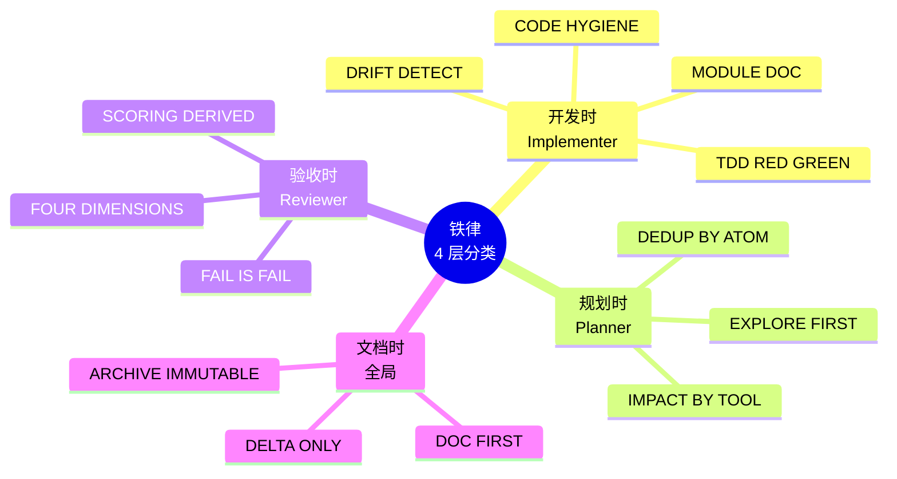

**冲突消解表**：

| 潜在冲突 | 优先级 | 判定 |
|---------|-------|------|
| TDD vs DRIFT | DRIFT > TDD | 实现中途发现契约错 → 立即停止 TDD，回流 spec |
| MODULE DOC vs CODE HYGIENE | MODULE DOC | 接入文档可放 references/ 子目录 |
| FAIL IS FAIL vs N/A | N/A > FAIL | 不适用维度不假装通过，也不算 FAIL |
| ARCHIVE IMMUTABLE vs 重构 | 重构 > ARCHIVE | 重构时 archive/out/ 目录可清理 |

---

## 9. 评分制度 V10 vs V9.2（Mermaid flowchart 对比）

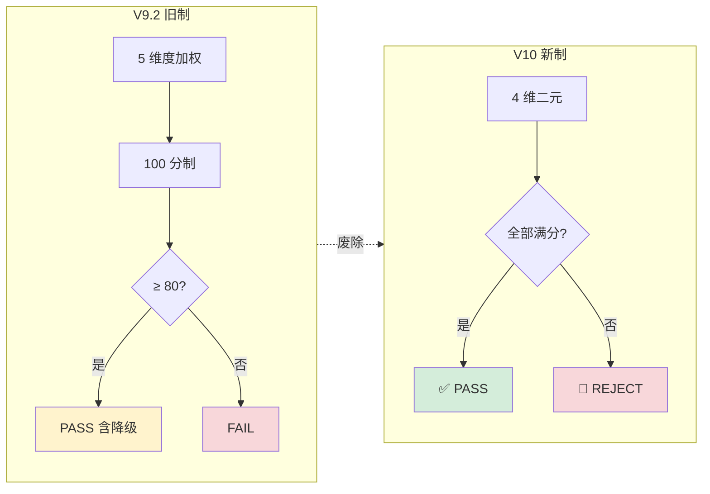

**核心差异**：

| 维度 | V9.2（旧） | V10（新） |
|------|----------|----------|
| 评分 | 5 维度加权 100 分制 | 4 维二元（PASS/REJECT） |
| 通过线 | ≥ 80 分通过 | 任何非满分 = REJECT |
| N/A 维度 | 不计入分母 | 必须 Plan 阶段锁定 |
| 降级验收 | "非阻塞 P1"允许 | 禁止 |
| 产物证据链 | agent 自报 | 必须附真实命令输出 |

---

## 10. AIGCMediaDesktop 实战状态（Mermaid pie + 仪表盘）

**当前 13 个 change 满分状态分布**：

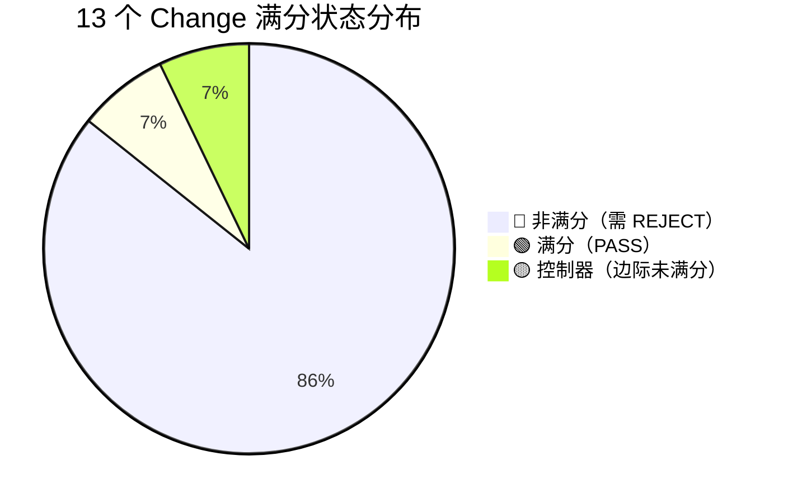

| 状态 | 数量 | 说明 |
|------|:---:|------|
| 🟢 满分 | 1 | 00-02 app-shell（纯前端，API/UI-UX/边际都达标） |
| 🔴 非满分 | 12 | 92/100 等旧评分，V10 下全部 REJECT |
| 🟡 控制器 | 1 | ui-ux-refactor（边际待补） |

**下一步（V10 路线）**：

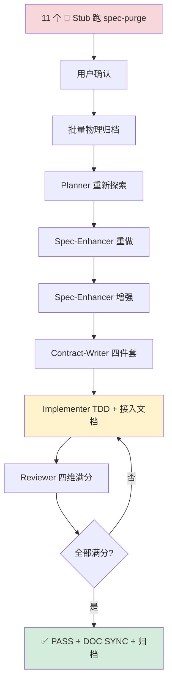

---

## 11. 仓库结构（Mermaid graph）

```mermaid
graph TD
    Root[fullstack4TraeV10/]

    Root --> Agents[agents/<br/>6 个 agent 文件]
    Root --> Refs[references/<br/>17 个细化文档]
    Root --> Scripts[scripts/<br/>7 个 Python 脚本]
    Root --> Templates[templates/<br/>契约 + Hooks + 模板]

    Agents --> A1[planner.md]
    Agents --> A2[spec-enhancer.md]
    Agents --> A3[contract-writer.md]
    Agents --> A4[implementer.md]
    Agents --> A5[reviewer.md]
    Agents --> A6[debugger.md]

    Scripts --> S1[code-hygiene.py 🆕]
    Scripts --> S2[phase-gate.py 🆕]
    Scripts --> S3[spec-purge.py 🆕 keyword-detect + gitignore-auto]
    Scripts --> S4[migrate-v9-to-v10.py]
    Scripts --> S5[change-status.py]
    Scripts --> S6[spec-knowledge-extract.py]
    Scripts --> S7[install-hooks.py]

    Refs --> R1[acceptance-gates-v10.md 🆕]
    Refs --> R2[acceptance-gates.md 旧版标记废止]

    Templates --> T1[contracts/<br/>api/domain/event/validation 4 件套]
    Templates --> T2[hooks/<br/>8 个 .py + hooks.json]
    Templates --> T3[spec-template.md]
    Templates --> T4[state-card.md]

    style S1 fill:#d4edda
    style S2 fill:#d4edda
    style S3 fill:#d4edda
    style R1 fill:#d4edda
```

---

## 12. 版本演进（时间线）

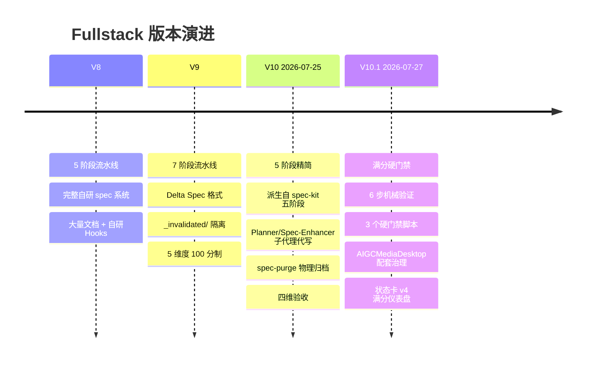

---

## 13. 核心成果数字

| 指标 | V9.2 | V10.1 | 改进 |
|------|:---:|:---:|:---:|
| 阶段数 | 7 | 5 | -29% |
| 用户确认次数 | 7 | 3 | -57% |
| 总文件数 | ~40+ | ~25 | -37% |
| 评分公式 | 100 分制 | 二元满分 | 杜绝灰色 |
| 验收降级 | 允许 | 禁止 | 100% 严化 |
| 跨项目治理 | 双仓副本 | 软链单一源 | 杜绝漂移 |
| 强制机制 | 0 | 6 步 + 3 脚本 | +∞ |

---

## 14. 常见问题（FAQ）

**Q: 满分硬门禁是不是太严？**
A: 是的。这是为了根治"AI 自评 100 分但实际为空"。不适用维度必须 Plan 阶段显式锁定。

**Q: V9.2 项目怎么升级？**
A: 跑 `python scripts/migrate-v9-to-v10.py` 一键迁移（含 dry-run）。

**Q: AIGCMediaDesktop 的 .trae/rules 副本怎么办？**
A: 已在 AIGCMediaDesktop 侧执行 `pwsh .trae/rules-link.ps1` 建立软链到 my-trae-helper 权威源。

**Q: 怎么强制 code-hygiene？**
A: 在 Implementer 完成任何 task 后立即跑 `python scripts/code-hygiene.py --changed-files`，exit 非 0 即 REJECT。

**Q: spec-purge 怎么用？**
A: `python scripts/spec-purge.py --feature XX --keyword-detect --gitignore-auto`，命中关键词白名单（重构/重写/推翻/从头来/重新设计）自动触发物理归档。

---

## 15. 相关链接

- 主 SKILL.md：[`./SKILL.md`](./SKILL.md)
- 验收清单 v10：[`./references/acceptance-gates-v10.md`](./references/acceptance-gates-v10.md)
- 阶段切换机械验证：[`/trae/rules/agent-机械验证.md`](../../trae/rules/agent-机械验证.md)
- AIGCMediaDesktop 状态卡 v4：[`/trae/specs/upgrade-fullstack-v10-harden/state-card-mirror-v4.md`](../../trae/specs/upgrade-fullstack-v10-harden/state-card-mirror-v4.md)
- 升级总策略：[`/trae/documents/fullstack-v10-升级总策略.md`](../../trae/documents/fullstack-v10-升级总策略.md)

---

**最后更新**：2026-07-27 · V10.1.0
**作者**：my-trae-helper 项目组