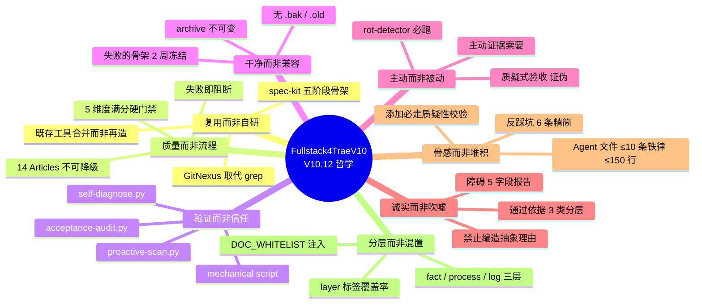
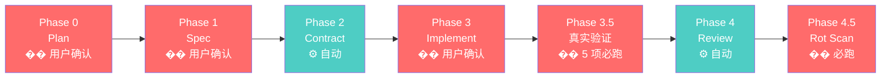
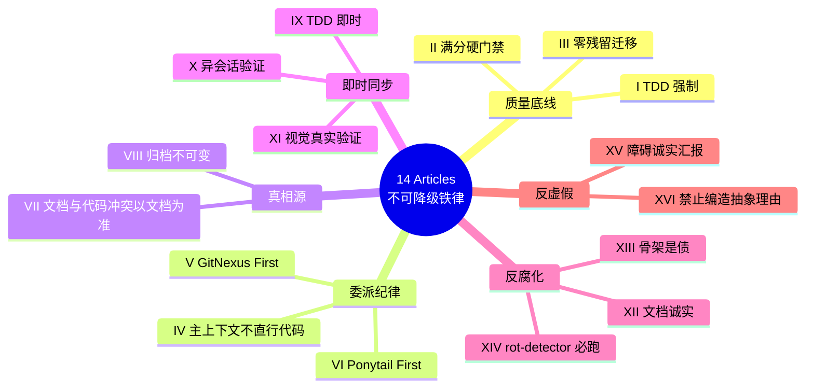
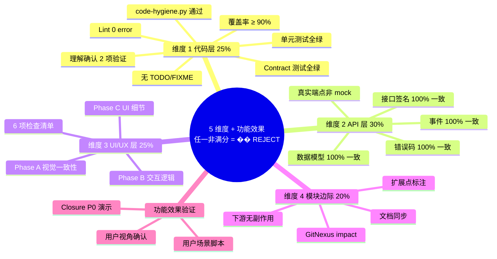
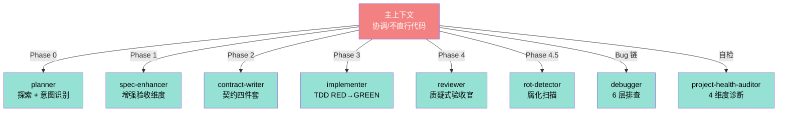

# Fullstack4TraeV10 思想总览

> V10.12 = "Spec 真相源 + 5 阶段流水线 + 14 Articles 不可降级 + 5 维度硬门禁 + 腐化可检测 + 启证可见产物"。
> 设计哲学: **复用而非自研 / 质量而非流程 / 验证而非信任 / 干净而非兼容 / 主动而非被动 / 诚实而非吹嘘 / 骨感而非堆积 / 分层而非混置**。

## 一、核心哲学 Mindmap

## 二、骨架流程（5 阶段 + Phase 3.5/4.5）

## 三、14 Articles 全景 Mindmap

## 四、5 维度硬门禁

## 五、6 大 Agent 角色

## 六、关键引用入口

| 主题 | 核心文件 |
|------|---------|
| 哲学骨架 | [SKILL.md](../SKILL.md) |
| 14 Articles 详情 | [constitution-detail.md](../references/constitution-detail.md) |
| 验收门禁 | [acceptance-gates-v10.md](../references/acceptance-gates-v10.md) |
| 委派铁律 | [sub-agent-rules.md](../references/sub-agent-rules.md) |
| 文档分层 | [artifact-lifecycle.md](../references/artifact-lifecycle.md) |
| 流程腐化 | [process-rot-analysis.md](../references/process-rot-analysis.md) |
| 质疑性校验 | [skeptical-validation-protocol.md](../references/skeptical-validation-protocol.md) |
| 极致优化方法论 | [skill