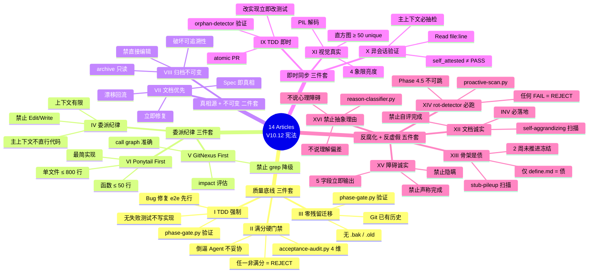
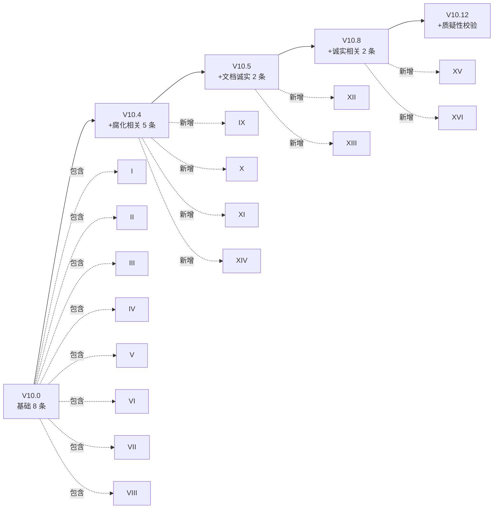

# 14 Articles 宪法 Mindmap

> 冲突判定顺序: **Constitution > Spec > Contract > Code > 个人判断**。
> 永不可降级: **Articles I、II、IV、V、VIII、IX、XIV、XV、XVI**（即使修改流程也维持底线）。

## 一、Articles 主题地图

## 二、Articles 演进时间轴

## 三、Article 强制执行点矩阵

```mermaid
graph TB
    subgraph 阶段门禁
        P0[Phase 0 Plan]
        P1[Phase 1 Spec]
        P2[Phase 2 Contract]
        P3[Phase 3 Implement]
        P35[Phase 3.5 真实验证]
        P4[Phase 4 Review]
        P45[Phase 4.5 Rot Scan]
    end

    subgraph Articles 作用点
        I2[Article I<br/>TDD 强制]
        II2[Article II<br/>满分硬门禁]
        III2[Article III<br/>零残留]
        IV2[Article IV<br/>委派纪律]
        V2[Article V<br/>GitNexus First]
        VII2[Article VII<br/>文档优先]
        VIII2[Article VIII<br/>归档不可变]
        IX2[Article IX<br/>TDD 即时]
        X2[Article X<br/>异会话验证]
        XI2[Article XI<br/>视觉真实]
        XII2[Article XII<br/>文档诚实]
        XIII2[Article XIII<br/>骨架是债]
        XIV2[Article XIV<br/>rot-detector]
        XV2[Article XV<br/>障碍诚实]
        XVI2[Article XVI<br/>禁抽象理由]
    end

    P3 --> I2
    P4 --> II2
    P4 --> III2
    P0 --> IV2
    P0 --> V2
    P1 --> VII2
    P0 --> VIII2
    P3 --> IX2
    P4 --> X2
    P4 --> XI2
    P45 --> XII2
    P45 --> XIII2
    P45 --> XIV2
    P35 --> XV2
    P0 --> XVI2

    classDef article fill:#ffd93d,color:#000
    classDef phase fill:#6bcf7f,color:#000
    class P0,P1,P2,P3,P35,P4,P45 phase
    class I2,II2,III2,IV2,V2,VII2,VIII2,IX2,X2,XI2,XII2,XIII2,XIV2,XV2,XVI2 article
```

## 四、关键引用

- 主宪法: [SKILL.md §-1](../SKILL.md)
- 详细解释: [constitution-detail.md](../references/constitution-detail.md)
- 验证脚本: [phase-gate.py](../scripts/phase-gate.py) / [acceptance-audit.py](../scripts/acceptance-audit.py) / [proactive-scan.py](../scripts/proactive-scan.py)
