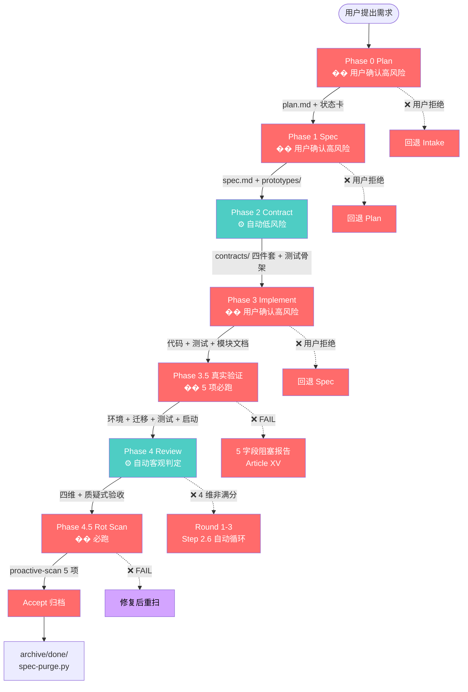
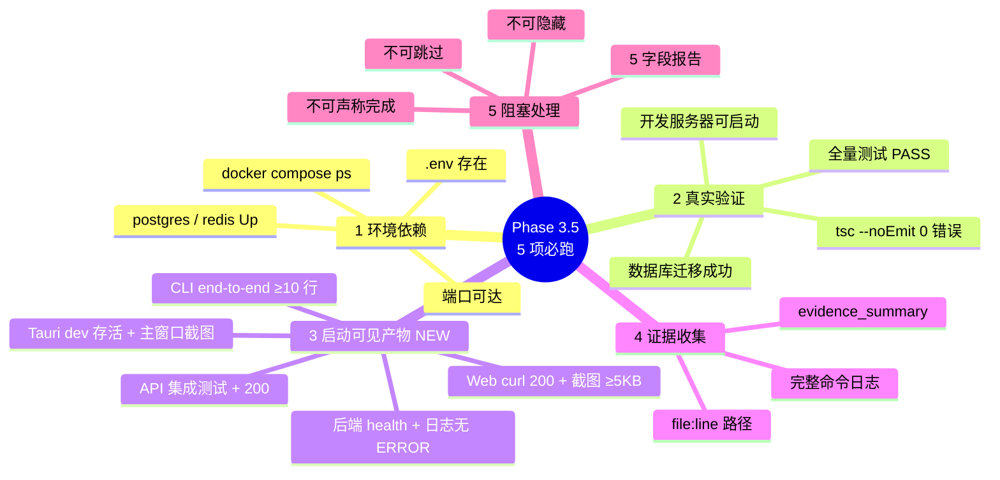
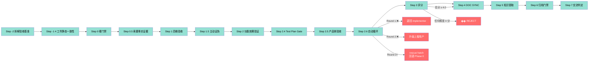
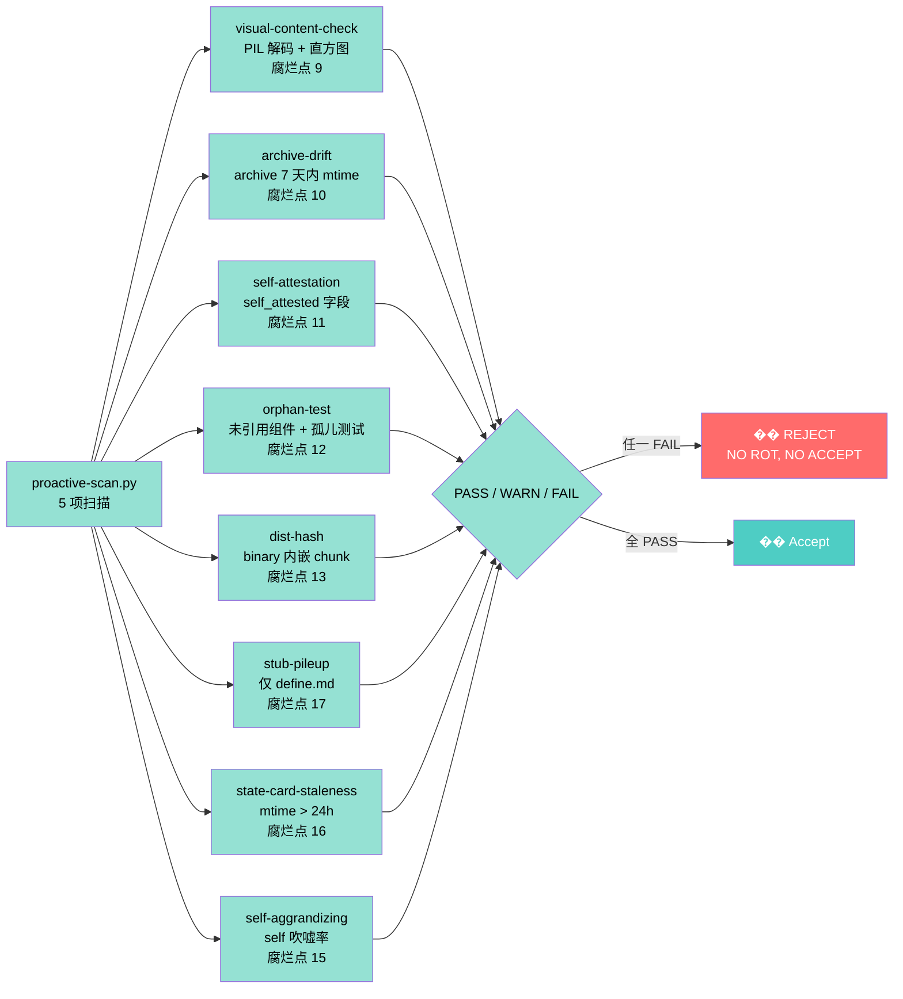

# 5 阶段流水线 + Phase 3.5/4.5 全流程图

> V10.12 引入 **Phase 3.5 真实验证**（V10.10 NEW）和 **Phase 4.5 腐化扫描**（V10.4 NEW）。
> 铁律: **任一阶段失败 = �� REJECT，必须回退**。

## 一、完整流水线流程图

## 二、Phase 3.5 真实验证 5 项硬门禁

## 三、Phase 4 Review 评分流程

## 四、四维验收详细评分

## 五、Phase 4.5 腐化扫描 5 项

## 六、关键引用

- 流程定义: [SKILL.md §0](../SKILL.md)
- 真实验证清单: [SKILL.md §0.10](../SKILL.md) + [reset-and-verify-protocol.md](../references/reset-and-verify-protocol.md)
- 验收门禁: [acceptance-gates-v10.md](../references/acceptance-gates-v10.md)
- Reviewer 模板: [reviewer-templates.md](../references/reviewer-templates.md)
- 阶段门禁脚本: [phase-gate.py](../scripts/phase-g