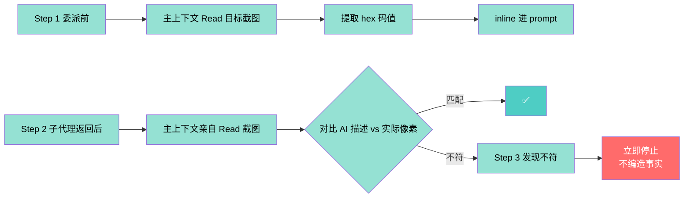
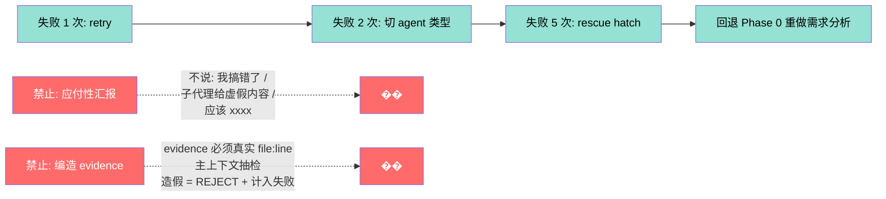
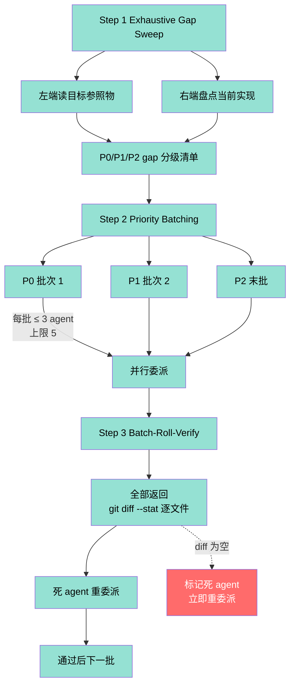
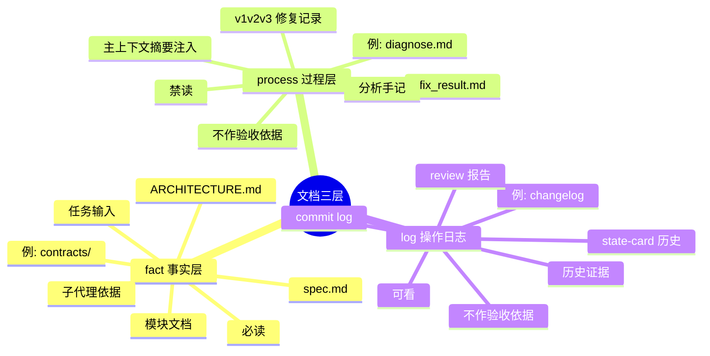

# 委派纪律 + 子代理铁律 Mindmap

> V10.8 核心: **防止主上下文直行代码、子代理返回虚假 evidence、应付性汇报、破坏性操作**。
> 原则: **主上下文只协调，子代理做执行，主上下文必独立验证三层**。

## 一、委派场景化决策

```mermaid
mindmap
  root((委派类型<br/>决策树))
    exploration-task
      search 子代理
      无 Completion Report
      仅结构化摘要
      例: 代码探索 / 文档勘察
    coding-task
      general_purpose_task
      必有 Completion Report
      4 字段 status / evidence / pass_count / next_hook
      强制头部注入
        MUST-READ
          AGENTS.md
          .trae/rules/
        PIPELINE
          phase: {N}
        DOC_WHITELIST
          白名单路径
        GITNEXUS
          impact 调用
        TASK
          ≤200 字符
        OUTPUT
          4 字段
```

## 二、子代理返回后三层独立验证

```mermaid
flowchart TD
    Return[子代理返回<br/>Completion Report]
    Layer1[Layer 1 evidence 存在性]
    Layer2[Layer 2 pass_count 准确性]
    Layer3[Layer 3 产物存在性]

    Return --> Layer1
    Return --> Layer2
    Return --> Layer3

    Layer1 ->|抽 1 个 evidence| Read[主上下文亲自 Read]
    Layer1 -.->|不匹配| Reject1[�� REJECT<br/>计入失败 1 次]

    Layer2 ->|跑测试命令| Run[主上下文亲自 Run]
    Layer2 -.->|不一致| Reject2[�� REJECT]

    Layer3 ->|Glob / LS 检查| Glob[主上下文亲自 Glob]
    Layer3 -.->|文件不存在| Reject3[�� REJECT]

    Read --> Match{证据匹配?}
    Run --> TestNum{测试数一致?}
    Glob --> Exists{文件存在?}

    Match -->|是| Pass1[✅]
    Match -->|否| Reject1

    TestNum -->|是| Pass2[✅]
    TestNum -->|否| Reject2

    Exists -->|是| Pass3[✅]
    Exists -->|否| Reject3

    Pass1 --> Pass[三层全过<br/>通过]
    Pass2 --> Pass
    Pass3 --> Pass

    Reject1 --> Total[记录失败计数]
    Reject2 --> Total
    Reject3 --> Total

    classDef pass fill:#4ecdc4,color:#fff
    classDef reject fill:#ff6b6b,color:#fff
    classDef layer fill:#95e1d3,color:#000
    class Layer1,Layer2,Layer3,Read,Run,Glob layer
    class Pass1,Pass2,Pass3,Pass pass
    class Reject1,Reject2,Reject3,Total reject
```

## 三、视觉验证增强协议



## 四、破坏性操作 4 步强制流程

```mermaid
flowchart TD
    Trigger[触发: rmtree / rm -rf /<br/>大文件 Delete / 跨盘 mv]
    Step1[Step 1 列清单]
    Step2[Step 2 用户确认]
    Step3[Step 3 Trash 兜底]
    Step4[Step 4 跨盘额外校验]

    Trigger --> Step1
    Step1 -->|find / ls / Get-ChildItem | measure| List[清单: 路径 + 字节数]
    List --> Step2
    Step2 -->|客服确认前禁止执行| User[用户确认]
    User --> Step3
    Step3 -->|mv 到 _trash_<ts>/<br/>保留 7 天可恢复| Trash[Mv to Trash]
    Trash --> Step4
    Step4 -->|implementer 报告空目录<br/>主上下文也自己 ls 一次| Cross[跨盘验证]

    classDef forbid fill:#ff6b6b,color:#fff
    classDef step fill:#95e1d3,color:#000
    class Trigger,List,User,Trash,Cross forbid
    class Step1,Step2,Step3,Step4 step
```

## 五、失败处理 5 步升级



## 六、批量并行推进三步流水线



## 七、文档分层判定



## 八、关键引用

- 主上下文委派铁律: [sub-agent-rules.md §1-§15](../references/sub-agent-rules.md)
- Agent 完成报告模板: [reviewer-templates.md](../references/reviewer-templates.md)
- 视觉验证协议: [reset-and-verify-protocol.md](../references/reset-and-verify-protocol.md)
- 文档分层: [artifact-lifecycle.md](../references/artifact-lifecycle.md)
