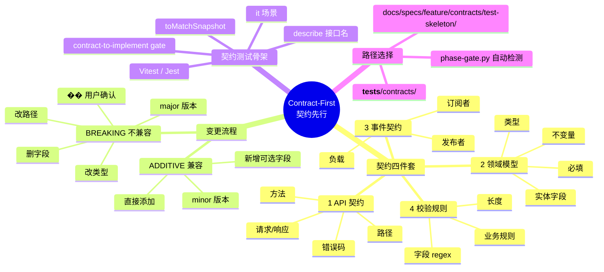
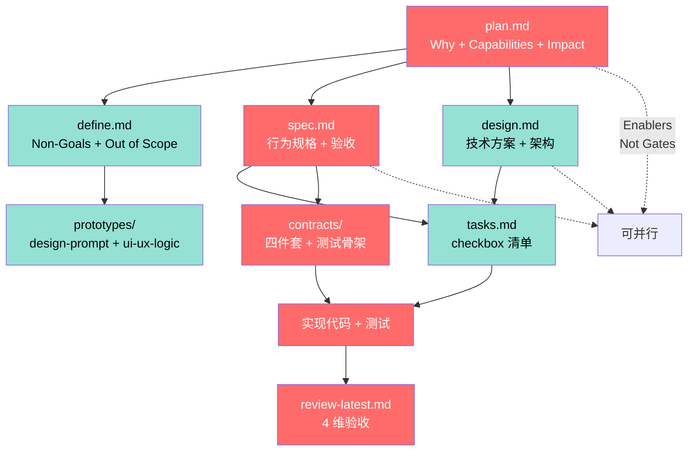
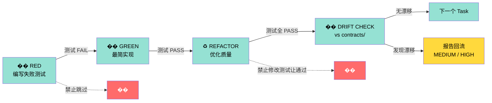
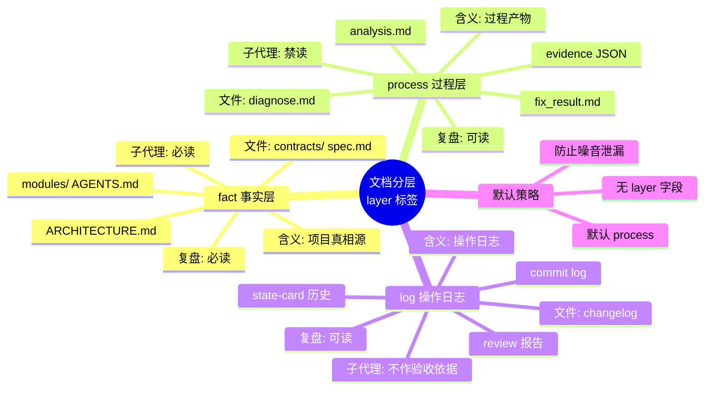
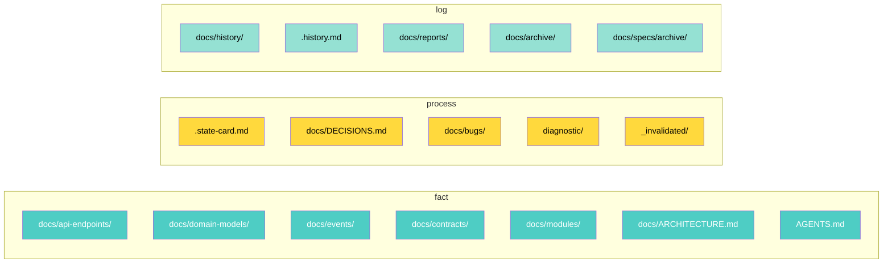
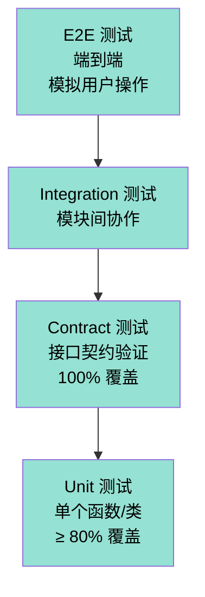
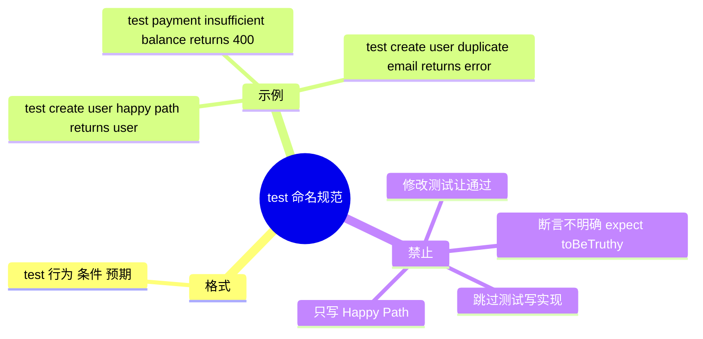

# 契约先行 + Spec 真相源 + TDD + 文档分层 Mindmap

> V10 核心立场: **Spec 是真相源，代码为规格服务。变更冲突顺序: Constitution > Spec > Contract > Code > 个人判断**。

## 一、契约先行 (Contract-First) 全景

## 二、Spec 驱动工件依赖图

## 三、TDD 工作流三步循环

## 四、文档三层标注 (layer:)

## 五、目录 layer 映射表

## 六、测试层级金字塔

## 七、测试命名规范

## 八、关键引用

- 契约四件套: [contract-first.md](../references/contract-first.md)
- TDD 工作流: [tdd-workflow.md](../references/tdd-workflow.md)
- 文档分层: [artifact-lifecycle.md](../references/artifact-lifecycle.md)
- 工件依赖图: [artifact-schema.md](../references/artifact-schema.md)
- DOC SYNC: [doc-sync.md](../references/doc-sync.md)
- 模板:
  - [api-contracts.md