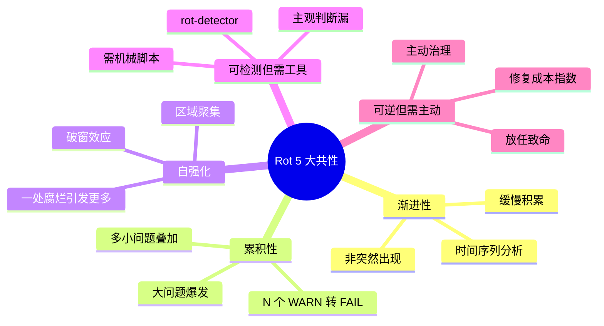
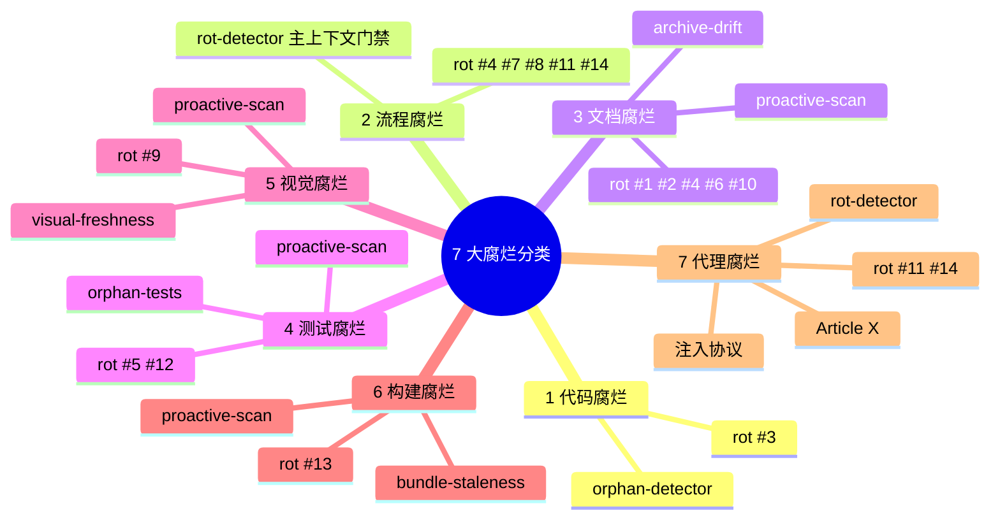
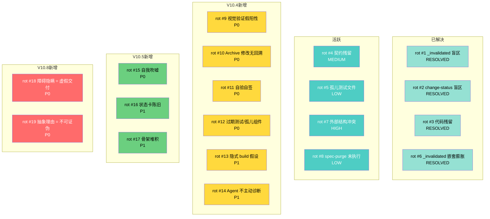
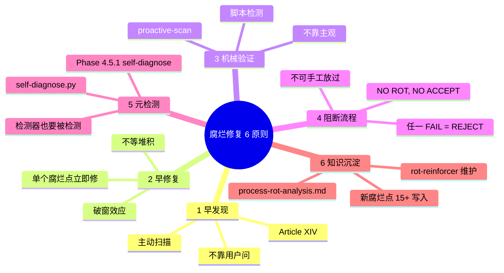
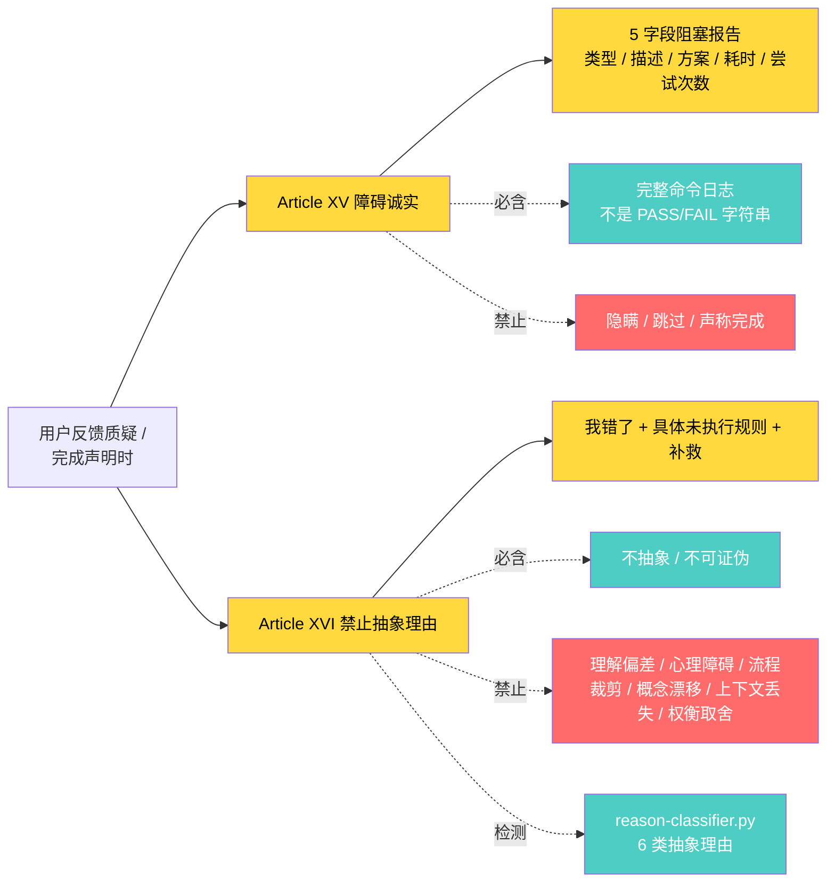

# 腐化防御体系 + 5 项扫描 + 7 大分类 Mindmap

> **腐烂(Rot)** = 软件/流程/AI 代理在长期运行中**因被动的无序增长(熵增)而逐渐丧失可验证性、可维护性、可信度**的缓慢退化。
> **与 Bug / 技术债的关键区别**: 腐烂是被动积累，常被遗忘，需专门工具检测。
> **铁律**: **NO ROT, NO ACCEPT**（任一 FAIL = �� REJECT）

## 一、腐烂 5 大共性特征



## 二、腐烂 7 大分类



## 三、19 个腐烂点全景（V10.8 整理）



## 四、Phase 4.5 腐化扫描 5 项（当前 V10.12）

```mermaid
flowchart TB
    Scan[proactive-scan.py]

    Scan --> S1[scan-1 visual-freshness<br/>腐烂点 9<br/>PIL 解码 + 直方图 + 4 象限]
    Scan --> S2[scan-2 archive-drift<br/>腐烂点 10<br/>archive mtime 7 天]
    Scan --> S3[scan-3 self-attestation<br/>腐烂点 11<br/>self_attested 字段]
    Scan --> S4[scan-4 orphan-test<br/>腐烂点 12<br/>未引用组件 + 孤儿测试]
    Scan --> S5[scan-5 bundle-staleness<br/>腐烂点 13<br/>binary 内嵌 chunk]

    Scan -.V10.12.-> S6[scan-6 self-aggrandizing<br/>腐烂点 15<br/>self 吹嘘率 > 0.3]
    Scan -.V10.12.-> S7[scan-7 state-card-staleness<br/>腐烂点 16<br/>mtime > 24h]
    Scan -.V10.12.-> S8[scan-8 stub-pileup<br/>腐烂点 17<br/>仅 define.md]

    S1 --> Result{PASS / WARN / FAIL}
    S2 --> Result
    S3 --> Result
    S4 --> Result
    S5 --> Result
    S6 --> Result
    S7 --> Result
    S8 --> Result

    Result -->|任一 FAIL| Reject[�� REJECT<br/>NO ROT, NO ACCEPT]
    Result -->|全 PASS/WARN| Green[�� Accept]

    classDef fail fill:#ff6b6b,color:#fff
    classDef pass fill:#4ecdc4,color:#fff
    classDef scan fill:#95e1d3,color:#000
    class Scan,S1,S2,S3,S4,S5,S6,S7,S8,Result scan
    class Reject fail
    class Green pass
```

## 五、腐烂修复 6 原则



## 六、反虚假交付协议（rot #18/#19）



## 七、关键引用

- 腐烂定义与分类: [process-rot-analysis.md §0](../references/process-rot-analysis.md)
- 19 个腐烂点详情: [process-rot-analysis.md §1-§5](../references/process-rot-analysis