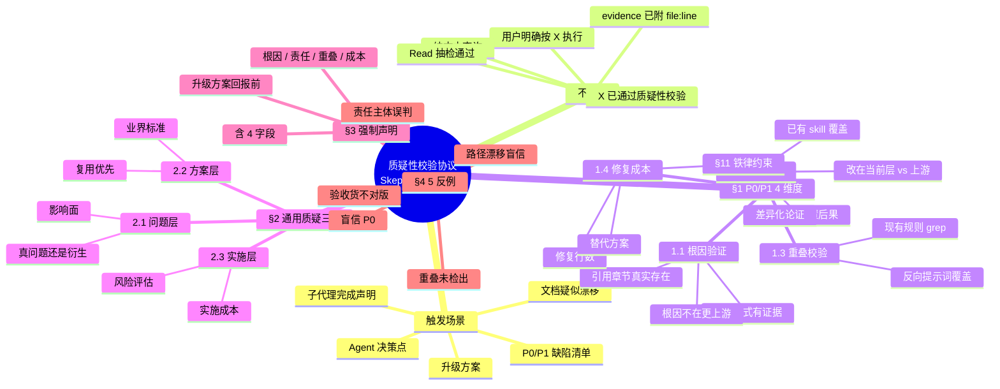
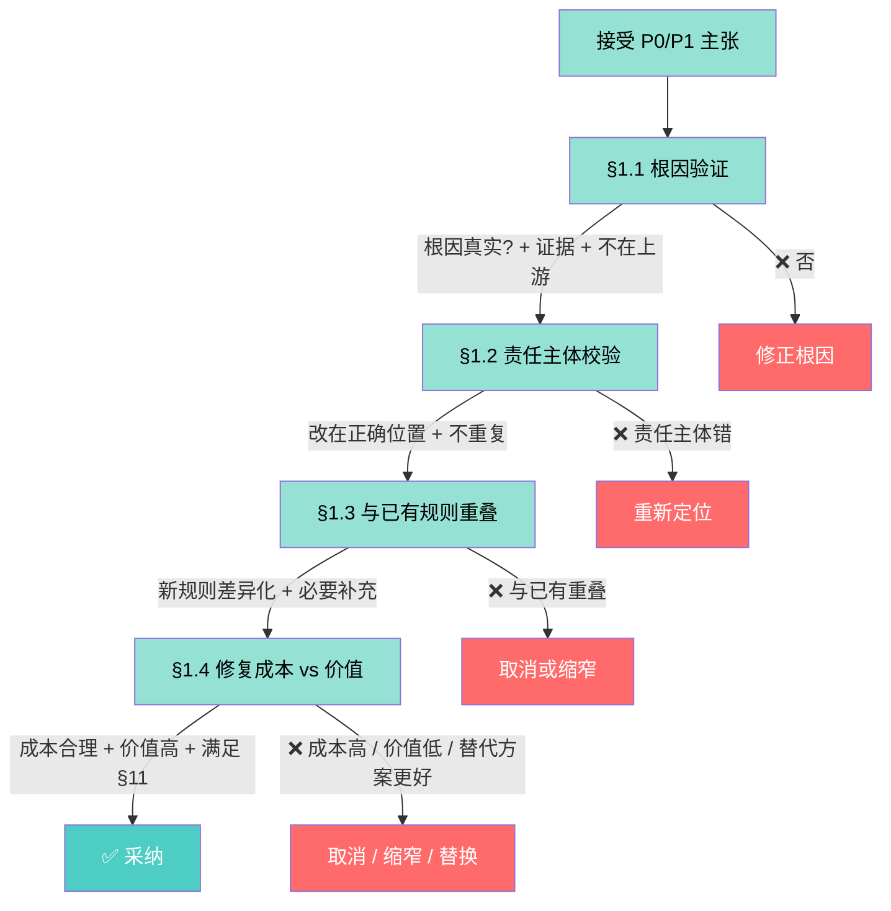
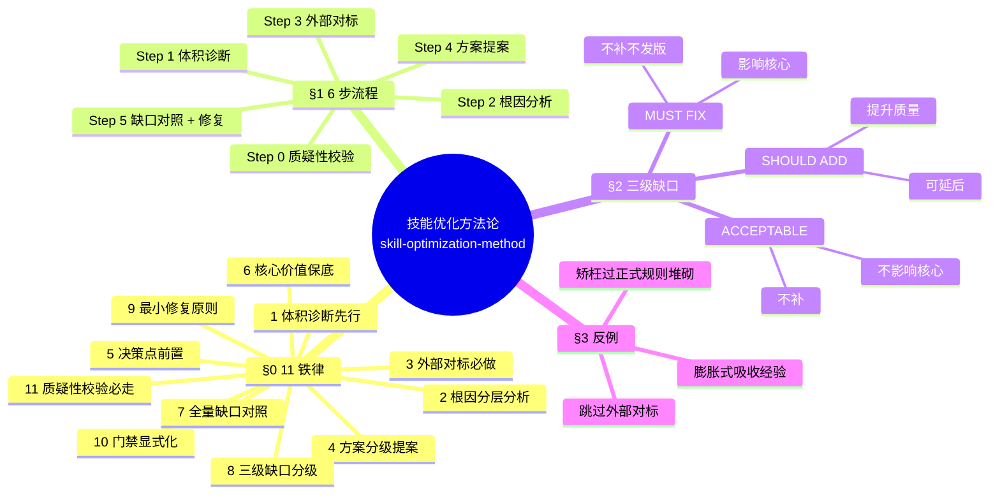
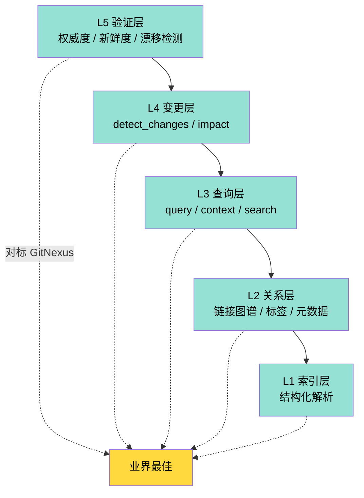
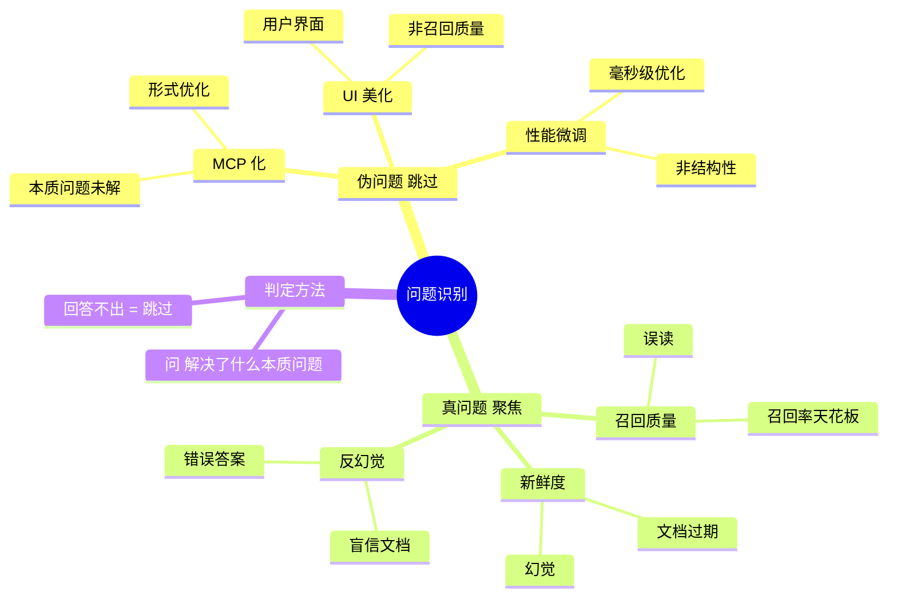
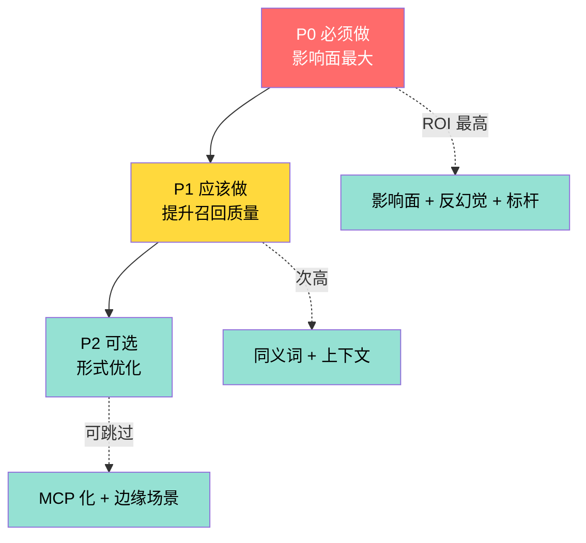

# 质疑性校验协议 + 技能优化方法论 + 知识库升级 Mindmap

> V10.12 NEW: **升级前必走质疑性校验** — 防止"看似合理的修复"实际是"矫枉过正"或"重复造轮子"。
> 核心立场: **接受用户/子代理输入前，必须独立校验，不盲信**。

## 一、质疑性校验协议 Mindmap

## 二、4 维度校验流程图

## 三、技能优化方法论 11 铁律 + 6 步流程

## 四、外部对标方法论

## 五、知识库升级 5 层能力架构

## 六、舍本逐末识别（伪问题 vs 真问题）

## 七、优先级铁律 P0 > P1 > P2

## 八、关键引用

- 质疑性校验协议: [skeptical-validation-protocol.md](../references/skeptical-validation-protocol.md)
- 技能优化方法论: [skill-optimization-method.md](../references/skill-optimization-method.md)
- 知识库升级: [knowledge-system-upgrade.md](../references/knowledge-system-upgrade.md)
- AGENTS.md 引用: [AGENTS.md §项目专属技能](../../../../../AGENTS.md)
- 9