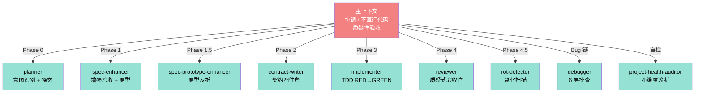
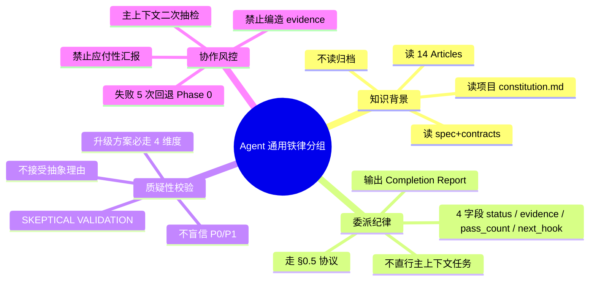
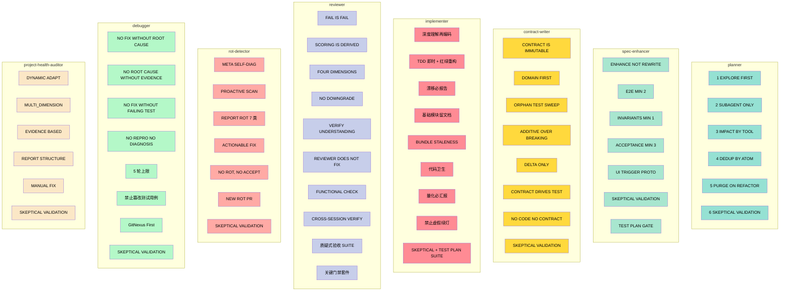
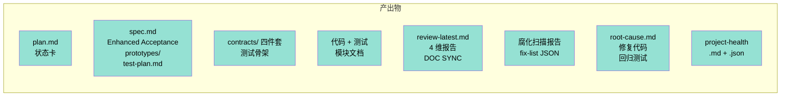
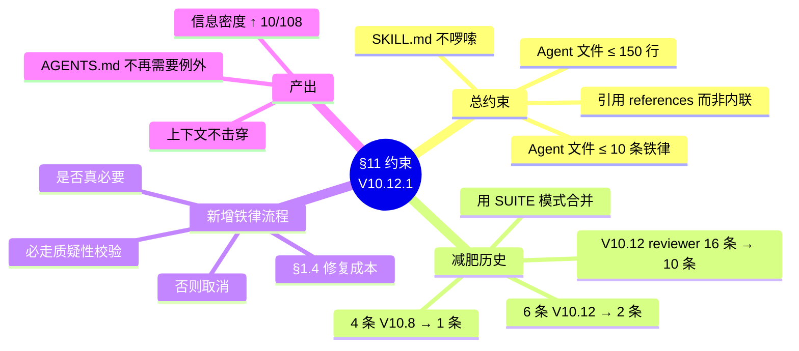

# 全栈 6 大 Agent 角色 Mindmap

> V10.12 共 9 个 Agent（agents/ 目录），每个 Agent 4-10 条铁律，文件 ≤150 行。
> 核心原则: **主上下文不直行代码，只做协调；Agent 报告需主上下文质疑性验收**。

## 一、Agent 全景图

## 二、Agent 通用铁律分组

## 三、Agent 详细铁律矩阵

## 四、Agent 产出对比

## 五、§11 约束 — Agent 文件 ≤ 10 条铁律 ≤ 150 行

## 六、关键引用

- Agent 文件:
  - [planner.md](../agents/planner.md)
  - [spec-enhancer.md](../agents/spec-enhancer.md)
  - [spec-prototype-enhancer.md](../agents/spec-prototype-enhancer.md)
  - [contract-writer.md](../agents/contract-writer.md)
  - [implementer.md](../agents/implementer.md)
  - [reviewer.md](../agents/reviewer.md)
  - [rot-detector.md](../agents/rot-detector.md)
  - [debugger.md](../agents/debugger.md)
  - [project-health-auditor.md](../agents/project-health-auditor.md)
- 委派速查表: [SKILL.md §1](../SKILL.md)
- §11 约束: [AGENTS.md §11](../../../../../AGENTS.md)
