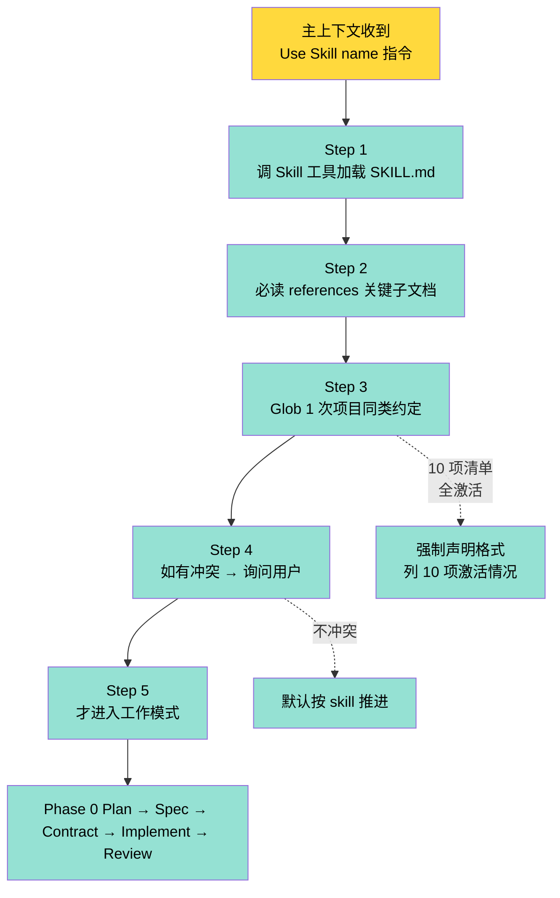
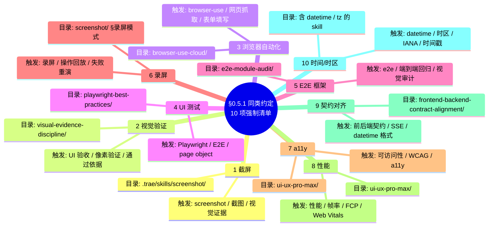
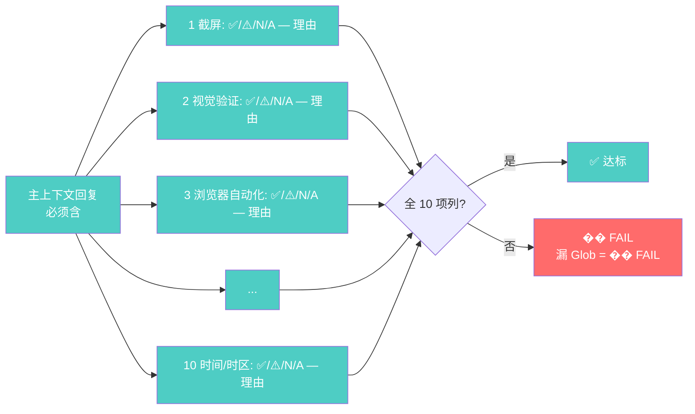
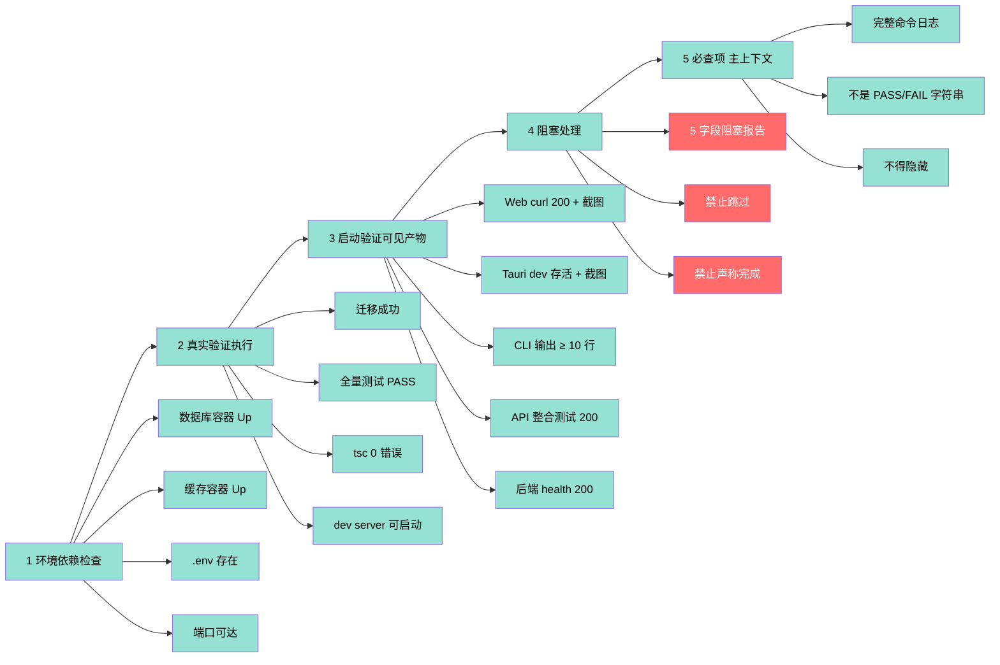

# §0.5 Skill 加载协议 + §0.10 启动验证可见产物 Mindmap

> V10.9 NEW — 防首次产物偏离项目惯例（4 轮返工蒸馏）。
> V10.10 NEW — 防虚假交付（[1] 后端类 vs [2] UI 渲染类边界）。
> V10.12 NEW — 同类约定 10 项强制清单 + 启动验证可见产物硬约束。

## 一、§0.5 加载协议 5 步流程



## 二、§0.5.1 同类约定 10 项强制清单



## 三、§0.5.1 强制声明格式



## 四、§0.10 启动验证可见产物 (5 类项目)

```mermaid
mindmap
  root((§0.10 启动验证<br/>可见产物硬约束))
    1 Web 项目
      curl localhost port 200
      Playwright 截图 ≥ 1 张 ≥ 5KB
      强约束 file:line 路径
    2 Tauri 应用
      tauri dev 进程存活
      主窗口 screenshot ≥ 1 张
      evidence_summary
    3 CLI / 脚本
      end-to-end 命令 实际跑 1 次
      输出片段 ≥ 10 行
      不可看到进程即通过
    4 Library / API
      集成测试 真实调用
      返回 200 / 正确字段
      不可 mock
    5 后端服务
      健康检查端点 200
      日志无 ERROR
      完整命令日志
    边界
      实施者层 Phase 3.5
      启动是否跑通
      与 §通过依据 [2] 区分
      Review 层 用户可见 UI
```

## 五、§0.10 5 项必做 机械门禁



## 六、§0.5 与 §0.10 边界澄清

```mermaid
graph TB
    subgraph Phase_3_5[Phase 3.5 实施者层]
        P35[§0.10 启动验证<br/>实施者交付]
        P35_1[启动是否真实跑通]
        P35_2[环境 + 迁移 + 测试 + 启动]
        P35_3[主上下文启动动作]
    end

    subgraph Phase_4[Phase 4 Review 层]
        P4[§通过依据 [2]<br/>Review 验收]
        P4_1[用户可见 UI 真渲染]
        P4_2[vision-audit 像素]
        P4_3[3 类分层后端/UI/用户]
    end

    P35 --> P35_1
    P35 --> P35_2
    P35 --> P35_3

    P4 --> P4_1
    P4 --> P4_2
    P4 --> P4_3

    P35 -.->|不同层| P4
    P4 -.->|不同层| P35

    classDef phase35 fill:#95e1d3,color:#000
    classDef phase4 fill:#ffd93d,color:#000
    class P35,P35_1,P35_2,P35_3 phase35
    class P4,P4_1,P4_2,P4_3 phase4
```

## 七、关键引用

- §0.5 Skill 加载协议: [SKILL.md §0.5](../SKILL.md)
- §0.5.1 同类约定 10 项: [SKILL.md §0.5.1](../SKILL.md)
- §0.10 启动