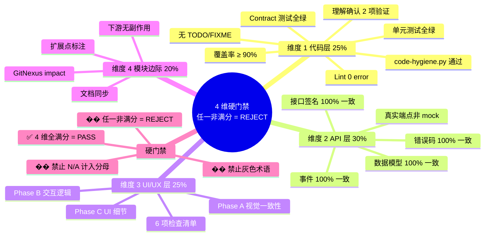
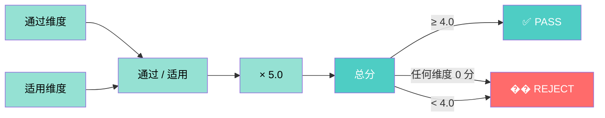
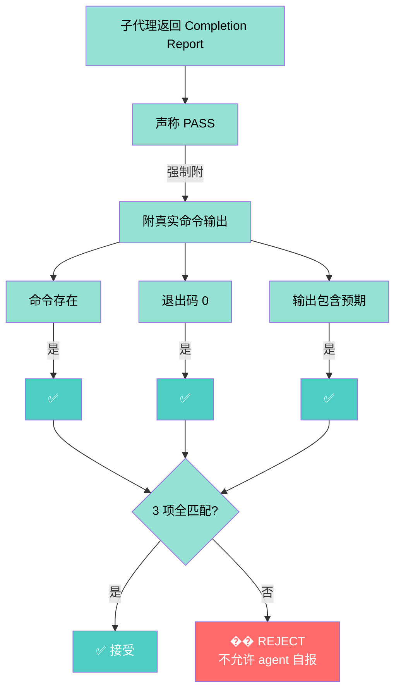
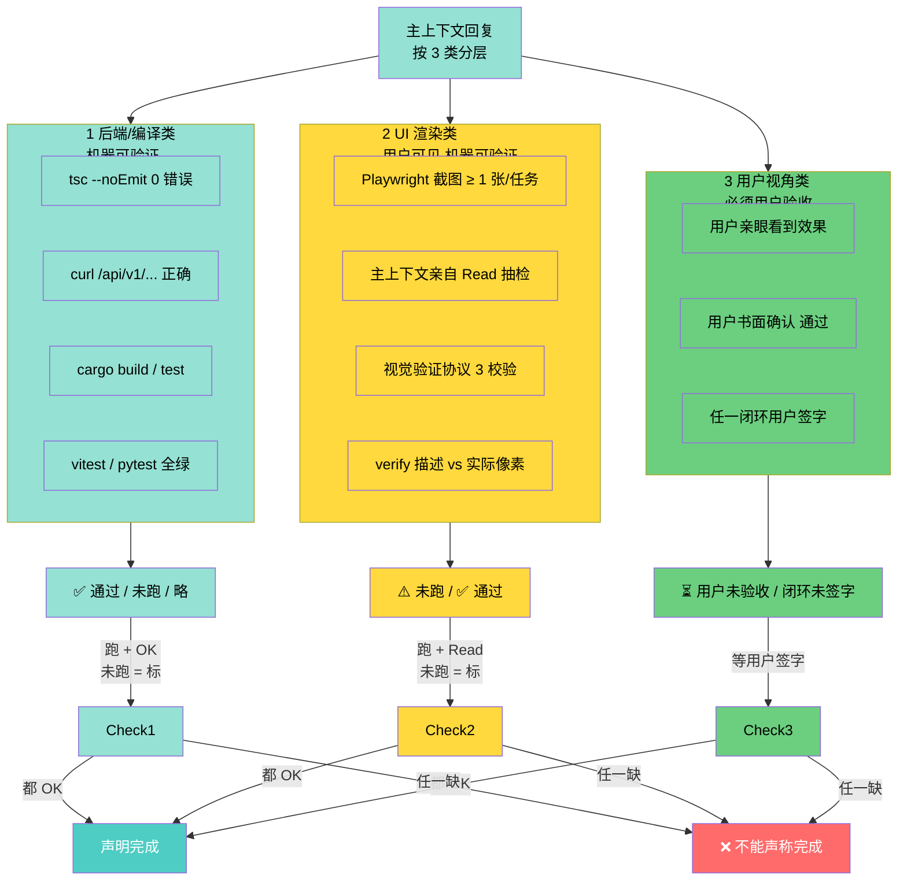
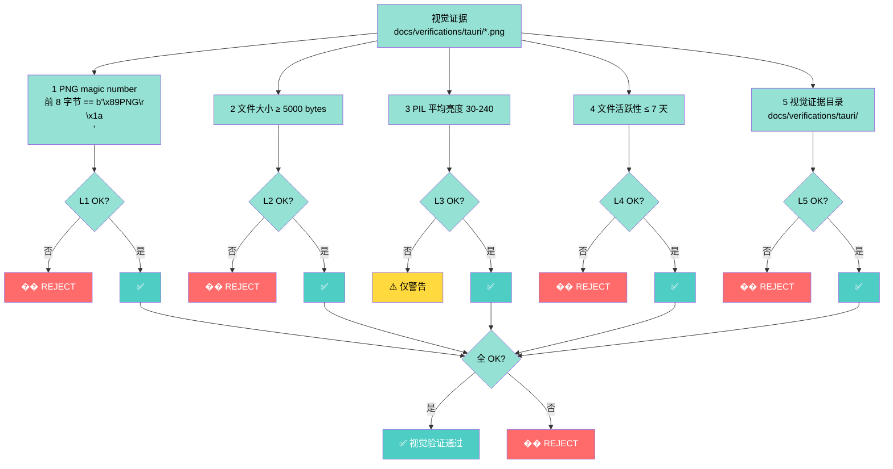
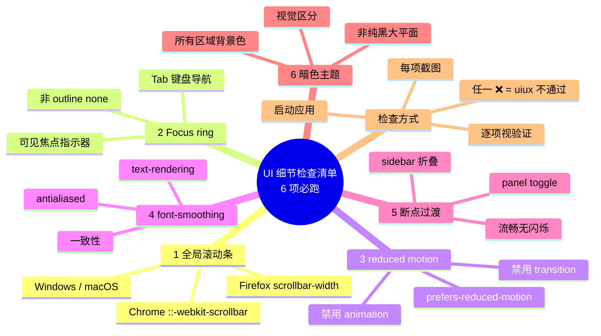
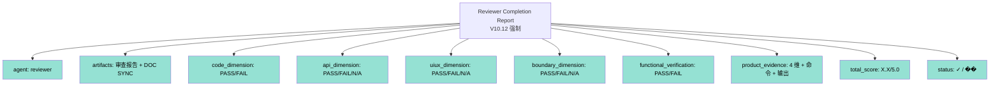

# 验收门禁 + 4 维评分 + 通过依据 3 类分层 + DOM 视觉证据 Mindmap

> V10.12 验收协议核心: **满分硬门禁（任何非满分 = �� REJECT）+ 视觉证据 3 层校验 + 通过依据 3 类分层**。

## 一、4 维验收硬门禁

## 二、4 维评分算法

## 三、产物证据链（强制）

## 四、通过依据 3 类分层（V10.8 NEW）

## 五、视觉证据 3 层校验 + 活跃性

## 六、UI 细节遗漏检查清单（V10.8 NEW）

## 七、Reviewer Completion Report 模板

## 八、关键引用

- 验收门禁: [acceptance-gates-v10.md](../references/acceptance-gates-v10.md)
- 通过依据 3 类分层: [acceptance-gates-v10.md §通过依据 3 类分层](../references/acceptance-gates-v10.md)
- UI 细节检查清单: [acceptance-gates-v10.md §UI 细节遗漏检查清单](../references/acceptance-gates-v10.md)
- 视觉证据 3 层校验: [reset-and-verify-protocol.md §V10.3.9 视觉证据门禁](../references/reset-and-verify-protocol.md)
-