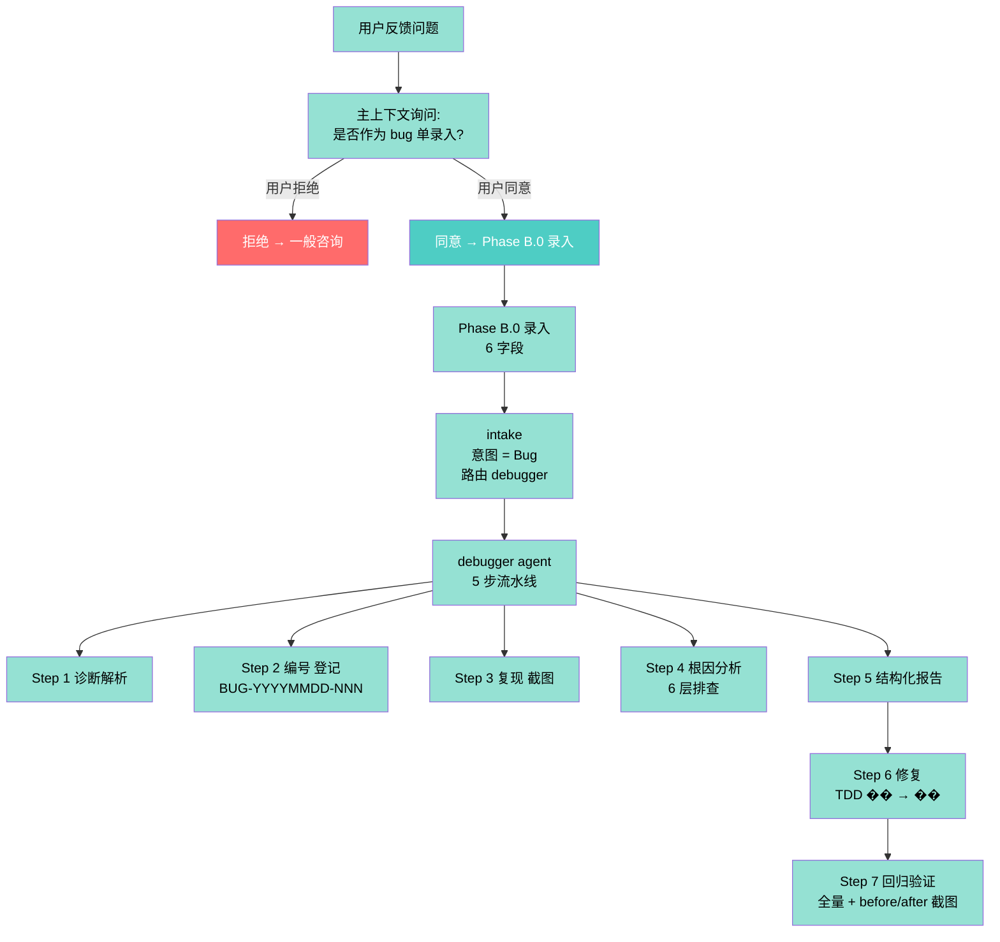
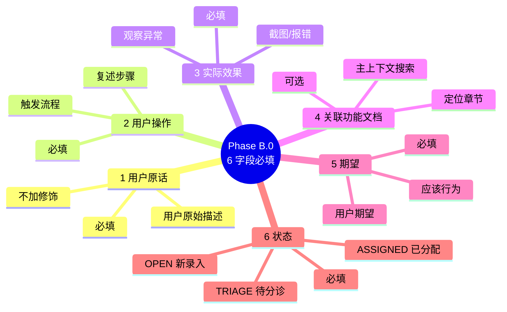
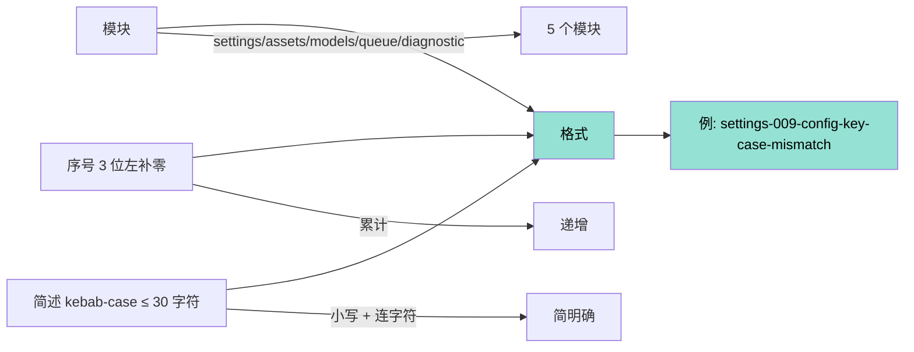
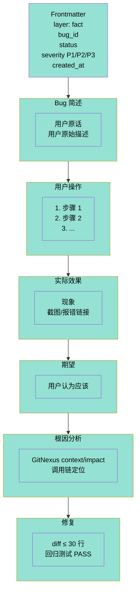
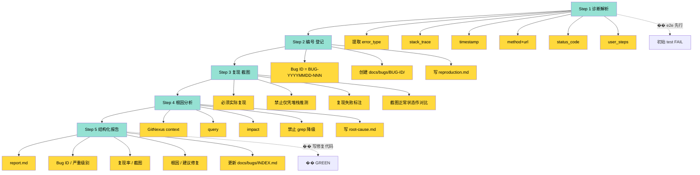
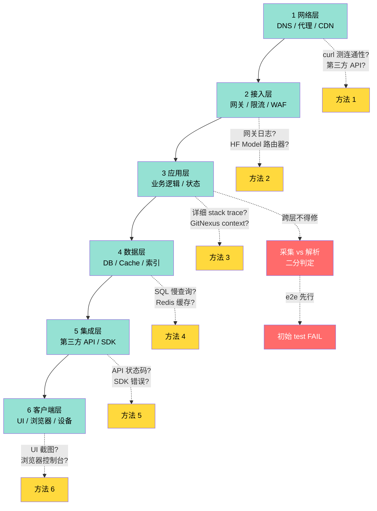
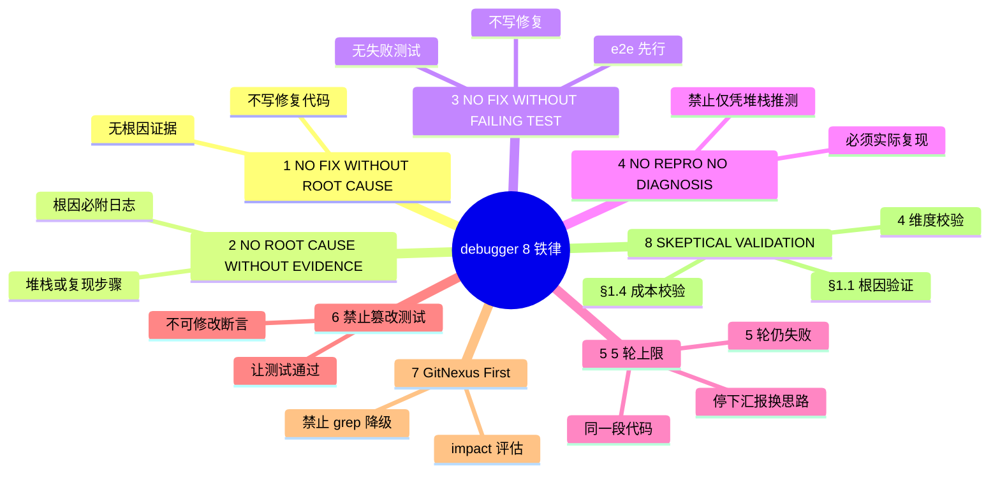

# Bug 录入 + 5 步流水线 + 6 层排查 + 视觉验证 Mindmap

> V10.11 NEW: Phase B.0 录入（用户反馈 → bug 单）。
> 核心铁律: **NO FIX WITHOUT ROOT CAUSE / NO REPRO NO DIAGNOSIS / NO FIX WITHOUT FAILING TEST**。

## 一、Bug 完整路径

## 二、Phase B.0 录入 6 字段

## 三、Bug 单编号规则

## 四、Bug 单文档结构

## 五、5 步流水线

## 六、6 层排查

## 七、debugger 铁律矩阵

## 八、关键引用

- Bug 工作流: [bug-workflow.md](../references/bug-workflow.md)
- debugger Agent: [debugger.md](../agents/debugger.md)
- 调试方法论: [debugger-methodology.md](../references/debugger-methodology.md)
- Bug 模板: [bug-template.md](../templates/bug-template.md)
- 多轮修订协议: [multi-round-revision-protocol.md](../references/multi-round-revision-prot