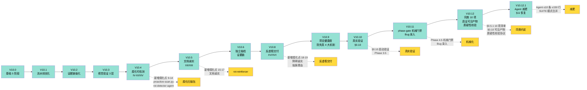
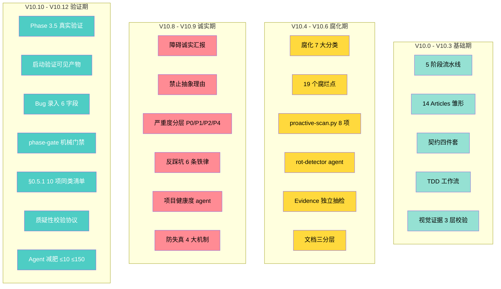
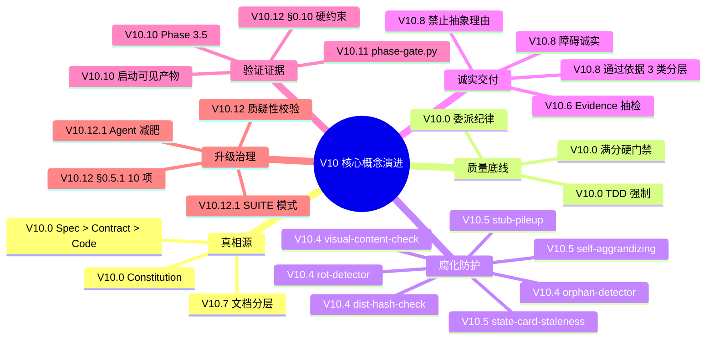
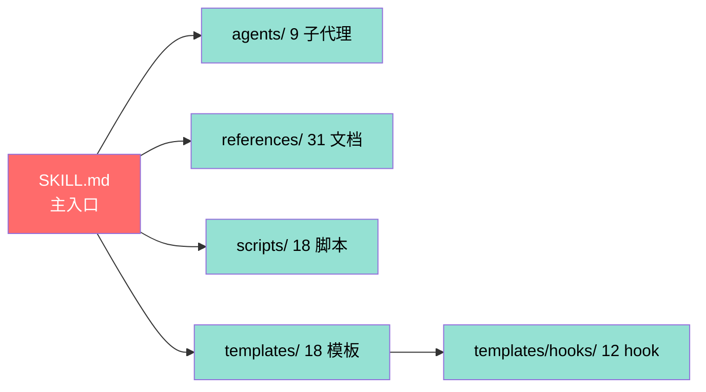

# V10.x 版本演进时间轴 + 附录索引

> V10 = "spec-kit 五阶段 + 16 Articles 不可降级 + 5 维度硬门禁 + 腐化可检测 + 启证可见产物"。
> 演进主线: **质量底线 → 腐化可检测 → 文档诚实 → 反虚假交付 → 质疑性校验 → 可见产物**。

## 一、版本演进时间轴



## 二、版本特性矩阵



## 三、核心概念演进关系



## 四、附录索引 — 文件清单

### 4.1 主干文件



### 4.2 Agent 文件索引

| Agent | 主方法论 | 关键铁律 |
|-------|---------|---------|
| [planner.md](../agents/planner.md) | 探索 + 意图识别 | 6 条 |
| [spec-enhancer.md](../agents/spec-enhancer.md) | 增强验收 + 原型 | 7 条 |
| [spec-prototype-enhancer.md](../agents/spec-prototype-enhancer.md) | 原型反推 | 7 条 |
| [contract-writer.md](../agents/contract-writer.md) | 契约四件套 | 8 条 |
| [implementer.md](../agents/implementer.md) | TDD RED→GREEN | 9 条 |
| [reviewer.md](../agents/reviewer.md) | 质疑式验收官 | 10 条 |
| [rot-detector.md](../agents/rot-detector.md) | 腐化扫描 | 7 条 |
| [debugger.md](../agents/debugger.md) | 6 层排查 | 8 条 |
| [project-health-auditor.md](../agents/project-health-auditor.md) | 4 维度诊断 | 6 条 |

### 4.3 References 31 文档索引

| 主题 | 文件 |
|------|------|
| 入门流程 | [acceptance-gates-v10.md](../references/acceptance-gates-v10.md) / [artifact-lifecycle.md](../references/artifact-lifecycle.md) |
| 流程定义 | [artifact-schema.md](../references/artifact-schema.md) / [bug-workflow.md](../references/bug-workflow.md) / [cockpit.md](../references/cockpit.md) |
| 流程详情 | [changelog.md](../references/changelog.md) / [clarify-checklist.md](../references/clarify-checklist.md) |
| 宪法 | [constitution-detail.md](../references/constitution-detail.md) / [contract-first.md](../references/contract-first.md) |
| 调试 | [debugger-methodology.md](../references/debugger-methodology.md) / [designer-handoff.md](../references/designer-handoff.md) |
| 文档 | [doc-sync.md](../references/doc-sync.md) / [drift-detect.md](../references/drift-detect.md) / [glossary.md](../references/glossary.md) |
| 知识 | [knowledge-system-upgrade.md](../references/knowledge-system-upgrade.md) / [multi-round-revision-protocol.md](../references/multi-round-revision-protocol.md) |
| 融合 | [multi-source-fusion.md](../references/multi-source-fusion.md) / [prd-integration-workflow.md](../references/prd-integration-workflow.md) |
| 文档 | [process-doc-locations.md](../references/process-doc-locations.md) / [process-rot-analysis.md](../references/process-rot-analysis.md) |
| 健康 | [project-health-checklist.md](../references/project-health-checklist.md) / [project-structure.md](../references/project-structure.md) |
| 原型 | [prototype.md](../references/prototype.md) / [prototype-code-gap-analysis.md](../references/prototype-code-gap-analysis.md) |
| 原型联动 | [prototype-linkage.md](../references/prototype-linkage.md) / [prototype-reverse-spec.md](../references/prototype-reverse-spec.md) |
| 报告 | [report-growth.md](../references/report-growth.md) / [reset-and-verify-protocol.md](../references/reset-and-verify-protocol.md) |
| 评审 | [reviewer-templates.md](../references/reviewer-templates.md) / [skeptical-validation-protocol.md](../references/skeptical-validation-protocol.md) |
| 优化 | [skill-optimization-method.md](../references/skill-optimization-method.md) / [spec-enhancer-templates.md](../references/spec-enhancer-templates.md) |
| 通用 | [sub-agent-rules.md](../references/sub-agent-rules.md) / [tdd-workflow.md](../references/tdd-workflow.md) |

### 4.4 Scripts 18 脚本索引

| 类别 | 脚本 |
|------|------|
| 阶段门禁 | [phase-gate.py](../scripts/phase-gate.py) / [acceptance-audit.py](../scripts/acceptance-audit.py) |
| 腐化扫描 | [proactive-scan.py](../scripts/proactive-scan.py) / [self-diagnose.py](../scripts/self-diagnose.py) |
| 维护 | [change-status.py](../scripts/change-status.py) / [spec-purge.py](../scripts/spec-purge.py) |
| 检查 | [check_integration_contract.py](../scripts/check_integration_contract.py) / [check_prerequisites.py](../scripts/check_prerequisites.py) |
| 卫生 | [code-hygiene.py](../scripts/code-hygiene.py) / [dist-hash-check.py](../scripts/dist-hash-check.py) |
| 验证 | [visual-content-check.py](../scripts/visual-content-check.py) / [orphan-detector.py](../scripts/orphan-detector.py) |
| 工具 | [scan-templates.py](../scripts/scan-templates.py) / [scenario-dispatch.py](../scripts/scenario-dispatch.py) |
| 智能 | [reason-classifier.py](../scripts/reason-classifier.py) / [setup-feature.py](../scripts/setup-feature.py) |
| 迁移 | [migrate-v9-to-v10.py](../scripts/migrate-v9-to-v10.py) / [install-hooks.py](../scripts/install-hooks.py) |
| 提取 | [spec-knowledge-extract.py](../scripts/spec-knowledge-extract.py) / [dispatch-agent.py](../scripts/dispatch-agent.py) |
| 公共 | [common.py](../scripts/common.py) |

## 五、V10 文件清单

```
skill-markets/fullstack4TraeV10/
├── SKILL.md                                 # 主入口（V10.12.0）
├── scenarios.md                             # V10.11 场景演练
├── README.md                                # 项目说明
├── research/                                # �� 本研究目录（Mermaid 表达）
│   ├── 00-overview-mindmap.md               # 总览
│   ├── 01-constitution-mindmap.md           # 14 Articles
│   ├── 02-pipeline-flow-graph.md            # 5 阶段流水线
│   ├── 03-delegation-discipline.md          # 委派纪律
│   ├── 04-spec-driven-mindmap.md            # 契约先行 + TDD
│   ├── 05-rot-detection.md                  # 腐化防御
│   ├── 06-skeptical-validation.md           # 质疑性校验
│   ├── 07-agent-architecture.md             # 9 Agent 角色
│   ├── 08-skill-loading-protocol.md         # §0.5 + §0.10 协议
│   ├── 09-acceptance-gates.md               # 4 维验收 + 视觉证据
│   ├── 10-bug-debug-mindmap.md              # Bug 流水线
│   └── 11-version-evolution-graph.md         # 版本演进 + 索引
├── agents/                                  # 9 个 Agent
│   ├── planner.md
│   ├── spec-enhancer.md
│   ├── spec-prototype-enhancer.md
│   ├── contract-writer.md
│   ├── implementer.md
│   ├── reviewer.md
│   ├── rot-detector.md
│   ├── debugger.md
│   └── project-health-auditor.md
├── references/                              # 31 个文档
│   ├── acceptance-gates-v10.md
│   ├── artifact-lifecycle.md
│   ├── artifact-schema.md
│   ├── bug-workflow.md
│   ├── changelog.md
│   ├── clarify-checklist.md
│   ├── cockpit.md
│   ├── constitution-detail.md
│   ├── contract-first.md
│   ├── debugger-methodology.md
│   ├── designer-handoff.md
│   ├── doc-sync.md
│   ├── drift-detect.md
│   ├── glossary.md
│   ├── knowledge-system-upgrade.md
│   ├── multi-round-revision-protocol.md
│   ├── multi-source-fusion.md
│   ├── prd-integration-workflow.md
│   ├── process-doc-locations.md
│   ├── process-rot-analysis.md
│   ├── project-health-checklist.md
│   ├── project-structure.md
│   ├── prototype-code-gap-analysis.md
│   ├── prototype-linkage.md
│   ├── prototype-reverse-spec.md
│   ├── prototype.md
│   ├── report-growth.md
│   ├── reset-and-verify-protocol.md
│   ├── reviewer-templates.md
│   ├── skeptical-validation-protocol.md
│   ├── skill-optimization-method.md
│   ├── spec-enhancer-templates.md
│   ├── sub-agent-rules.md
│   └── tdd-workflow.md
├── scripts/                                 # 18 个脚本
│   ├── acceptance-audit.py
│   ├── change-status.py
│   ├── check_integration_contract.py
│   ├── check_prerequisites.py
│   ├── code-hygiene.py
│   ├── common.py
│   ├── dispatch-agent.py
│   ├── dist-hash-check.py
│   ├── install-hooks.py
│   ├── migrate-v9-to-v10.py
│   ├── orphan-detector.py
│   ├── phase-gate.py
│   ├── proactive-scan.py
│   ├── reason-classifier.py
│   ├── scenario-dispatch.py
│   ├── self-diagnose.py
│   ├── setup-feature.py
│   ├── spec-knowledge-extract.py
│   ├── spec-purge.py
│   ├── scan-templates.py
│   └── visual-content-check.py
└── templates/                               # 18 个模板
    ├── bug-template.md
    ├── checklist-template.md
    ├── constitution-template.md
    ├── spec-template.md
    ├── state-card.md
    ├── test-plan.md
    ├── test-plan-example.md
    ├── contracts/
    │   ├── api-contracts.md
    │   ├── domain-models.md
    │   ├── events.md
    │   └── validation-rules.md
    ├── hooks/
    │   ├── README.md
    │   ├── auto-test.py
    │   ├── complexity-guard.py
    │   ├── contract-gate.py
    │   ├── doc-sync-gate.py
    │   ├── drift-detect.py
    │   ├── fullstack-hooks.json
    │   ├── gitnexus-session-check.py
    │   ├── gitnexus-session-finalize.py
    │   ├── session-start.py
    │   ├── spec-validate-hook.py
    │   └── tasks-integrity.py
    └── scripts/
        ├── env-init.py
        ├── log-agent-prompt.py
        └── render-cockpit.py
```

## 六、关键引用

- 主入口: [SKILL.md](../SKILL.md)
- 版本历史: [changelog.md](../references/changelog.md)
- 场景演练: [scenarios.md](../scenarios.md)
- 术语表: [glossary.md](../references/glossary.md)
