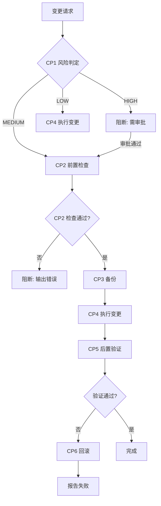
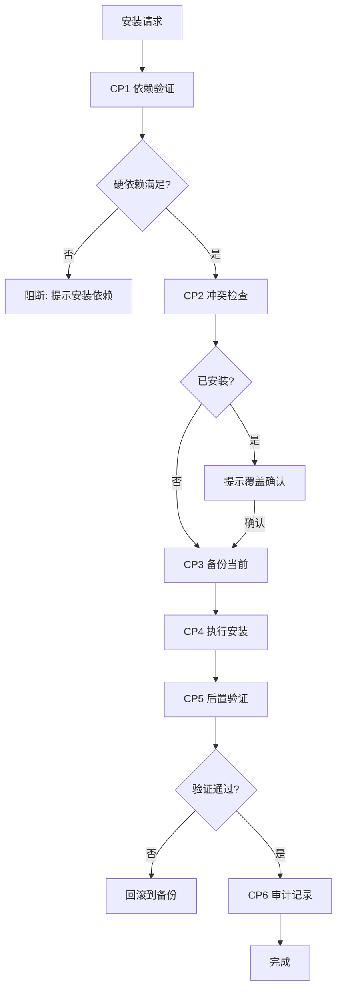
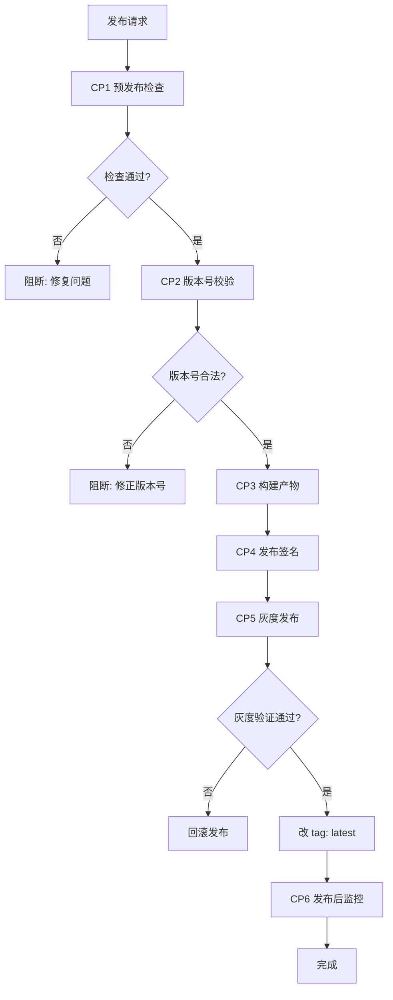

# 技能市场三层控制体系设计

> **目标**: 将 `@my-trae-helper/cli` 的技能市场管理对齐到 `agent-dev-control-kit` 的 Execution + Guard + Gate 三层控制体系,实现标准化执行、自动检查和质量门禁。
>
> **适用场景**: 新建/修改/删除/安装/卸载/发布技能包的所有操作。
>
> **触发词**: "技能市场管理" / "skill 变更" / "CLI 自动化" / "三层控制" / "Execution Guard Gate"

---

## §0 设计原则

### 0.1 继承自 agent-dev-control-kit

| 控制层 | 原版能力 | 技能市场特化 |
|--------|---------|-------------|
| **Execution Layer** | 数据变更控制 / 配置同步控制 / 发布流程控制 | **Skill Change Control** / **Skill Install Control** / **Skill Publish Control** |
| **Guard Layer** | 安全约束Guard / 架构约束Guard | **Skill Security Guard** / **Skill Dependency Guard** / **Skill Structure Guard** |
| **Gate Layer** | L1~L4 门禁 | **L1 Commit** / **L2 Push** / **L3 Merge** / **L4 Publish** (映射到技能市场操作) |

### 0.2 核心铁律

```
1. 破坏性操作必须备份 + 回滚脚本
2. 安全审查必须走 scan_skills_dir.py
3. CAPABILITY-MAP.md 必须同步更新
4. 依赖检查必须执行（硬依赖阻断，软引用警告）
5. 审计日志必须记录（谁/何时/做了什么/结果）
```

---

## §1 Execution Layer — 技能市场执行控制

### 1.1 Skill Change Control（技能变更控制）

**继承自**: `agent-dev-control-kit/skills/data-change-control`

**控制对象**: 新建 / 修改 / 删除 技能包

**风险分级**:

| 风险等级 | 触发条件 | 强制措施 |
|:-------:|---------|---------|
| **HIGH** | 删除技能 / 修改已发布技能的核心结构 / 批量变更 > 5 个技能 | 必须备份到 `_archived_<ts>/` + dry-run + 审批 + 回滚脚本 |
| **MEDIUM** | 修改技能的 SKILL.md / 新增脚本 / 修改依赖 | 必须备份 + dry-run + 安全扫描 |
| **LOW** | 新建技能 / 纯文档修改 | 可选备份 + 安全扫描 |

**关键控制点 (CP)**:

```
CP1 [风险判定] → 判定 HIGH/MEDIUM/LOW
CP2 [前置检查] → 安全扫描 + 依赖检查 + CAPABILITY-MAP 冲突检查
CP3 [备份] → 备份到 _archived_<ts>/（HIGH/MEDIUM 强制）
CP4 [执行变更] → 创建/修改/删除
CP5 [后置验证] → 安全扫描 + 结构检查 + CAPABILITY-MAP 同步
CP6 [回滚准备] → 生成回滚脚本（HIGH 强制）
```

**流程图**:



**实施示例**:

```javascript
// CLI 集成: trae-skills create <name>
import { classifyRisk, backupSkill, executeChange, verifyChange } from './skill-change-control.mjs';

async function createSkill(name) {
  // CP1: 风险判定
  const risk = classifyRisk({ operation: 'create', target: name });

  // CP2: 前置检查
  const precheck = await precheckSkill({ name });
  if (!precheck.passed) {
    console.error(`前置检查失败: ${precheck.errors.join(', ')}`);
    process.exit(1);
  }

  // CP3: 备份（HIGH/MEDIUM 强制）
  if (risk === 'HIGH' || risk === 'MEDIUM') {
    await backupSkill({ name, timestamp: Date.now() });
  }

  // CP4: 执行变更
  await executeChange({ operation: 'create', name });

  // CP5: 后置验证
  const verification = await verifyChange({ operation: 'create', name });
  if (!verification.passed) {
    // CP6: 回滚
    await rollbackSkill({ name, timestamp: Date.now() });
    console.error(`验证失败,已回滚: ${verification.errors.join(', ')}`);
    process.exit(1);
  }

  console.log(`✅ 技能 ${name} 创建成功`);
}
```

---

### 1.2 Skill Install Control（技能安装控制）

**继承自**: `agent-dev-control-kit/skills/config-sync-control`

**控制对象**: 安装 / 卸载 / 更新 技能到 Agent

**关键控制点 (CP)**:

```
CP1 [依赖验证] → 检查硬依赖是否已安装（缺失则阻断）
CP2 [冲突检查] → 检查是否已安装（已安装则提示覆盖）
CP3 [备份当前] → 备份当前版本（更新时）
CP4 [执行安装] → symlink/copy
CP5 [后置验证] → 验证安装完整性
CP6 [审计记录] → 记录安装日志
```

**流程图**:



**实施示例**:

```javascript
// CLI 集成: trae-skills add <name> -a trae-cn
import { checkDependencies, backupInstalled, installSkill, verifyInstall } from './skill-install-control.mjs';

async function addSkill(name, agent) {
  // CP1: 依赖验证
  const deps = await checkDependencies(name);
  if (deps.missing.length > 0) {
    console.error(`缺失硬依赖: ${deps.missing.join(', ')}`);
    console.log(`请先安装: trae-skills add ${deps.missing.join(' ')}`);
    process.exit(1);
  }

  if (deps.missingOptional.length > 0) {
    console.warn(`⚠️ 软依赖缺失: ${deps.missingOptional.join(', ')}（功能可能降级）`);
  }

  // CP2: 冲突检查
  const installed = await detectInstalled(name, agent);
  if (installed) {
    const confirm = await askConfirm(`已安装 ${name}@${installed.version}，是否覆盖？`);
    if (!confirm) return;

    // CP3: 备份当前
    await backupInstalled({ name, agent, timestamp: Date.now() });
  }

  // CP4: 执行安装
  await installSkill({ name, agent, method: 'symlink' });

  // CP5: 后置验证
  const verification = await verifyInstall({ name, agent });
  if (!verification.passed) {
    await rollbackInstall({ name, agent, timestamp: Date.now() });
    console.error(`安装验证失败,已回滚: ${verification.errors.join(', ')}`);
    process.exit(1);
  }

  // CP6: 审计记录
  await auditLog({
    action: 'install',
    skill: name,
    agent,
    timestamp: new Date().toISOString(),
    result: 'success'
  });

  console.log(`✅ ${name} 已安装到 ${agent}`);
}
```

---

### 1.3 Skill Publish Control（技能发布控制）

**继承自**: `agent-dev-control-kit/skills/release-process-control`

**控制对象**: 发布 `@my-trae-helper/cli` 到 npm / 发布技能包到技能市场

**关键控制点 (CP)**:

```
CP1 [预发布检查] → 全量测试 + 安全扫描 + 依赖检查
CP2 [版本号校验] → 检查版本号是否递增 + CHANGELOG 更新
CP3 [构建产物] → npm run build / 打包
CP4 [发布签名] → npm publish（带 tag）
CP5 [灰度发布] → 先发 next tag，验证后改 latest
CP6 [发布后监控] → 监控安装量 / 错误率
```

**流程图**:



**实施示例**:

```bash
# scripts/publish-cli.sh
#!/bin/bash
set -e

# CP1: 预发布检查
echo "🔍 执行预发布检查..."
npm run lint
npm run test
npm run typecheck
python skill-markets/trae-security-review/scripts/scan_skills_dir.py skill-markets auto_reports

# CP2: 版本号校验
CURRENT_VERSION=$(node -p "require('./package.json').version")
echo "当前版本: $CURRENT_VERSION"
read -p "请输入新版本号: " NEW_VERSION

if [[ ! "$NEW_VERSION" =~ ^[0-9]+\.[0-9]+\.[0-9]+$ ]]; then
  echo "❌ 版本号格式错误"
  exit 1
fi

# CP3: 构建产物
echo "🏗️ 构建产物..."
npm run build

# CP4: 发布签名（灰度）
echo "🚀 发布到 npm (next tag)..."
npm publish --tag next

# CP5: 灰度验证
echo "⏳ 等待 5 分钟观察..."
sleep 300

read -p "灰度验证通过? (y/n): " confirm
if [[ "$confirm" != "y" ]]; then
  echo "回滚发布..."
  npm unpublish @my-trae-helper/cli@$NEW_VERSION
  exit 1
fi

# 改 tag: latest
npm dist-tag add @my-trae-helper/cli@$NEW_VERSION latest

echo "✅ 发布完成: @my-trae-helper/cli@$NEW_VERSION"
```

---

## §2 Guard Layer — 技能市场守卫

### 2.1 Skill Security Guard（技能安全守卫）

**继承自**: `agent-dev-control-kit/skills/guard-control`

**检查维度**: HIGH/MEDIUM/LOW 风险 + SHELL_EXEC + HTTP_INSECURE + HARDCODED_SECRET

**触发时机**: `pre-commit` (新建/修改技能时)

**禁止性规则**:

```yaml
forbidden:
  - HIGH 风险 > 0（除非文档引用）
  - 硬编码密钥（非示例）
  - 未参数化的 Shell 命令
  - HTTP 外联（非 localhost）
```

**白名单机制**:

```yaml
whitelist:
  - path: "skill-markets/trae-security-review/references/risk-patterns.md"
    reason: "风险模式文档,非可执行代码"
    expires: "永久"
  - path: "skill-markets/browser-use-cloud/references/local-usage.md"
    reason: "示例 API Key（文档）"
    expires: "永久"
```

**失败处理**:

| 结果 | 处理 | 输出 |
|------|------|------|
| **PASS** | 继续流程 | 无输出 |
| **WARN** | 输出警告,允许继续 | 黄色提示（需人工确认） |
| **BLOCK** | 终止流程,输出错误 | 红色阻断 + 修复建议 |

**实施脚本**:

```python
# scripts/skill-security-guard.py
import subprocess
import sys
import json

def run_security_guard(skill_path):
    """执行技能安全守卫"""
    # 调用 trae-security-review 的扫描脚本
    result = subprocess.run([
        'python',
        'skill-markets/trae-security-review/scripts/scan_skills_dir.py',
        skill_path,
        'auto_reports'
    ], capture_output=True, text=True)

    # 解析结果
    if result.returncode != 0:
        return {
            'status': 'BLOCK',
            'message': f'安全扫描失败: {result.stderr}'
        }

    # 检查 HIGH 风险
    # ... (解析报告)

    return {
        'status': 'PASS',
        'message': '安全扫描通过'
    }

if __name__ == '__main__':
    skill_path = sys.argv[1]
    result = run_security_guard(skill_path)
    print(json.dumps(result, indent=2))
    sys.exit(0 if result['status'] != 'BLOCK' else 1)
```

---

### 2.2 Skill Dependency Guard（技能依赖守卫）

**继承自**: `agent-dev-control-kit/skills/guard-control`

**检查维度**: 硬依赖完整性 / 软依赖降级影响

**触发时机**: `pre-add` (安装技能前) / `pre-publish` (发布前)

**检查规则**:

```yaml
rules:
  hard_dependency_missing:
    check: "requires.skills 中声明的技能未安装"
    action: "BLOCK"
    message: "缺失硬依赖: {missing}。请先安装: trae-skills add {missing}"
  soft_dependency_missing:
    check: "requires.optional 中声明的技能未安装"
    action: "WARN"
    message: "⚠️ 软依赖缺失: {missing}。功能可能降级: {impact}"
```

**实施脚本**:

```javascript
// src/guards/skill-dependency-guard.mjs
import { readYaml, checkInstalled } from '../utils.mjs';

export async function checkDependencies(skillName) {
  const skillPath = `skill-markets/${skillName}/SKILL.md`;
  const skillMeta = parseSkillMetadata(skillPath);

  const result = {
    passed: true,
    missing: [],
    missingOptional: [],
    impacts: []
  };

  // 检查硬依赖
  if (skillMeta.requires?.skills) {
    for (const dep of skillMeta.requires.skills) {
      if (!await checkInstalled(dep)) {
        result.passed = false;
        result.missing.push(dep);
      }
    }
  }

  // 检查软依赖
  if (skillMeta.requires?.optional) {
    for (const dep of skillMeta.requires.optional) {
      if (!await checkInstalled(dep)) {
        result.missingOptional.push(dep);
        result.impacts.push(getDowngradeImpact(dep));
      }
    }
  }

  return result;
}

function getDowngradeImpact(skillName) {
  const impactMap = {
    'acceptance-discipline': '验收门禁不可用',
    'gitnexus4Trae': '影响分析降级为 grep',
    'doc-map-manager': '文档索引无法自动更新'
  };
  return impactMap[skillName] || '功能可能受限';
}
```

---

### 2.3 Skill Structure Guard（技能结构守卫）

**检查维度**: 目录结构 / 命名规范 / YAML frontmatter

**触发时机**: `pre-create` (新建技能时)

**禁止性规则**:

```yaml
forbidden:
  - 目录名含空格 / 大写字母
  - SKILL.md 缺 YAML frontmatter
  - SKILL.md > 500 行
  - agents/ 文件名带 -agent 后缀
  - 技能位置不在 skill-markets/<name>/
```

**实施脚本**:

```python
# scripts/skill-structure-guard.py
import re
import sys
from pathlib import Path

def check_structure(skill_path):
    errors = []

    # 检查目录名
    dir_name = Path(skill_path).name
    if not re.match(r'^[a-z][a-z0-9-]*$', dir_name):
        errors.append(f'目录名不合规: {dir_name}（应为 kebab-case）')

    # 检查 SKILL.md
    skill_md = Path(skill_path) / 'SKILL.md'
    if not skill_md.exists():
        errors.append('缺少 SKILL.md')
    else:
        content = skill_md.read_text()

        # 检查 YAML frontmatter
        if not content.startswith('---'):
            errors.append('SKILL.md 缺 YAML frontmatter')

        # 检查行数
        lines = content.count('\n') + 1
        if lines > 500:
            errors.append(f'SKILL.md 过长: {lines} 行（应 ≤ 500）')

    return {
        'passed': len(errors) == 0,
        'errors': errors
    }

if __name__ == '__main__':
    skill_path = sys.argv[1]
    result = check_structure(skill_path)
    if result['passed']:
        print('✅ 结构检查通过')
    else:
        print('❌ 结构检查失败:')
        for err in result['errors']:
            print(f'  - {err}')
        sys.exit(1)
```

---

### 2.4 Skill Capability Guard（技能能力守卫）

**检查维度**: 能力去重 / CAPABILITY-MAP.md 同步

**触发时机**: `pre-create` / `pre-update` / `pre-delete`

**禁止性规则**:

```yaml
forbidden:
  - 新增脚本在「共享能力注册表」中已存在（必须复用）
  - CAPABILITY-MAP.md 未同步更新
```

**实施脚本**:

```python
# scripts/skill-capability-guard.py
import sys
import yaml
from pathlib import Path

def check_capability_duplicate(skill_path, script_name):
    """检查脚本是否在共享能力注册表中已存在"""
    capability_map = Path('skill-markets/CAPABILITY-MAP.md')
    content = capability_map.read_text()

    # 解析「共享能力注册表」
    # ... (Markdown 表格解析)

    if script_name in existing_scripts:
        return {
            'passed': False,
            'error': f'脚本 {script_name} 已存在于共享能力注册表，请复用'
        }

    return {'passed': True}

if __name__ == '__main__':
    skill_path = sys.argv[1]
    script_name = sys.argv[2] if len(sys.argv) > 2 else None

    if script_name:
        result = check_capability_duplicate(skill_path, script_name)
        if not result['passed']:
            print(f'❌ {result["error"]}')
            sys.exit(1)

    print('✅ 能力检查通过')
```

---

## §3 Gate Layer — 技能市场门禁

### 3.1 L1 Commit Gate（提交门禁）

**触发时机**: `git commit` (husky pre-commit hook)

**检查项**:

```json
{
  "L1": {
    "trigger": "pre-commit",
    "checks": [
      "lint",
      "typecheck",
      "test:unit",
      "skill-security-guard (仅变更的技能)",
      "skill-structure-guard (仅新建技能)"
    ]
  }
}
```

**实施**:

```bash
# .husky/pre-commit
#!/bin/bash
set -e

# 1. Lint
npm run lint

# 2. TypeCheck
npm run typecheck

# 3. Unit Tests
npm run test:unit

# 4. 技能安全守卫（仅变更的技能）
CHANGED_SKILLS=$(git diff --name-only --cached | grep 'skill-markets/' | cut -d'/' -f2 | sort -u)
for skill in $CHANGED_SKILLS; do
  python scripts/skill-security-guard.py "skill-markets/$skill"
done

# 5. 技能结构守卫（仅新建技能）
NEW_SKILLS=$(git diff --name-only --cached --diff-filter=A | grep 'skill-markets/.*SKILL.md' | cut -d'/' -f2)
for skill in $NEW_SKILLS; do
  python scripts/skill-structure-guard.py "skill-markets/$skill"
done

echo "✅ L1 Commit Gate 通过"
```

---

### 3.2 L2 Push Gate（推送门禁）

**触发时机**: `git push` (husky pre-push hook)

**检查项**:

```json
{
  "L2": {
    "trigger": "pre-push",
    "checks": [
      "L1 全部",
      "test:integration",
      "test:coverage",
      "skill-dependency-guard (全部技能)",
      "build"
    ]
  }
}
```

**实施**:

```bash
# .husky/pre-push
#!/bin/bash
set -e

# 1. L1 检查（已在 commit 时执行，可跳过）
# npm run lint && npm run typecheck && npm run test:unit

# 2. Integration Tests
npm run test:integration

# 3. Coverage
npm run test:coverage

# 4. 依赖检查（全部技能）
for skill in skill-markets/*/; do
  skill_name=$(basename "$skill")
  node src/guards/skill-dependency-guard.mjs "$skill_name"
done

# 5. Build
npm run build

echo "✅ L2 Push Gate 通过"
```

---

### 3.3 L3 Merge Gate（合并门禁）

**触发时机**: PR merge (GitHub Actions / GitLab CI)

**检查项**:

```json
{
  "L3": {
    "trigger": "pr-merge",
    "checks": [
      "L2 全部",
      "code-review",
      "capability-map-sync",
      "security-map-sync",
      "gitnexus-impact-analysis"
    ]
  }
}
```

**实施**:

```yaml
# .github/workflows/skill-market-gate.yml
name: Skill Market Gate

on:
  pull_request:
    branches: [main, release/*]

jobs:
  L3-merge-gate:
    runs-on: ubuntu-latest
    steps:
      - uses: actions/checkout@v3

      - name: Setup Node.js
        uses: actions/setup-node@v3
        with:
          node-version: '18'

      - name: Install dependencies
        run: npm ci

      - name: L2 checks
        run: |
          npm run test:integration
          npm run test:coverage
          npm run build

      - name: Check CAPABILITY-MAP.md sync
        run: |
          python scripts/check-capability-map-sync.py

      - name: Check SECURITY-MAP.md sync
        run: |
          python scripts/check-security-map-sync.py

      - name: GitNexus impact analysis
        run: |
          npx gitnexus impact --target main --output impact-report.md

      - name: Upload impact report
        uses: actions/upload-artifact@v3
        with:
          name: impact-report
          path: impact-report.md
```

---

### 3.4 L4 Publish Gate（发布门禁）

**触发时机**: Release (GitHub Actions)

**检查项**:

```json
{
  "L4": {
    "trigger": "release",
    "checks": [
      "L3 全部",
      "perf-benchmark",
      "security-scan",
      "acceptance-test",
      "skill-market-integrity-check"
    ]
  }
}
```

**实施**:

```yaml
# .github/workflows/publish.yml
name: Publish CLI

on:
  release:
    types: [published]

jobs:
  L4-publish-gate:
    runs-on: ubuntu-latest
    steps:
      - uses: actions/checkout@v3

      - name: Setup Node.js
        uses: actions/setup-node@v3
        with:
          node-version: '18'
          registry-url: 'https://registry.npmjs.org'

      - name: Install dependencies
        run: npm ci

      - name: L3 checks
        run: |
          npm run test:integration
          npm run test:coverage
          npm run build

      - name: Performance benchmark
        run: |
          npm run benchmark

      - name: Security scan (全量)
        run: |
          python skill-markets/trae-security-review/scripts/scan_skills_dir.py skill-markets auto_reports

      - name: Skill market integrity check
        run: |
          python scripts/skill-market-integrity-check.py

      - name: Publish to npm
        run: npm publish --tag next
        env:
          NODE_AUTH_TOKEN: ${{ secrets.NPM_TOKEN }}

      - name: Wait for 5 minutes
        run: sleep 300

      - name: Promote to latest
        run: |
          VERSION=$(node -p "require('./package.json').version")
          npm dist-tag add @my-trae-helper/cli@$VERSION latest
```

---

## §4 CLI 命令集成

### 4.1 新增 CLI 命令

| 命令 | 功能 | Execution Skill | Guard |
|------|------|----------------|-------|
| `trae-skills create <name>` | 新建技能包 | Skill Change Control | Security + Structure Guard |
| `trae-skills delete <name>` | 删除技能包 | Skill Change Control | Security Guard |
| `trae-skills add <name>` | 安装技能 | Skill Install Control | Dependency Guard |
| `trae-skills remove <name>` | 卸载技能 | Skill Install Control | - |
| `trae-skills publish` | 发布 CLI | Skill Publish Control | Security Guard |
| `trae-skills verify <name>` | 验证技能 | - | All Guards |
| `trae-skills audit` | 审计日志 | - | - |

### 4.2 命令实现示例

#### `trae-skills create`

```javascript
// src/create.mjs
import { classifyRisk, backupSkill, executeCreate, verifySkill } from './execution/skill-change-control.mjs';
import { runSecurityGuard, runStructureGuard } from './guards/index.mjs';

export async function runCreate(args) {
  const name = args[0];
  if (!name) {
    console.error('用法: trae-skills create <name>');
    process.exit(1);
  }

  console.log(`🔨 创建技能: ${name}`);

  // CP1: 风险判定
  const risk = classifyRisk({ operation: 'create', target: name });
  console.log(`风险等级: ${risk}`);

  // CP2: 前置检查（Guards）
  console.log('🔍 执行前置检查...');

  const structureCheck = await runStructureGuard(`skill-markets/${name}`);
  if (!structureCheck.passed) {
    console.error('❌ 结构检查失败:', structureCheck.errors.join(', '));
    process.exit(1);
  }

  // CP3: 备份（LOW 风险可选）
  if (risk !== 'LOW') {
    console.log('📦 备份...');
    await backupSkill({ name, timestamp: Date.now() });
  }

  // CP4: 执行变更
  console.log('✍️ 创建目录和文件...');
  await executeCreate({ name });

  // CP5: 后置验证
  console.log('✅ 验证技能...');
  const verification = await verifySkill({ name });
  if (!verification.passed) {
    console.error('❌ 验证失败,回滚...');
    await rollbackSkill({ name });
    process.exit(1);
  }

  // CP6: 审计记录
  await auditLog({
    action: 'create',
    skill: name,
    timestamp: new Date().toISOString(),
    result: 'success'
  });

  console.log(`✅ 技能 ${name} 创建成功`);
  console.log('📖 下一步:');
  console.log(`  1. 编辑 skill-markets/${name}/SKILL.md`);
  console.log(`  2. 运行: trae-skills verify ${name}`);
  console.log(`  3. 更新 skill-markets/CAPABILITY-MAP.md`);
}
```

#### `trae-skills verify`

```javascript
// src/verify.mjs
import { runAllGuards } from './guards/index.mjs';

export async function runVerify(args) {
  const name = args[0];
  if (!name) {
    console.error('用法: trae-skills verify <name>');
    process.exit(1);
  }

  console.log(`🔍 验证技能: ${name}`);

  const results = await runAllGuards(`skill-markets/${name}`);

  let passed = 0;
  let failed = 0;

  for (const [guard, result] of Object.entries(results)) {
    if (result.passed) {
      console.log(`  ✅ ${guard}`);
      passed++;
    } else {
      console.log(`  ❌ ${guard}: ${result.errors.join(', ')}`);
      failed++;
    }
  }

  console.log(`\n结果: ${passed} 通过, ${failed} 失败`);

  if (failed > 0) {
    process.exit(1);
  }
}
```

---

## §5 审计日志

### 5.1 日志格式

```json
{
  "timestamp": "2026-08-14T10:30:00Z",
  "action": "install",
  "skill": "fullstack4TraeV11",
  "agent": "trae-cn",
  "user": "septe",
  "result": "success",
  "duration_ms": 1234,
  "details": {
    "method": "symlink",
    "source": "d:/workspace/my-trae-helper/skill-markets/fullstack4TraeV11",
    "target": "C:/Users/septe/.trae-cn/skills/fullstack4TraeV11"
  }
}
```

### 5.2 日志存储

- **位置**: `logs/skill-market-audit.jsonl`
- **格式**: JSON Lines (每行一个 JSON 对象)
- **轮转**: 每月归档到 `logs/archive/`

---

## §6 与现有体系的联动

### 6.1 与 CAPABILITY-MAP.md 联动

| 操作 | CAPABILITY-MAP.md 更新 |
|------|----------------------|
| 新建技能 | 添加到「技能索引」对应层级 |
| 修改依赖 | 更新「依赖关系图」+「降级影响表」 |
| 删除技能 | 从「技能索引」移除 + 检查「共享能力注册表」消费者 |
| 新增脚本 | 添加到「共享能力注册表」 |

### 6.2 与 SECURITY-MAP.md 联动

| 操作 | SECURITY-MAP.md 更新 |
|------|---------------------|
| 新建技能 | 运行安全扫描 + 添加评分条目 |
| 修改脚本 | 重新评估安全风险 + 更新评分 |
| 引入第三方 | 先扫描 + 判定 🟢 才准入 |

### 6.3 与 GitNexus 联动

| 场景 | GitNexus 工具 |
|------|--------------|
| L3 合并门禁 | `detect_changes()` 验证变更范围 |
| 影响分析 | `impact({target: "symbolName"})` 评估影响面 |
| 重命名 | `rename()` 安全重命名符号 |

---

## §7 实施路线图

### Phase 1: Execution Skills (Week 1-2)

- [ ] 实现 `skill-change-control.mjs` (新建/修改/删除)
- [ ] 实现 `skill-install-control.mjs` (安装/卸载)
- [ ] 集成到 CLI 命令 (`create` / `delete` / `add` / `remove`)

### Phase 2: Guard Skills (Week 3-4)

- [ ] 实现 `skill-security-guard.py`
- [ ] 实现 `skill-dependency-guard.mjs`
- [ ] 实现 `skill-structure-guard.py`
- [ ] 实现 `skill-capability-guard.py`

### Phase 3: Gate Skills (Week 5-6)

- [ ] 配置 Git Hooks (husky)
- [ ] 配置 GitHub Actions (L3/L4)
- [ ] 集成 GitNexus impact analysis

### Phase 4: 审计与监控 (Week 7-8)

- [ ] 实现审计日志记录
- [ ] 实现审计日志查询
- [ ] 实现发布后监控

---

## 附录

### A. 快速参考

- **Execution Skills 决策树**: §1.1 Skill Change Control 流程图
- **Guard 失败处理模板**: §2.1 Skill Security Guard 失败处理表
- **Gate 层级详解**: §3.1-3.4 各级门禁详解
- **相关技能**: `agent-dev-control-kit` / `trae-security-review` / `gitnexus4Trae` / `doc-map-manager`
- **工具脚本**: `scan_skills_dir.py` / `init-control-kit.py` / `gate-check.py`

### B. 反模式

- ❌ 跳过安全审查直接发布
- ❌ 硬依赖缺失时静默降级
- ❌ CAPABILITY-MAP.md 未同步
- ❌ 审计日志缺失
- ❌ Git hooks 绕过（--no-verify）

---

**维护者**: my-trae-helper team
**最后更新**: 2026-08-14
**版本**: v1.0.0