# V11 哲学体系

> 10 条核心哲学指导全栈文档驱动开发。

---

## 哲学总览

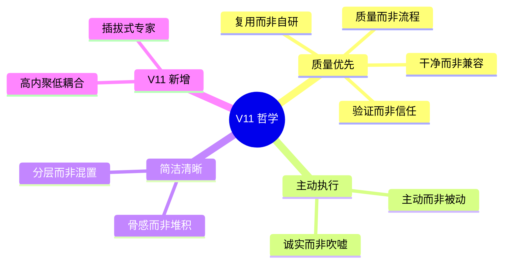

---

## 哲学层次结构

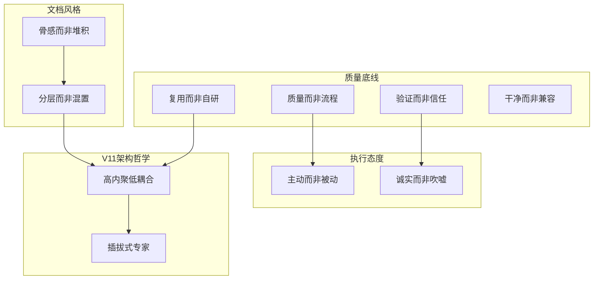

---

## 各哲学详解

### 1. 复用而非自研

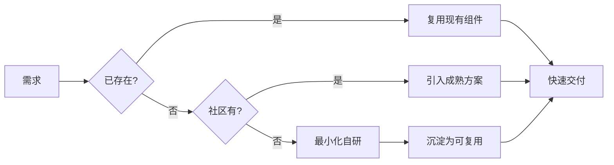

**核心原则**:
- 标准库优先
- 成熟库优先
- 必要时最小化自研
- 自研后沉淀为可复用

---

### 2. 质量而非流程

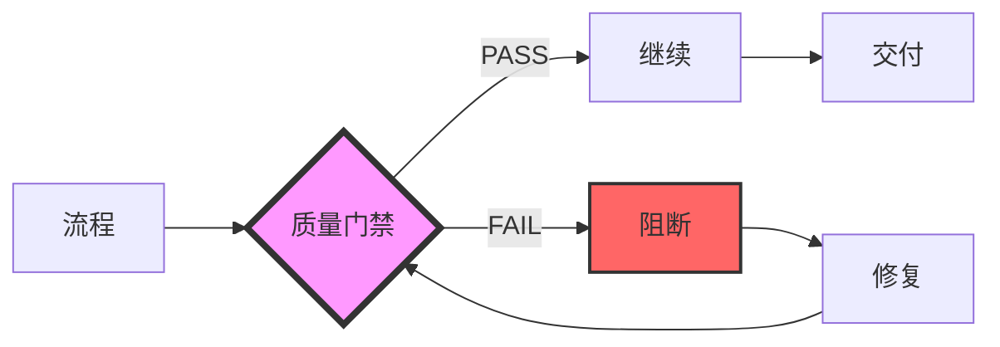

**核心原则**:
- 门禁 PASS 是唯一通行证
- 流程服务于质量
- 跳过门禁 = 流程失效

---

### 3. 验证而非信任

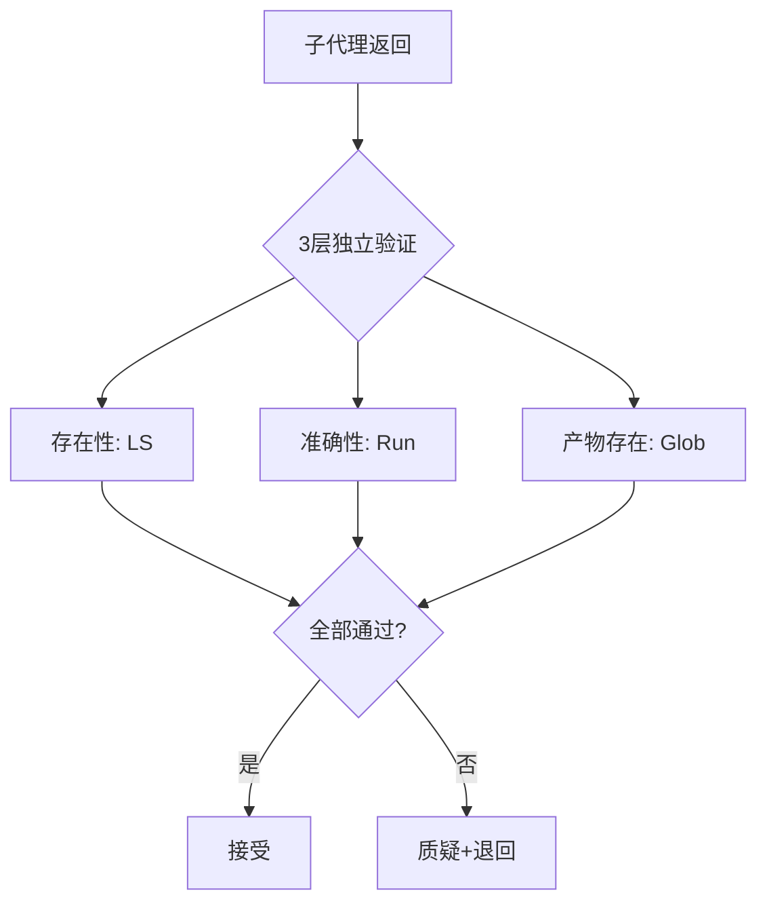

**核心原则**:
- 不盲信自评
- 主上下文亲自验证
- 证据链必须真实

---

### 4. 干净而非兼容

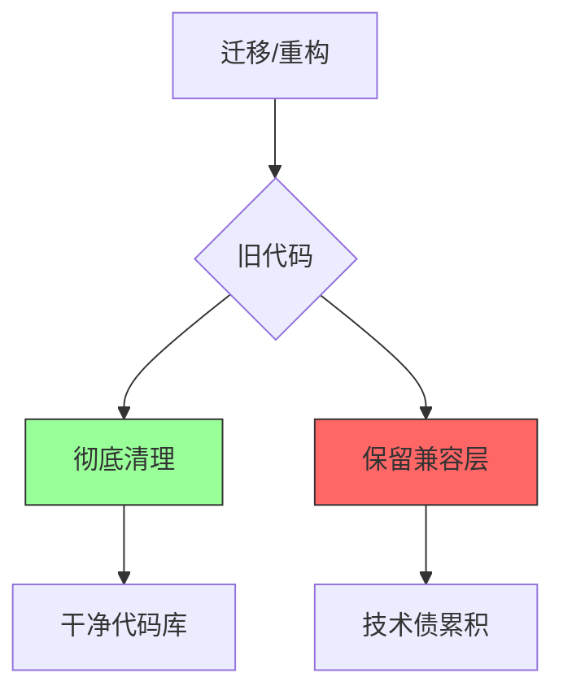

**核心原则**:
- Git 有历史，不留 `.bak`
- 兼容层是临时技术债
- 彻底迁移优于缝补

---

### 5. 主动而非被动

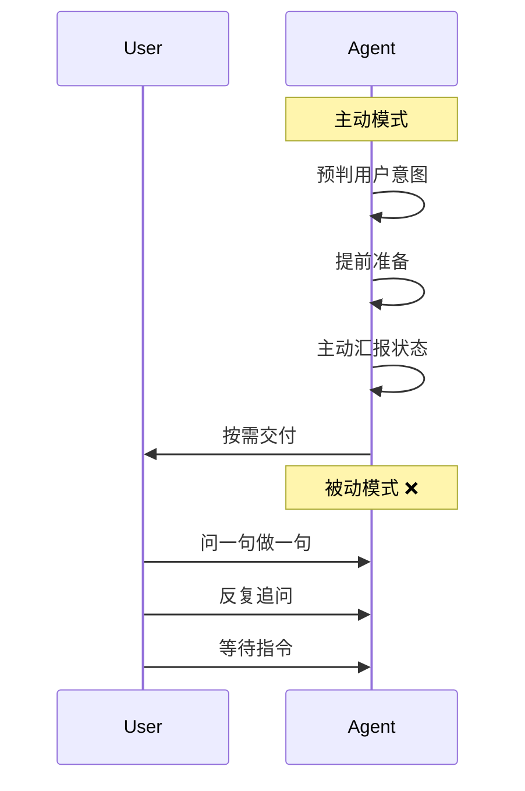

**核心原则**:
- 预判用户需求
- 主动状态汇报
- 减少用户追问

---

### 6. 诚实而非吹嘘

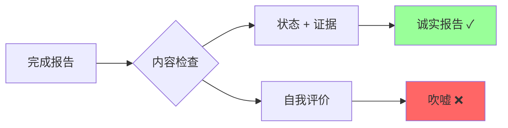

**禁止项**:
- ❌ "我成功完成"
- ❌ "完美实现"
- ❌ "快速交付"

**正确模式**:
- ✅ 状态变化 + 证据
- ✅ 阻塞明确汇报
- ✅ 未完成项诚实声明

---

### 7. 骨感而非堆积

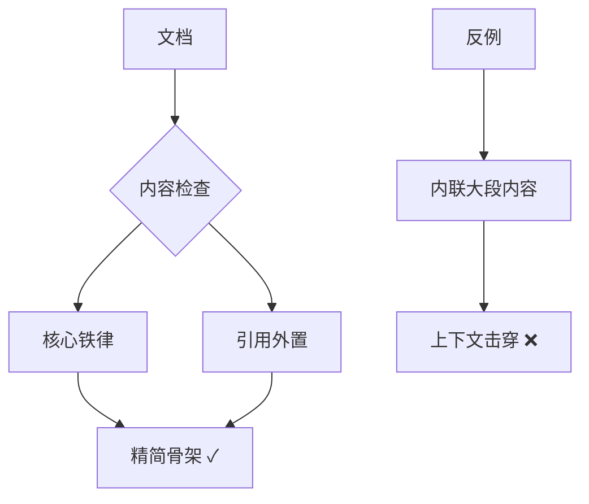

**核心原则**:
- SKILL.md 只放骨架
- 详细内容放 references/
- Agent 文件 ≤150 行

---

### 8. 分层而非混置

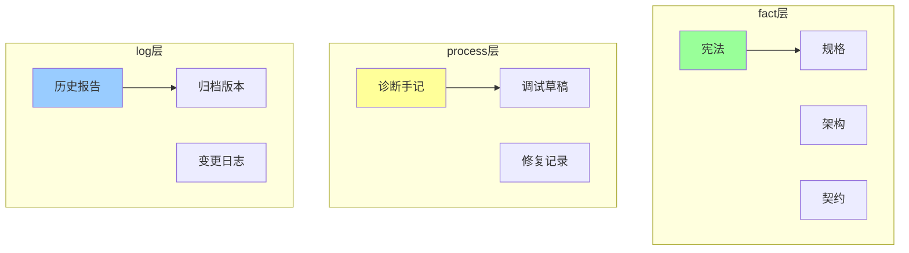

**子代理可读性**:
- fact: ✅ 必读
- process: ❌ 禁读
- log: ⚠️ 可读但不作验收依据

---

### 9. 高内聚低耦合

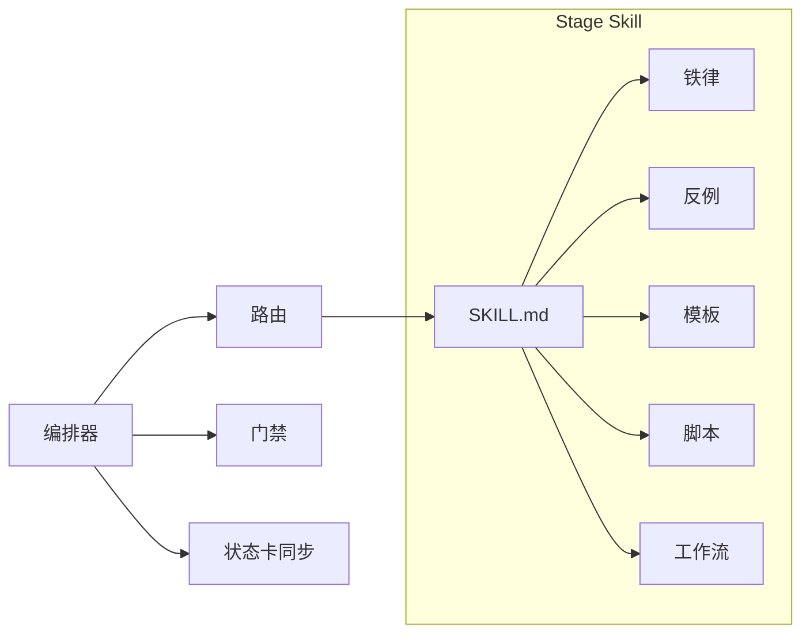

**核心原则**:
- 每个 stage 自包含
- stage skill 可独立升级
- 编排器只做路由+门禁

---

### 10. 插拔式专家

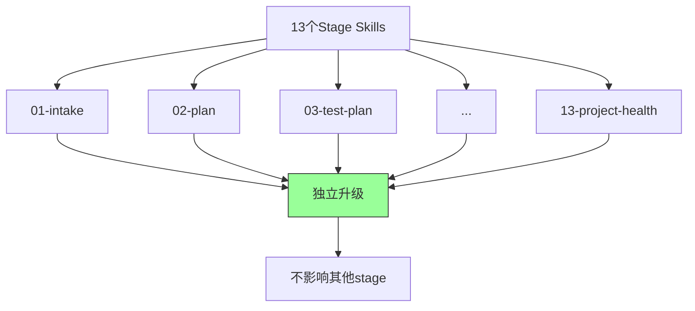

**核心原则**:
- stage skill 像组件一样插拔
- 升级一个不影响其他
- 依赖声明在 frontmatter

---

## 哲学冲突判定

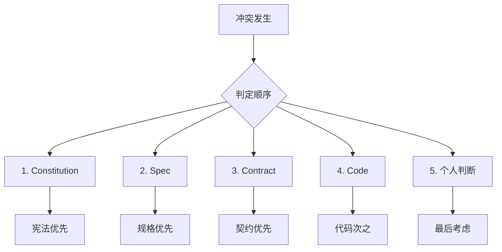

**冲突判定顺序**: Constitution > Spec > Contract > Code > 个人判断

---

## 哲学与宪法映射

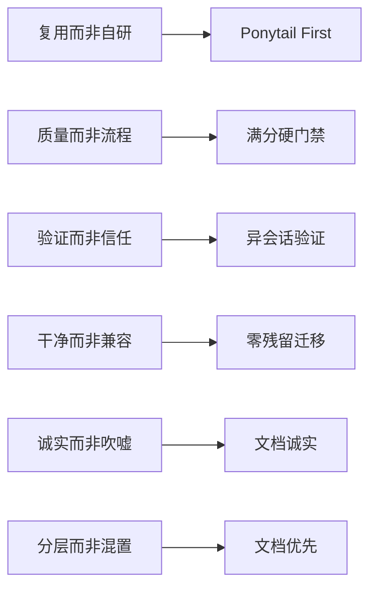

---

## 关联文档

- [宪法详细版](../references/constitution.md)
- [公共铁律](../references/common-iron-rules.md)
- [公共反例](../references/common-anti-patterns.md)