# V11 十三阶段流水线

> 从 Intake 到 Project Health 的完整流水线。

---

## 流水线总览

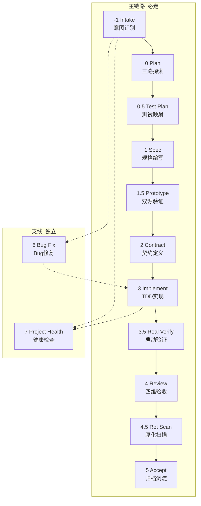

---

## 阶段门禁链

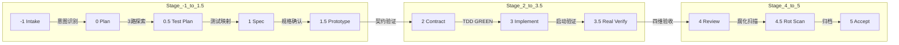

---

## 各阶段详解

### Stage -1: Intake（意图识别）

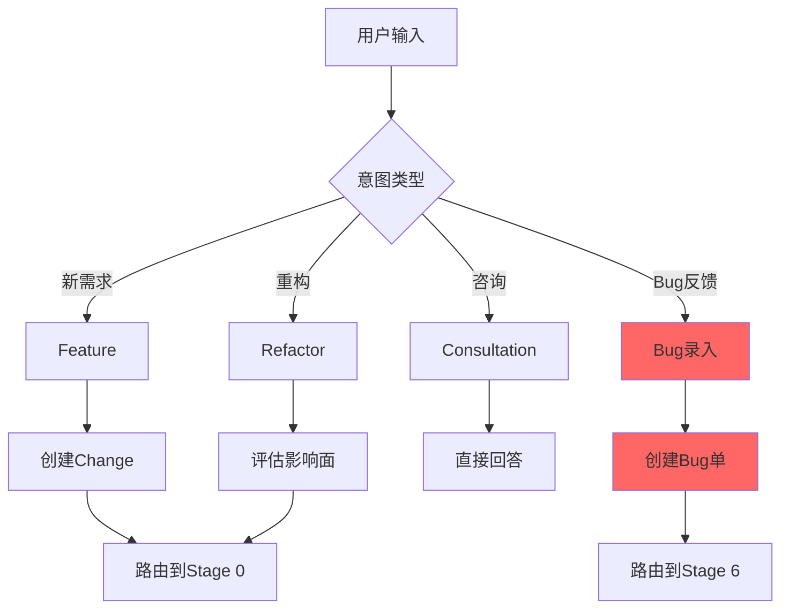

**门禁**:
- 意图识别完成
- 路由决策表输出
- Bug录入判断完成

**产物**:
- 状态卡初始化
- 路由决策表

---

### Stage 0: Plan（规划）

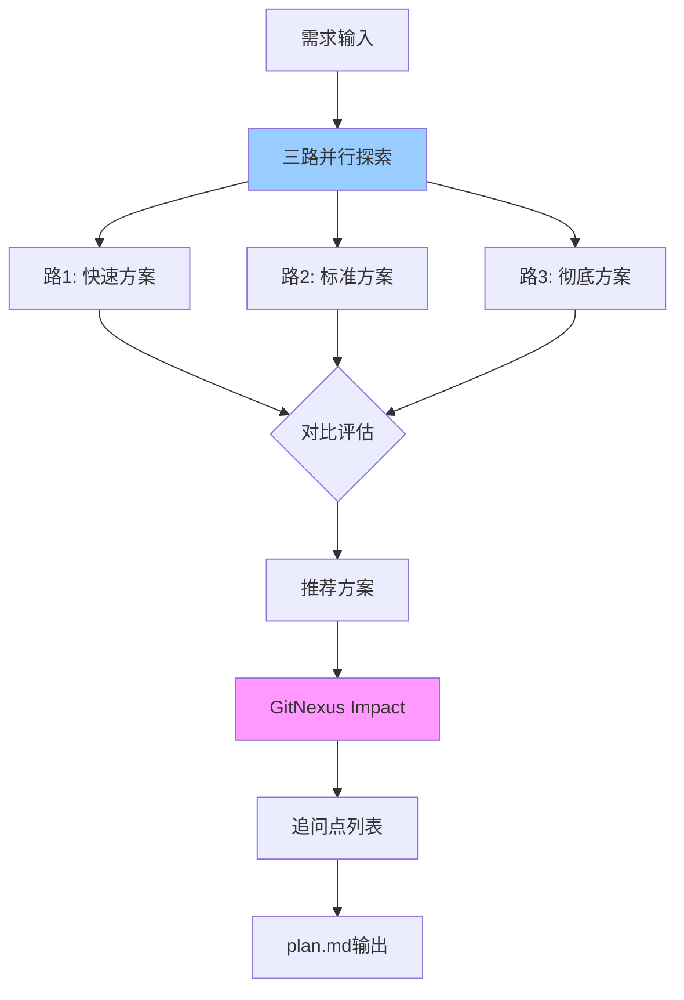

**门禁**:
- 3 路并行探索完成
- GitNexus impact 执行
- 追问点明确

**产物**:
- plan.md
- 影响面评估报告

---

### Stage 0.5: Test Plan（测试规划）

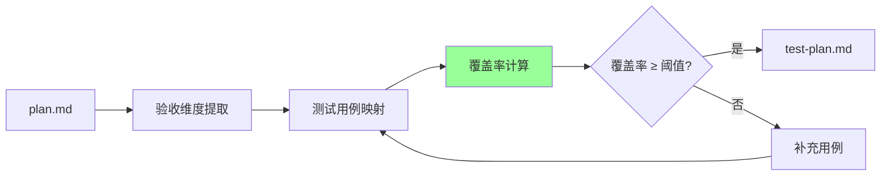

**门禁**:
- 验收维度完整
- 测试用例映射完成
- 覆盖率达标

**产物**:
- test-plan.md

---

### Stage 1: Spec（规格）

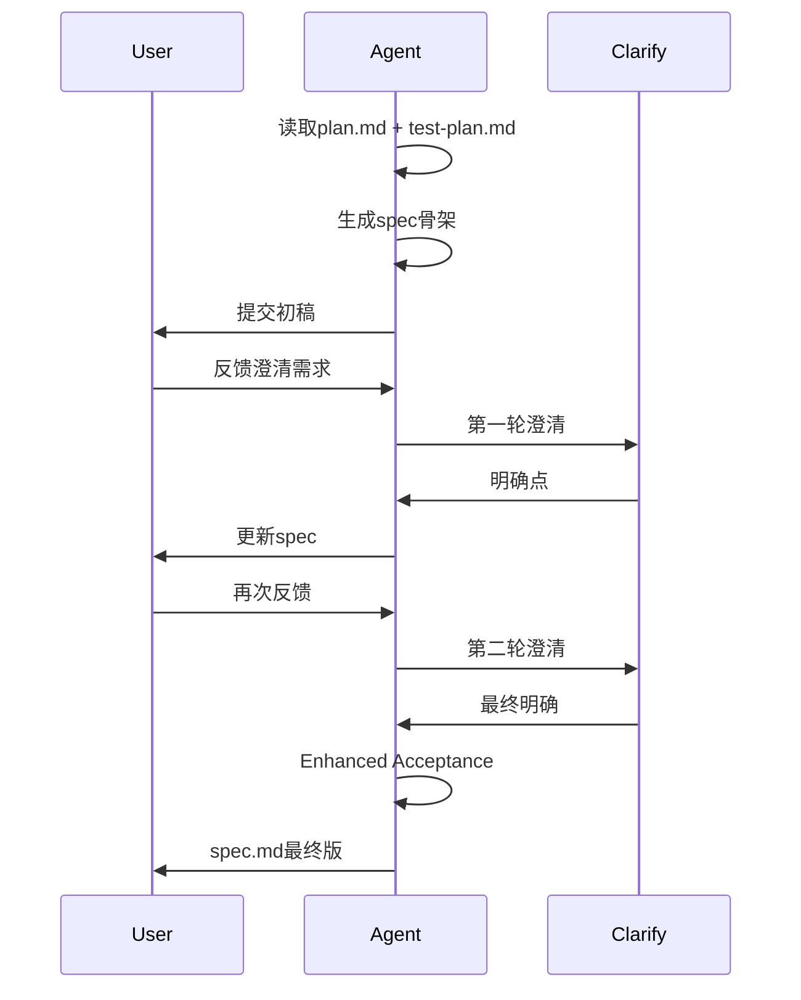

**门禁**:
- Enhanced Acceptance 完成
- INV ≥ 1
- Clarify ≥ 2 轮

**产物**:
- spec.md
- 澄清记录

---

### Stage 1.5: Prototype（原型）

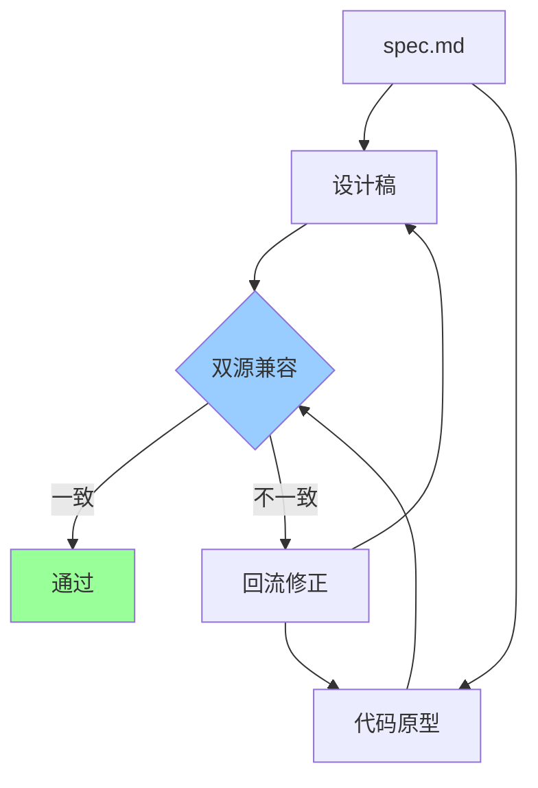

**门禁**:
- 双源兼容校验通过

**产物**:
- 设计稿
- 代码原型

---

### Stage 2: Contract（契约）

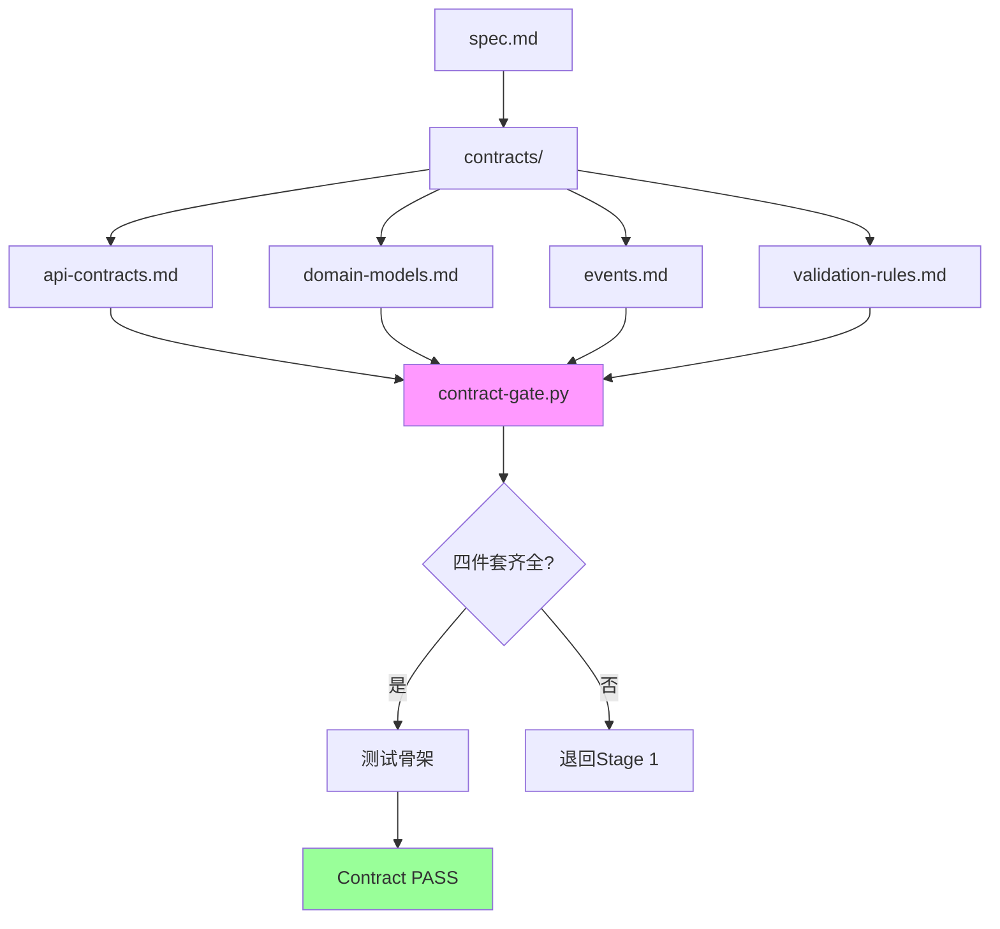

**门禁**:
- contract-gate.py 通过
- 四件套齐全
- 测试骨架存在

**产物**:
- contracts/ 四件套
- tests/contracts/

---

### Stage 3: Implement（实现）

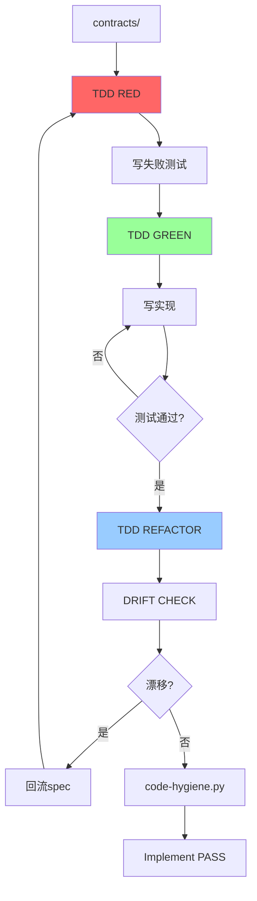

**门禁**:
- TDD GREEN
- DRIFT CHECK
- code-hygiene.py

**产物**:
- 代码
- tests/unit
- docs/modules

---

### Stage 3.5: Real Verify（真实验证）

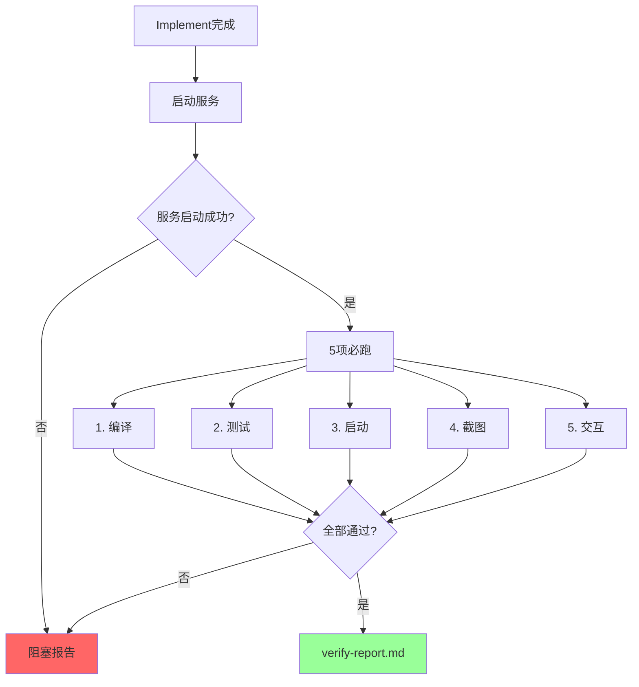

**门禁**:
- 5 项必跑
- 启动可见产物

**产物**:
- verify-report.md
- 截图证据

---

### Stage 4: Review（评审）

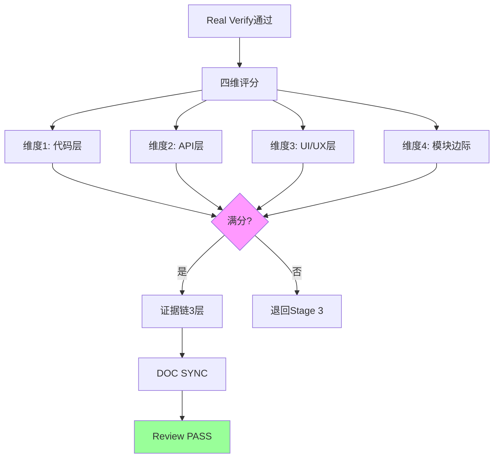

**门禁**:
- 四维满分
- 证据链3层
- DOC SYNC

**产物**:
- review-report.md

---

### Stage 4.5: Rot Scan（腐化扫描）

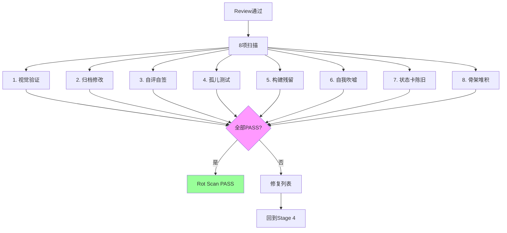

**门禁**:
- proactive-scan 8 项全部 PASS

**产物**:
- rot-scan-{date}.md
- fix-list.json

---

### Stage 5: Accept（归档）

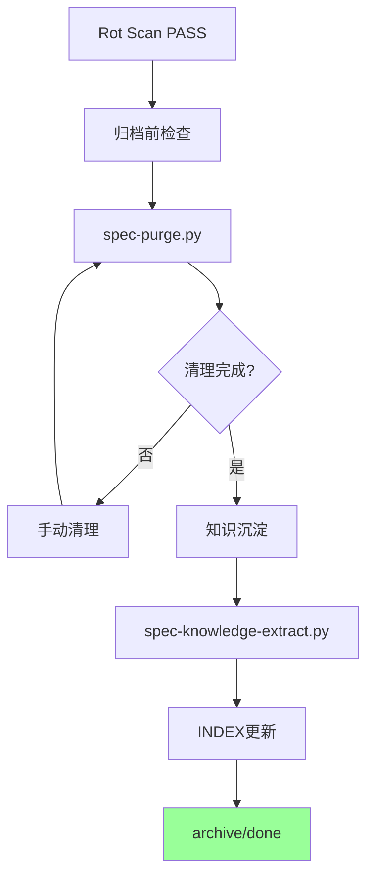

**门禁**:
- 归档不可变
- INDEX 更新

**产物**:
- archive/done/{change}/
- 知识沉淀文档

---

### Stage 6: Bug Fix（Bug修复）

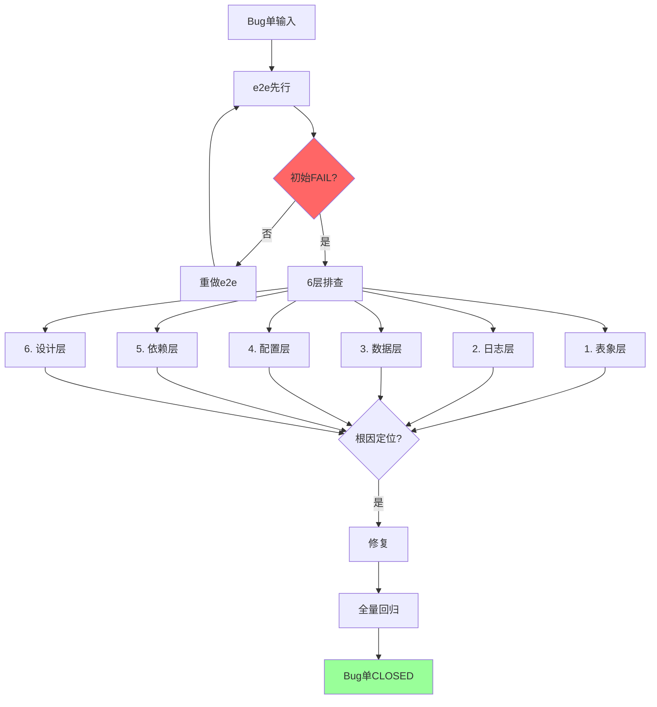

**门禁**:
- e2e 先行（必须初始 FAIL）
- 6 层排查
- 全量回归

**产物**:
- 修复代码
- Bug单 CLOSED

---

### Stage 7: Project Health（项目健康）

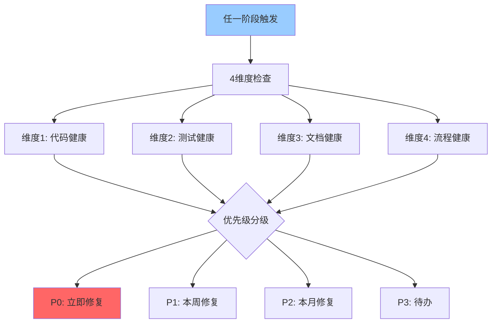

**门禁**:
- 非阻塞，异步

**产物**:
- project-health-{date}.md
- .json

---

## 回退路径

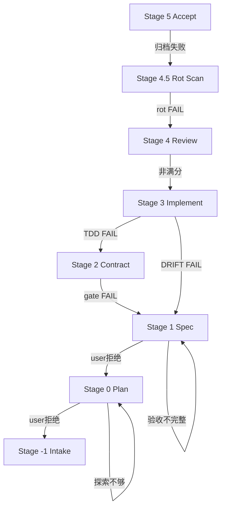

---

## 阶段度量指标

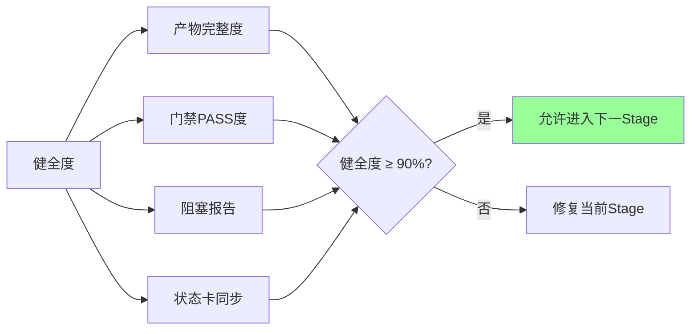

---

## 关联文档

- [阶段交互协议](../references/stage-interaction-protocol.md)
- [状态卡协议](../references/state-card-protocol.md)
- [宪法](../references/constitution.md)