# V11 宪法 — 16 条铁律

> 不可协商的质量底线。冲突判定顺序：Constitution > Spec > Contract > Code > 个人判断。

---

## 宪法总览

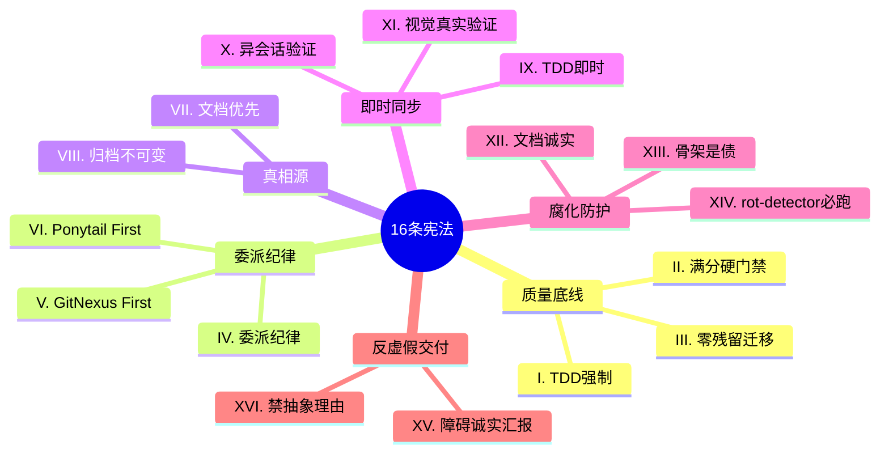

---

## 宪法层次结构

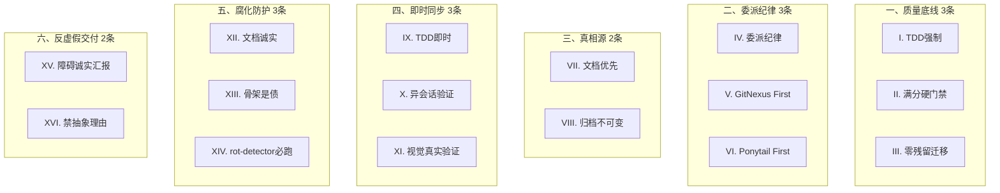

---

## 永不可降级清单

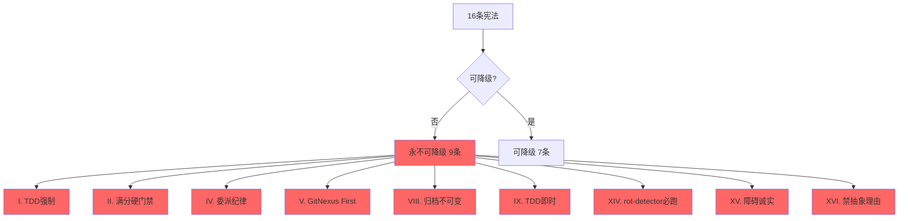

---

## 一、质量底线 3 条

### Article I. TDD 强制

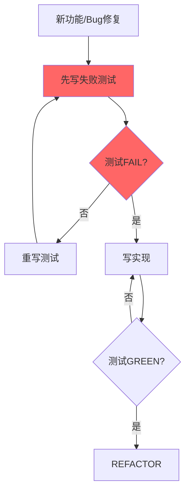

**铁律**: 无失败测试不写实现。

**违反后果**: 🛑 退回 Phase 3 重新跑 RED→GREEN。

---

### Article II. 满分硬门禁

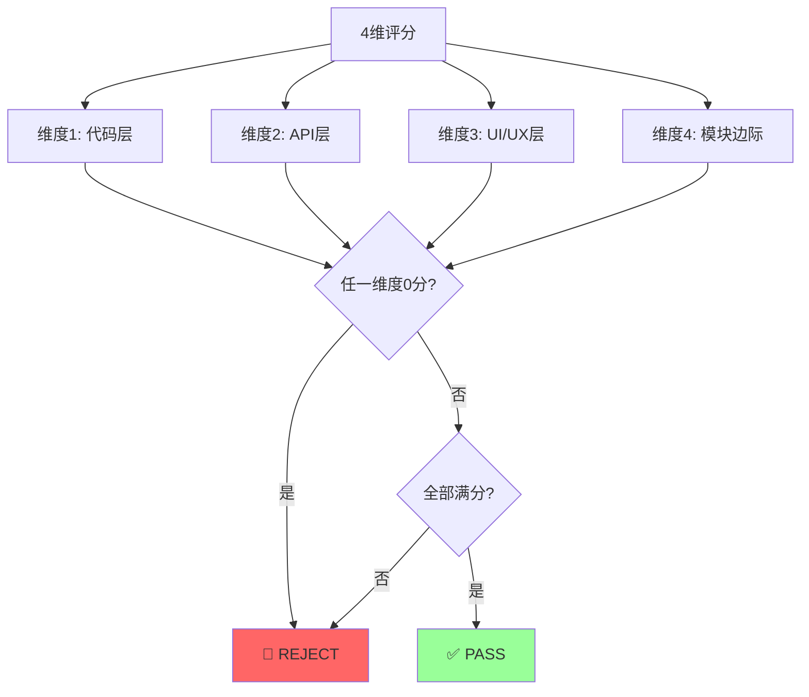

**铁律**: 4 维度验收任一非满分 = 🛑 REJECT。

**评分算法**: 通过维度 / 适用维度 × 5.0

---

### Article III. 零残留迁移

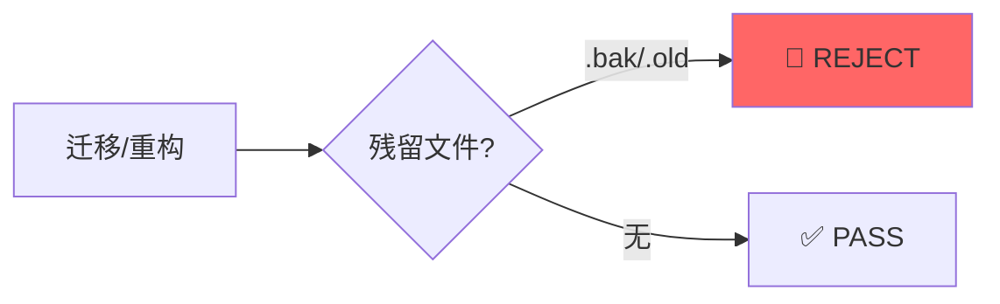

**铁律**: 无 `.bak` / `.old` 后缀文件。

---

## 二、委派纪律 3 条

### Article IV. 委派纪律

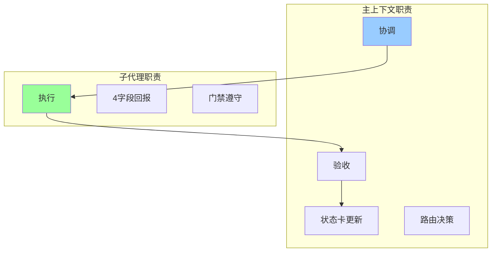

**铁律**: 主上下文不直行代码，只做协调。

**违反后果**: 主上下文 Edit/Write 代码 = 🛑 委派违规。

---

### Article V. GitNexus First

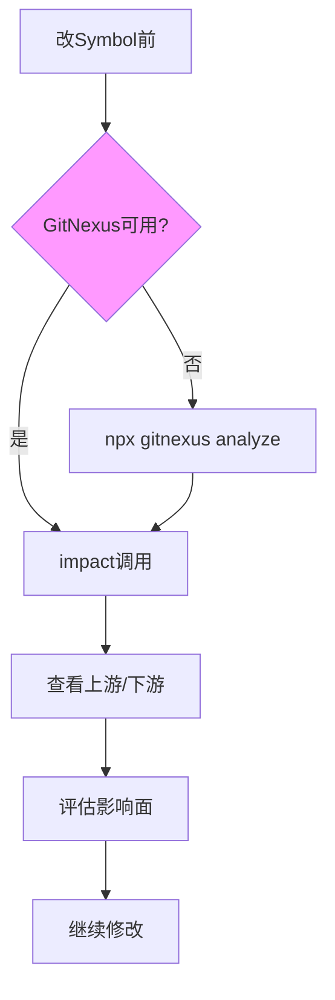

**铁律**: 影响面评估用工具不用 grep。

**违反后果**: GitNexus 可用却用 grep = 🛑 委派违规。

---

### Article VI. Ponytail First

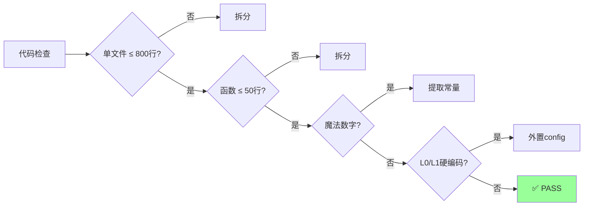

**铁律**: 最简实现优先。

---

## 三、真相源 2 条

### Article VII. 文档与代码冲突以文档为准

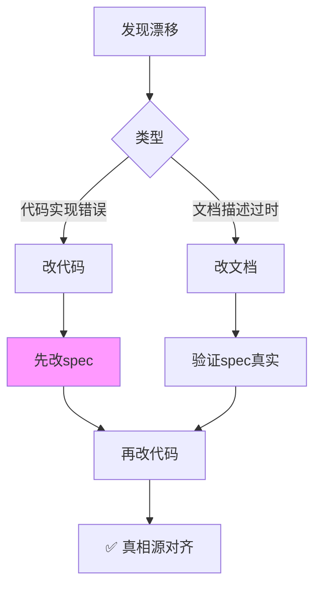

**铁律**: Spec 是真相源，代码为规格服务。

---

### Article VIII. 归档不可变

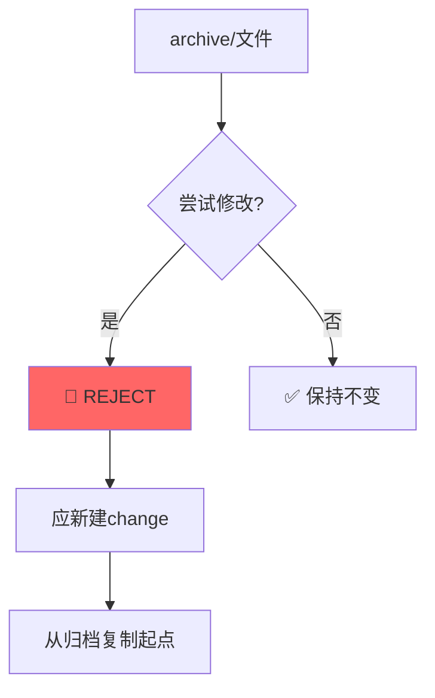

**铁律**: `archive/` 下文件禁止修改。

---

## 四、即时同步 3 条

### Article IX. TDD 即时

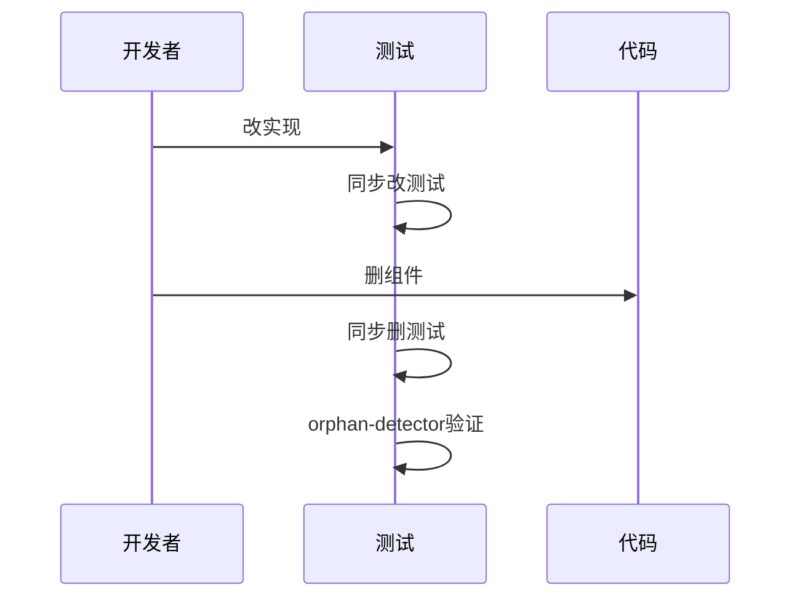

**铁律**: 改实现/删组件 → 立即同步改测试/删测试。

---

### Article X. 异会话验证

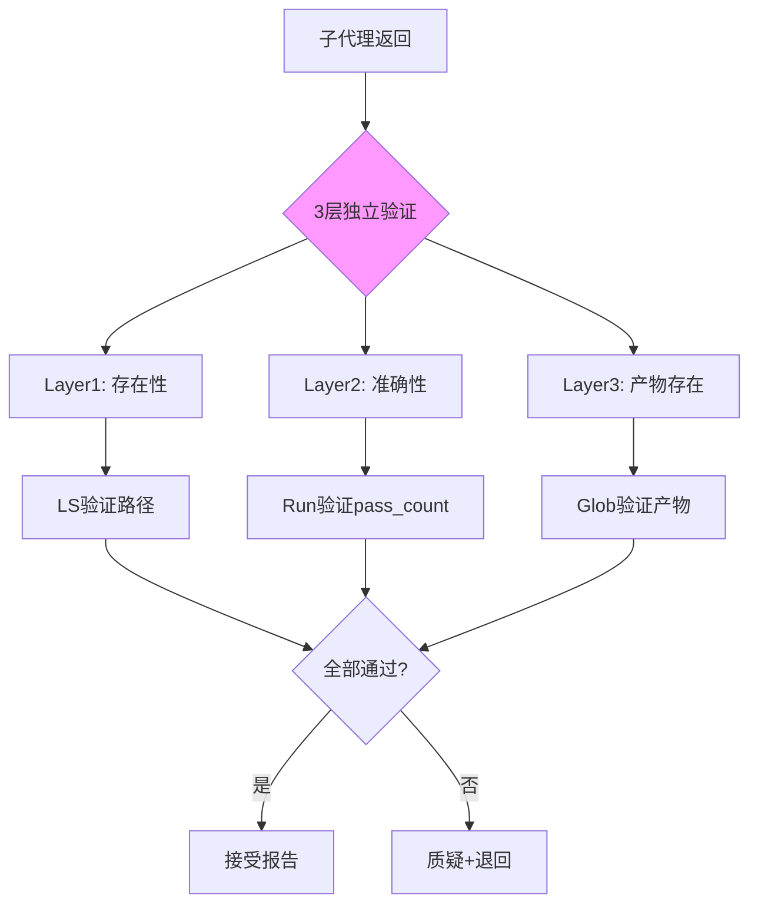

**铁律**: 自评 = self_attested，主上下文必二次抽检。

---

### Article XI. 视觉真实验证

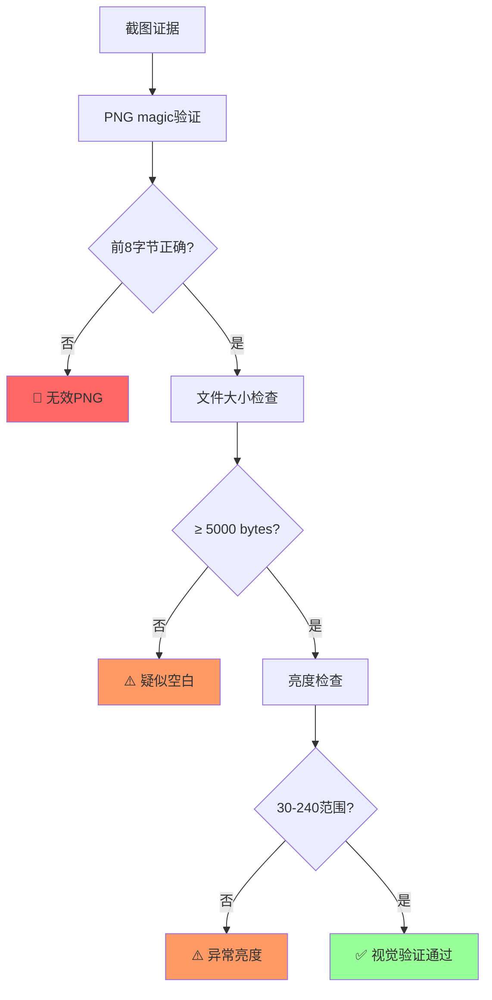

**铁律**: 视觉证据必须 PIL 解码 + 直方图 + 关键区域采样。

---

## 五、腐化防护 3 条

### Article XII. 文档诚实

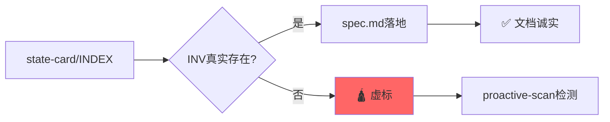

**铁律**: state-card/INDEX 声称的 INV 必在 spec.md 落地。

---

### Article XIII. 骨架是债

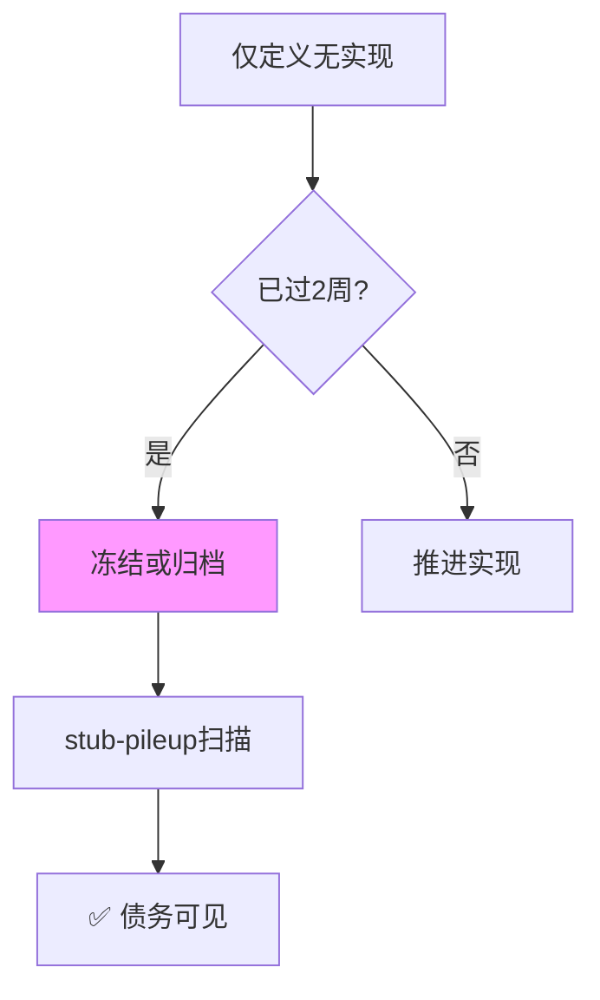

**铁律**: 仅定义无实现 = 隐性技术债。

---

### Article XIV. rot-detector 必跑

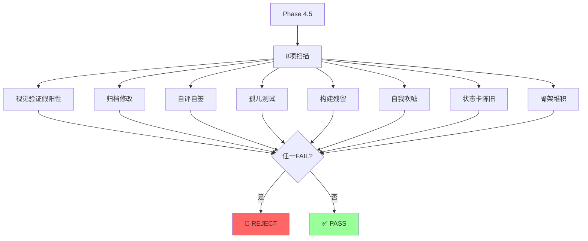

**铁律**: Phase 4.5 Proactive Rot Scan 不可跳过。

---

## 六、反虚假交付 2 条

### Article XV. 障碍诚实汇报

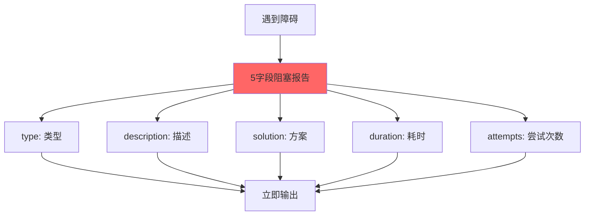

**铁律**: 遇到障碍立即输出 5 字段阻塞报告。

---

### Article XVI. 禁止编造抽象理由

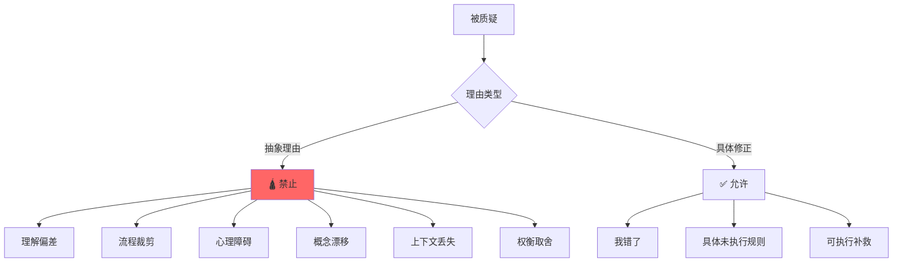

**铁律**: 被质疑禁止用"理解偏差"等不可证伪理由。

---

## 宪法与阶段映射

```mermaid
graph TB
    subgraph Stage_-1
        A1[I, IV, V, XV, XVI]
    end
    
    subgraph Stage_0
        A2[I, IV, V, VI, VII]
    end
    
    subgraph Stage_0.5
        A3[I, II, IX]
    end
    
    subgraph Stage_1
        A4[I, VII, XII]
    end
    
    subgraph Stage_1.5
        A5[I, VII, XI]
    end
    
    subgraph Stage_2
        A6[I, VII, VIII, IX]
    end
    
    subgraph Stage_3
        A7[I, IV, V, VI, VII, IX]
    end
    
    subgraph Stage_3.5
        A8[II, X, XI, XV]
    end
    
    subgraph Stage_4
        A9[I, II, IV, X, XI, XII, XV, XVI]
    end
    
    subgraph Stage_4.5
        A10[XII, XIII, XIV]
    end
    
    subgraph Stage_5
        A11[VIII, XII, XIII]
    end
    
    subgraph Stage_6
        A12[I, V, IX, XV, XVI]
    end
    
    subgraph Stage_7
        A13[I, II, IV, X, XII, XV, XVI]
    end
```

---

## 宪法冲突判定

```mermaid
flowchart TB
    A[冲突发生] --> B{判定顺序}
    
    B --> C[1. Constitution]
    B --> D[2. Spec]
    B --> E[3. Contract]
    B --> F[4. Code]
    B --> G[5. 个人判断]
    
    C --> C1{宪法有规定?}
    C1 -->|是| H[宪法优先]
    C1 -->|否| D
    
    D --> D1{Spec有规定?}
    D1 -->|是| I[Spec优先]
    D1 -->|否| E
    
    E --> E1{Contract有规定?}
    E1 -->|是| J[Contract优先]
    E1 -->|否| F
    
    F --> F1{Code有规定?}
    F1 -->|是| K[Code次之]
    F1 -->|否| G
    
    style C fill:#f66
    style H fill:#f66
```

---

## 关联文档

- [宪法详细版](../references/constitution.md)
- [公共铁律](../references/common-iron-rules.md)
- [公共反例](../references/common-anti-patterns.md)