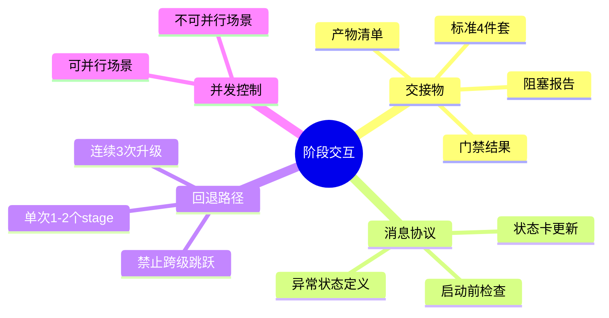
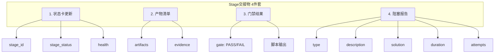
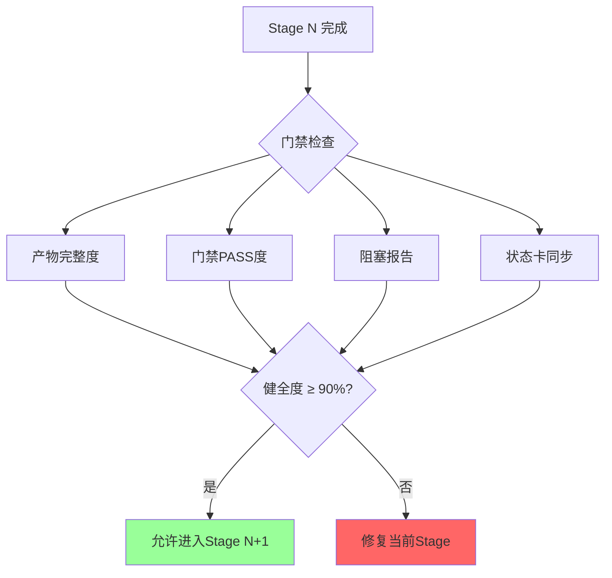
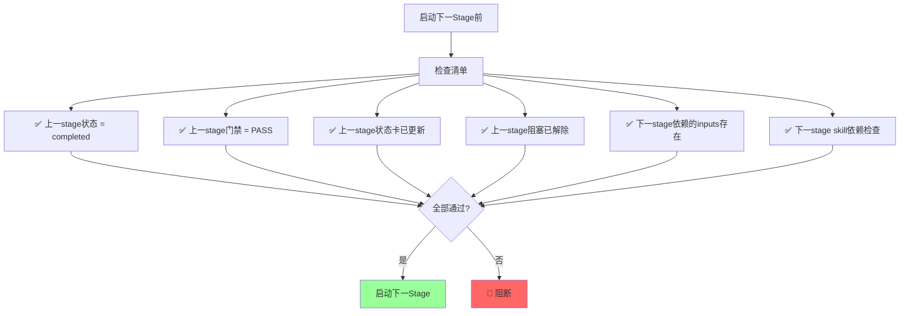
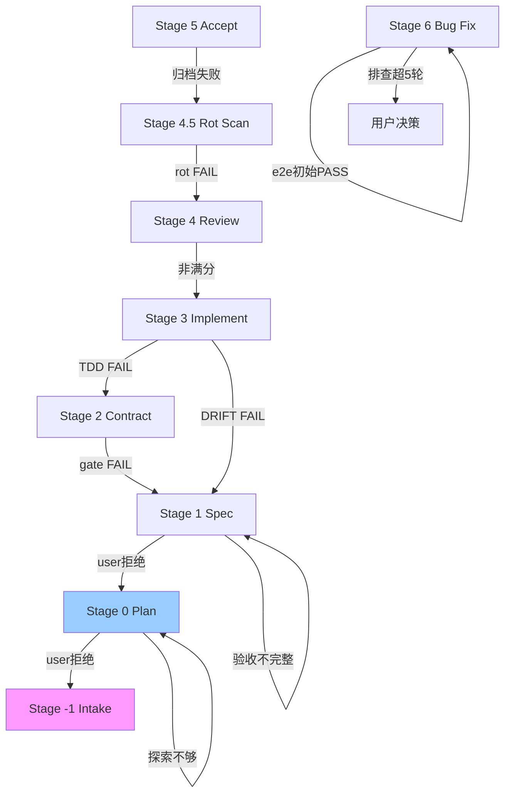
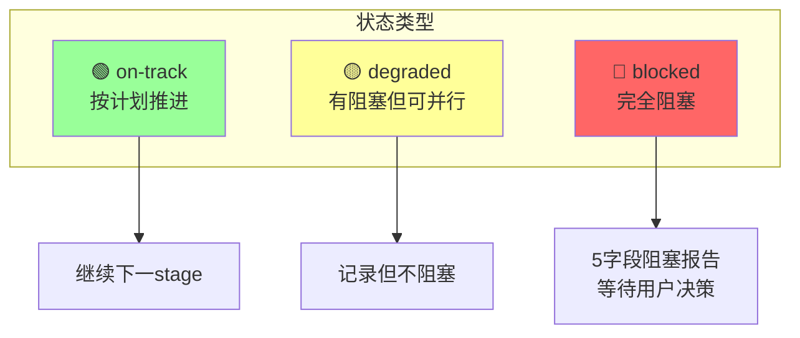
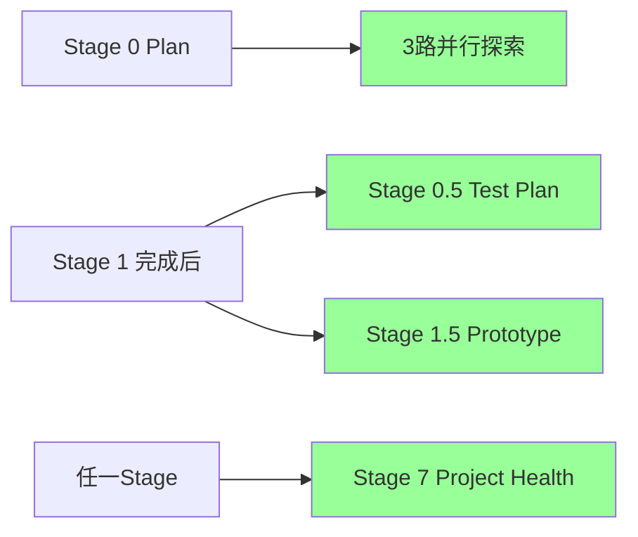
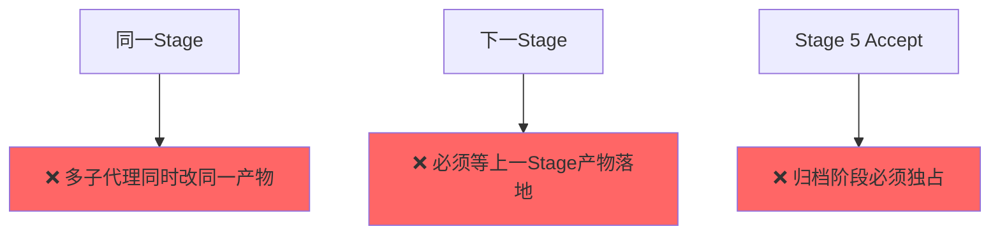
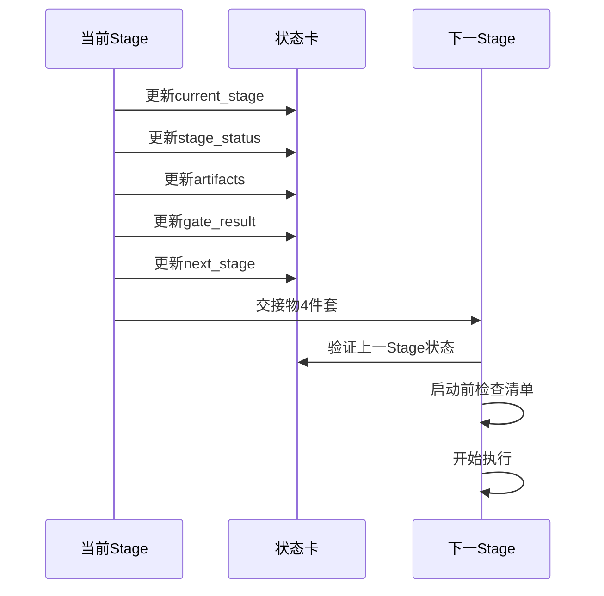
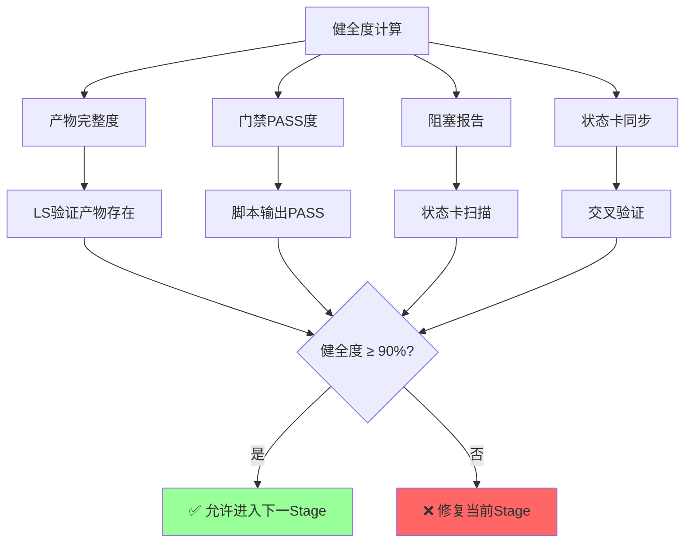

# 阶段交互协议

> Stage 间交接的标准化协议。每个 stage 完成后必须输出统一格式的交接物。

---

## 交互总览



---

## 标准 4 件套



---

## 阶段门禁链



---

## 启动前检查清单



---

## 阶段回退路径



---

## 异常状态定义



---

## 阶段产物层级

```mermaid
graph TB
    subgraph Stage_-1_to_1.5
        A1[Stage -1] --> A2[状态卡 + 路由决策表]
        B1[Stage 0] --> B2[plan.md]
        C1[Stage 0.5] --> C2[test-plan.md]
        D1[Stage 1] --> D2[spec.md]
        E1[Stage 1.5] --> E2[prototypes/]
    end
    
    subgraph Stage_2_to_3.5
        F1[Stage 2] --> F2[contracts/ 四件套]
        G1[Stage 3] --> G2[代码 + tests/unit]
        H1[Stage 3.5] --> H2[verify-report.md]
    end
    
    subgraph Stage_4_to_5
        I1[Stage 4] --> I2[review-report.md]
        J1[Stage 4.5] --> J2[rot-scan-{date}.md]
        K1[Stage 5] --> K2[archive/done/]
    end
    
    subgraph Stage_6_to_7
        L1[Stage 6] --> L2[Bug单CLOSED]
        M1[Stage 7] --> M2[project-health-{date}.md]
    end
```

---

## 阶段并发控制

### 可并行场景



### 不可并行场景



---

## 状态卡更新协议



---

## 交接物 YAML 模板

```yaml
hand_over:
  stage_id: {stage编号}
  stage_skill: {stage skill name}
  status: {completed | blocked | skipped}
  health: {🟢 on-track | 🟡 degraded | 🔴 blocked}
  duration: {开始时间 → 结束时间}
  artifacts:
    - path: {产物路径}
      type: {file | dir | report | state-update}
      evidence: {验证方式}
  gate_result:
    status: {PASS | FAIL | N/A}
    gate: {门禁脚本名}
    output: {门禁脚本输出}
  blocker: {无 | 5字段阻塞报告}
  next_stage:
    stage_id: {下一stage编号}
    skill_name: {下一stage skill name}
    expected_inputs: {下一stage需要的输入物清单}
    prerequisites: {启动前必含条件}
```

---

## 阶段健全度指标



---

## 关联文档

- [阶段交互协议详细版](../references/stage-interaction-protocol.md)
- [状态卡协议](../references/state-card-protocol.md)
- [公共铁律](../references/common-iron-rules.md)