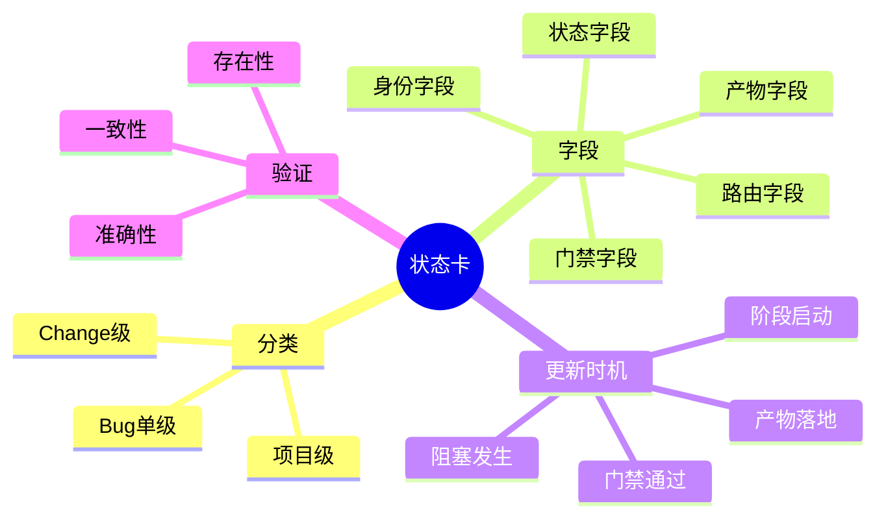
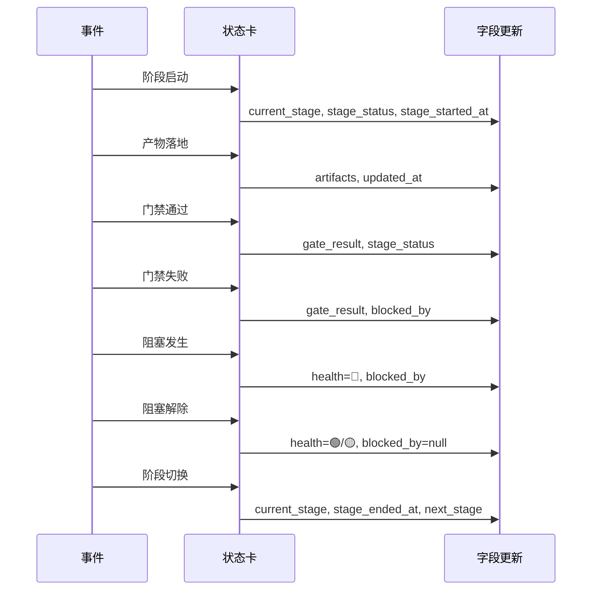
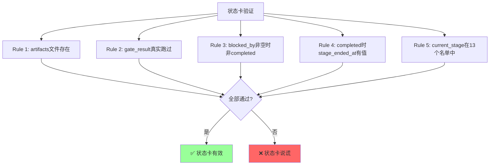
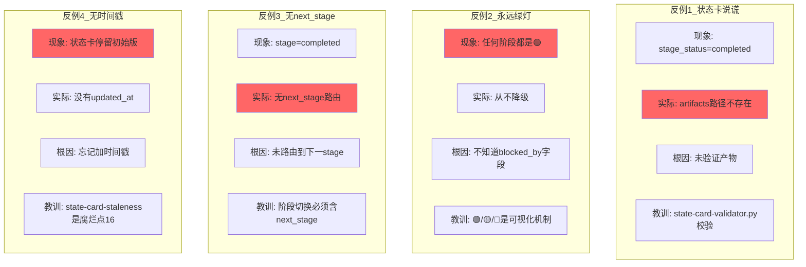
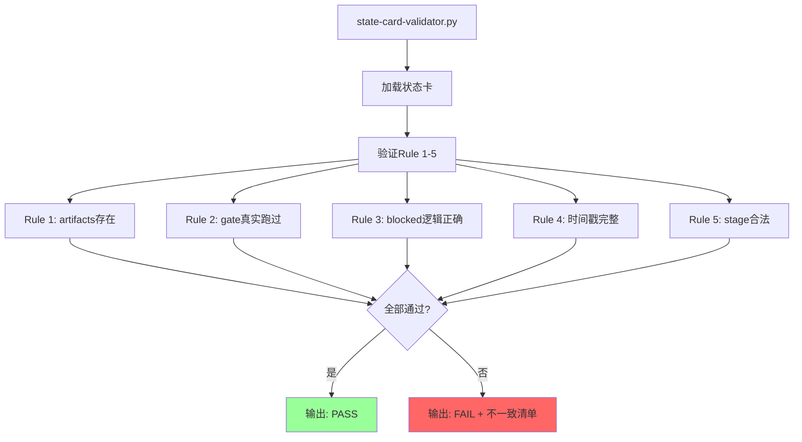
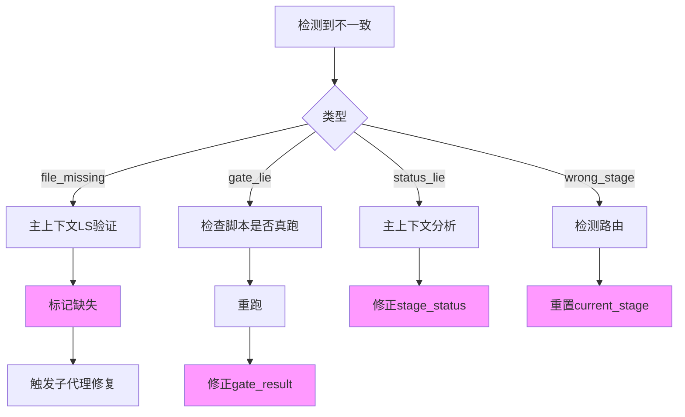

# 状态卡协议

> 13 个 stage 的状态卡统一协议。状态卡是任务真相源之一，不允许说谎（Article XII）。

---

## 状态卡总览



---

## 状态卡分类

```mermaid
graph TB
    subgraph 项目级状态卡
        A[位置: .trae/state-card.md]
        B[作用: 项目整体状态]
        C[生命周期: 项目存在期间]
    end
    
    subgraph Change级状态卡
        D[位置: docs/specs/changes/{id}/.state-card.md]
        E[作用: 单个change状态]
        F[生命周期: change启动→归档]
    end
    
    subgraph Bug单状态卡
        G[位置: docs/bugs/{id}/.state-card.md]
        H[作用: Bug修复进度]
        I[生命周期: 反馈→关闭]
    end
    
    style A fill:#9cf
    style D fill:#9f9
    style G fill:#f9f
```

---

## 必含字段定义

```mermaid
graph TB
    subgraph 身份字段
        A[card_type: project | change | bug]
        B[card_id: 项目名 | change-id | bug-id]
        C[version: 语义版本号]
    end
    
    subgraph 状态字段
        D[current_stage: stage_id]
        E[stage_status: pending | working | completed | blocked | skipped]
        F[stage_started_at: ISO 8601]
        G[stage_ended_at: ISO 8601 | null]
    end
    
    subgraph 元数据字段
        H[updated_at: ISO 8601]
        I[updated_by: 主上下文 | sub-agent]
        J[health: 🟢 | 🟡 | 🔴]
    end
    
    subgraph 产物字段
        K[artifacts: 产物清单]
        L[path: 产物路径]
        M[type: file | dir | report]
        N[exists: true | false]
        O[evidence: 验证方式]
    end
    
    subgraph 门禁字段
        P[gate_result: 门禁结果]
        Q[status: PASS | FAIL | N/A | PENDING]
        R[gate: 门禁脚本名]
        S[output: 脚本输出]
        T[verified_at: ISO 8601]
    end
    
    subgraph 路由字段
        U[next_stage: 下一stage]
        V[id: stage_id]
        W[skill_name: skill名称]
        X[expected_inputs: 输入清单]
        Y[prerequisites: 前置条件]
    end
    
    subgraph 阻塞字段
        Z[blocked_by: 5字段阻塞报告 | null]
    end
```

---

## 状态卡更新时机



---

## 交叉验证规则



---

## 状态卡模板

### 项目级模板

```yaml
---
card_type: project
card_id: my-project
version: "1.0.0"
current_stage: 0/plan
stage_status: working
stage_started_at: 2026-08-11T13:00:00
stage_ended_at: null
updated_at: 2026-08-11T13:30:00
updated_by: 主上下文
health: 🟢 on-track
artifacts:
  - path: docs/specs/changes/2026-08-11-add-user-auth/
    type: dir
    exists: true
    evidence: "ls 验证"
gate_result:
  status: PENDING
  gate: stage-gate.py
  output: null
  verified_at: null
next_stage:
  id: 0.5/test-plan
  skill_name: skills/02-test-plan/SKILL.md
  expected_inputs: [plan.md]
  prerequisites: [plan.md 存在]
blocked_by: null
actor: 主上下文
duration_minutes: 30
---
```

### Change 级模板

```yaml
---
card_type: change
card_id: 2026-08-11-add-user-auth
version: "1.0.0"
current_stage: 3/implement
stage_status: working
stage_started_at: 2026-08-11T14:00:00
stage_ended_at: null
updated_at: 2026-08-11T15:30:00
updated_by: implementer
health: 🟢 on-track
artifacts:
  - path: docs/specs/changes/2026-08-11-add-user-auth/plan.md
    type: file
    exists: true
    evidence: "docs/specs/changes/2026-08-11-add-user-auth/plan.md:1-120"
  - path: docs/specs/changes/2026-08-11-add-user-auth/spec.md
    type: file
    exists: true
    evidence: "docs/specs/changes/2026-08-11-add-user-auth/spec.md:1-200"
gate_result:
  status: PASS
  gate: contract-gate.py
  output: "contract-gate.py: 4件套齐全 + 测试骨架 PASS"
  verified_at: 2026-08-11T14:55:00
next_stage:
  id: 3.5/real-verify
  skill_name: skills/04-real-verify/SKILL.md
  expected_inputs: [代码 + tests/ + docs/modules/]
  prerequisites: [TDD GREEN, DRIFT CHECK ✅]
blocked_by: null
parent_change: null
related_changes: []
risk_level: MEDIUM
priority: P1
notes: 后端API + 前端 + DB schema协同改动
---
```

---

## 状态卡反例



---

## 验证脚本



---

## 不一致处理



---

## 关联文档

- [状态卡协议详细版](../references/state-card-protocol.md)
- [阶段交互协议](../references/stage-interaction-protocol.md)
- [宪法 Article XII](../references/constitution.md)