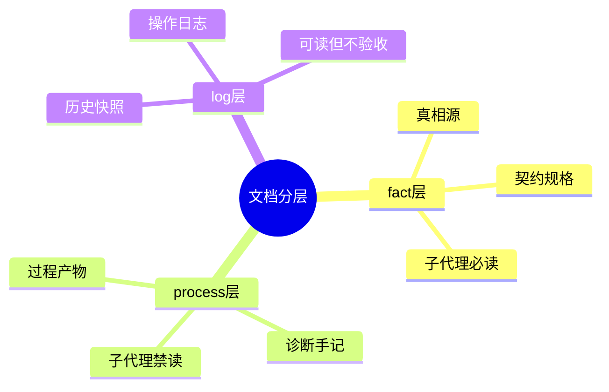
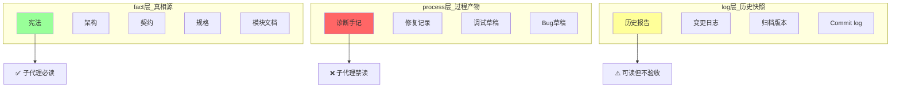
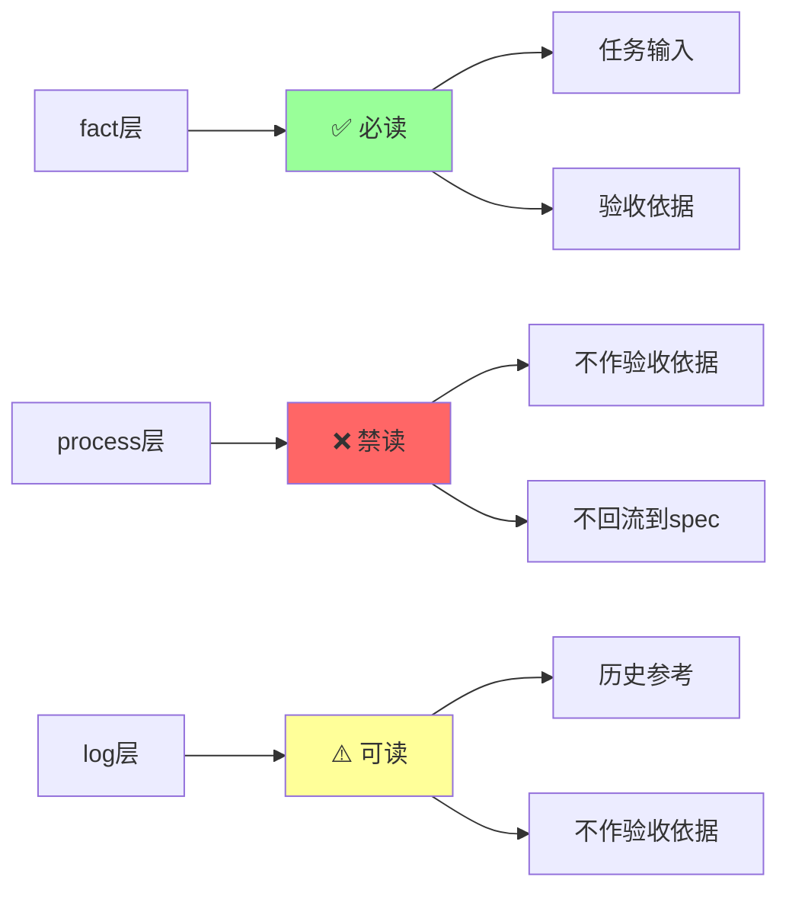
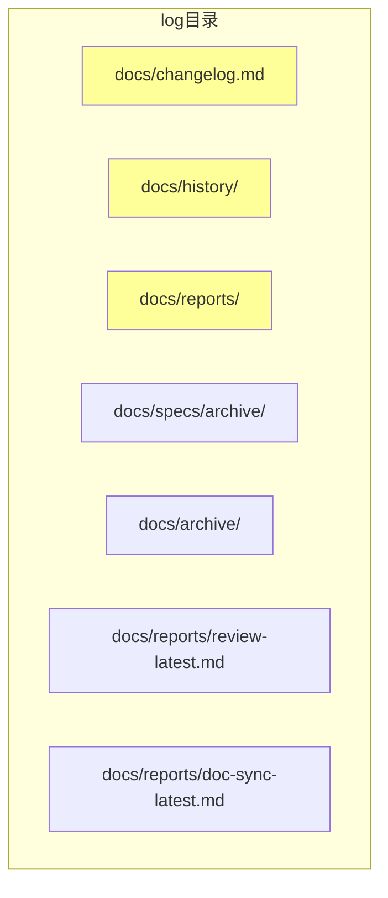
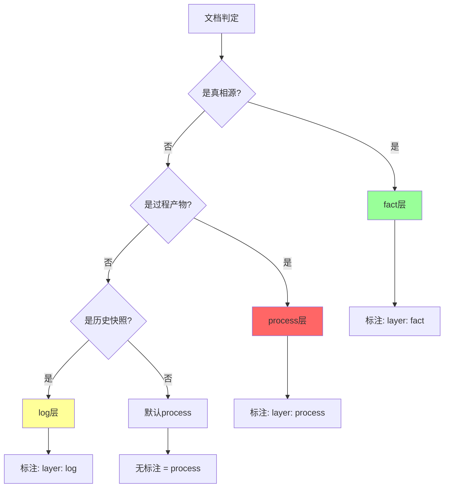
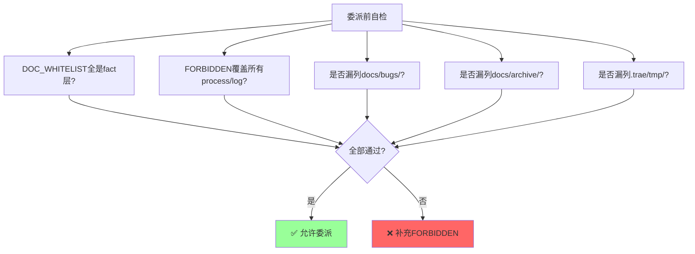
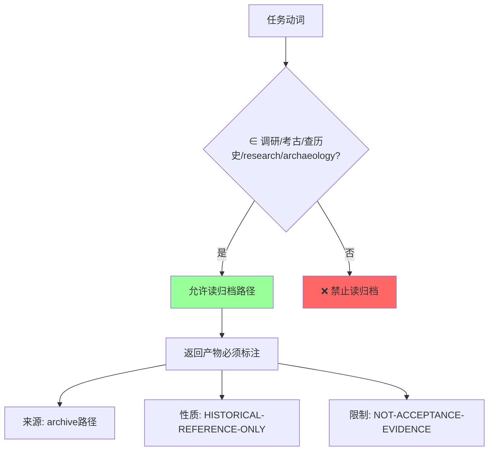
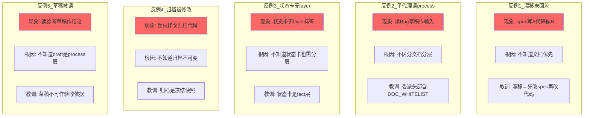
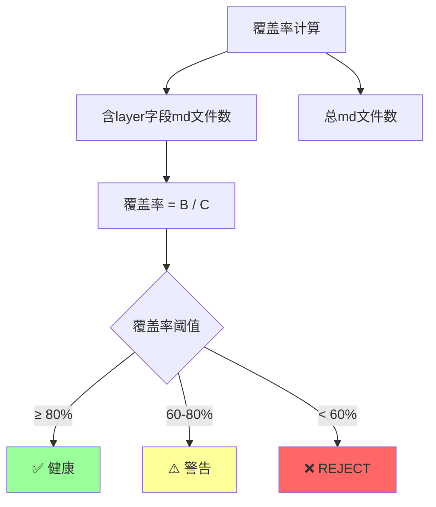

# 文档分层（fact / process / log）

> 三层文档标注协议。解决"子代理误读过程文档作为任务输入"的问题。

---

## 分层总览



---

## 三层定义



---

## 子代理可读性



---

## 目录 layer 映射表

### fact 目录

```mermaid
graph TB
    subgraph fact目录
        A[docs/constitution.md]
        B[docs/ARCHITECTURE.md]
        C[docs/INDEX.md]
        D[docs/api-endpoints/]
        E[docs/domain-models/]
        F[docs/events/]
        G[docs/contracts/]
        H[docs/modules/]
        I[AGENTS.md]
        J[docs/specs/changes/{id}/spec.md]
        K[docs/specs/changes/{id}/contracts/*.md]
        L[docs/bugs/{id}.md]
        M[.trae/rules/]
    end
    
    style A fill:#9f9
    style B fill:#9f9
    style C fill:#9f9
```

### process 目录

```mermaid
graph TB
    subgraph process目录
        A[docs/bugs/{id}-draft.md]
        B[docs/bugs/{id}/reproduction.md]
        C[docs/bugs/{id}/root-cause.md]
        D[.trae/tmp/]
        E[.trae/logs/agent-detail/]
        F[diagnose.md]
        G[fix_result.md]
        H[analysis.md]
        I[_invalidated/]
    end
    
    style A fill:#f66
    style B fill:#f66
    style C fill:#f66
```

### log 目录



---

## 判定规则



---

## 子代理 DOC_WHITELIST 协议

### 委派头部模板

```yaml
[DOC_WHITELIST]
  # 必读路径（fact层）
  - docs/constitution.md
  - docs/ARCHITECTURE.md
  - docs/INDEX.md
  - docs/specs/changes/{change-id}/spec.md
  - docs/specs/changes/{change-id}/contracts/api-contracts.md

[FORBIDDEN]
  # 禁读路径（process / log层）
  - docs/bugs/{bug-id}-draft.md
  - .trae/tmp/*.md
  - docs/reports/archive/**
  - docs/archive/**
```

### 委派前检查



---

## 归档路径防护

```mermaid
graph TB
    subgraph 归档黑名单
        A[docs/archive/out/stub-pileup/**]
        B[docs/archive/out/spec-purge/**]
        C[docs/archive/bak_v8doc/**]
        D[docs/reports/review-latest.md]
        E[docs/reports/doc-sync-latest.md]
        F[docs/bugs/{id}-draft.md]
        G[.trae/tmp/*.md]
        H[.trae/logs/agent-detail/**]
    end
    
    A --> I[❌ 默认FORBIDDEN]
    B --> I
    C --> I
    D --> I
    E --> I
    F --> I
    G --> I
    H --> I
    
    style I fill:#f66
```

---

## archaeology-mode 例外



---

## 文档分层反例



---

## Layer 标签覆盖率



---

## 关联文档

- [文档分层详细版](../references/document-layer.md)
- [宪法 Article VII](../references/constitution.md)
- [公共铁律](../references/common-iron-rules.md)