# Hook 生命周期

> 每个 stage 的关键动作有前后验证。Hook 失败 = 阻断，不得跳过。

---

## Hook 总览

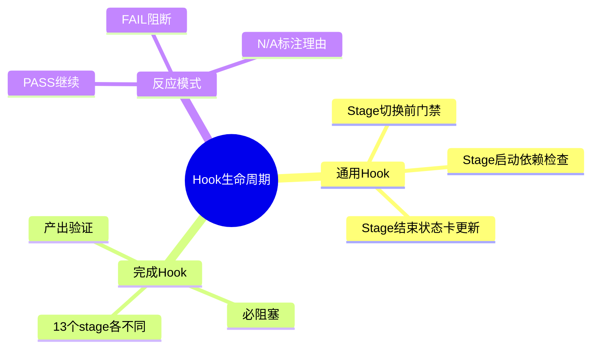

---

## 通用 Hook

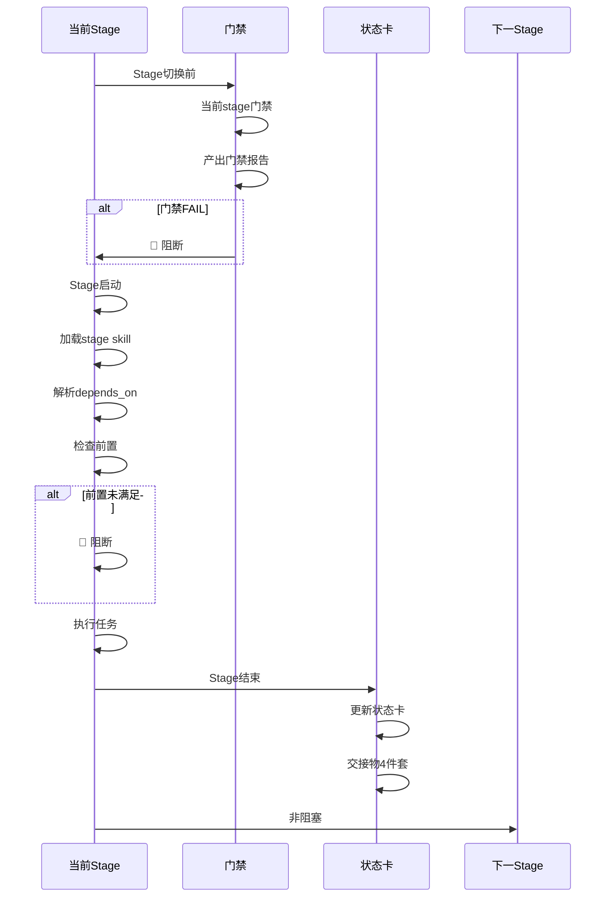

---

## 各 Stage 完成 Hook

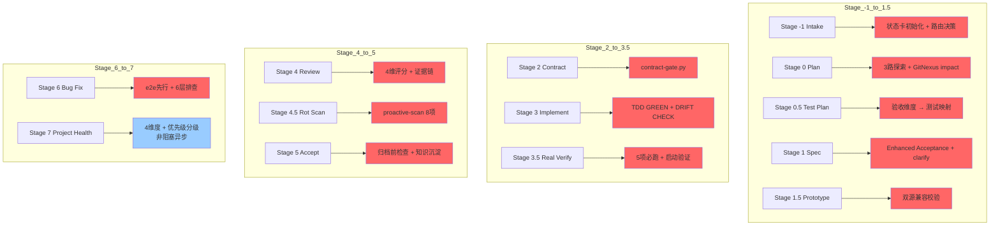

---

## Hook 反应模式

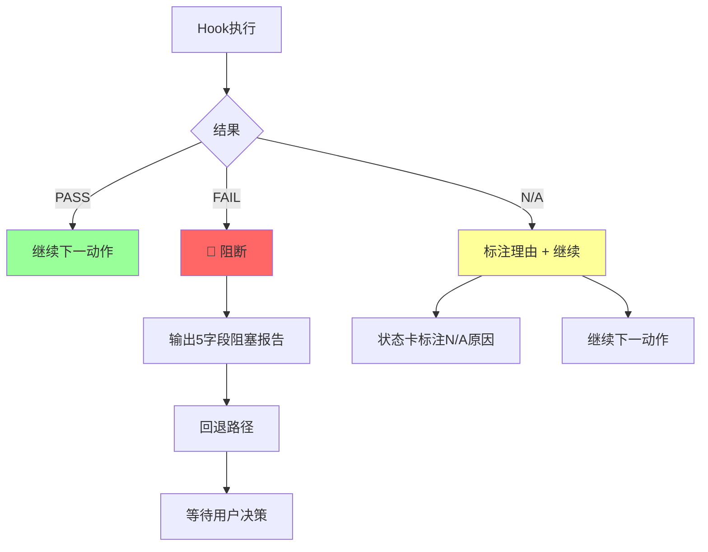

---

## Stage -1 Intake Hook

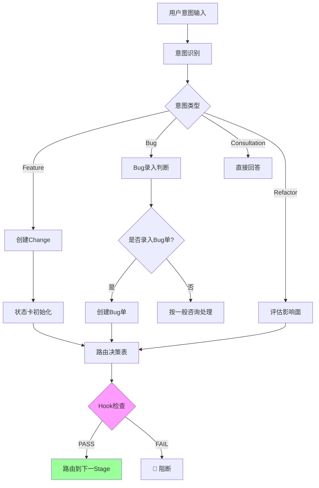

---

## Stage 0 Plan Hook

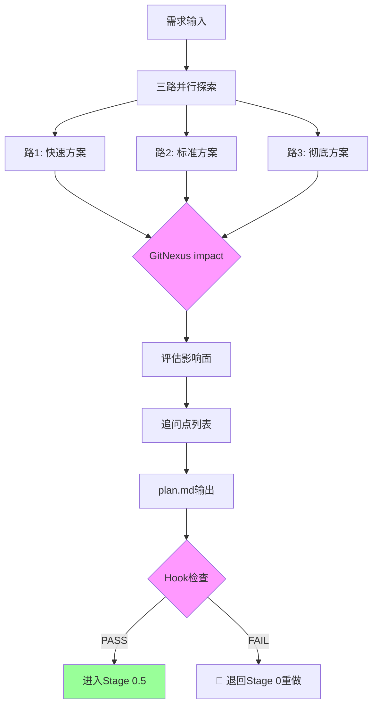

---

## Stage 3 Implement Hook

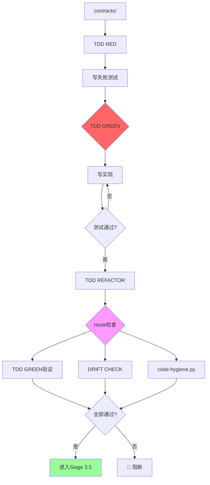

---

## Stage 3.5 Real Verify Hook

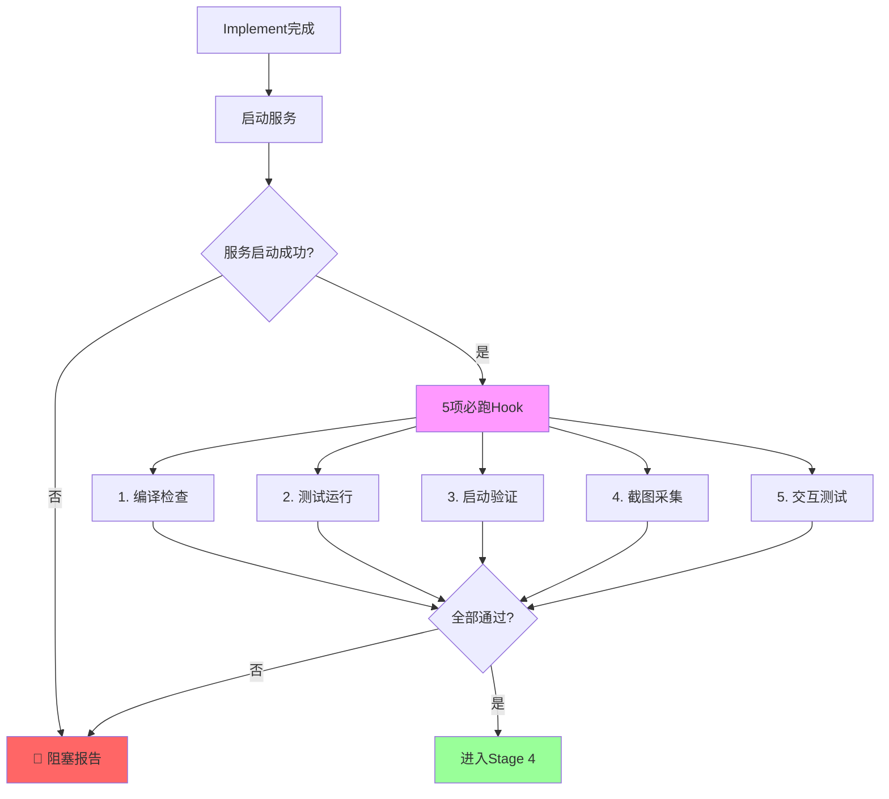

---

## Stage 4 Review Hook

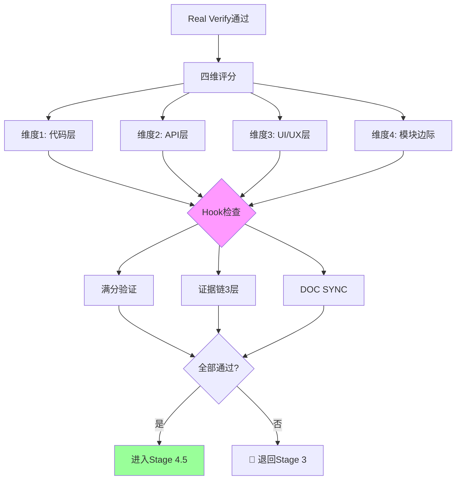

---

## Stage 4.5 Rot Scan Hook

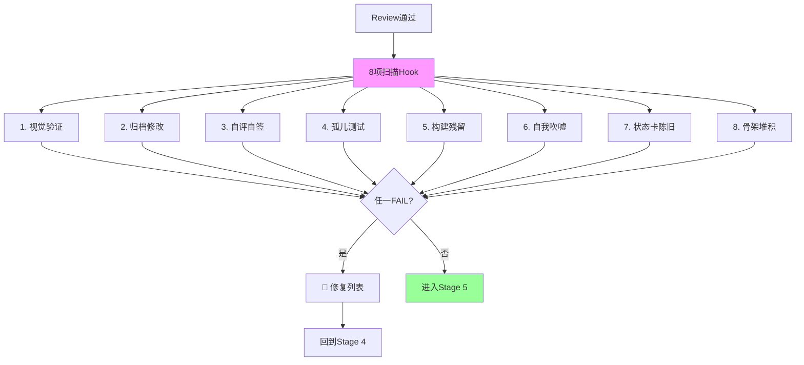

---

## Stage 6 Bug Fix Hook

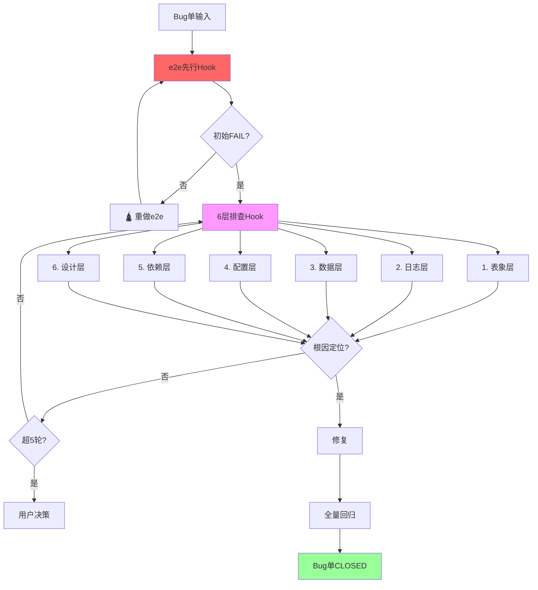

---

## 关联文档

- [阶段交互协议](../references/stage-interaction-protocol.md)
- [状态卡协议](../references/state-card-protocol.md)
- [脚本使用时机](08-scripts.md)