# 脚本使用时机

> 14 个公共脚本 + 各 stage 内部脚本。脚本失败 = 🛑 REJECT。

---

## 脚本总览

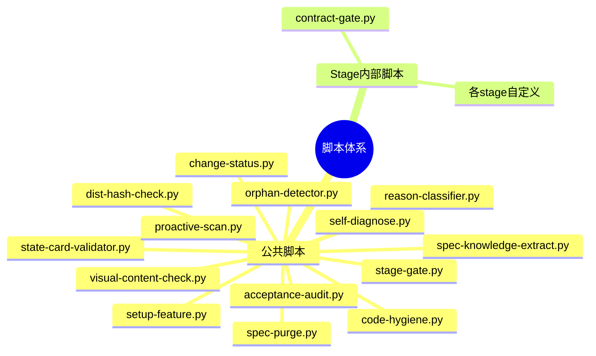

---

## 公共脚本清单

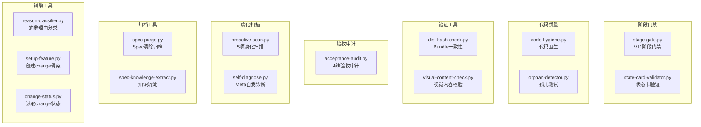

---

## 脚本使用时机表

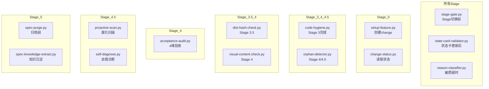

---

## 脚本调用规则

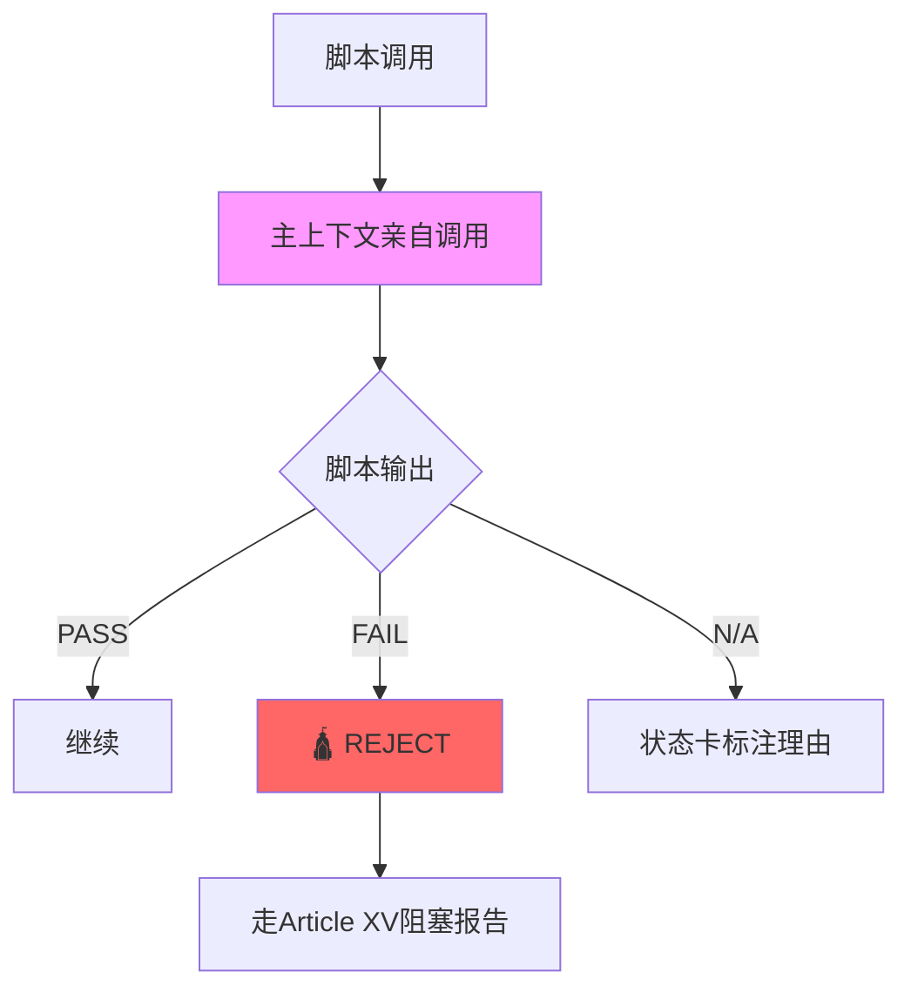

**核心规则**:
- 主上下文亲自调用（不委派给子代理）
- 脚本输出必须真实保存
- 脚本失败 = 🛕 REJECT
- 脚本 N/A 必须标注理由

---

## stage-gate.py

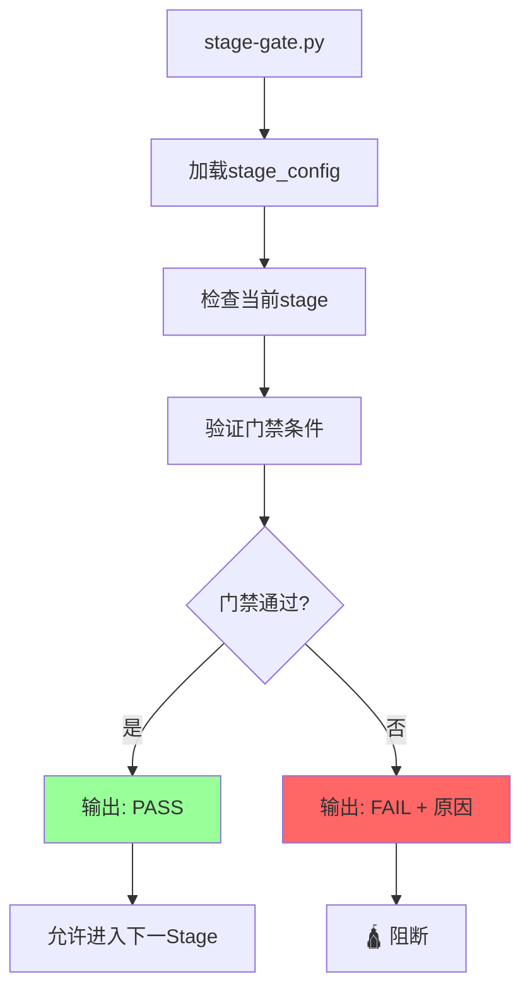

**使用时机**: 所有 stage 切换前

---

## state-card-validator.py

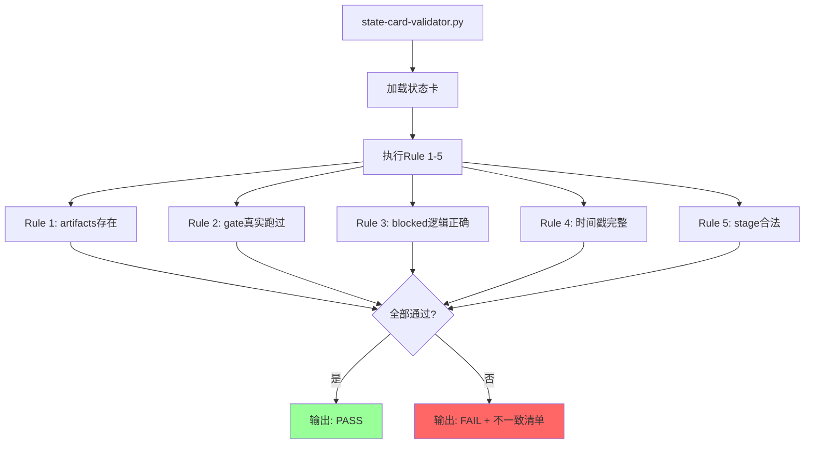

**使用时机**: 所有 stage 状态卡更新后

---

## code-hygiene.py

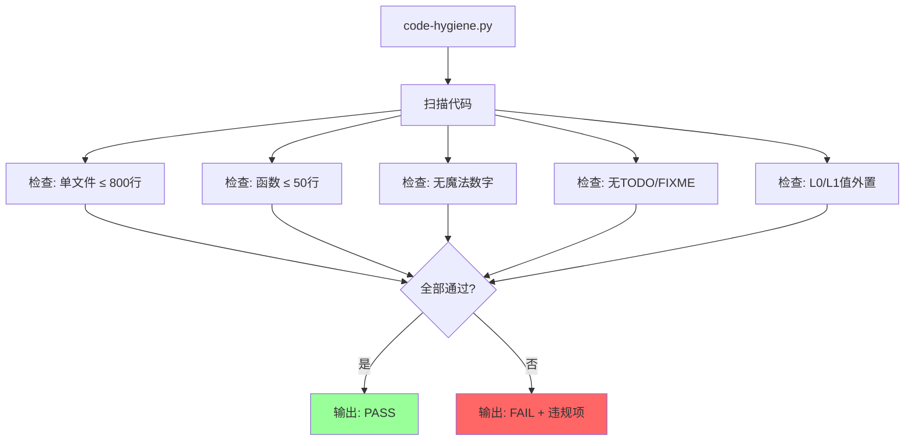

**使用时机**: Stage 3 Implement 完成

---

## orphan-detector.py

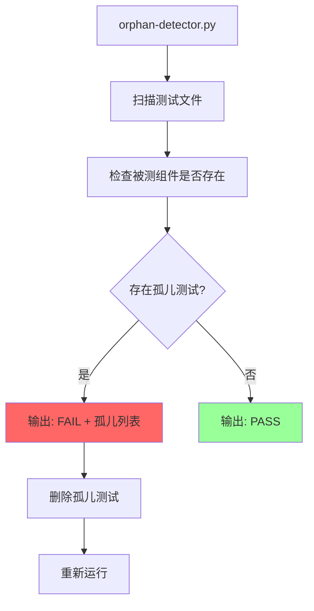

**使用时机**: Stage 4 Review / Stage 4.5 Rot Scan

---

## visual-content-check.py

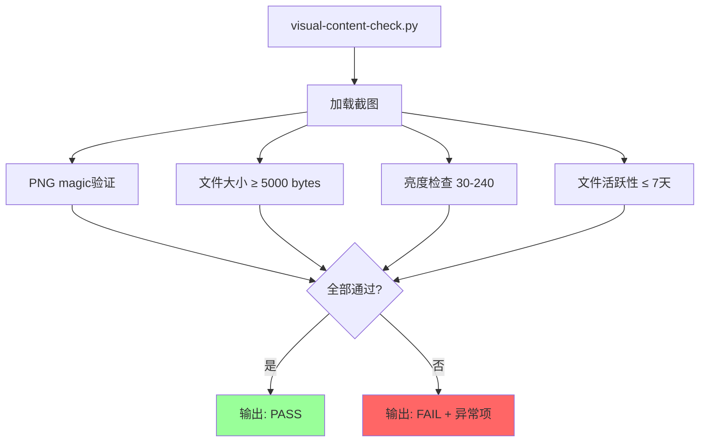

**使用时机**: Stage 4 Review（视觉验证）

---

## proactive-scan.py

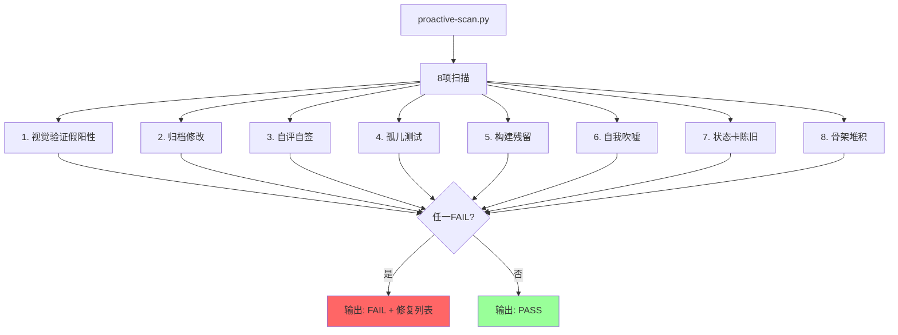

**使用时机**: Stage 4.5 Rot Scan

---

## reason-classifier.py

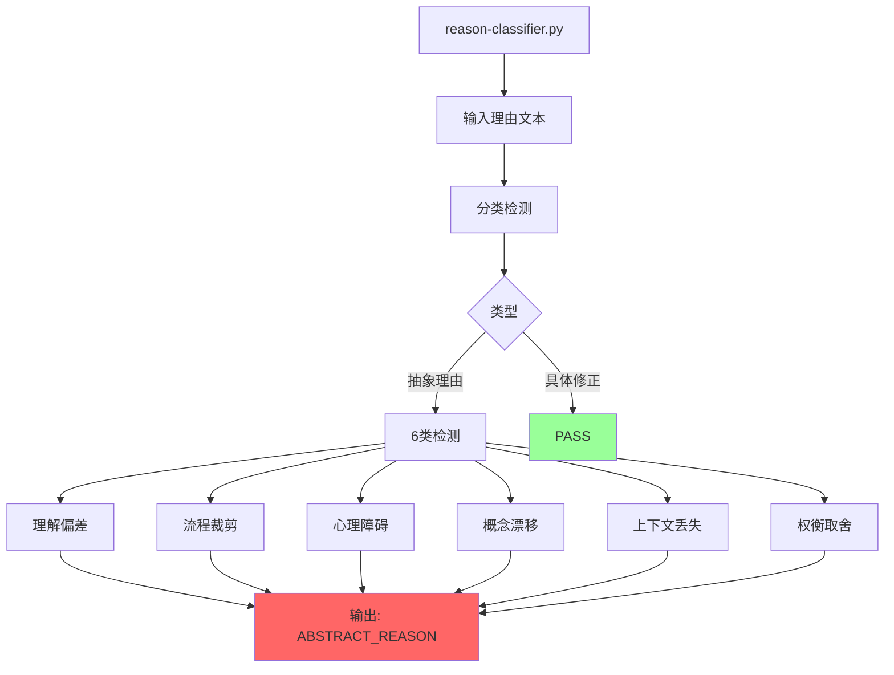

**使用时机**: 所有 stage（被质疑时）

---

## 脚本失败处理

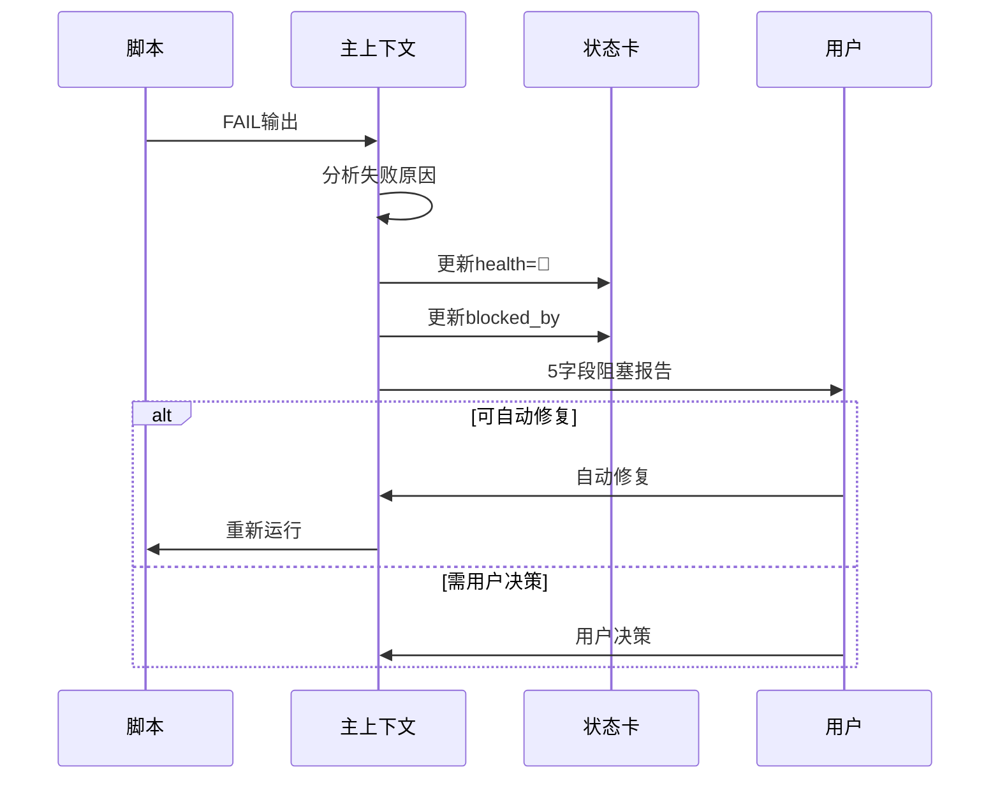

---

## 脚本输出格式

### PASS 格式

```json
{
  "status": "PASS",
  "script": "stage-gate.py",
  "stage": "3/implement",
  "checks": {
    "tdd_green": true,
    "drift_check": true,
    "code_hygiene": true
  },
  "timestamp": "2026-08-11T14:30:00"
}
```

### FAIL 格式

```json
{
  "status": "FAIL",
  "script": "code-hygiene.py",
  "violations": [
    {
      "file": "src/services.rs",
      "line": 150,
      "rule": "function_too_long",
      "message": "Function `handle_request` exceeds 50 lines (78 lines)"
    }
  ],
  "timestamp": "2026-08-11T14:30:00"
}
```

---

## 关联文档

- [脚本目录](../scripts/README.md)
- [宪法 Article X](../references/constitution.md)
- [Hook生命周期](07-hook-lifecycle.md)