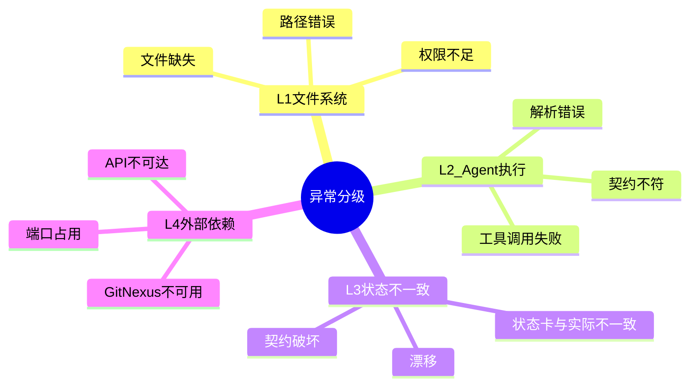
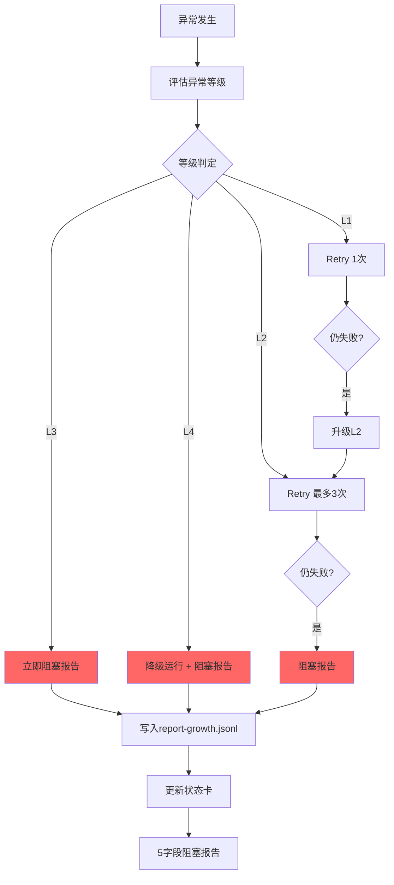
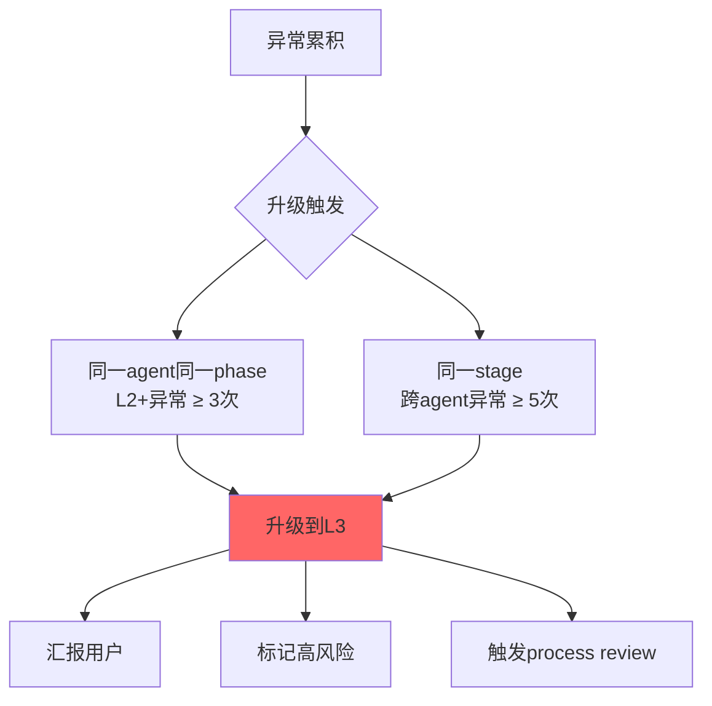
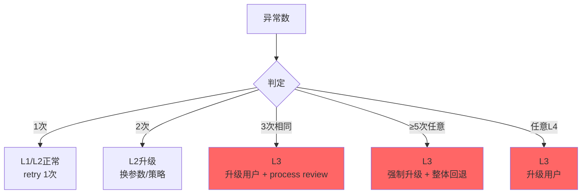
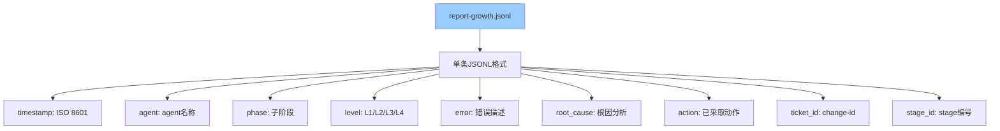
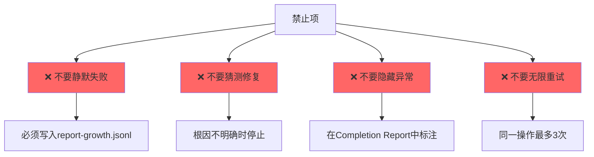
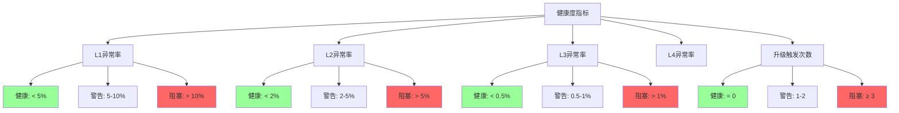

# 异常分级（Report Growth）

> L1-L4 异常分级 + 累积升级规则 + 异常处理协议。

---

## 异常分级总览



---

## L1-L4 分级定义

```mermaid
graph TB
    subgraph L1_文件系统
        A1[文件缺失]
        A2[权限不足]
        A3[路径错误]
        A4[Retry 1次 → 继续]
    end
    
    subgraph L2_Agent执行
        B1[工具调用失败]
        B2[解析错误]
        B3[契约不符]
        B4[换参数/策略 → 最多3次]
    end
    
    subgraph L3_状态不一致
        C1[state-card与实际不一致]
        C2[漂移]
        C3[契约破坏]
        C4[汇报用户 → 等待决策]
    end
    
    subgraph L4_外部依赖
        D1[GitNexus不可用]
        D2[API不可达]
        D3[端口占用]
        D4[降级运行 + 标注风险]
    end
    
    A4 --> E[重试上限: 1次]
    B4 --> F[重试上限: 3次]
    C4 --> G[不可自动]
    D4 --> H[不可自动]
    
    style A4 fill:#9f9
    style B4 fill:#ff9
    style C4 fill:#f66
    style D4 fill:#f66
```



---

## 异常处理流程



---

## 累积升级规则



---

## 升级矩阵



---

## 阻塞报告 5 字段

```mermaid
graph TB
    A[阻塞报告] --> B[5字段必含]
    
    B --> C[type: 类型]
    B --> D[description: 描述]
    B --> E[solution: 方案]
    B --> F[duration_minutes: 耗时]
    B --> G[attempts: 尝试次数]
    
    C --> C1[依赖未启动 | 迁移失败<br/>测试失败 | 编译错误<br/>资源缺失 | 环境问题<br/>外部依赖L4]
    
    D --> D1[具体阻塞描述<br/>附命令输出]
    
    E --> E1[建议解决方案<br/>风险评估]
    
    F --> F1[已耗时分钟数]
    
    G --> G1[已尝试次数<br/>每次的action]
    
    style B fill:#f66
```

---

## JSONL 写入格式



### 示例

```jsonl
{"timestamp": "2026-08-11T14:30:00", "agent": "implementer", "phase": "TDD-GREEN", "level": "L2", "error": "test_foo(): assertion error", "root_cause": "domain model field type mismatch", "action": "revert to contract definition, fix test expectation", "ticket_id": "2026-08-11-add-user-auth", "stage_id": "3/implement"}
```

---

## 4 禁止项



---

## Process Review 协议

```mermaid
flowchart TB
    A[触发条件] --> B{升级触发 ≥ 3次?}
    B -->|是| C[收集report-growth.jsonl]
    B -->|否| D[继续监控]
    
    C --> E[提炼共同根因]
    E --> F[输出process-review-{date}.md]
    F --> G[提交到技能升级循环]
    
    G --> H[反馈给技能开发者]
    G --> I[更新公共铁律]
    G --> J[反馈到项目级rules]
    
    style F fill:#9cf
```

---

## 关键指标



---

## 关联文档

- [异常分级详细版](../references/report-growth.md)
- [宪法 Article XV](../references/constitution.md)
- [阻塞报告协议](../references/report-growth.md)