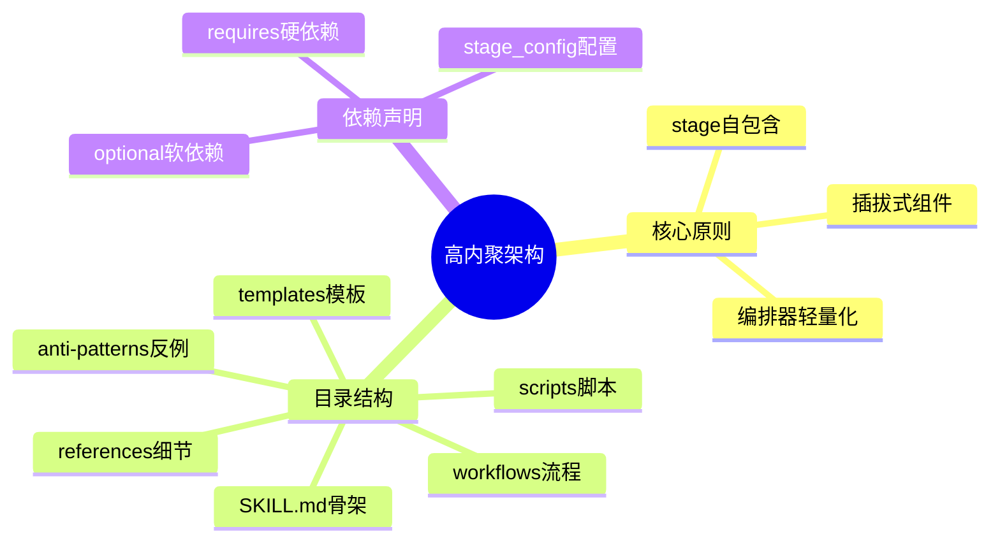
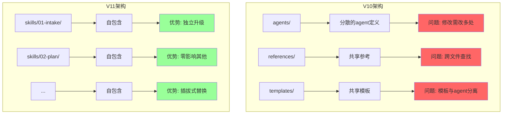
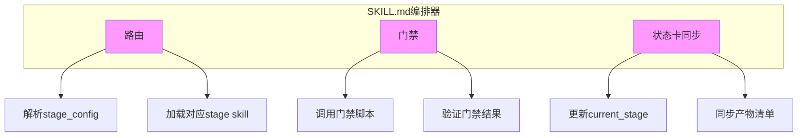
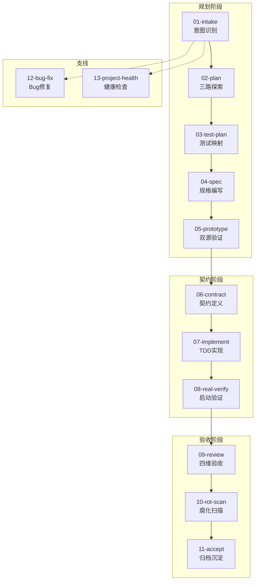
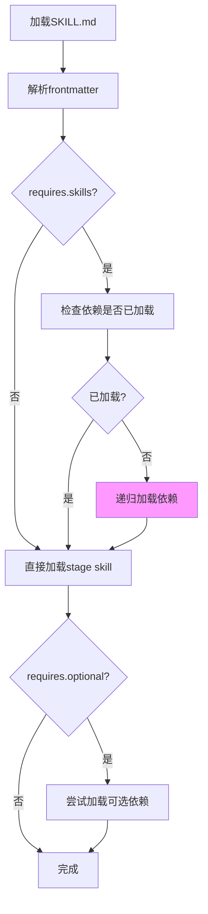
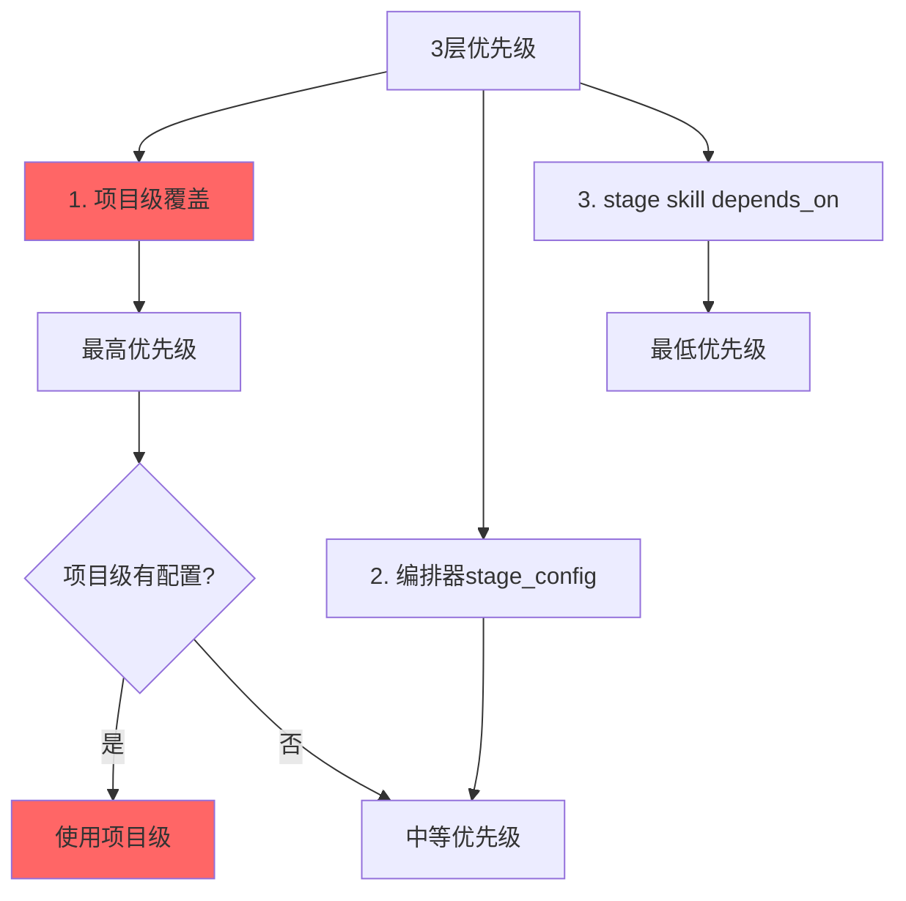
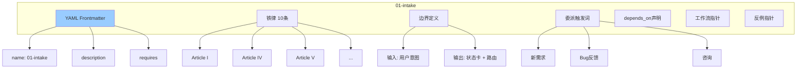
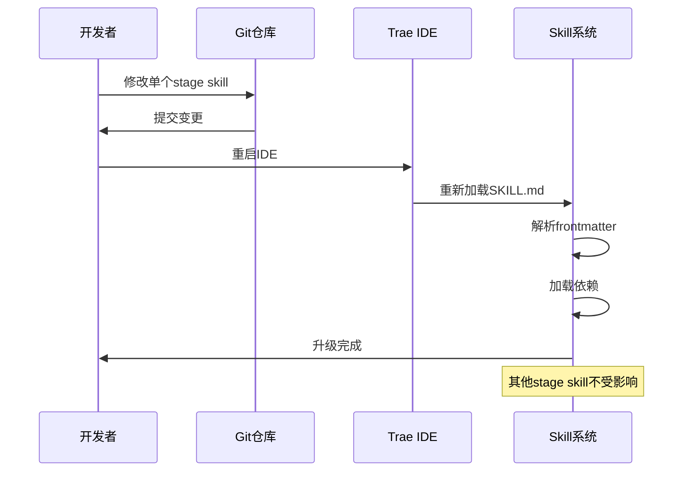
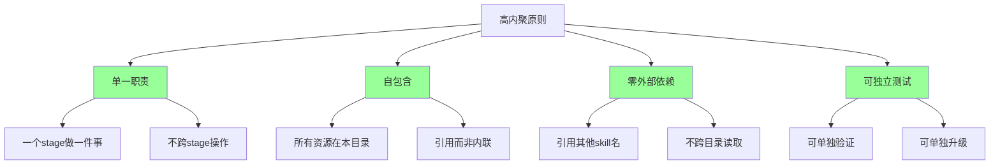

# 高内聚专家架构

> V11 升级核心：从 V10 的分散架构升级为高内聚专家 skill 架构。

---

## 架构总览



---

## V10 vs V11 架构对比



---

## Stage Skill 自包含结构

```mermaid
graph TB
    subgraph Stage_Skill[skills/{NN}-{name}/]
        A[SKILL.md<br/>阶段入口]
        B[README.md<br/>阶段元信息]
        C[scripts/<br/>确定性脚本]
        D[workflows/<br/>阶段内工作流]
        E[templates/<br/>产物模板]
        F[references/<br/>方法论细节]
        G[anti-patterns/<br/>反例库]
    end
    
    A --> A1[铁律 ≤10条]
    A --> A2[边界定义]
    A --> A3[委派触发词]
    A --> A4[depends_on声明]
    
    B --> B1[stage说明]
    B --> B2[依赖声明]
    B --> B3[产出清单]
    
    style A fill:#9cf
```

---

## 编排器职责



**编排器不做**:
- ❌ 不执行具体任务
- ❌ 不直接编辑代码
- ❌ 不替换 stage skill 决策

---

## 13 个 Stage Skills



---

## 依赖声明机制

### YAML Frontmatter

```yaml
---
name: skill-name
description: 一句话 + 触发条件
requires:
  skills: [dependency-name]    # 硬依赖：必须先加载
  optional: [optional-name]     # 软依赖：建议但不强制
stage_config:
  intake:
    route: "skills/01-intake/SKILL.md"
    skills: []
    stages: []
  plan:
    route: "skills/02-plan/SKILL.md"
    skills: [gitnexus4Trae]
    stages: [-1/intake]
---
```

### 依赖加载流程



---

## 配置化依赖覆盖



---

## Stage Skill 示例

### 01-intake/SKILL.md 结构



---

## 插拔式升级流程



---

## 高内聚设计原则



---

## 目录结构完整版

```
fullstack4TraeV11/
├── SKILL.md                # 总编排器
├── references/             # 9个公共references
│   ├── constitution.md
│   ├── common-iron-rules.md
│   ├── common-anti-patterns.md
│   ├── stage-interaction-protocol.md
│   ├── state-card-protocol.md
│   ├── dependency-config.md
│   ├── document-layer.md
│   ├── report-growth.md
│   └── ask-question-anti-patterns.md
├── templates/              # 项目级模板
│   ├── project-agents-example.md
│   ├── project-rules-example/
│   └── state-card.md
├── scripts/                # 14个公共scripts
│   ├── stage-gate.py
│   └── state-card-validator.py
└── skills/                 # 13个stage skill
    ├── 01-intake/
    │   ├── SKILL.md
    │   ├── README.md
    │   ├── scripts/
    │   ├── workflows/
    │   ├── templates/
    │   ├── references/
    │   └── anti-patterns/
    ├── 02-plan/
    ├── ...
    └── 13-project-health/
```

---

## 关联文档

- [SKILL.md](../SKILL.md)
- [依赖配置](../references/dependency-config.md)
- [阶段交互协议](../references/stage-interaction-protocol.md)