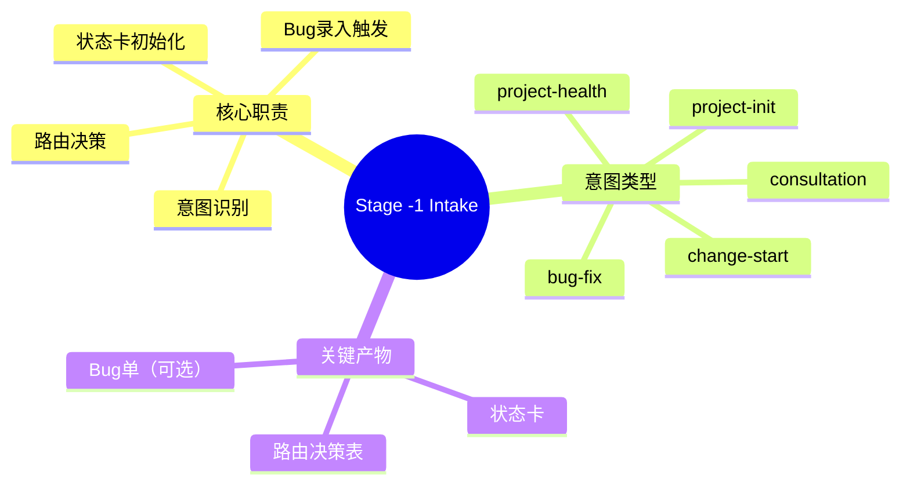
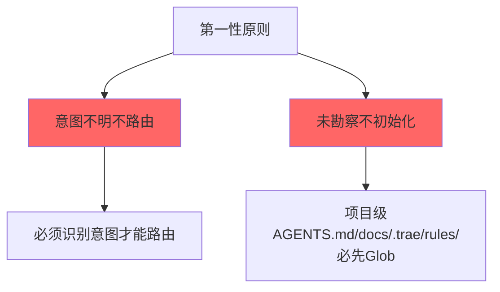
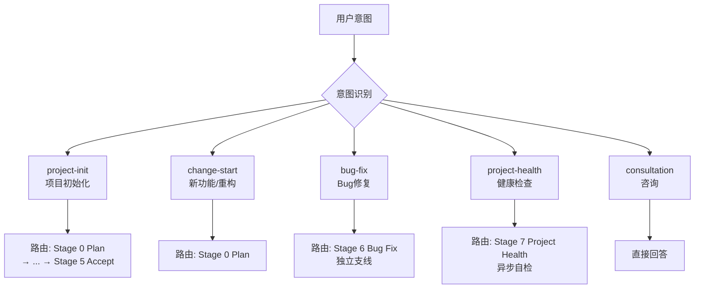
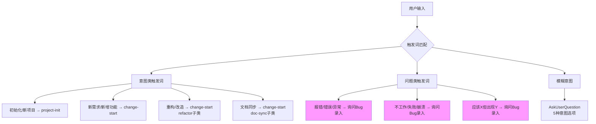
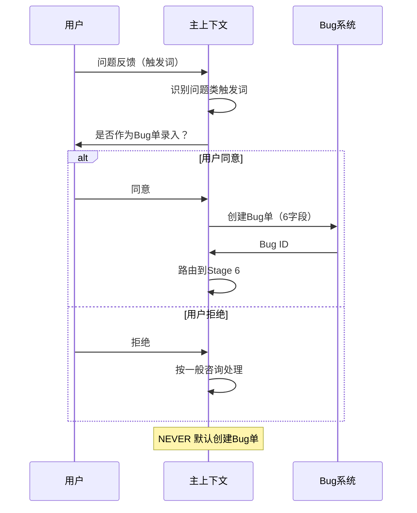
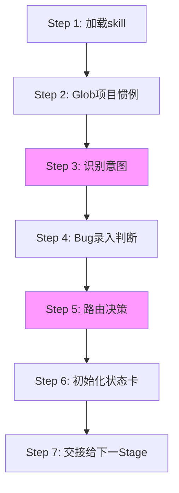
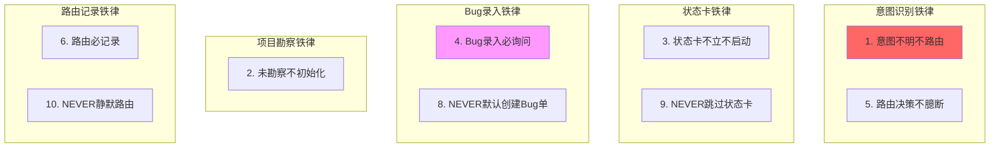
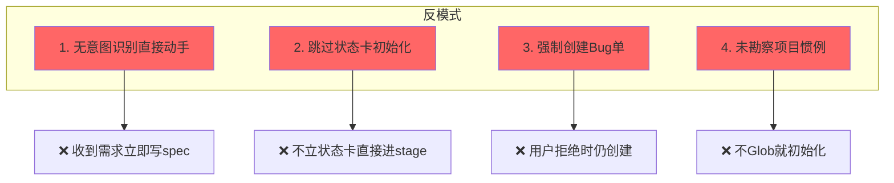

# Stage -1 Intake — 意图受理 + 路由起点

> 全栈流程的唯一入口，所有用户请求必须先经过意图识别 + 路由决策。

---

## 阶段总览



---

## 第一性原则



---

## 5 种意图类型



---

## 触发词识别



---

## Bug 录入流程



---

## 骨架流程（7 步）



---

## 10 条铁律



---

## 状态卡初始化

```mermaid
graph TB
    A[状态卡初始化] --> B{意图类型}
    
    B --> C[project-init]
    B --> D[change-start]
    B --> E[bug-fix]
    
    C --> F[项目级状态卡<br/>.trae/state-card.md]
    D --> G[Change级状态卡<br/>docs/specs/changes/{id}/.state-card.md]
    E --> H[Bug单状态卡<br/>docs/bugs/{id}/.state-card.md]
    
    F --> I[card_type: project]
    G --> J[card_type: change]
    H --> K[card_type: bug]
    
    style F fill:#9f9
    style G fill:#9cf
    style H fill:#f9f
```

---

## 交接物 4 件套

```yaml
hand_over:
  stage_id: "-1/intake"
  stage_skill: skills/01-intake/SKILL.md
  status: completed
  health: "🟢 on-track"
  artifacts:
    - path: .trae/state-card.md
      type: file
      evidence: "状态卡初始化 + next_stage 路由"
  gate_result:
    status: PASS
    gate: state-card-validator.py
    output: "状态卡字段完整 + 文件存在性 OK"
  next_stage:
    id: "0/plan" | "6/bug-fix" | "7/project-health"
    skill_name: skills/02-plan/SKILL.md
    expected_inputs: [状态卡 + 路由决策表]
    prerequisites: [意图识别 PASS + 状态卡初始化 PASS]
```

---

## 4 条反模式



---

## 关联文档

- [意图路由工作流](../skills/01-intake/workflows/intent-routing.md)
- [Bug录入工作流](../skills/01-intake/workflows/bug-intake-flow.md)
- [项目惯例勘察](../skills/01-intake/workflows/project-convention-survey.md)
- [5种意图类型](../skills/01-intake/references/intent-types.md)
- [路由决策树](../skills/01-intake/references/routing-decision-tree.md)