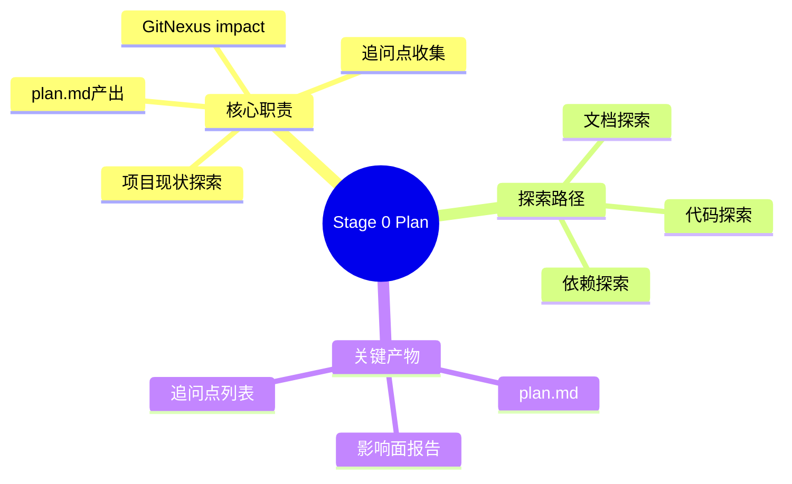
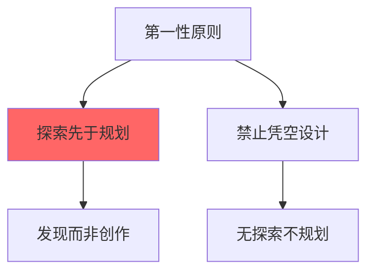
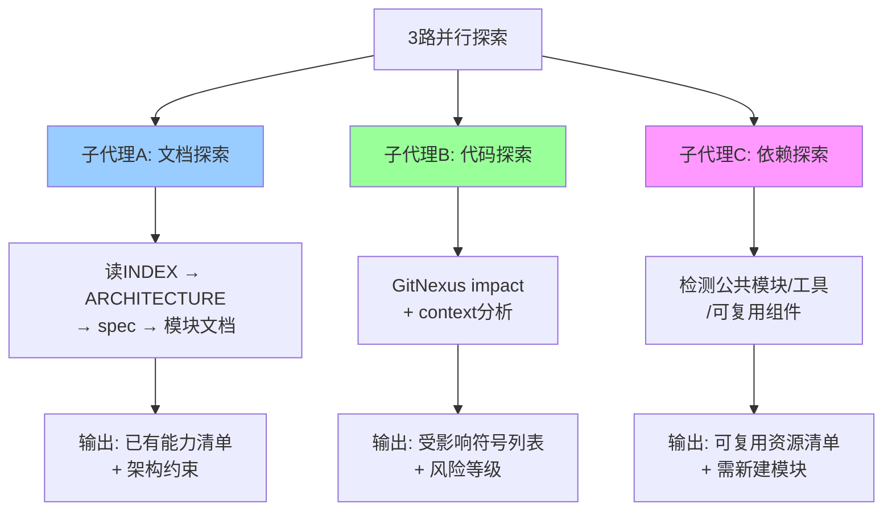
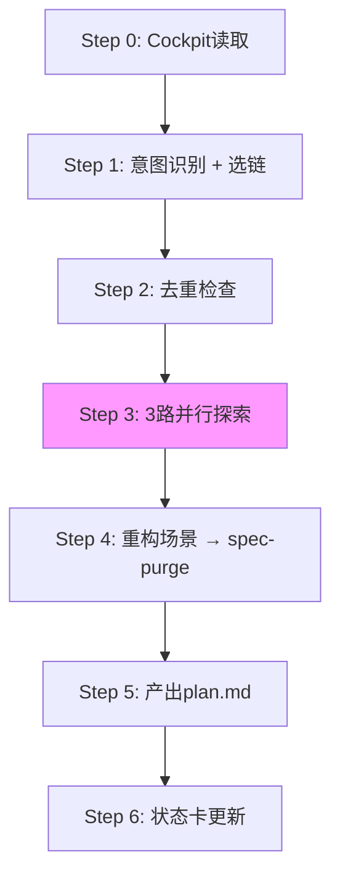
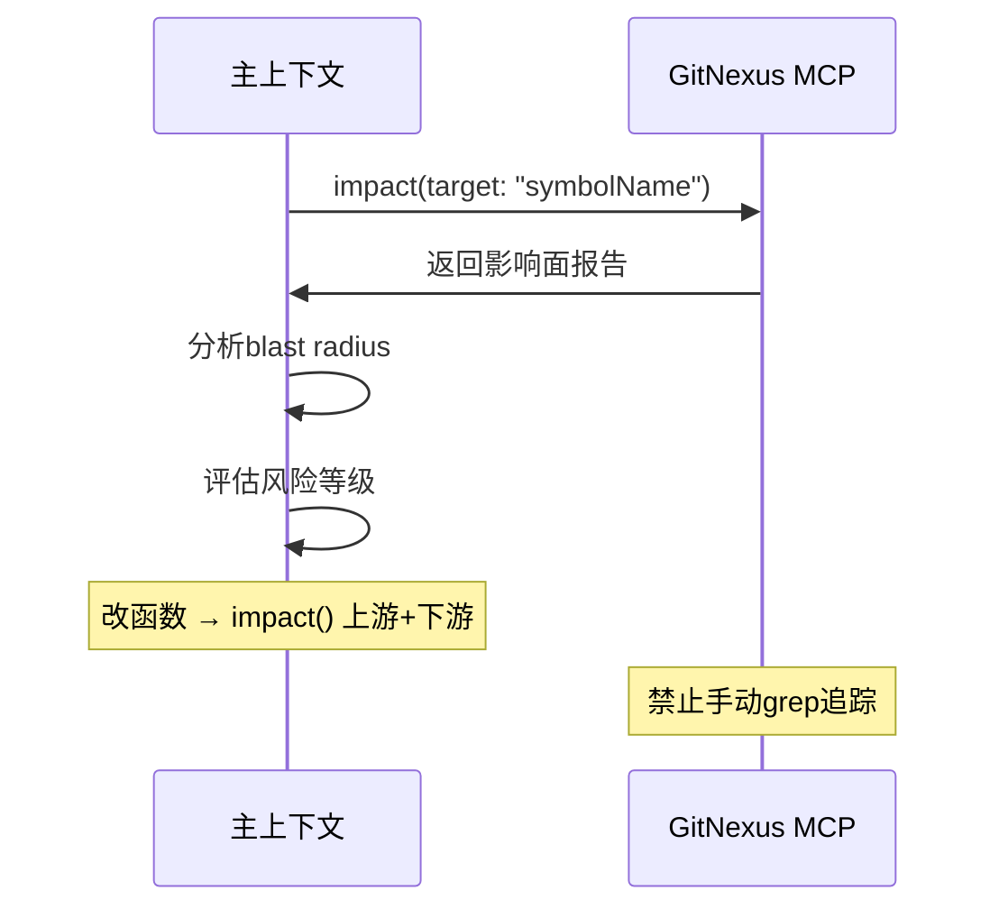
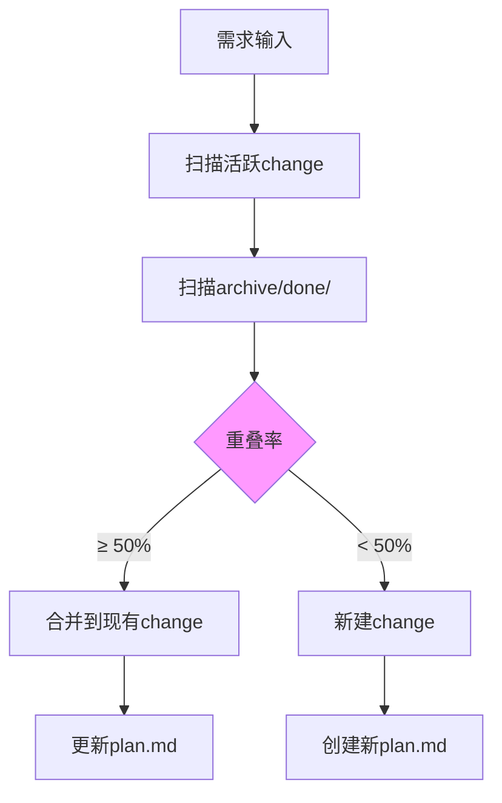
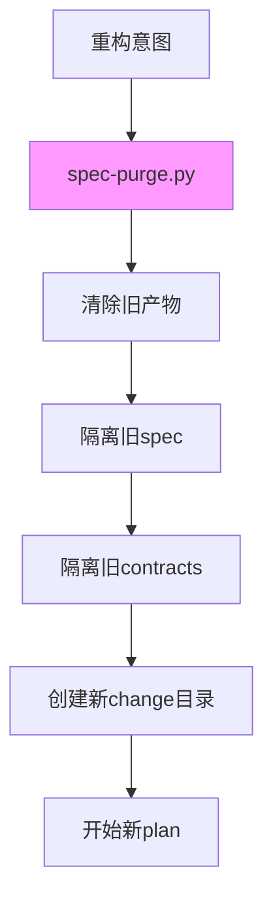
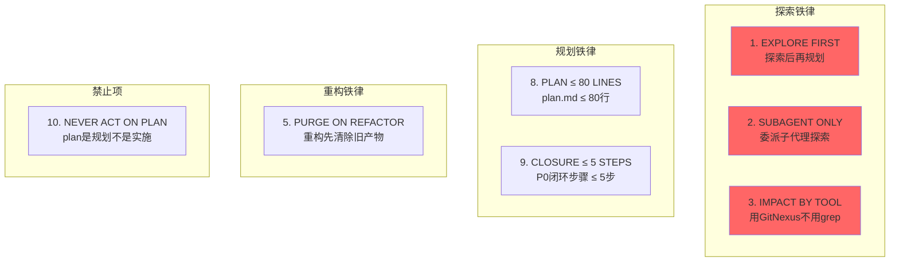
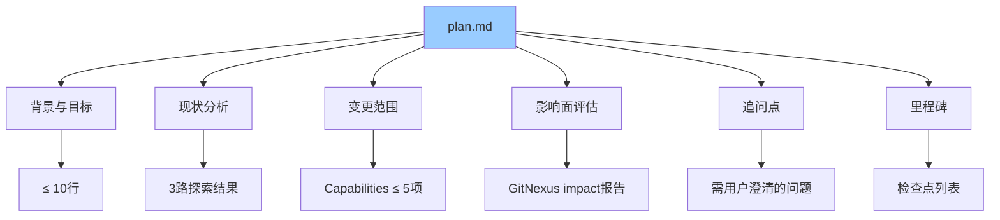
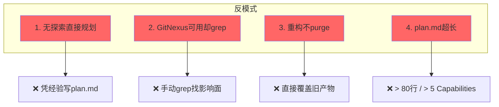

# Stage 0 Plan — 探索 + 规划

> 项目现状 3 路并行探索 + GitNexus impact + 追问点 + plan.md 产出。

---

## 阶段总览



---

## 第一性原则



---

## 3 路并行探索



---

## 骨架流程（6 步）



---

## GitNexus Impact 评估



---

## 去重检查（DEDUP BY ATOM）



---

## 重构场景（PURGE ON REFACTOR）



---

## 10 条铁律



---

## plan.md 模板结构



---

## 交接物 4 件套

```yaml
hand_over:
  stage_id: "0/plan"
  stage_skill: skills/02-plan/SKILL.md
  status: completed
  health: "🟢 on-track"
  artifacts:
    - path: docs/specs/changes/{id}/plan.md
      type: file
      evidence: "plan.md ≤ 80行 + 3路探索evidence"
  gate_result:
    status: PASS
    gate: stage-gate.py
    output: "plan.md行数 + Capabilities数 PASS"
  next_stage:
    id: "0.5/test-plan"
    skill_name: skills/03-test-plan/SKILL.md
    expected_inputs: [plan.md + 3路探索evidence]
    prerequisites: [意图识别PASS, 去重检查PASS]
```

---

## 4 条反模式



---

## 关联文档

- [3路并行探索工作流](../skills/02-plan/workflows/three-path-exploration.md)
- [计划追问点工作流](../skills/02-plan/workflows/plan-clarification.md)
- [原子级去重](../skills/02-plan/references/dedup-by-atom.md)
- [GitNexus影响面评估](../skills/02-plan/references/impact-assessment.md)
- [plan.md模板](../skills/02-plan/templates/plan-template.md)