# Stage 2 Contract — 契约四件套

> 契约是不可变的接口真相，先于实现。

---

## 阶段总览

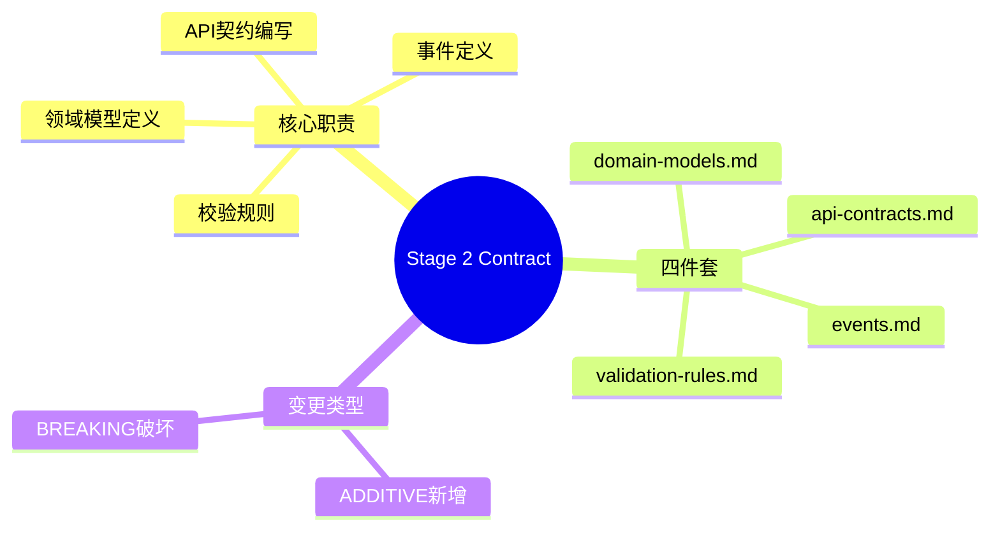

---

## 第一性原则

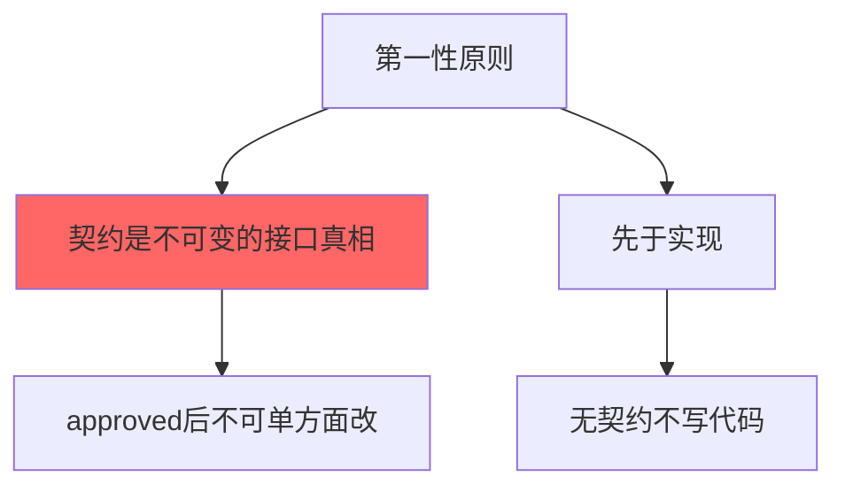

---

## 契约四件套

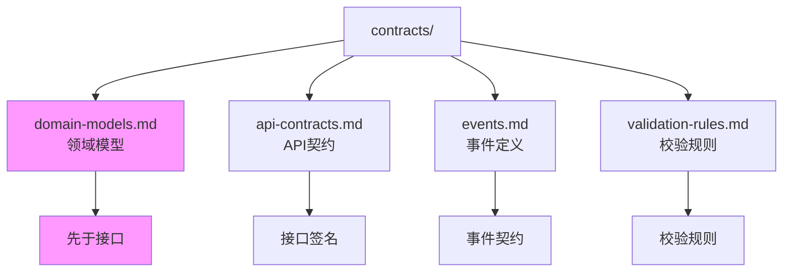

---

## 骨架流程（5 步）

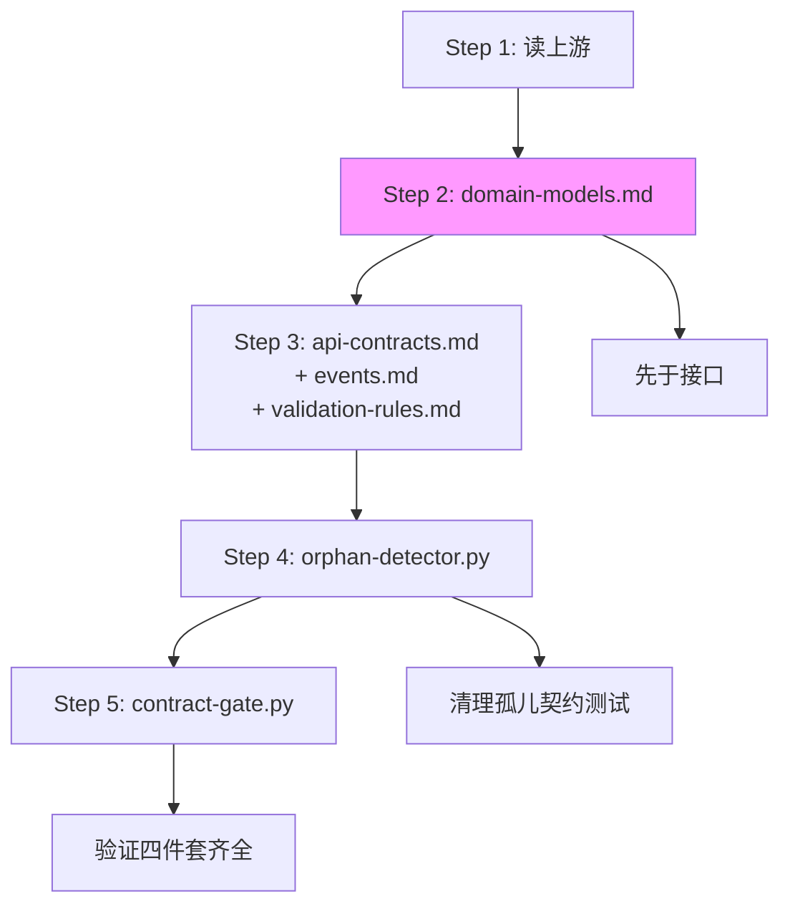

---

## DOMAIN FIRST 原则

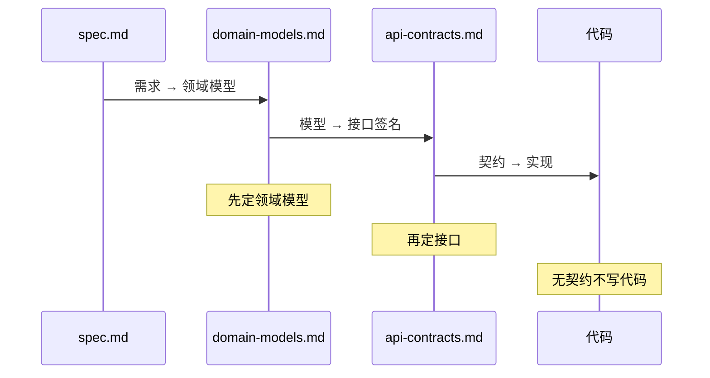

---

## ADDITIVE / BREAKING 变更流程

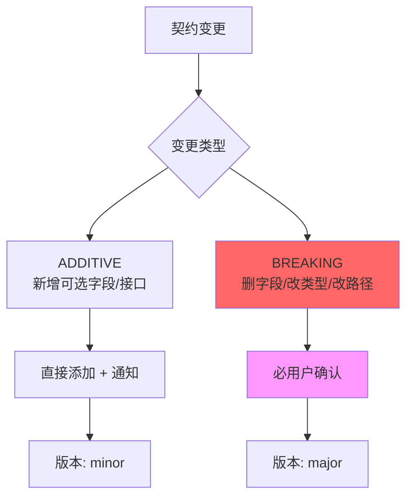

---

## 孤儿契约测试清理

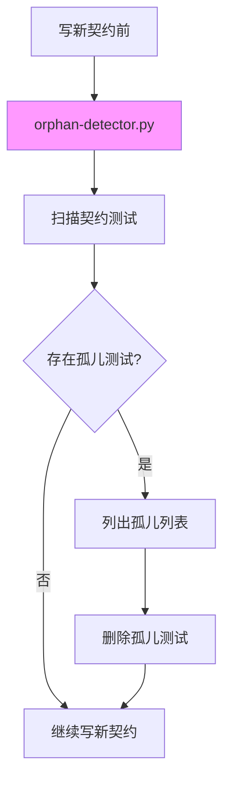

---

## 三方同步（THREE-WAY SYNC）

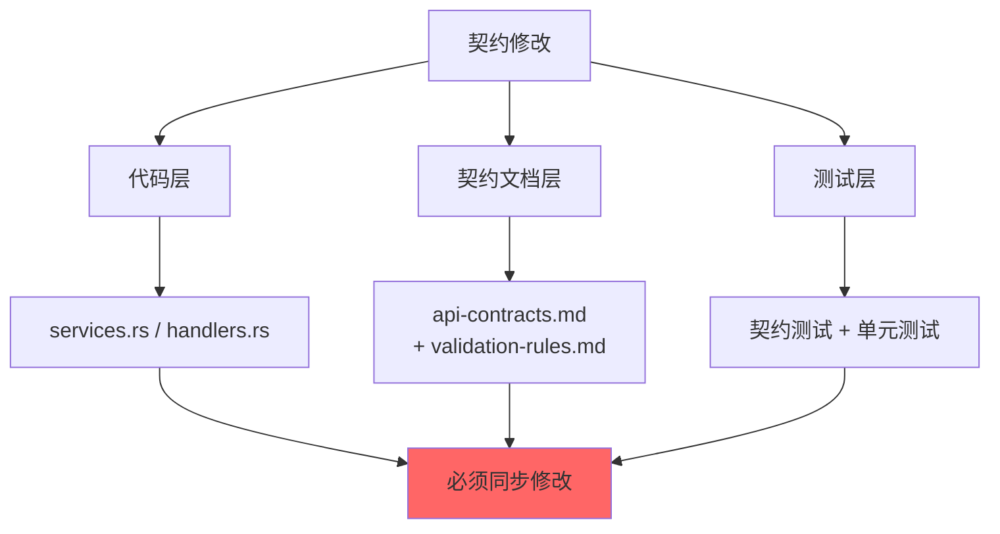

---

## 10 条铁律

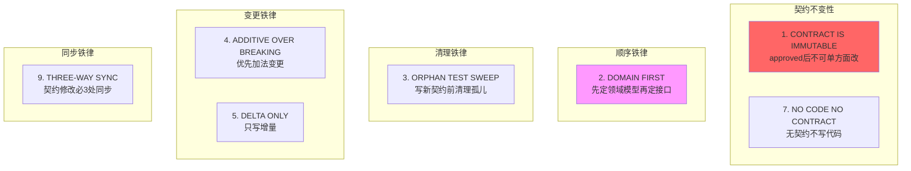

---

## 契约模板

### domain-models.md

```markdown
# 领域模型 — {Change Name}

## 核心实体

### User
- id: string (UUID)
- name: string (≤ 100 chars)
- email: string (email format)
- created_at: datetime (ISO 8601)

## 关系图

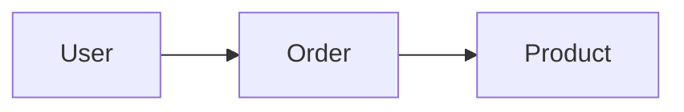
```

### api-contracts.md

```markdown
# API 契约 — {Change Name}

## POST /api/users

### Request
```json
{
  "name": "string",
  "email": "string"
}
```

### Response (201)
```json
{
  "id": "string",
  "name": "string",
  "email": "string",
  "created_at": "string"
}
```

### Errors
- 400: Validation error
- 409: Email already exists
```

---

## 交接物 4 件套

```yaml
hand_over:
  stage_id: "2/contract"
  stage_skill: skills/06-contract/SKILL.md
  status: completed
  health: "🟢 on-track"
  artifacts:
    - path: docs/specs/changes/{id}/contracts/domain-models.md
      type: file
      evidence: "领域模型定义 + INV"
    - path: docs/specs/changes/{id}/contracts/api-contracts.md
      type: file
      evidence: "API契约 + 错误码"
    - path: docs/specs/changes/{id}/contracts/events.md
      type: file
      evidence: "事件定义"
    - path: docs/specs/changes/{id}/contracts/validation-rules.md
      type: file
      evidence: "校验规则 + regex"
  gate_result:
    status: PASS
    gate: contract-gate.py
    output: "四件套齐全 + 测试骨架PASS"
  next_stage:
    id: "3/implement"
    skill_name: skills/07-implement/SKILL.md
    expected_inputs: [contracts/ 四件套]
    prerequisites: [contract-gate PASS]
```

---

## 4 条反模式

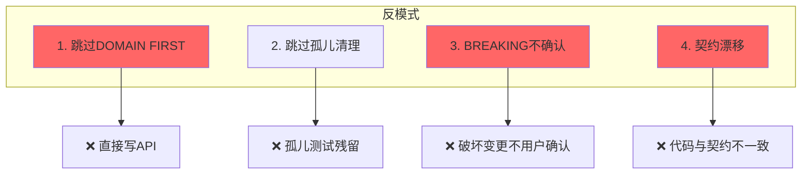

---

## 关联文档

- [契约四件套详细规则](../skills/06-contract/references/contract-four-suite.md)
- [孤儿测试扫描](../skills/06-contract/references/orphan-test-sweep.md)
- [契约模板目录](../skills/06-contract/templates/)
- [V10实战参考](../skills/06-contract/anti-patterns/V10-battle-tested.md)