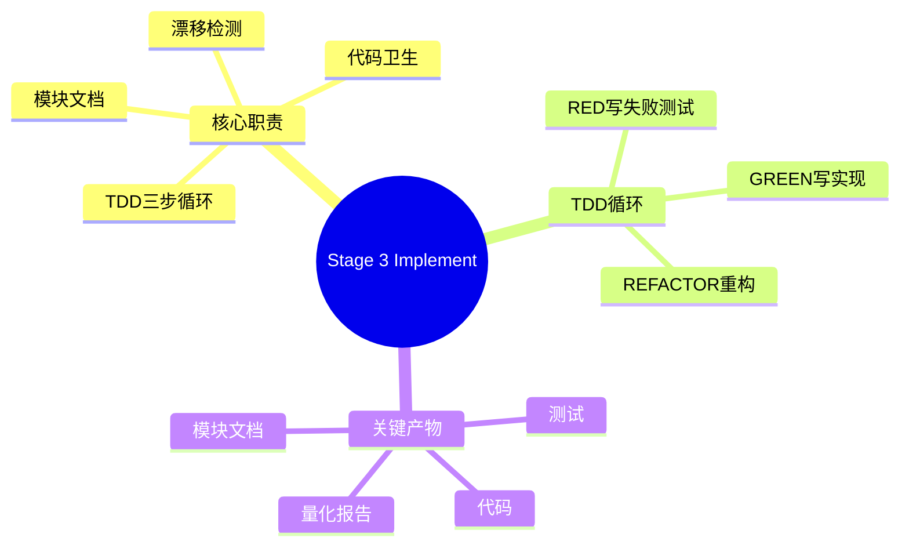
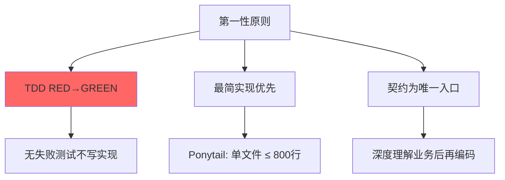
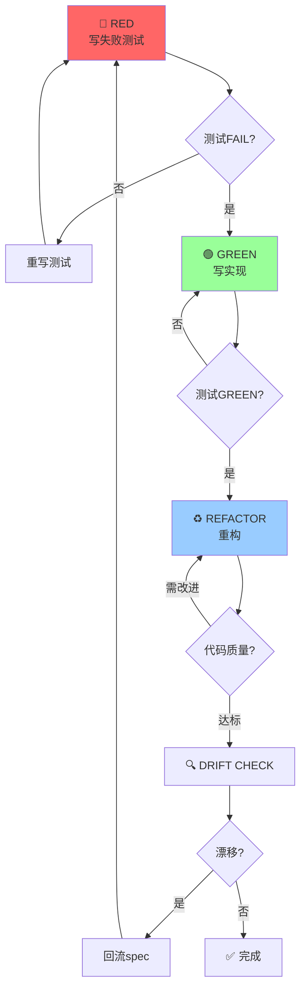
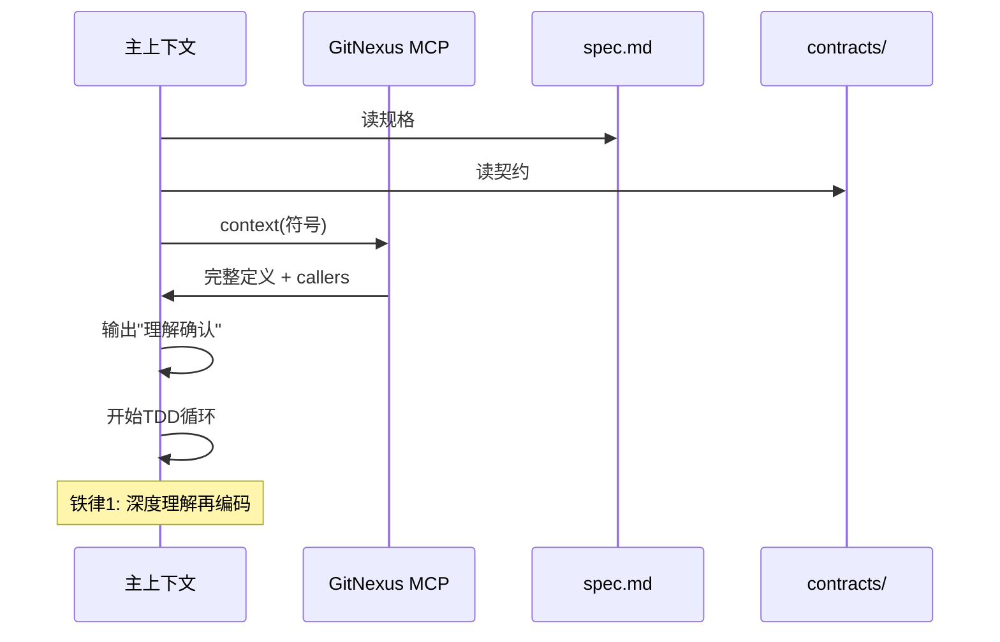
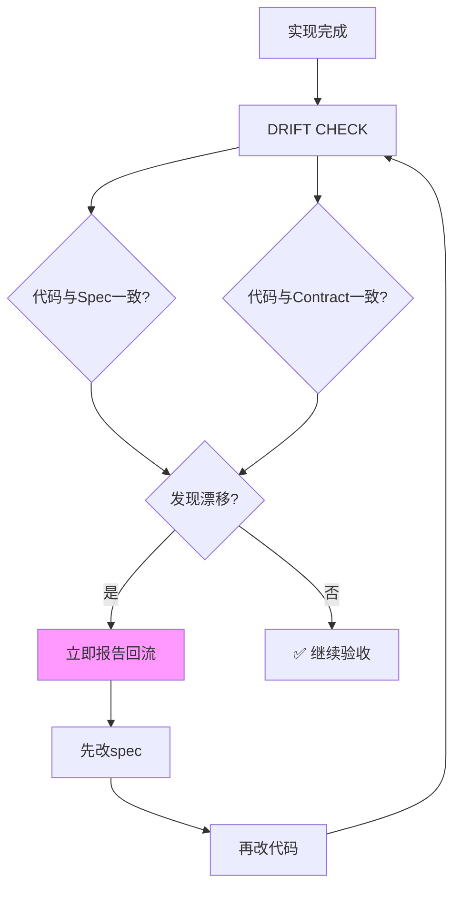
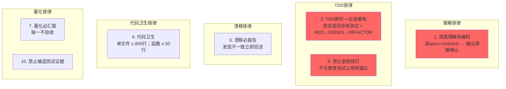
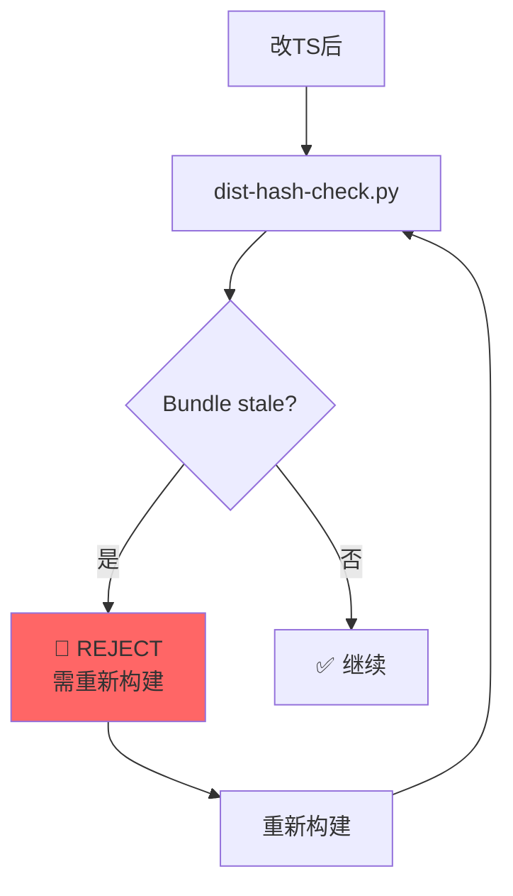
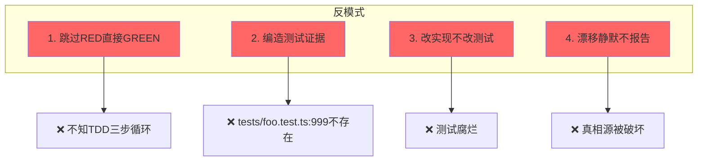

# Stage 3 Implement — TDD RED→GREEN

> 契约驱动 + 深度业务理解 + TDD 三步循环 + 漂移检测。

---

## 阶段总览



---

## 第一性原则



---

## TDD 三步循环



---

## 深度理解再编码



---

## 漂移检测（DRIFT CHECK）



---

## 骨架流程（4 步）

```mermaid
flowchart TB
    A[Step 1: 门禁检查] --> B[Step 2: 深度理解]
    B --> C[Step 3: TDD循环]
    C --> D[Step 4: 模块文档<br/>+ 量化汇报]
    
    A --> A1[spec.md + contracts/<br/>+ state-card存在]
    B --> B1[GitNexus context<br/>→ 输出"理解确认"]
    C --> C1[tasks.md逐项<br/>RED→GREEN→REFACTOR]
    D --> D1[test/contract_tests/coverage]
    
    style A fill:#9cf
    style C fill:#f9f
```

---

## 量化汇报格式

```mermaid
graph TB
    A[Completion Report] --> B[artifacts: 代码+测试+文档]
    A --> C[test: {pass}/{total}]
    A --> D[contract_tests: {pass}/{total}]
    A --> E[coverage: {X}%]
    A --> F[status: ✓ | ⚠️ | ✗]
    
    style C fill:#f9f
    style D fill:#f9f
    style E fill:#f9f
```

**示例**:
```yaml
## Completion Report - Implementer
- artifacts: [src/services.rs, __tests__/services.test.rs]
- test: 50/50
- contract_tests: 8/8
- coverage: 92%
- status: ✓
```

---

## 10 条铁律



---

## Bundle Staleness 检测



---

## 模块接入文档（条件触发）

```mermaid
flowchart TB
    A[模块完成] --> B{可作为增值功能基底?}
    
    B -->|是| C[产出接入文档<br/>docs/modules/{module}/README.md]
    B -->|否| D[不产出文档]
    
    C --> E[包含: 快速接入 + API示例<br/>+ 常见问题]
    
    style C fill:#9f9
```

---

## 交接物 4 件套

```yaml
hand_over:
  stage_id: "3/implement"
  stage_skill: skills/07-implement/SKILL.md
  status: completed
  health: "🟢 on-track"
  artifacts:
    - path: src/{module}/{feature}.{ts,py,rs}
      type: file
      evidence: "代码实现"
    - path: __tests__/{unit,integration}/{feature}.test.*
      type: file
      evidence: "测试文件"
  gate_result:
    status: PASS
    gate: stage-gate.py
    output: "TDD GREEN + DRIFT CHECK PASS + code-hygiene PASS"
  next_stage:
    id: "3.5/real-verify"
    skill_name: skills/08-real-verify/SKILL.md
    expected_inputs: [代码 + 测试]
    prerequisites: [TDD GREEN, DRIFT CHECK ✅]
```

---

## 4 条反模式



---

## 关联文档

- [TDD工作流](../skills/07-implement/references/tdd-workflow.md)
- [代码卫生](../skills/07-implement/references/code-hygiene.md)
- [漂移检测](../skills/07-implement/references/drift-detect.md)
- [V10实战蒸馏](../skills/07-implement/anti-patterns/V10-battle-tested.md)