# Stage 4 Review — 质疑式验收

> FAIL IS FAIL + 4 维评分 + 主动证伪 + DOC SYNC。

---

## 阶段总览

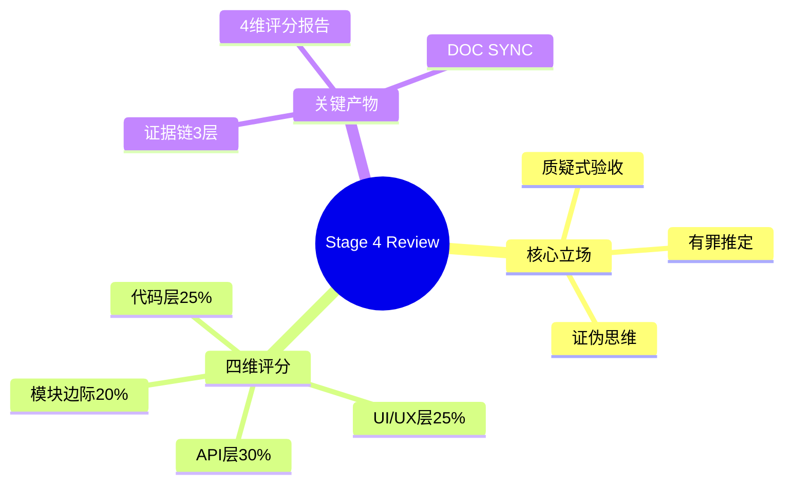

---

## 立场转变

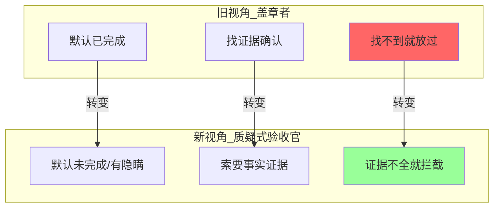

---

## 质疑式验收 SUITE

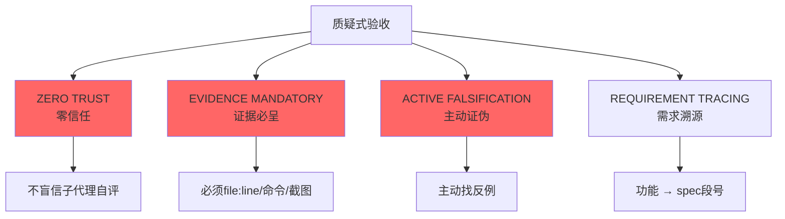

---

## 4 维评分

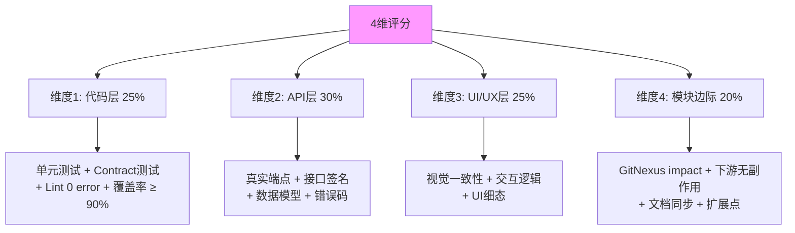

---

## 评分公式

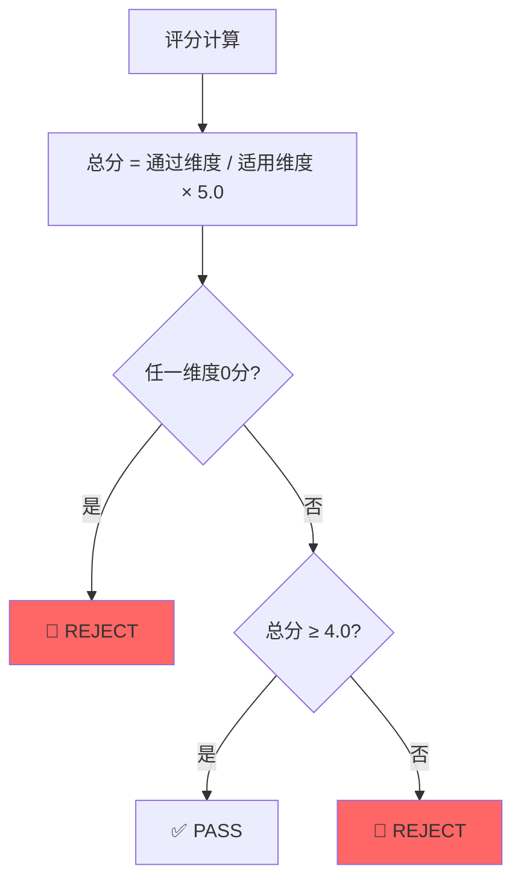

---

## 骨架流程（V10 reviewer 8 步）

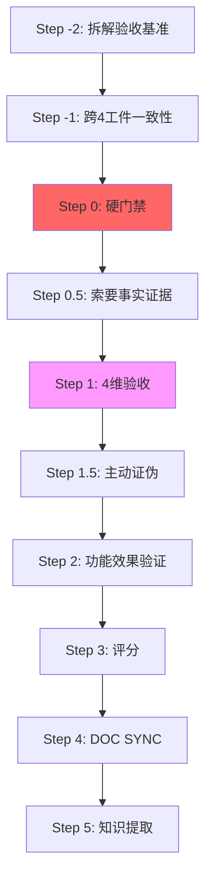

---

## 硬门禁（Step 0）

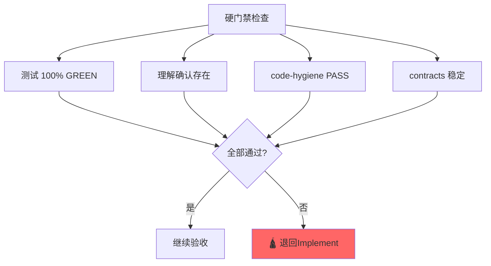

---

## 证据链 3 层

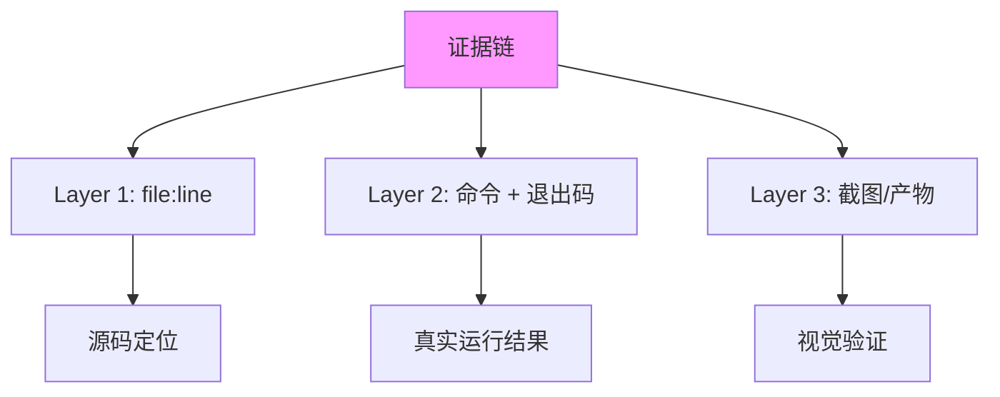

---

## 主动证伪（Step 1.5）

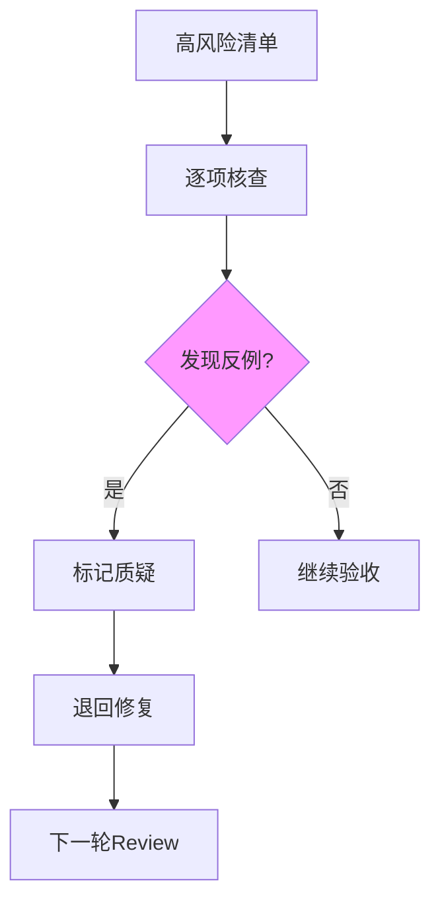

---

## 自动循环（Round 机制）

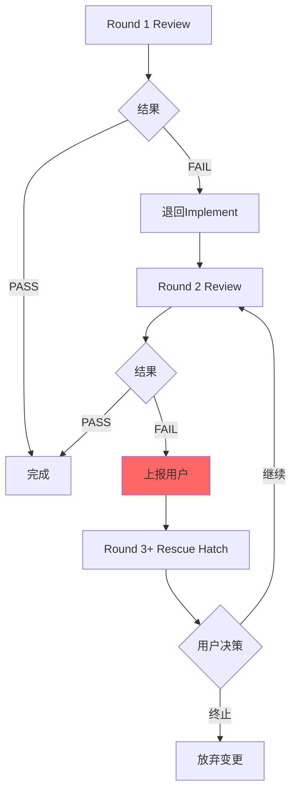

---

## 10 条铁律

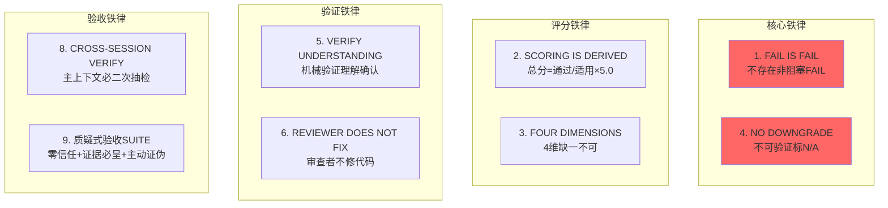

---

## DOC SYNC

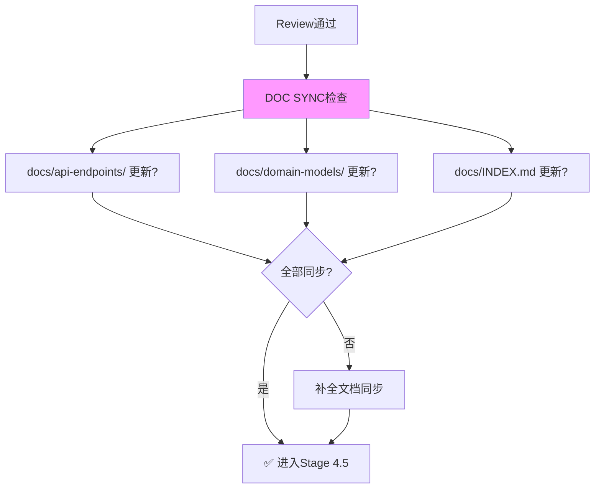

---

## 交接物 4 件套

```yaml
hand_over:
  stage_id: "4/review"
  stage_skill: skills/09-review/SKILL.md
  status: completed
  health: "🟢 on-track"
  artifacts:
    - path: docs/specs/changes/{id}/review-report.md
      type: file
      evidence: "4维评分 + 证据链"
  gate_result:
    status: PASS
    gate: acceptance-audit.py
    output: "4维满分 + 证据链3层 + DOC SYNC ✅"
  next_stage:
    id: "4.5/rot-scan"
    skill_name: skills/10-rot-scan/SKILL.md
    expected_inputs: [review-report.md]
    prerequisites: [4维 ≥ 4.0, 任一维度 > 0]
```

---

## 4 条反模式

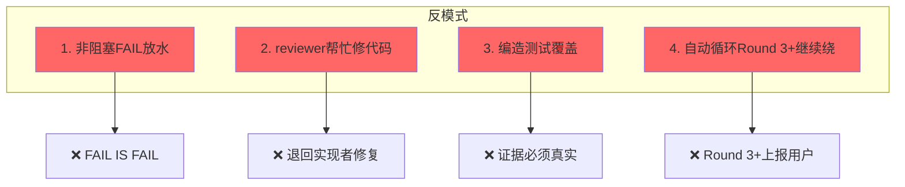

---

## 关联文档

- [四维评分详细](../skills/09-review/references/four-dimension-scoring.md)
- [证据链3层](../skills/09-review/references/evidence-3-layer.md)
- [质疑式验收](../skills/09-review/references/skeptical-acceptance.md)
- [多轮修订](../skills/09-review/references/multi-round-revision.md)
- [Review报告模板](../skills/09-review/templates/review-report-template.md)