# Stage 6 Bug Fix — 独立专精流程

> 根因不明不修复 + e2e 先行 + 6 层排查 + TDD 修复。

---

## 阶段总览

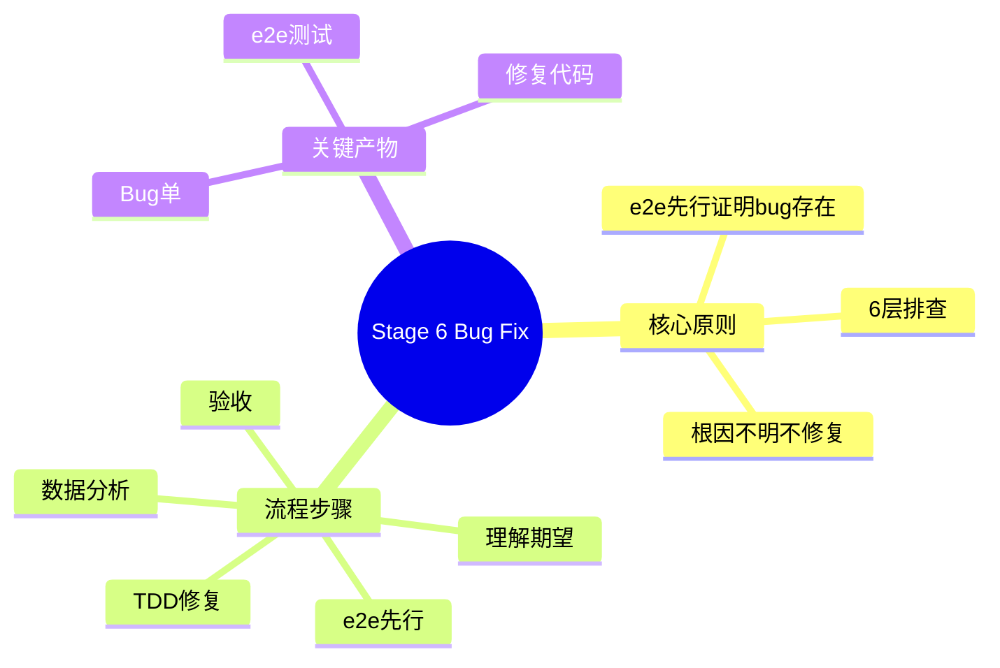

---

## 第一性原则

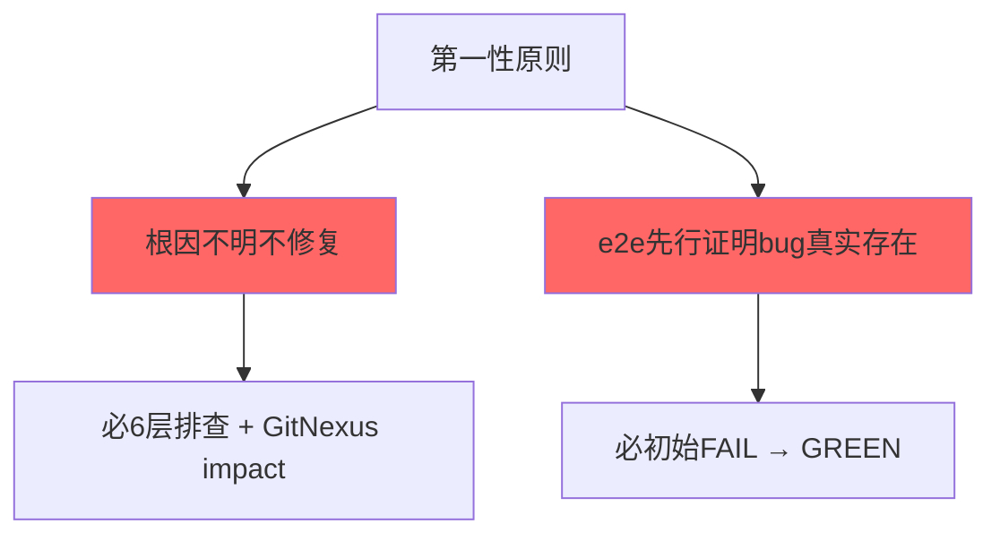

---

## 5 步精简流程

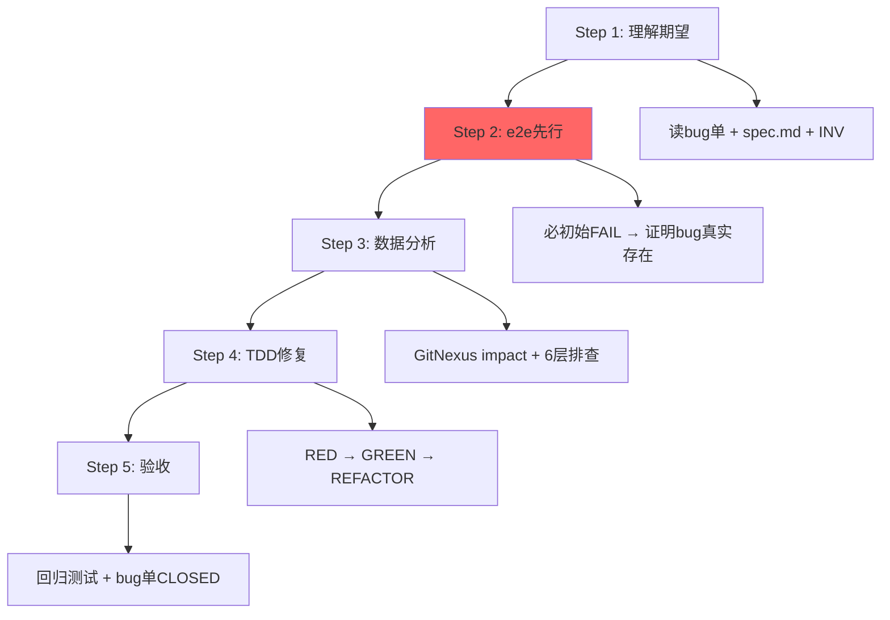

---

## e2e 先行

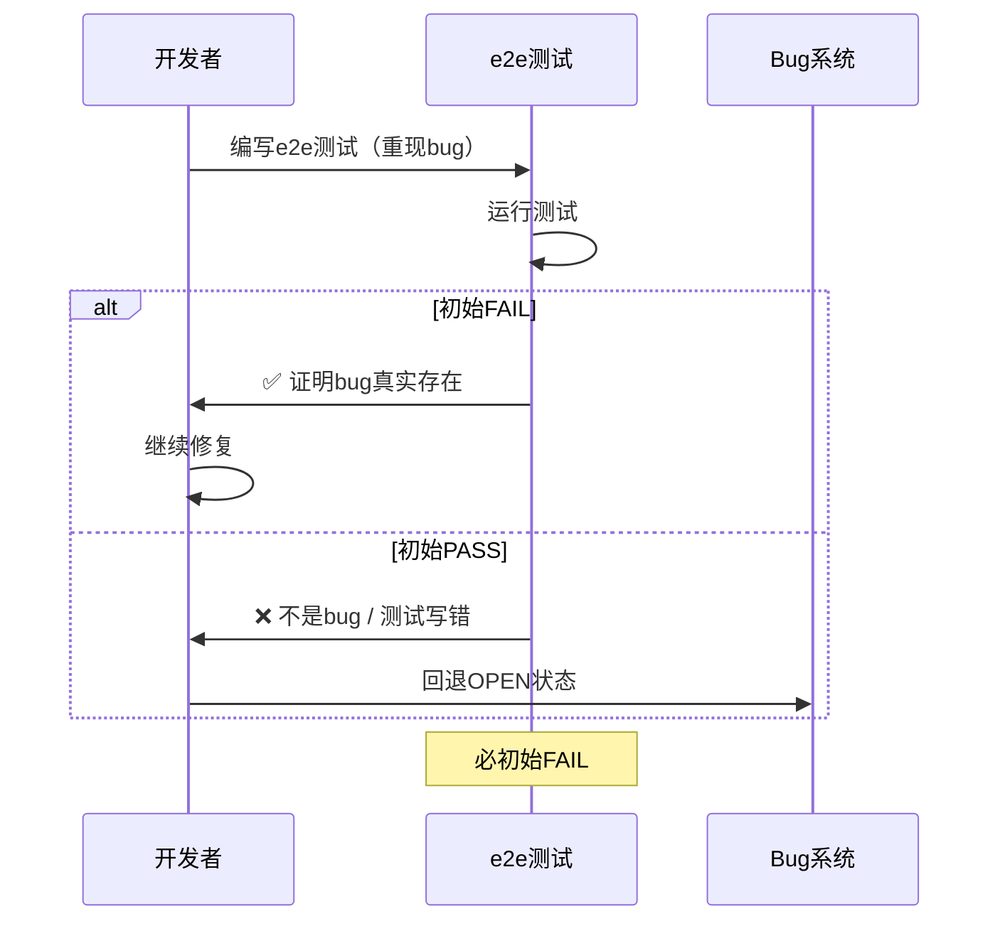

---

## 6 层排查

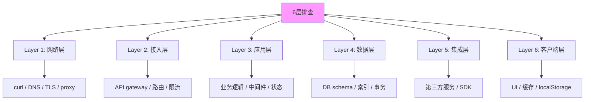

---

## Bug 单状态机

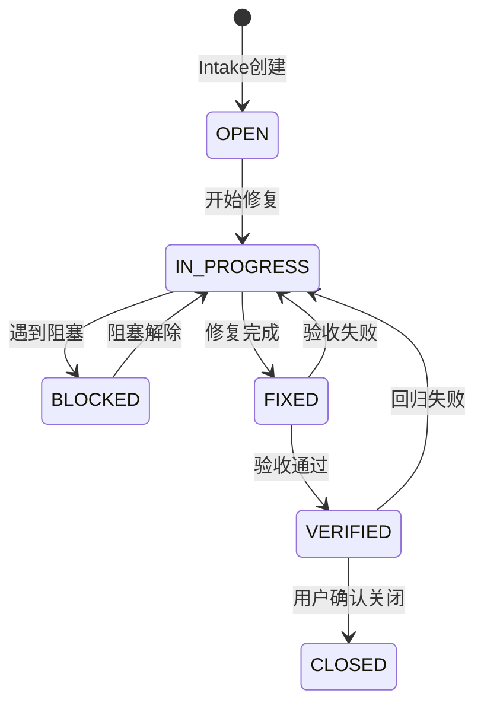

---

## TDD 修复流程

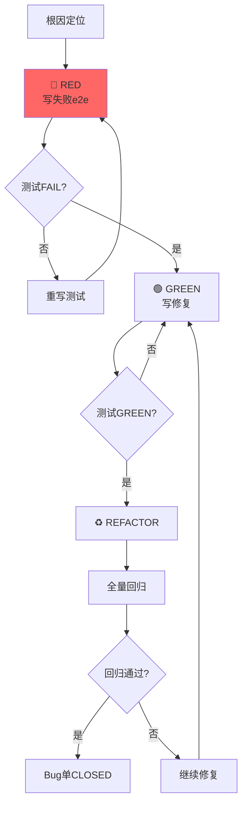

---

## 8 条铁律

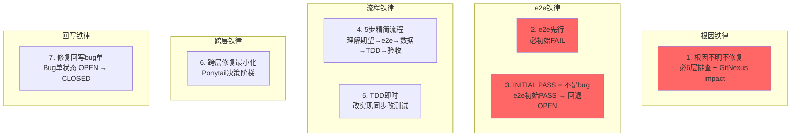

---

## 跨层修复最小化（Ponytail 决策阶梯）

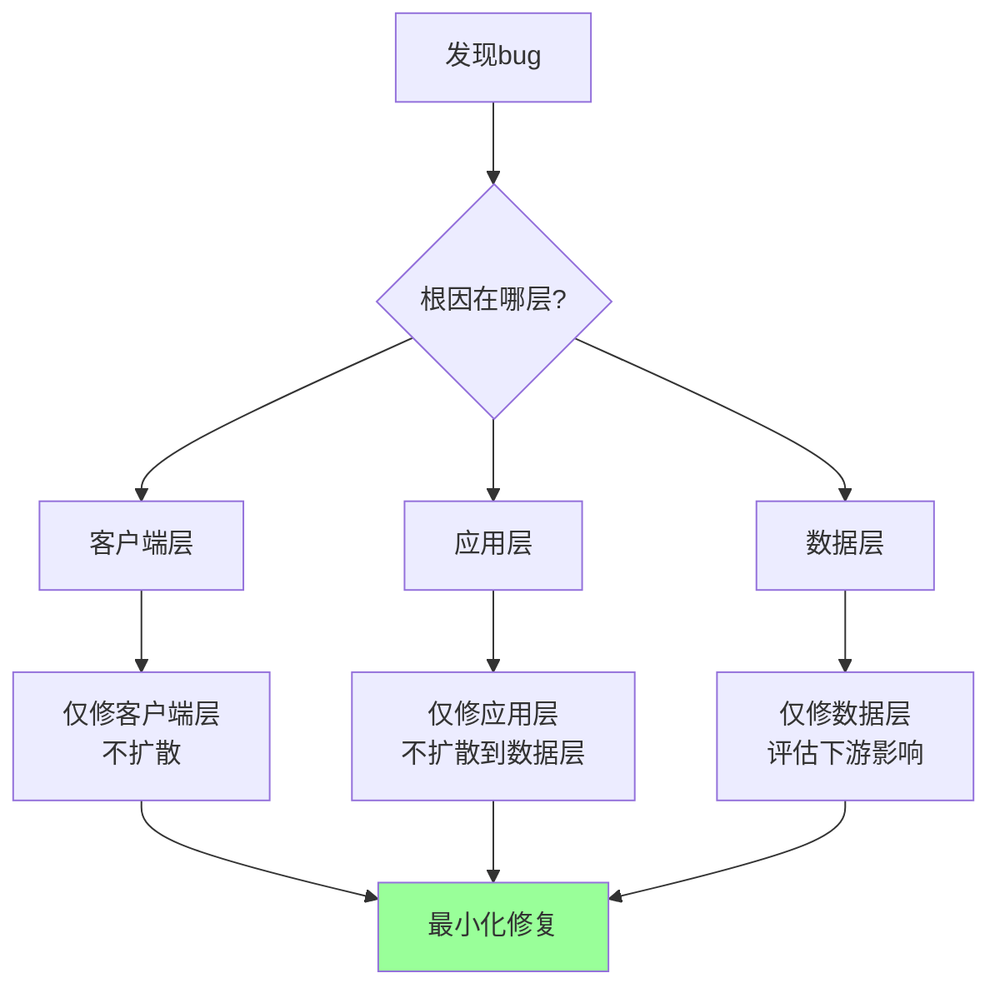

---

## 障碍诚实汇报（5 字段阻塞报告）

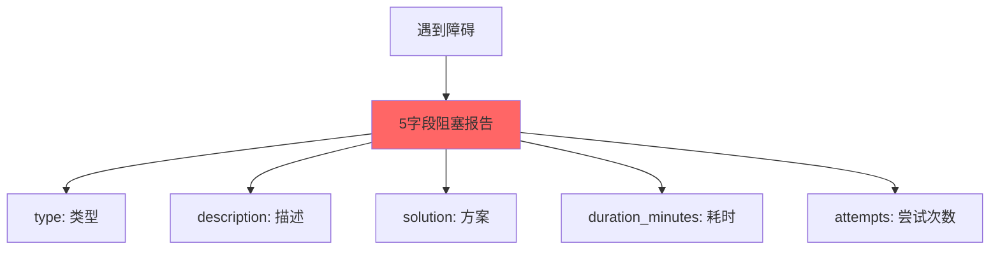

---

## 关键产物

```mermaid
graph TB
    A[Bug Fix产物] --> B[Bug单<br/>docs/bugs/{bug-id}.md]
    A --> C[e2e测试<br/>tests/e2e/test_{bug-id}.py]
    A --> D[修复代码<br/>src/{module}/{file}.ts]
    A --> E[根因报告（可选）<br/>docs/bugs/{bug-id}-root-cause.md]
    
    B --> B1[Intake创建]
    C --> C1[初始FAIL → GREEN]
    D --> D1[TDD修复]
```

---

## 交接物 4 件套

```yaml
hand_over:
  stage_id: "6/bug-fix"
  stage_skill: skills/12-bug-fix/SKILL.md
  status: completed
  health: "🟢 on-track"
  artifacts:
    - path: docs/bugs/{bug-id}.md
      type: file
      evidence: "Bug单状态 CLOSED"
    - path: tests/e2e/test_{bug-id}.py
      type: file
      evidence: "e2e测试 GREEN"
  gate_result:
    status: PASS
    gate: stage-gate.py
    output: "e2e GREEN + 全量回归PASS + bug单CLOSED"
  next_stage:
    id: null  # Bug Fix是独立支线，完成后归档
    skill_name: null
    expected_inputs: []
    prerequisites: []
```

---

## 4 条反模式

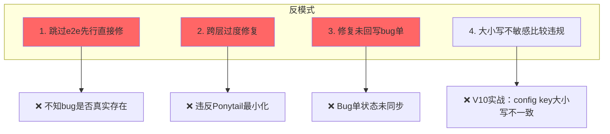

---

## 关联文档

- [5步精简流程](../skills/12-bug-fix/references/five-step-flow.md)
- [6层排查](../skills/12-bug-fix/references/six-layer-diagnosis.md)
- [跨层修复](../skills/12-bug-fix/references/cross-layer-fix.md)
- [Bug状态机](../skills/12-bug-fix/references/bug-state-machine.md)
- [V10实战蒸馏](../skills/12-bug-fix/anti-patterns/V10-battle-tested.md)