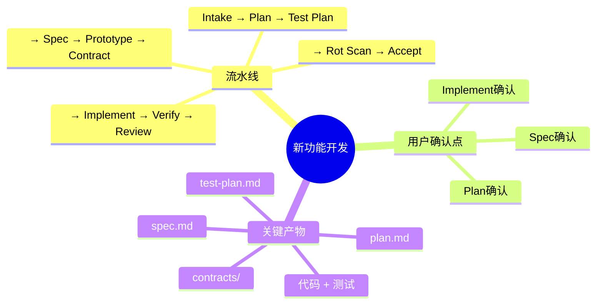
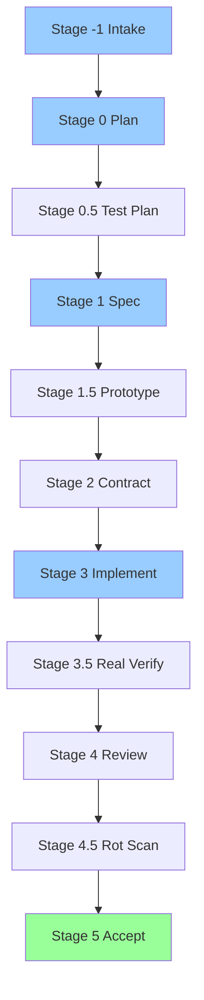
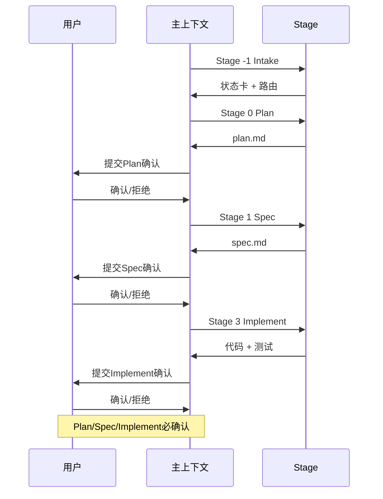
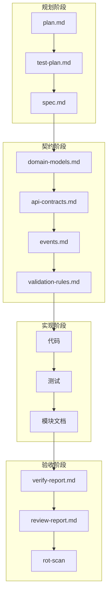
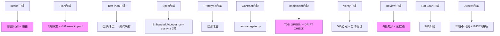
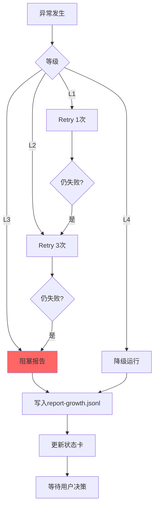

# 使用场景：新功能开发

> 完整的 13 阶段流水线 — 从 Intake 到 Accept。

---

## 场景总览

---

## 完整流水线

---

## 用户确认点

---

## 各阶段关键产物

---

## 门禁链

---

## 时间线估算

```mermaid
gantt
    title 新功能开发时间线
    dateFormat X
    axisFormat %s
    
    section 规划
    Intake :0, 1
    Plan :1, 2
    Test Plan :2, 3
    Spec :3, 4
    Prototype :4, 5
    
    section 契约
    Contract :5, 6
    
    section 实现
    Implement :6, 7
    Verify :7, 8
    
    section 验收
    Review :8, 9
    Rot Scan :9, 10
    Accept :10, 11
```

---

## 异常处理

---

## 关联文档

- [13阶段流水线](02-pipeline.md)
- [Intake阶段](11-stage-intake.md)
- [Plan阶段](12-stage-plan.md)
- [Contract阶段](16-stage-contract.md)
- [Implement阶段](17-stage-implement.md)
- [Review阶段](19-stage-review.md)