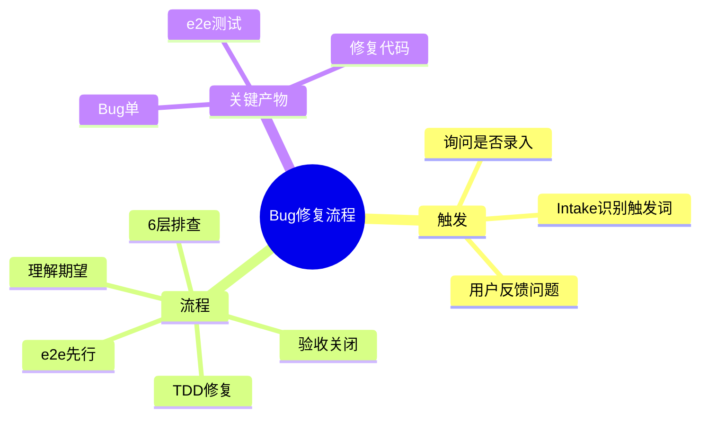
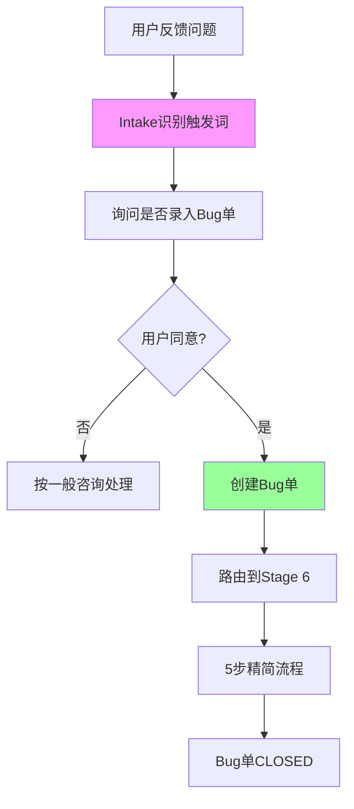
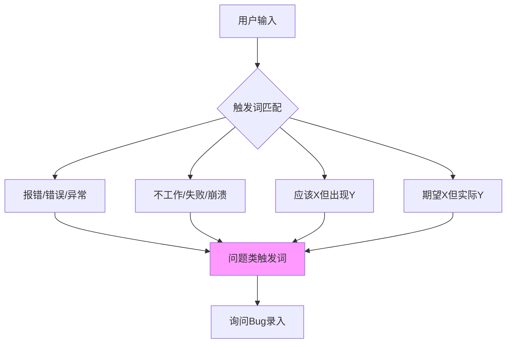
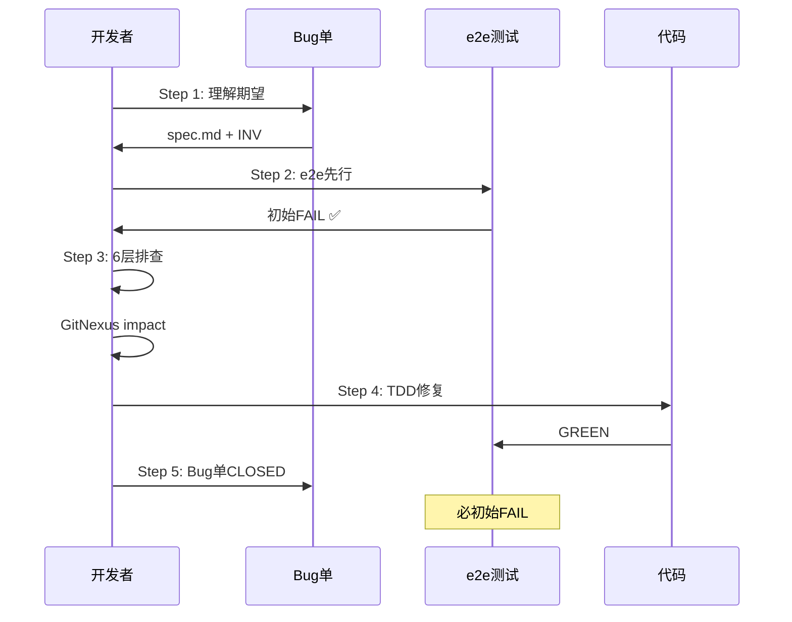
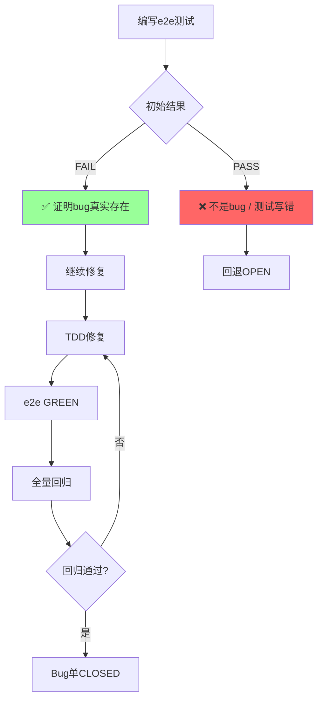
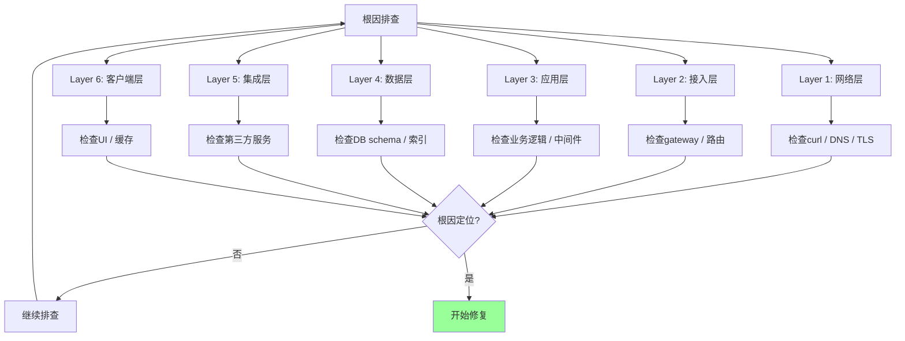
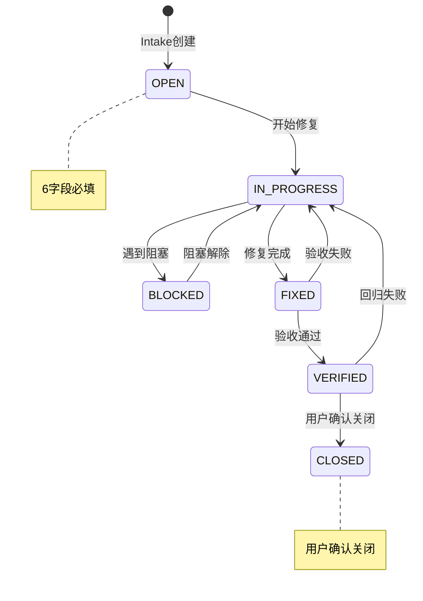
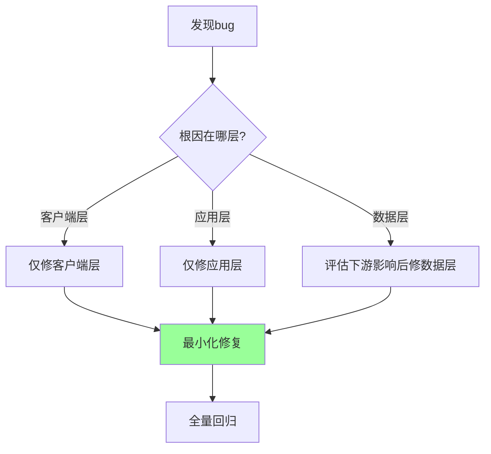
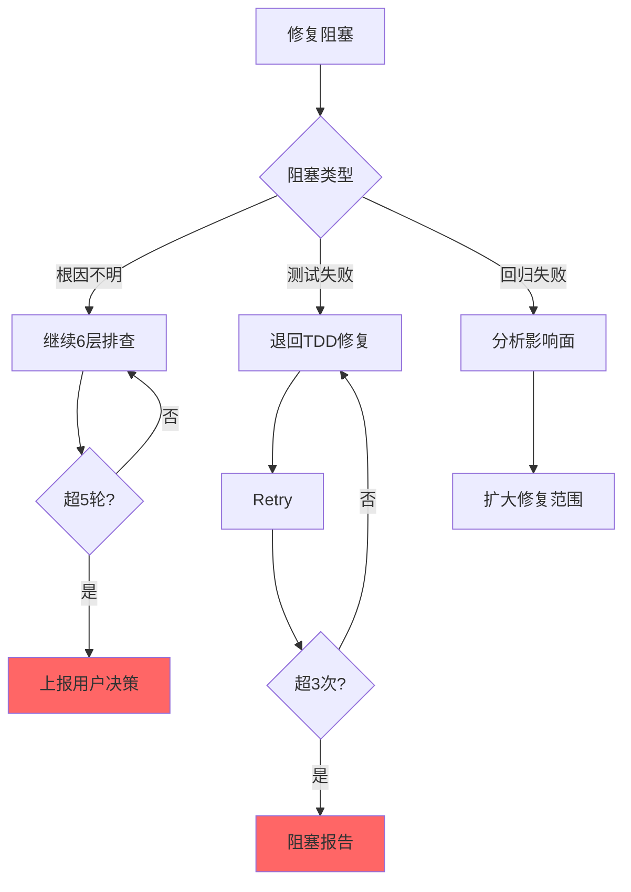

# 使用场景：Bug 修复流程

> Stage 6 独立支线 — 根因不明不修复 + e2e 先行。

---

## 场景总览



---

## Bug 修复流程



---

## 触发词识别



---

## 5 步精简流程



---

## e2e 先行验证



---

## 6 层排查详解



---

## Bug 单生命周期



---

## Bug 单 6 字段

```mermaid
graph TB
    A[Bug单] --> B[1. Bug ID]
    A --> C[2. 标题]
    A --> D[3. 复现步骤]
    A --> E[4. 期望行为]
    A --> F[5. 实际行为]
    A --> G[6. 优先级]
    
    B --> B1[格式: {module}-{seq}]
    C --> C1[一句话描述]
    D --> D1[详细步骤]
    E --> E1[用户期望]
    F --> F1[实际发生]
    G --> G1[P0/P1/P2/P3]
    
    style A fill:#f9f
```

---

## 跨层修复决策



---

## 异常处理



---

## 关联文档

- [Stage 6 Bug Fix](22-stage-bug-fix.md)
- [Stage -1 Intake](11-stage-intake.md)
- [6层排查](../skills/12-bug-fix/references/six-layer-diagnosis.md)
- [Bug状态机](../skills/12-bug-fix/references/bug-state-machine.md)