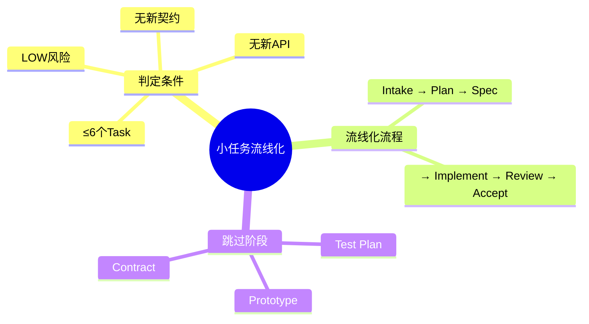
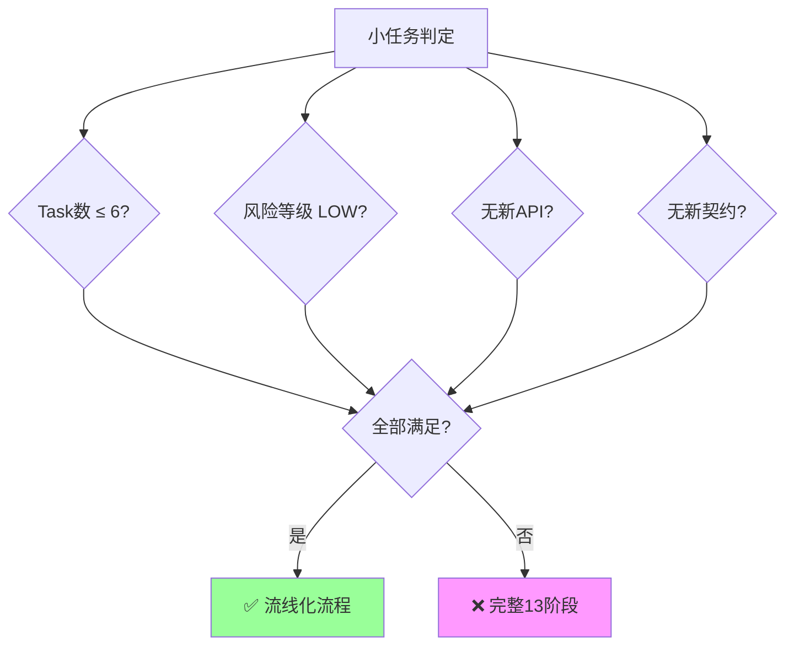
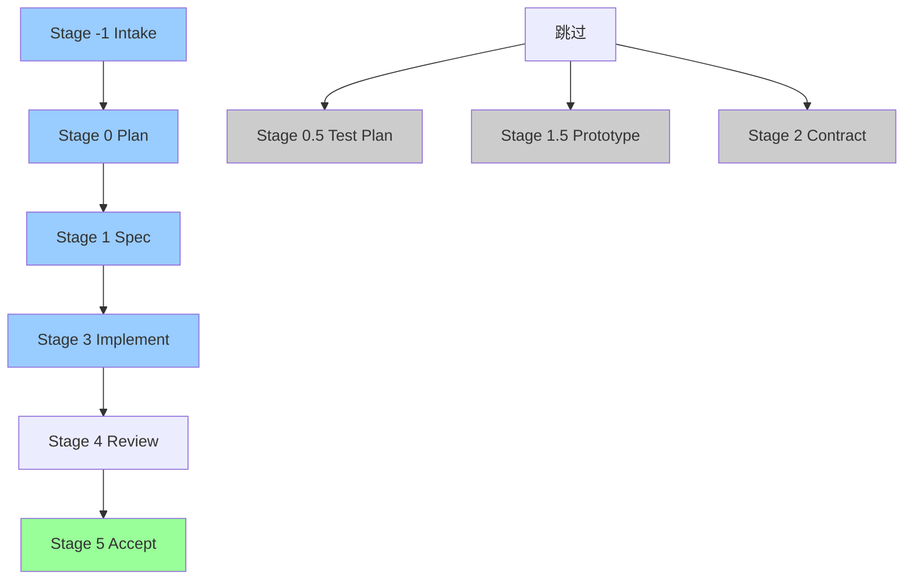
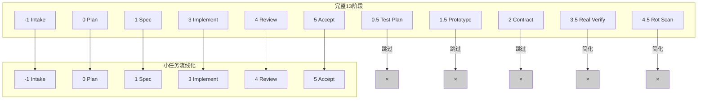
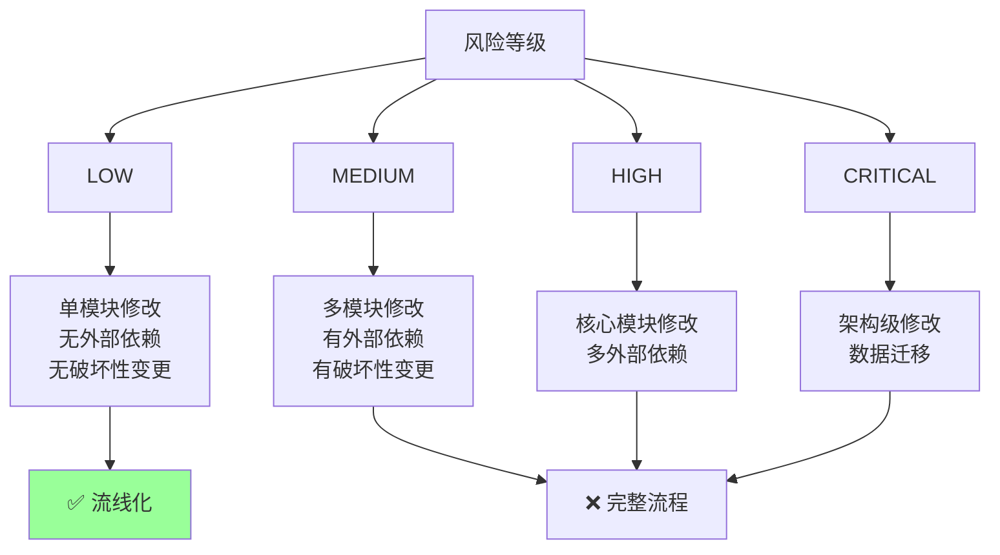
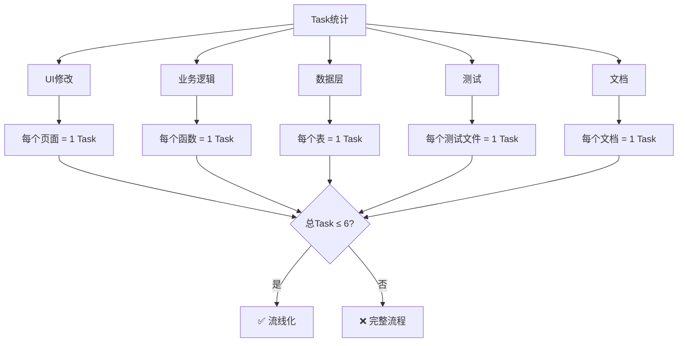
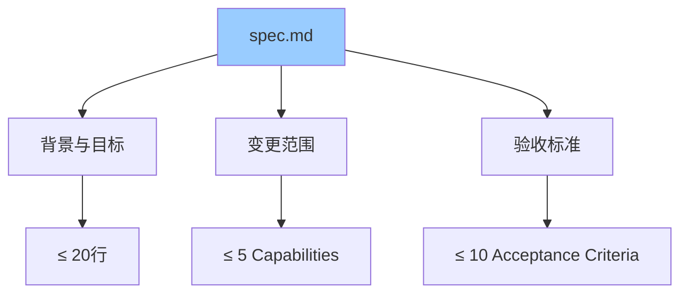
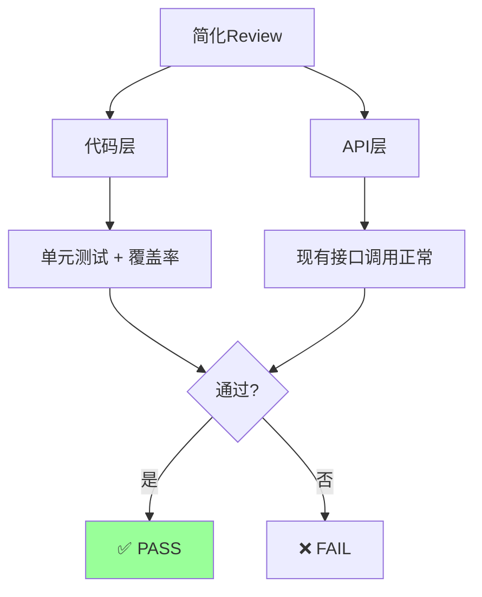
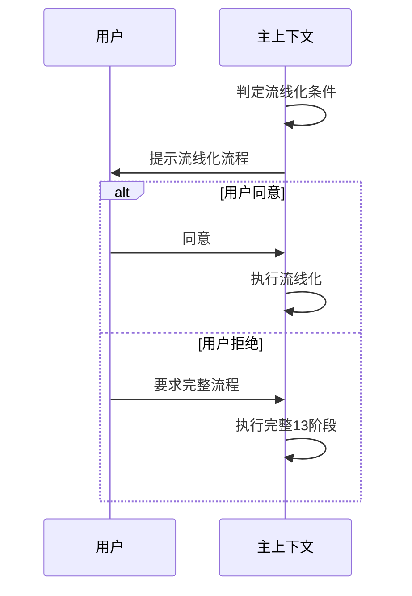
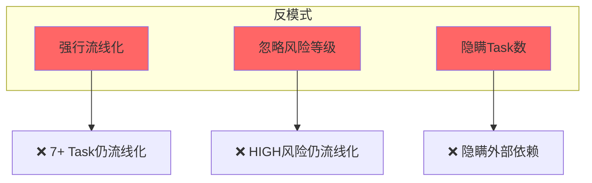

# 使用场景：小任务流线化

> ≤6 Task + LOW + 无新 API → 无 Contract，跳过部分阶段。

---

## 场景总览

---

## 判定条件

---

## 流线化流程

---

## vs 完整流程

---

## 风险等级判定

---

## Task 数统计

---

## 简化的 Spec

---

## 简化的 Review

---

## 用户确认

---

## 反例

---

## 关联文档

- [13阶段流水线](02-pipeline.md)
- [Stage 0 Plan](12-stage-plan.md)
- [Stage 1 Spec](../skills/04-spec/SKILL.md)
- [Stage 3 Implement](17-stage-implement.md)
- [Stage 4 Review](19-stage-review.md)