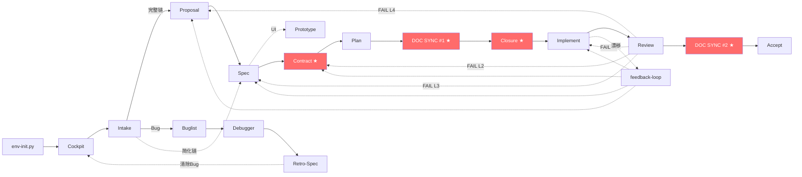

# Fullstack V7 操作指南

> 给用户和 Agent 的快速上手指南。方法论细节见 `references/`，Agent 定义见 `agents/`。

---

## 一分钟速览

Fullstack V7 是**文档驱动的全栈开发技能包**。核心思想：**先定义再开发，先文档再代码**。

```
你的想法 → Cockpit 定位 → Intake 去重 → Proposal(Why) → Spec(What) → [圆桌评审] → Contract(接口)
→ Design(How) → TDD 编码 → Review(打分) → Accept(验收)
```

### 流水线拓扑（Mermaid）



> 上图用 Mermaid 展示了 Agent 流水线拓扑。详细的 ASCII 线框图见 [SKILL.md §0](SKILL.md)。

---

## 目录结构（全貌）

```
项目根/
├── docs/
│   ├── modules/             ← 持久化模块文档（唯一事实来源）
│   ├── CODEMAPS/            ← 架构地图
│   ├── ARCHITECTURE.md      ← 架构总览
│   ├── prototypes/          ← 项目级组件速查（Cockpit 用）
│   ├── contracts/           ← 项目级公共协议
│   ├── test-plan/           ← 项目级测试策略
│   ├── archive/
│   │   ├── out/             ← 淘汰的 Spec
│   │   └── done/            ← 已完成的变更
│   └── specs/               ← 变更工作区
│       ├── config.yaml      ← 项目上下文 + 圆桌开关
│       ├── .state-card.md   ← 项目驾驶舱（Cockpit）
│       └── changes/
│           └── {NN}-{change-name}/   ← 每个变更一个目录
│               ├── .state-card.md
│               ├── proposal.md
│               ├── specs/{capability}/spec.md
│               ├── prototypes/       ← 施工图纸
│               ├── contracts/        ← 契约四件套
│               ├── meeting-notes/    ← 圆桌会议纪要
│               ├── design.md
│               ├── tasks.md
│               ├── check-list.md
│               ├── report-{0X}.md    ← 技能生长报告
│               └── acceptance-scorecard-*.md
└── src/                     ← 源代码
```

---

## 你的角色：在流水线中做什么

### 如果你是用户

| 阶段 | 你需要做什么 |
|------|------------|
| **提需求** | 直接说你要什么，Agent 自动走 intake |
| **Intake 后** | 确认流程定位卡，看到去重结果 |
| **Proposal 后** | 确认 Why + What + Non-Goals |
| **Spec 后** | 确认 BDD 场景是否符合预期 |
| **圆桌会议** | Review 会议纪要，裁决分歧 |
| **Design 后** | 确认技术方案 |
| **编码中** | 等待，Agent 按 tasks.md 逐项完成 |
| **Review 后** | 查看 7 维度打分卡 |
| **验收** | 确认交付 |
| **任何时候** | 说"状态"查看 Cockpit；打断就触发 report |

### 如果你是 Agent

| 阶段 | Agent | 核心动作 |
|------|-------|---------|
| **Cockpit** | 主 Agent | 读项目级 state-card，输出全局快照 |
| **Intake** | intake | 意图识别 → 30%去重 → 影响面 → 选链 → 状态卡 |
| **Proposal** | proposal-writer | 写 Why + What + Non-Goals |
| **Spec** | spec-writer | 写 BDD spec + E2E 场景 + 原型（涉及 UI 时） |
| **圆桌** | 主 Agent（主持） | 6 子代理并行评审 → meeting-notes 落盘 |
| **Contract** | contract-writer | 写领域模型 + API 契约 + 事件契约 |
| **Design** | planner | 编号决策 + tasks.md |
| **Dev** | implementer | CONTRACT GATE → TDD → 量化汇报 |
| **Review** | reviewer | 7 维度打分 + 漂移检测 |
| **Accept** | acceptance-discipline | E2E + 性能 + 安全 |

---

## 14 条铁律（Agent 必遵）

> 以下为 [SKILL.md](SKILL.md) §1 门禁链 + §2 五条铁律 + §5 禁止项的人类可读展开，不发明新约束。

```
 1. 不定位不进提案      → 先 Cockpit + intake
 2. 不提案不进规格      → proposal approved → spec
 3. 不规格不进契约      → spec approved → contract
 4. 不契约不进设计      → contract approved → design
 5. 不文档同步不编码    → DOC SYNC GATE 必须先过
 6. 不过测试不生产代码  → TDD 红绿重构
 7. 不量化打分不批准    → reviewer 必须 7 维度打分 ≥ 4.0
 8. 不验收不算完成      → acceptance 门禁
 9. 有漂移必须回流      → 不静默迁就
10. 状态卡必须真实      → 新会话自检，禁止假性完成
11. 需求重叠必须合并    → 30% 原子化去重
12. 有磕绊必须写报告    → report 生长
13. 分析前必须索引      → GitNexus 先于分析
14. 禁止降级兼容       → 拒绝 || / ?? 模糊写法
```

---

## 常见操作速查

### 开始新功能
```
你: "我要做用户认证功能"
Agent: Cockpit → intake(去重) → proposal → spec → [圆桌] → contract → design → ...
```

### 提需求时已有类似 change
```
Agent 自动检测 30% 重叠 → 提示合并到已有 change
你确认合并 → Agent 执行合并归档
```

### 查看进度
```
你: "状态" / "驾驶舱" / "进度"
Agent: 输出 Cockpit + per-change 状态卡
```

### 新会话重入
```
Agent 自动: 读 Cockpit → 自检文件系统 vs 状态卡 → 纠正假性完成
```

### 中途反馈
```
你: "这个设计不对，应该..."
Agent: 写 report（你的原文 + 反思）→ 回到对应阶段
```

---

## 配置你的项目

创建 `docs/specs/config.yaml`：

```yaml
schema: spec-driven

context: |
  Tech stack: TypeScript + React + Node.js
  Domain: e-commerce
  Conventions: conventional commits
  Architecture: modular-monolith

rules:
  proposal:
    - Keep proposals under 500 words
    - Always include Non-Goals section
  design:
    - Decisions must be numbered (D1, D2, ...)
  tasks:
    - Break tasks into chunks of max 2 hours

paths:
  changes: docs/specs/changes/{NN}-{change-name}/
  archive_out: docs/archive/out/{change-name}/
  archive_done: docs/archive/done/{change-name}/
  prototypes: docs/prototypes/

roundtable:
  enabled: true          # 是否启用圆桌会议
  max_rounds: 3
  auto_converge: true
```

---

## 状态卡是什么

两层卡片：

| 层级 | 路径 | 内容 |
|------|------|------|
| **Cockpit（项目级）** | `docs/specs/.state-card.md` | 所有 change 概览 + 项目工件状态 |
| **工位（per-change）** | `changes/{change}/.state-card.md` | 单 change 工件进度 + 健康度 |

Agent 激活时先读 Cockpit（全局定位），再读 per-change 卡片（当前任务）。

---

## 更多参考

| 你想了解 | 去哪里 |
|---------|--------|
| 完整方法论 | [SKILL.md](SKILL.md) |
| Agent 详细定义 | [agents/](agents/) |
| Cockpit 机制 | [references/cockpit.md](references/cockpit.md) |
| 圆桌会议 | [references/roundtable.md](references/roundtable.md) |
| 30% 去重规则 | [references/spec-overlap-merge.md](references/spec-overlap-merge.md) |
| Report/异常处理 | [references/report-growth.md](references/report-growth.md) |
| AOP 自检 + QA 门禁 | [references/aop-self-check.md](references/aop-self-check.md) + [templates/gate-qa-schema.md](templates/gate-qa-schema.md) |
| 工作流全景 | [workflows/README.md](workflows/README.md) |
| 项目规则引用 | [agents-guide.md](agents-guide.md) |

---

## FAQ（详细版）

> SKILL.md 保留 4 条核心 FAQ，其他迁移至此，按需查阅。

### "intake 阶段是必须的吗？"

是。任何需求进来都先经 intake 30 秒定位 + 去重检查。intake 解决"AI 绕路 + 重复建设"问题。详见铁律 1：NO INTAKE NO PROPOSAL。

### "圆桌会议什么时候开？"

spec.md 初稿完成后 + config.yaml 中 `roundtable.enabled = true`。涉及跨角色决策的需求建议开启，纯后端/纯 API 可跳过。详见 [references/roundtable.md](references/roundtable.md)。

### "report-{0X}.md 什么时候写？"

随时。用户打断、Agent 报错、发现优化点、自动驾驶磕绊——任何"不顺畅"的时刻都可以马上开子代理写。change 交付时强制整理汇总。详见 [references/report-growth.md](references/report-growth.md)。

### "30% 重叠怎么算？"

intake 先把用户需求拆成原子功能点（如"用户登录""密码重置""OAuth 绑定"），然后搜索已有 specs/ 和 proposals/，计算匹配的原子点比例。详见 [references/spec-overlap-merge.md](references/spec-overlap-merge.md)。

### "DOC SYNC GATE 和 CONTRACT GATE 是什么？"

- **DOC SYNC GATE**：编码前 Schema QA 检查 — KIT 脚本（文件存在）+ GATE 逻辑审查（内容一致性）。P0 内容必须已同步
- **CONTRACT GATE**：编码前 Schema QA 检查 — KIT 脚本（contracts/ 齐全 + approved）+ GATE 逻辑审查（接口覆盖 + test 骨架）

两个门禁都必须通过才能编码。V7 升级为 KIT+GATE 双通道。详见 [agents/implementer.md](agents/implementer.md) 步骤 0.5/0.7。

### "doc-updater V7 和 V5 有什么不同？"

V7 的 doc-updater 同步范围从 CODEMAP/ARCHITECTURE 扩展到 prototypes/、archive/out、archive/done、test-plan/，从"代码地图生成器"升级为"全栈文档管家"。详见 [agents/doc-updater.md](agents/doc-updater.md)。

### "V5 和 V7 有什么区别？"

详见 [references/CHANGELOG.md](references/CHANGELOG.md) 的 V7.0 条目。核心变化：双层 Cockpit、out/done 归档拆分、30% 原子化去重、圆桌会议、Report Try-Catch、AOP 自检 + Schema QA 门禁、14 条铁律。
