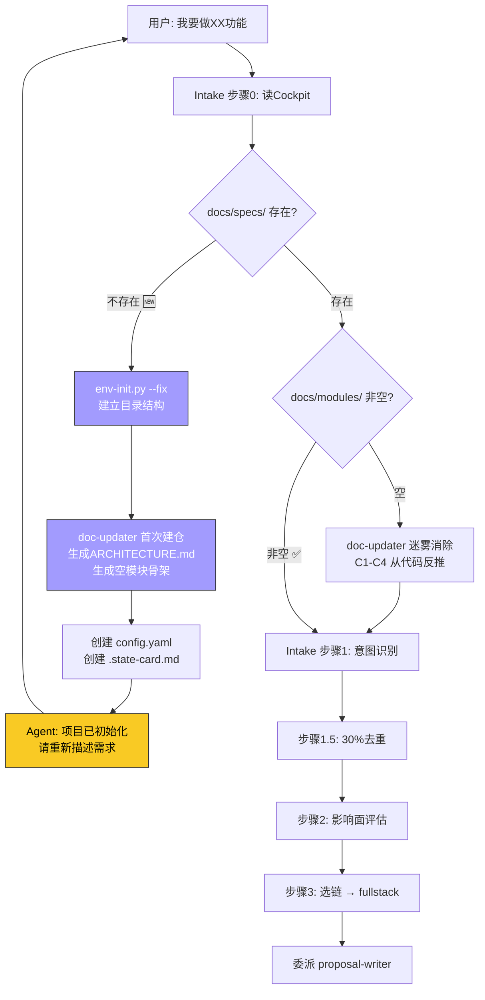

# 场景 1: 项目 0→1 初始化

> **模拟**: 用户首次在空项目中启用 fullstack4traev7，项目没有任何 docs/ 目录。

---

## 用户视角

```
用户: "我要在这个项目里做个用户认证功能"

Agent: 🛩️ Cockpit 快照...

        检测到: docs/specs/ 目录不存在
        项目未初始化，开始自动初始化...

        → 运行 env-init.py --fix（建立目录结构）
        → 委派 doc-updater 生成初始 ARCHITECTURE.md + 空模块骨架
        → 创建 docs/specs/config.yaml（最小配置）
        → 创建 docs/specs/.state-card.md（空 Cockpit）

Agent: 项目已初始化完成。请重新描述你的需求，我会在完整的文档体系上做增量。

用户: "我要做用户认证功能"

Agent: [走完整链 Phase 1-8...]
```

---

## 系统内部流程



---

## 关键决策点

| 决策点 | 判断条件 | 结果 |
|--------|---------|------|
| 项目是否已初始化 | `docs/specs/` 目录存在？ | 不存在 → 自动初始化 |
| 模块文档是否就绪 | `docs/modules/` 非空？ | 空 → 迷雾消除，从代码反推 |
| 初始化后 | 用户需重新输入需求 | 因为初始化改变了项目状态 |

---

## 与正常流程的区别

- 正常流程: Cockpit → Intake → Proposal → ...（Phase 0 秒过）
- 0→1 流程: 多了一步"检测 → 初始化 → 用户重输"（Phase 0 额外处理）
- 后续 Agent 看到的是一个有骨架的项目，和正常流程完全一致
