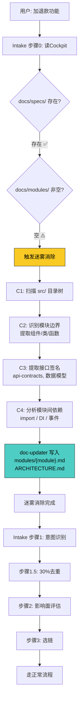

# 场景 2: 已有代码初始化（迷雾消除）

> **模拟**: 项目已有成熟代码，但 docs/ 目录刚创建（modules/ 全空）。用户想要新增功能。

---

## 用户视角

```
用户: "我要在支付模块里加一个退款功能"

Agent: 🛩️ Cockpit 快照...

        ⚠️ docs/modules/ 为空 — 模块文档未建立
        开始迷雾消除，从代码反推模块结构...

        → 扫描 src/ 目录结构
        → 识别模块: auth, payment, order, user
        → 提取接口: POST /api/payment/charge, GET /api/order/:id
        → 提取依赖: payment → order, payment → user
        → 写入 docs/modules/payment.md, docs/modules/order.md, ...
        → 生成 docs/ARCHITECTURE.md

        迷雾消除完成，模块文档已建立。
        继续 intake — "退款功能"...

Agent: [正常走 Intake → Proposal → ...]
```

---

## 系统内部流程



---

## 关键决策点

| 决策点 | 判断条件 | 结果 |
|--------|---------|------|
| Cockpit 存在但 modules/ 空 | 项目目录有，但文档未建立 | 迷雾消除 → 从代码反推 |
| 迷雾消除触发者 | intake 步骤 0.1 检测 | 委派 doc-updater |
| 迷雾消除后的 spec-writer | modules/ 已有内容 | spec-writer 可以 DELTA ONLY 写增量 |

---

## 与正常流程的区别

- 正常流程: Intake 步骤 0 秒过，直接步骤 1
- 已有代码初始化: 步骤 0.1 触发迷雾消除（约 30s-2min），然后继续步骤 1
- 好处: spec-writer 后续写 spec 时，modules/ 已经有模块文档可以引用
