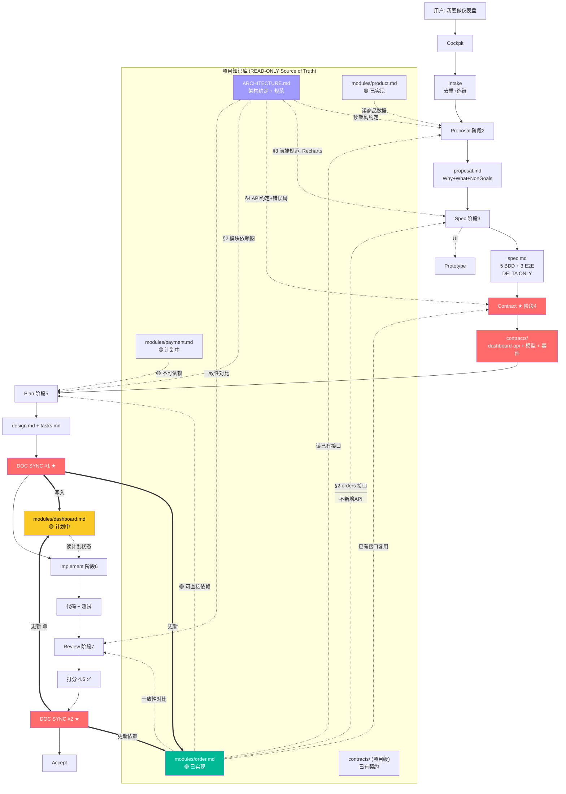

# 场景 3: 新增 Spec 完整链

> **模拟**: 用户提出一个新功能需求，走完整 fullstack 链。每个 Agent 第一步都是从项目知识库召回已有上下文，然后写增量。

---

## 核心原则: SPEC ON SYNCED DOCS

> **新 spec 永远在已同步的文档基础之上分析，不是从零凭空设计。**

```
每个 Agent 的内部流程:

1. 读 Cockpit（phase/state）
2. 召回知识库（ARCHITECTURE.md + modules/*.md + contracts/）
      ↓
    "我知道项目中已经有什么，我只需要写增量"
      ↓
3. 产出增量工件（DELTA ONLY — 不复制知识库已有内容）
```

---

## 用户视角

```
用户: "我要做一个仪表盘功能，展示销售数据趋势和今日订单统计"

[本项目的知识库当前状态:
  ARCHITECTURE.md: 前端 React 18 + 后端 Express + PostgreSQL
  modules/order.md:   订单模块已实现 — GET /api/orders, GET /api/orders/:id
  modules/product.md: 商品模块已实现 — GET /api/products
  modules/payment.md: 支付模块已实现 — 已计划退款（🟡）

  → 仪表盘 = 读已有模块接口 + 可视化层，不新建后端逻辑]

---
Phase 0: Cockpit
  🛩️ 活跃 1 个 change，🐛 无 bug
  知识库就绪: modules/ 4 个模块文档，ARCHITECTURE.md ✅

Phase 1: Intake
  意图: 新功能
  去重: 无重叠
  选链: fullstack 完整链

Phase 2: Proposal
  proposal-writer 启动:
    → 读 ARCHITECTURE.md (知道: React 18 + Express + PostgreSQL)
    → 读 modules/order.md (知道: 已有订单查询接口，返回 daily aggregation)
    → 读 modules/product.md (知道: 已有商品分类数据)

    → 产出 proposal.md:
        Why: 销售数据可视化，管理层需要实时看板
        What: 仪表盘页面 — 趋势图 + 订单统计卡片
        Capabilities: dashboard-trend, dashboard-today-stats
        Non-Goals: 数据导出、自定义报表（复用已有 order 接口即可）

Phase 3: Spec
  spec-writer 启动:
    → 🗂️ 召回知识库:
         ARCHITECTURE.md   §3 前端规范: 所有图表统一用 Recharts
         modules/order.md  §2 接口: GET /api/orders?date=YYYY-MM-DD
         modules/product.md §2 接口: GET /api/products/categories
    → 已有接口支持趋势和统计 → spec 聚焦在可视化层
    → spec.md 只写此变更的增量行为场景（不负读已有接口文档）

    → 产出 spec.md (5 个 BDD 场景 + 3 个 E2E):
        Scenario 1: 默认展示今日订单统计
        Scenario 2: 鼠标悬停趋势图显示详情 tooltip
        Scenario 3: 日期范围筛选刷新图表
        Scenario 4: 空数据状态（无订单日）
        Scenario 5: 响应式布局（移动端卡片堆叠）
    → 涉及 UI → 委派 prototype-writer 出 ASCII 线框图

Phase 4: Contract ★
  contract-writer 启动:
    → 召回:
         ARCHITECTURE.md   §4 API 设计约定: 统一错误码格式、分页规范
         modules/order.md  §2: GET /api/orders (已有，不需要重新定义)
         spec.md            §3: 仪表盘需要的 order 数据格式
    → 判定: 不新增 API（复用已有 order 接口）→ 只定义前端组件契约
    → 产出 contracts/:
        dashboard-api.md:   前端调用 order 接口 + 数据转换层
        domain-models.md:   DashboardData, TrendPoint, StatsCard
        events.md:          date_range_changed, dashboard_loaded
        validation.md:      日期格式校验 + 数据范围校验

Phase 5: Plan
  planner 启动:
    → 召回:
         ARCHITECTURE.md   §2 模块依赖图: 前端 → API Gateway → order-service
         modules/order.md  🟢 已实现 — 可直接依赖
         modules/payment.md 🟡 计划中 — 不可依赖退款数据
    → 方案对比 (3 个):
        A. 前端直调 order 接口（推荐 — 最简单）
        B. 新建 /api/dashboard 聚合接口（多一层，但不必要 — 数据量小）
        C. WebSocket 实时推送（过度设计 — 仪表盘不需要实时）
    → 选择方案 A
    → 产出 design.md + tasks.md (8 个 task)

Phase 5.5: DOC SYNC #1 ★
  doc-updater 启动:
    → 读 contracts/dashboard-api.md + domain-models.md
    → 写入 modules/dashboard.md:
        📋 能力: 销售趋势图 + 今日统计卡片
        📡 接口: 复用 GET /api/orders (无新增)
        📊 模型: DashboardData, TrendPoint
        🔗 依赖: order(🟢)
        实施状态: 🟡 计划中
        来源 Change 04-dashboard
    → 写入 modules/order.md: 新增引用 — "被 dashboard 模块依赖"
    → 提取原型到 docs/prototypes/dashboard/

Phase 5.6: Closure
  planner 产出 closure-checklist.md:
    P0 最小闭环: 页面加载 → 调 order 接口 → 渲染趋势图 + 统计卡片
    验收: 打开仪表盘 → 看到今日数据 → 切换日期范围 → 图表更新

Phase 6: Implement
  implementer 启动:
    → CONTRACT GATE: contracts/dashboard-api.md 已批准 ✅
    → DOC SYNC GATE: modules/dashboard.md 已存在 ✅
    → 🔴RED: 写测试 (5 个组件测试 + 3 个 E2E)
    → 🟢GREEN: 实现 3 个组件 (TrendChart, StatsCard, DateFilter)
    → 🔍DRIFT CHECK: 代码 vs contracts/ 一致
    → 覆盖率 87%

Phase 7: Review
  reviewer 启动:
    → 召回:
         变更: spec.md + contracts/ + code
         知识库: modules/order.md + ARCHITECTURE.md (对比一致性)
    → 7 维度打分 4.6/5.0 ✅

Phase 7.5: DOC SYNC #2 ★
  doc-updater 启动:
    → 更新 modules/dashboard.md: 🟢 已实现 — 覆盖率 87%
    → 更新 modules/order.md: "被 dashboard 依赖" → 🟢 dashboard 已完成
    → 去死链: grep docs/ → 无 specs/changes/ 残留引用

Phase 8: Accept
  acceptance-discipline: E2E 全绿 + Lighthouse 90+ + 安全门禁通过
```

---

## 系统内部流程（完整版 — 知识库召回视角）



> **图例**: 虚线 `-.->` = READ（召回知识库）/ 实线 `-->` = 流程推进 / 粗线 `==>` = WRITE（写入知识库）

---

## 每个 Agent 的"召回 → 产出"对照

| 阶段 | Agent | 召回知识库（读到什么） | 产出（写什么） | 为什么是增量 |
|------|-------|----------------------|---------------|------------|
| Proposal | proposal-writer | ARCHITECTURE.md + modules/order + modules/product | proposal.md | 知道已有接口 → 不重复提案 |
| Spec | spec-writer | ARCHITECTURE.md §3 + modules/order §2 | spec.md BDD 场景 | 知道已有接口 → spec 只定义可视化层 |
| Contract | contract-writer | ARCHITECTURE.md §4 + modules/order §2 + spec.md | contracts/ 四件套 | 知道已有 API → 不定义重复接口 |
| Plan | planner | ARCHITECTURE.md §2 + modules/order 🟢 + modules/payment 🟡 | design.md + tasks.md | 知道模块状态 → 排正确的依赖 |
| DOC SYNC #1 | doc-updater | contracts/ + spec.md | modules/dashboard.md | 把策划内容写回知识库 |
| Implement | implementer | modules/dashboard.md + contracts/ | 代码 + 测试 | 知道计划状态 → 按计划编码 |
| Review | reviewer | ARCHITECTURE.md + modules/order + code | 打分卡 | 知道全局约定 → 比较一致性 |
| DOC SYNC #2 | doc-updater | 代码 + 测试结果 | modules/dashboard.md (最终) | 把实现状态写回知识库 |

---

## Spec on Synced Docs — 每次写之前的神圣步骤

```
Agent 启动
    ↓
1. 读 Cockpit → 知道全局状态
2. 读 ARCHITECTURE.md → 知道项目约定
3. 读 modules/{related}.md → 知道已有接口/依赖/状态
4. 读 contracts/（如有项目级契约）→ 知道已有契约
    ↓
现在 Agent 脑中已有完整上下文
    ↓
5. 写增量工件（DELTA ONLY）
    - 不复制知识库中已有的定义
    - 不重复定义知识库中已有的接口
    - 只写此变更 net-new 的内容
```

---

## 与旧版流程的关键区别

| 维度 | 旧版（场景 03 v1） | 新版（v2 — Spec on Synced Docs） |
|------|-------------------|----------------------------------|
| Proposal 是否读 modules/ | ❌ 没展示 | ✅ 读 ARCHITECTURE + modules/ |
| Spec 是否读已有接口 | ❌ 没展示 | ✅ 读 modules/order §2 |
| Contract 是否用已有接口 | ❌ 看起来像新建 API | ✅ 判定: 复用已有 order 接口 |
| Plan 是否读模块状态 | ❌ 没展示 | ✅ 读 modules/payment 🟡（不可依赖） |
| Mermaid 图 | 只画 WRITE 方向 | 画 READ + WRITE 双向 |
