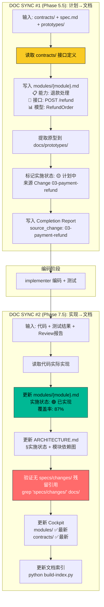

# 场景 4: Spec 回流（DOC SYNC 知识持久化）

> **模拟**: 一个 spec 完成后，知识如何从临时工件（specs/changes/）回流到持久化文档（modules/、ARCHITECTURE.md），供后续所有 Agent 参考。

---

## 用户视角

```
用户看不到 DOC SYNC 的细节——这是系统内部机制。
用户只知道："Agent 在 plan 之后和 review 之后各做了一次文档同步。"

DOC SYNC #1（Phase 5.5，plan 确认后）:
  - 把 contracts/ 中的接口定义写入 modules/payment.md
  - 把 spec 中的能力描述写入 modules/payment.md
  - 把原型提取到 docs/prototypes/
  - 标记 modules/payment.md 实施状态: 🟡 计划中

DOC SYNC #2（Phase 7.5，review 通过后）:
  - 把代码实现后的最终状态写入 modules/payment.md
  - 标记实施状态: 🟢 已实现
  - 更新 ARCHITECTURE.md §实施状态
  - 验证无 specs/changes/ 残留引用
  - 更新 Cockpit 项目级工件状态
```

---

## 系统内部流程



---

## 知识回流前后对比

| 时间点 | modules/payment.md 状态 | 其他 Agent 读到什么 |
|--------|------------------------|-------------------|
| DOC SYNC #1 前 | 无退款能力描述 | spec-writer 从零开始 |
| DOC SYNC #1 后 | 🟡 计划中 — 退款处理能力 | 其他 change 知道"正在计划退款" |
| DOC SYNC #2 后 | 🟢 已实现 — 覆盖率 87% | 其他 change 可以依赖退款接口 |

---

## 为什么有两次 DOC SYNC

- **#1（Phase 5.5）**: 让其他并行的 change 知道"有计划中的接口"（虽然还没实现）
- **#2（Phase 7.5）**: 让所有后续 change 知道"接口已稳定可用"（代码已完成+Review通过）
- 两次之间: modules/ 中的内容带 traceability（来源 Change XX），Agent 可以判断状态
