# 场景 5: 小 Bug 修复 — 反馈交流 + 快捷回流同步

> **模拟**: 用户报告 Bug → 修复 → 用户追加反馈 → 新会话重入自动识别。

---

## 用户视角 — 第一幕：发现 Bug

```
用户: "登录超时后页面白屏了，没有重试"

Agent: 🛩️ Cockpit 快照...
        🐛 新 Bug 登记: B1 登录超时未重试
        📋 创建 buglist: docs/specs/changes/03-login-timeout-bug/
           Cockpit 🐛段 +1

Agent: Bug 已登记。现在开始根因调查...
        → 委托 debugger

[debugger 执行中...]
  🔴RED: test_auth_timeout_retry → 复现超时白屏
  🟢GREEN: auth.ts catch TimeoutError + 重试 3 次 + fallback UI
  回归: 24 个测试全绿

Agent: Bug 已修复，走 Retro-Spec 归档...

[doc-updater 执行中...]
  modules/auth.md: 超时重试逻辑已添加
  Cockpit 🐛段: B1 ✅已修复

Agent: ✅ 修复完成。
```

---

## 用户视角 — 第二幕：反馈交流

```
用户: "等一下，重试逻辑有个问题——如果用户网络真的断了，3 次重试白等 15 秒"

Agent: 收到反馈。更新 buglist B1:
        状态: 🔍 重新调查
        用户反馈: "网络断开时 3 次重试空等 15 秒不合理"
        交流历史: +1 条

Agent: 重新委派 debugger...

[debugger 执行中...]
  修正: 网络不可用检测（navigator.onLine）→ 无网络时跳过重试
  🟢GREEN: 测试通过（离线+在线 2 场景覆盖）

Agent: 修正完成。

[doc-updater 执行中...]
  modules/auth.md: 重试前检查网络可用性
  Cockpit 🐛段: B1 ✅已修复
```

---

## 用户视角 — 第三幕：新会话重入（关键！）

```
[用户关闭 IDE。第二天重新打开，新对话窗口。]

用户: "Hi"

Agent: 🛩️ Cockpit 快照...
        ⚠️ 🐛段有已修复但未归档的 bug: B1
        （已过 24h，状态仍为 ✅已修复，尚未清除）

        建议: 确认 B1 修复无误后归档。

用户: "测试通过了，确认修复"

Agent: doc-updater 归档...
        Cockpit 🐛段: B1 已清除 → 移入已修复历史注释
```

## 用户视角 — 第四幕：新 Bug + 旧 Bug 共存

```
[几天后，新的会话。]

用户: "支付页面加载很慢"

Agent: 🛩️ Cockpit 快照...
        🐛 活跃缺陷: 0 个
        ✅ 继续处理新需求
        → intake: Bug → bug-batch 链
        → 创建 B2: 支付页面加载慢 → Cockpit 🐛段 +1

[后续在下一轮会话...]

Agent: 🛩️ Cockpit 快照...
        ⚠️ 有 1 个未解决的 bug:
        | B2 | 支付页面加载慢 | payment | 🟡 P1 | 🔍 调查中 |
        是否要先处理 bug？

用户: "是的，继续调查"

Agent: 加载 buglist.md...
        Bug B2 当前状态: 🔍 调查中
        上次交流: [2026-07-12] "支付页面加载很慢"
        下一步建议: 继续根因调查
        → 委派 debugger
```

---

## 系统内部流程（完整版）

```mermaid
graph TD
    subgraph S1["第一幕: 发现Bug"]
        U1["用户: 登录超时白屏"] --> I1["Intake<br/>Cockpit快照<br/>🐛段=0<br/>选链:bug-batch"]
        I1 --> BL["创建 buglist.md<br/>Cockpit 🐛段 +1: B1"]
        BL --> DBG["委派 debugger"]
        DBG --> RED["🔴RED 复现测试"]
        RED --> GREEN["🟢GREEN 修复+回归"]
        GREEN --> RETRO["Retro-Spec<br/>doc-updater 同步"]
        RETRO --> CK1["Cockpit B1: ✅已修复"]
    end

    subgraph S2["第二幕: 反馈交流"]
        U2["用户: '重试逻辑有问题'"] --> FB["Agent 写 buglist.md<br/>用户反馈列 + 交流历史"]
        FB --> CK2["Cockpit B1: 🔍重新调查<br/>用户反馈: 空等15秒"]
        CK2 --> DBG2["重新委派 debugger<br/>网络可用性检测"]
        DBG2 --> RETRO2["Retro-Spec<br/>Cockpit B1: ✅已修复"]
    end

    subgraph S3["第三幕: 新会话重入"]
        U3["用户: Hi (新窗口)"] --> CHK{"intake 步骤0.05<br/>Cockpit 🐛段有未归档?"}
        CHK -->|"有 B1"| LOAD["提示用户: B1 已修复<br/>建议归档或继续调查"]
        LOAD --> ARCH["doc-updater 归档<br/>Cockpit 🐛段清除B1"]
    end

    subgraph S4["第四幕: Bug共存 新会话"]
        U4["用户: 支付页面慢"] --> CHK2{"步骤0.05<br/>Cockpit 🐛段?"}
        CHK2 -->|"空"| NEW_BUG["创建 B2<br/>Cockpit 🐛段 +1"]
        NEW_BUG --> NEXT["下一轮会话..."]
        NEXT --> CHK3{"步骤0.05<br/>Cockpit 🐛段?"}
        CHK3 -->|"B2 存在"| PROMPT["⚠️ 1个未解决bug<br/>是否先处理?"]
        PROMPT -->|"是"| RESUME["读 buglist.md<br/>恢复上下文"]
    end

    style BL fill:#f9ca24,stroke:#333,color:#000
    style FB fill:#a29bfe,stroke:#333,color:#fff
    style CHK fill:#ff6b6b,stroke:#333,color:#fff
    style CHK3 fill:#ff6b6b,stroke:#333,color:#fff
    style RESUME fill:#4ecdc4,stroke:#333,color:#000
```



---

## Buglist — 用户与 Agent 的反馈媒介

```
buglist.md 的三重角色:

1. Bug 登记表   — 活跃 Bug + 已修复 Bug
2. 反馈收件箱   — 用户说"不对/有问题/改成" → Agent写入"用户反馈"列
3. 会话恢复锚   — 新窗口/新会话 → Agent读 buglist 恢复交流上下文
```

| 用户说 | Agent 写入 buglist | Cockpit 同步 |
|--------|-------------------|-------------|
| "这个 bug 应该是 XX 原因" | 用户反馈列: "应该是 XX 原因" | 状态不变 |
| "修复的不对，应该 YY" | 状态回退 🔍, 交流历史 +1 | 状态: 🔍重新调查 |
| "确认修复没问题" | 状态: ✅已修复 | 状态: ✅已修复 |

---

## 与完整链的区别

| 维度 | 完整链 | Bug修复链 |
|------|--------|----------|
| 走 proposal? | 是 | 否 |
| 走 spec? | 是 | 否 |
| 走 contract? | 是 | 否（除非BREAKING接口变更） |
| 走 DOC SYNC? | #1 + #2 | 仅 Retro-Spec 时一次 |
| 委派 debugger? | 否 | 是（核心） |
| 更新 Cockpit? | 更新 change 进度 | 更新 🐛段 |
| 用户反馈通道 | proposal 审批 | buglist 反馈列 + 交流历史 |

---

## Cockpit bug 信号生命周期

```
用户报告 → intake 创建 buglist → Cockpit 🐛段 +1
    ↓
debugger 调查中 → 状态: 🔍
    ↓
用户反馈 "不对" → intake 写 buglist + Cockpit 回退 🔍
    ↓
debugger 修复完成 → 状态: ✅已修复
    ↓
用户确认 → doc-updater 归档 → Cockpit 🐛段清除
    ↓
历史保留: <!-- B1已修复于2026-07-10 -->
```

---

## 新会话重入协议速查

```
intake 步骤 0 → Cockpit 快照
    ↓
步骤 0.05 → 🐛段有 P0/P1 未修复？
    ├── 是 → 提示 "有 N 个未解决 bug" + 输出摘要表
    │        用户选"是" → 读 buglist.md → 恢复上下文 → route
    │        用户选"否" → 继续新需求
    └── 否 → 继续步骤 1
```

> **关键**: 无论用户是否选择立即处理，`intake` 的 Cockpit 输出始终展示 🐛段。
> bug 信号不会因为用户说"不做"就从 Cockpit 消失——它持续存在直到修复归档。
