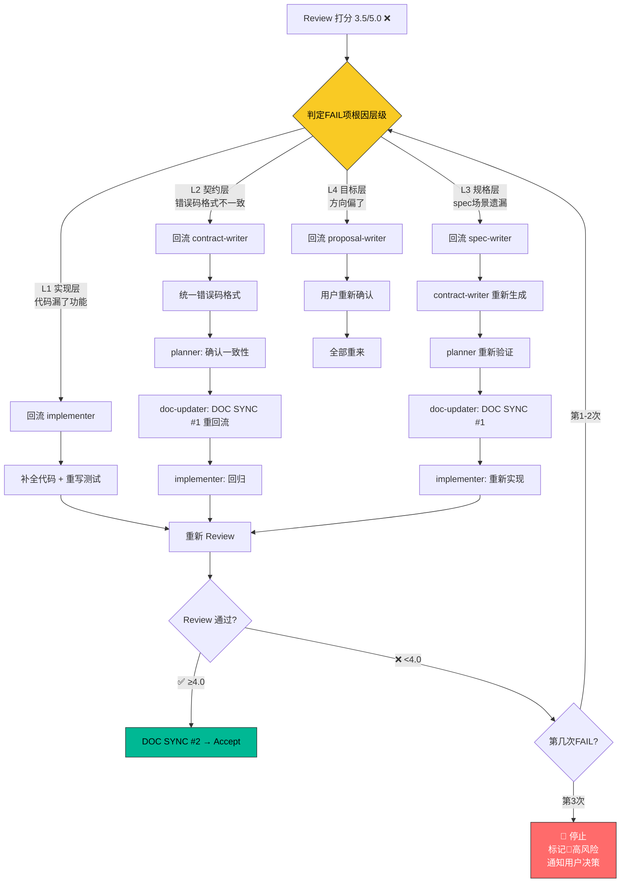

# 场景 6: 功能实现审核不通过 — 返工回流

> **模拟**: Review 阶段打分低于 4.0，按根因层级判定回流深度，重走受影响下游阶段。

---

## 用户视角

```
Agent: Review 完成，打分 3.5/5.0 — 🛑 不通过。

        失败明细:
        ❌ Spec对齐 2.5 (spec说退款要发通知，代码没实现)
        ❌ 契约一致 3.0 (API错误码格式与contract不一致)
        ⚠️ 测试质量 3.5

        根因层级判定:
        - Spec对齐失败 → L1实现层（代码漏了通知功能）
        - 契约一致失败 → L2契约层（contract定义了错误码格式但实现用了另一套）

        返工计划:
        L1 → 回流 implementer（补通知功能 → 重写测试 → 重新Review）
        L2 → 回流 contract-writer（统一错误码格式 → 重新plan → DOC SYNC #1）

        这是此变更第 2 次 Review FAIL（上限 3 次）

Agent: [执行返工...]
        → implementer 补全通知功能，重跑测试
        → contract-writer 统一错误码格式
        → planner 确认变更一致
        → doc-updater 重新 DOC SYNC #1
        → implementer 回归全绿
        → 重新 Review → 4.6/5.0 ✅ PASS
```

---

## 系统内部流程



---

## 返工层级对照表

| 层级 | 根因 | 回流谁 | 重走范围 | DOC SYNC 处理 |
|:---:|------|--------|---------|:---:|
| L1 | 代码写错 | implementer | 🔴RED→🟢GREEN→re-review | 不重置 |
| L2 | 契约定义错 | contract-writer | contract→plan→DOC1→impl→review | DOC SYNC #1 重执行 |
| L3 | spec 写错 | spec-writer | spec→contract→plan→DOC1→impl→review | DOC SYNC #1 重执行 |
| L4 | 目标偏了 | proposal-writer | 全部重来 | 全部作废 |

---

## 3 次返工上限

```
第1次 Review FAIL → 按层级回流，重走，正常
第2次 Review FAIL → 按层级回流，重走，Agent输出⚠️警告
第3次 Review FAIL → 🛑停止
  → 标记 change 为 🔴高风险
  → 通知用户: "此变更已3次未通过Review，建议拆分或重新评估"
  → 用户决定: 继续（手动放行）还是放弃（归档到archive/out/）
```
