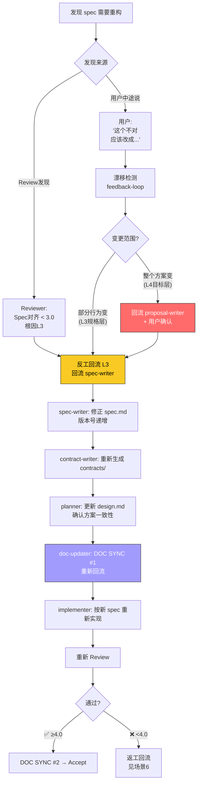

# 场景 7: 重构某个 Spec

> **模拟**: 用户发现已有 spec 的设计有缺陷，需要回到 spec 阶段重新设计。这可能是 Review 过程中发现的，也可能是用户在中途意识到原有方案不对。

---

## 用户视角

### 情况 A: Review 阶段发现

```
Agent: Review 打分 3.2/5.0 — 🛑 不通过。

        失败明细:
        ❌ Spec对齐 2.0 — spec定义的缓存策略是"每次请求查DB"，但架构评审认为应用Redis

        根因层级判定: L3 规格层（spec的缓存行为定义有缺陷）

Agent: 回流 spec-writer 重新设计缓存策略...

        → spec-writer 修正 spec.md §3.2 缓存行为
        → contract-writer 重新生成 contracts/cache-api.md
        → planner 更新 design.md（Redis方案调整）
        → doc-updater DOC SYNC #1 重新回流
        → implementer 重新实现缓存层
        → 重新 Review → 4.3/5.0 ✅
```

### 情况 B: 用户中途发现

```
用户: "等一下，这个支付流程不应该用同步回调，应该改成异步webhook"

Agent: 🛑 漂移检测 — 目标变更（L4目标层）
        当前: payment-contract.md 定义同步回调
        新目标: 异步 webhook

        回流动作:
        → 回流 spec-writer: 修改 spec.md 支付流程
        → 回流 contract-writer: 重新生成 contracts/
        → 回流 planner: 更新 design.md 方案
        → doc-updater: DOC SYNC #1 重新回流
        → implementer: 重新实现

Agent: 变更方向已确认，按新方案重新走... 
```

---

## 系统内部流程



---

## 重构 spec 的两种触发方式

| 触发 | 时机 | 严重度 | 处理 |
|------|------|:---:|------|
| Review 发现 spec 缺陷 | Phase 7 Review | L3 规格层 | 回流 spec-writer → 重走合同→计划→实现 |
| 用户中途喊停 | 任意阶段 | L3/L4 | feedback-loop → 判定 → 回流 |

---

## 重构后的知识一致性

```
重构前状态:
  modules/payment.md: 🟡 计划中 — 同步回调接口
  contracts/payment-api.md: POST /pay → 200 OK（同步）

重构后:
  1. spec-writer 修正 spec.md（异步webhook）
  2. contract-writer 重新生成 contracts/（POST /pay → 202 Accepted + webhook回调）
  3. doc-updater DOC SYNC #1: modules/payment.md 🟡 计划中（异步webhook）
  4. implementer 重写代码
  5. Review 通过
  6. doc-updater DOC SYNC #2: modules/payment.md 🟢 已实现（异步webhook）

关键: DOC SYNC #1 重新执行，旧知识被覆盖，新知识流入 modules/
```
