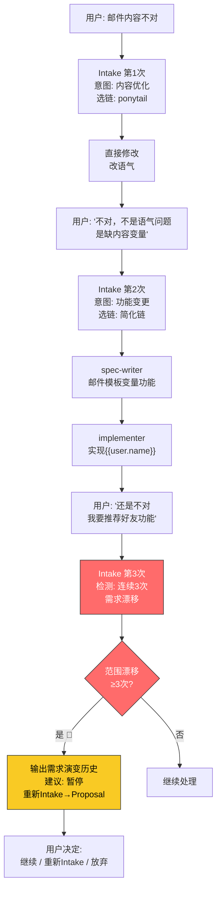

# 场景 8: 反复反馈内容不对

> **模拟**: 用户连续多次说"不对""不是这样的"，系统如何逐级升级，如何避免无限循环。

---

## 用户视角

```
用户: "用户注册后的欢迎邮件内容不对，太生硬了"

[第1轮]
Agent: 这是内容优化，走 ponytail 链直接修改。

Agent: 已修改邮件模板，语气更自然。你看看？

用户: "不对，我不是说语气，我是说内容里要有用户的名字和注册时间"

[第2轮 — 需求升级]
Agent: 这是功能变更（不是"改一行"）。
        → intake 重新评估: 邮件模板需要支持变量替换
        → 创建 change: 05-email-template-variables
        → spec-writer → implementer

Agent: 已完成。模板支持 `{{user.name}}` `{{register_time}}` 变量。

用户: "还是不对，我说的是在邮件里显示推荐的好友..."

[第3轮 — 范围漂移]
Agent: 🛑 范围已 3 次变更。
        当前: 邮件模板变量 → 欢迎邮件
        第1次变更: 语气 → 内容变量
        第2次变更: 内容变量 → 推荐好友
        第3次变更: 推荐好友 → ?

        原始目标已丢失。建议暂停，重新定义需求。

Agent: 原始需求: "欢迎邮件"
        演变:
          版1: 改语气（第1轮反馈）
          版2: 加注册人信息（第2轮反馈）
          版3: 加推荐好友（第3轮反馈）

        是否要重新走完整 Intake → Proposal 来收敛需求？
```

---

## 系统内部流程



---

## 三级反馈升级路径

| 次数 | 行为 | 系统动作 |
|:---:|------|---------|
| 第1次 | 用户说"不对" | 分析反馈，按需调整（ponytail/简化链） |
| 第2次 | 用户再说"不对" | 可能升级为更正式的流程（走完整链） |
| 第3次 | 用户第三次说"不对" | 🛑 暂停 → 输出需求演变历史 → 建议重新 Intake |

---

## 演变历史报告模板

```
📋 需求演变历史

原始需求: "用户注册后的欢迎邮件"

变更记录:
  v1: 用户反馈"太生硬" → 修改语气（ponytail链，1次修改）→ 用户不接受
  v2: 用户澄清"缺内容变量" → 新增变量替换功能（简化链，2阶段）→ 用户转而提新需求
  v3: 用户新增"推荐好友" → 范围已偏离原始目标

当前状态: 🔴 需求漂移 — 原始目标(邮件内容) vs 当前方向(推荐系统)

建议:
  1. 重新走 Intake → Proposal 明确: 到底要邮件功能还是推荐系统？
  2. 如果是两个独立需求 → 拆分为 2 个 change
  3. 如果邮件功能已完成 → 关闭当前 change，新开 change 做推荐
```

---

## 与返工回流的区别

| 机制 | 触发 | 处理 | 用途 |
|------|------|------|------|
| 返工回流 (场景6) | Review FAIL | 按层级回流重做 | 代码/文档质量问题 |
| 重构 spec (场景7) | 设计缺陷发现 | 回到 spec 重设计 | 技术方案不对 |
| 反复反馈 (场景8) | 用户连续说不对 | 暂停 → 重新需求分析 | 需求本身在漂移 |
